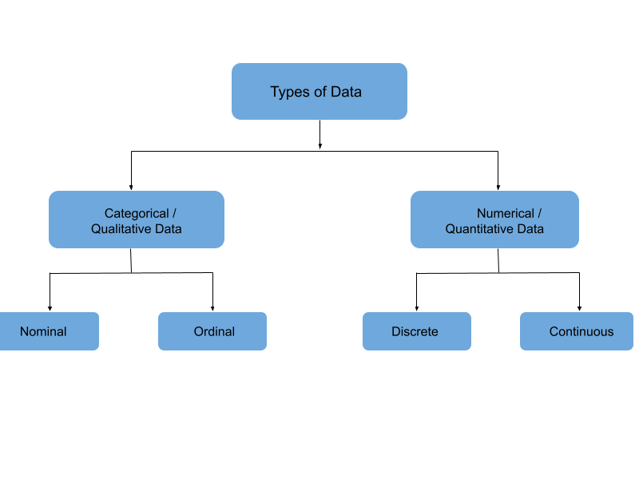

The term "data type" is commonly used across data science and software development disciplines. 

Software development emphasises how data is formatted. For example: strings, integers, or decimals.

This content focuses on the data science and statistical interpretation of data types. For example: nominal and ordinal.

Data is broadly categorised into four major types:

1. Categorical / Qualitative Data

    1.1. Nominal data

    1.2. Ordinal data

2. Numerical / Quantitative Data    

    2.1. Discrete data

    2.2. Continuous data

## 1. Categorical / Qualitative Data 

Qualitative data, also known as categorical data, describes information that fits into specific categories. 
This type of data is not numeric; instead, it deals with descriptions of characteristics such as someone's gender or where they're from. Unlike numbers, we use words to describe categorical data. 

It can be split into two main types: Nominal and Ordinal data. 
Nominal data includes categories without any order (like types of fruit), while Ordinal data involves categories that do follow an order (like small, medium, large).
### 1.1 Nominal data

Nominal data, a form of qualitative information, involves labeling variables without assigning numerical values. Also referred to as the nominal scale, this type of data lacks order and measurement. However, in certain cases, it may exhibit both qualitative and quantitative characteristics. For Example: Nominal data include type, degree and gender.

| Nominal Variable Name | Category Name |
| --- | --- |
| Gender | Male, Female |
| Degree | Master, Bachelor |
| Blood Type | A, B, AB |

Please take a moment to review the article below to gain a deeper understanding of the nominal data type.

[Nominal Data Type](https://statisticsbyjim.com/basics/nominal-data/)

### 1.2 Ordinal data

Ordinal data or variables are characterized by a natural order among their values. Unlike nominal data, the crucial aspect of ordinal data is that the specific differences between data values are not defined. This type of variable is frequently encountered in surveys, finance, economics, questionnaires, and similar contexts.

| Ordinal Data | Types |
| --- | --- |
| Finance | Low, Medium, High |
| Education Level | Primary,Secondary, Post Secondary |
| Reviews | 1 star, 2 star, 3 star and so on |

Please take a moment to review the article below to gain a deeper understanding of the ordinal data type.

[Ordinal Data Type](https://statisticsbyjim.com/basics/ordinal-data/)

## 2. Numerical / Quantitative Data

Quantitative data, synonymous with numerical data, denotes values expressed in numerical terms, providing information about quantity—answering questions like "how much," "how often," or "how many." Numerical data pertains to the measurement of specific quantities, including examples such as height, length, size, weight, and more. 

Quantitative data can be categorised into two types based on data sets: Discrete Data and Continuous data.

### 2.1 Discrete data 

Discrete data is restricted to specific, distinct values and encompasses only a finite number of possibilities. These values cannot be further subdivided meaningfully and are typically counted in whole numbers. 
For example: Number of students in the class or dice results.

### 2.2 Continuous data

Continuous data is measurable and can be expressed as a range with an infinite number of potential values within a specified interval. For example : Height of the student, Weather reports. 

Please take a moment to review the article below to gain a deeper understanding of the continuous data type.

[Continuous Data Type](https://statisticsbyjim.com/basics/discrete-vs-continuous-data/)

## Check your own understanding 

For each of the examples below, is the data nominal, ordinal, discrete or continuous:

- the number of emails received on a day
- the speed at which you are running
- the different types of turtles found on the beach
- the difficulty of a problem (easy, medium, hard)

Try to think of more examples in your own life and test your understanding.

