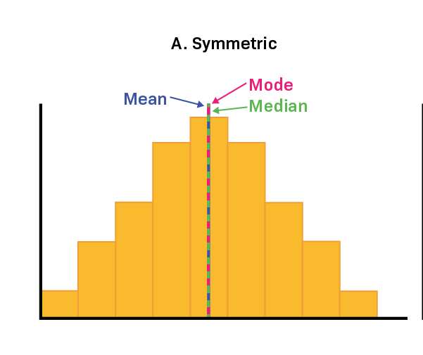

Central tendency is a key concept in statistics that helps identify the centre of a dataset, essentially the point around which all other data points gather. 

This important trio - mean, median, and mode - is the starting point for analysing data, giving a clear view of the dataset's overall trend or average. The mean calculates the arithmetic average, the median shows the middle value in an ordered list of data, and the mode indicates the most common value. 

These measures are vital for simplifying complex data into clear figures, aiding further analysis and decision-making by showing where most data values are concentrated.

## Mean

The mean, or arithmetic average, is a basic statistical concept you're probably familiar with. It's calculated simply by adding all the values in a dataset and then dividing by the total number of values. This gives you a single figure that represents the average of your data. The formula to calculate the mean is:
```
x1+x2+x3…+xn / n 
```

x1 to xn represent individual values, and n denotes the total number of values in your dataset.



When you calculate the mean, every value in the dataset matters, so any change can impact the mean. However, it's important to remember that the mean doesn't always show the true center of your data accurately. 

This is often seen in histograms, where the mean may not fully capture the data's central tendency, especially with uneven distributions or outliers. This shows why it's key not just to rely on the mean for summarizing data but to also use other statistics for a fuller picture.

As shown above in the graph, in a distribution that is symmetric, the mean accurately identifies the central point.


In a [skewed distribution](https://www.statisticshowto.com/probability-and-statistics/skewed-distribution/), the mean might not be accurate and can move away from the center. This happens because [outliers](https://www.statisticshowto.com/statistics-basics/find-outliers/) – especially those far out in the tail of the distribution – have a strong impact on the mean, pulling it towards them. As the skewness increases, the mean moves further from the middle. Therefore, using the mean as a central measure is best suited for symmetric distributions. We will delve deeper into this, comparing mean and median, in upcoming discussions. 

**Generally, use the mean for data that is symmetric and continuous.** 

## Median

The median is the value that sits in the middle of a dataset when it is arranged in order, effectively dividing it into two equal halves. Unlike the mean, the median is not influenced by extremely high or low values, or outliers, in the dataset.

To find the median, first, sort your data in ascending order. Then, look for the data point that has an equal number of values above and below it. The method to identify the median varies if your dataset has an even number of values compared to an odd number.

For a dataset with an odd number of observations, the median is simply the middle number. For example, if there are 13 values, the seventh value, when sorted, is the median because it has six values on either side.

1,10,13,5,8,7,**11**,9,10,12,13,8,3

In instances where there is an even number of values, you count inward to the two middlemost values and subsequently calculate their average. For example, in the dataset with values 11 and 13, their average (12) becomes the median for this particular dataset.

1,10,13,5,8,7,   **11, 13**,  9,10,12,13,8,3

Your data might include decimal points, but the process to find the median remains the same.

**Note:** The impact of outliers and skewed data on the median is less pronounced compared to the mean as measures of central tendency.

## Mode

The most frequently occurring value in a dataset. The mode, unlike the mean or median, is the value that appears most frequently in your dataset. To determine the mode, arrange your dataset in ascending order for numeric values or by categories, and then identify the value with the highest frequency.

## Which Central Tendency Measure — Mean, Median, or Mode — Is the Most Suitable?

In continuous data with a symmetrical distribution, the mean, median, and mode all align. In these cases, analysts usually opt for the mean because it takes into account every data point. However, when the distribution is skewed, the median is often a better indicator of central tendency.

For ordinal data, which involves rankings or order, the median or mode is usually more appropriate. With categorical data, such as types or categories, the mode is the go-to choice since it identifies the most common category.

To gain a deeper understanding of when to use the mean versus the median, please refer to the following article:
[Use of mean vs median](https://www.statology.org/when-to-use-mean-vs-median/)

## Develop your analytical intuition 

At times, statistics might appear somewhat tedious, filled with endless facts and formulas. 
However, an effective data scientist aims to bring these numbers to life, fostering an intuitive grasp of the underlying principles.

To truly comprehend these concepts, it's vital to approach them from multiple angles, enriching your understanding. We highly recommend this resource as a key to unlocking a deeper, more intuitive connection with statistical data. Please make sure to explore it in detail.

[Mean, Median, and Mode: Measures of Central Tendency
By Jim Frost ](https://statisticsbyjim.com/basics/measures-central-tendency-mean-median-mode/)

