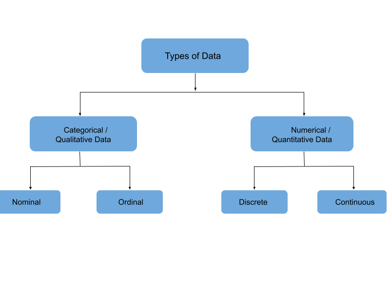

# What is Data and Its types
Data is broadly categorized into four major types:
1. Categorical/Qualitative Data
    - Nominal data
    - Ordinal data

2. Numerical/Quantitative Data    
    - Discrete data
    - Continuous data

1. **Categorical / Qualitative Data**: Qualitative data, alternatively referred to as categorical data, characterizes information that falls into distinct categories. Unlike numerical data, qualitative data is non-numeric and pertains to categorical variables describing features such as an individual's gender or hometown. Categorical measures are articulated through natural language descriptions rather than numerical values. Categorical data is further divided into two types: 
- Nominal Data
- Ordinal Data

- **Nominal Data**:  
Nominal data, a form of qualitative information, involves labeling variables without assigning numerical values. Also referred to as the nominal scale, this type of data lacks order and measurement. However, in certain cases, it may exhibit both qualitative and quantitative characteristics. For Example: Nominal data include type, degree and gender.

| Nominal Variable Name | Category Name |
|-----------------------|---------------|
| Gender                | Male, Female  |
| Degree                | Master, Bachelor |
| Blood Type            | A, B, AB      |

Please take a moment to review the article below to gain a deeper understanding of the nominal data type:
[Nominal Data Type](https://statisticsbyjim.com/basics/nominal-data/)

- **Ordinal Data:**  
Ordinal data or variables are characterized by a natural order among their values. Unlike nominal data, the crucial aspect of ordinal data is that the specific differences between data values are not defined. This type of variable is frequently encountered in surveys, finance, economics, questionnaires, and similar contexts.

| Ordinal Data | Types |
|--------------|-------|
| Finance      | Low, Medium, High |
| Education Level | Primary, Secondary, Post Secondary |
| Reviews      | 1 star, 2 star, 3 star, and so on |

Please take a moment to review the article below to gain a deeper understanding of the ordinal data type.
[Ordinal Data Type](https://statisticsbyjim.com/basics/ordinal-data/)

2. **Numerical / Quantitative Data**: Quantitative data, synonymous with numerical data, denotes values expressed in numerical terms, providing information about quantity—answering questions like "how much," "how often," or "how many." Numerical data pertains to the measurement of specific quantities, including examples such as height, length, size, weight, and more. Quantitative data can be categorized into two types based on data sets: 
- Discrete Data
- Continuous data.

- **Discrete Data**:  
Discrete data is restricted to specific, distinct values and encompasses only a finite number of possibilities. These values cannot be further subdivided meaningfully and are typically counted in whole numbers. For example: Number of students in the class, dice result.

- **Continuous Data**:  
Continuous data is measurable and can be expressed as a range with an infinite number of potential values within a specified interval. For example : Height of the student, Weather reports. 
Please take a moment to review the article below to gain a deeper understanding of the continuous data type.
[Continuous Data Type](https://statisticsbyjim.com/basics/discrete-vs-continuous-data/)
