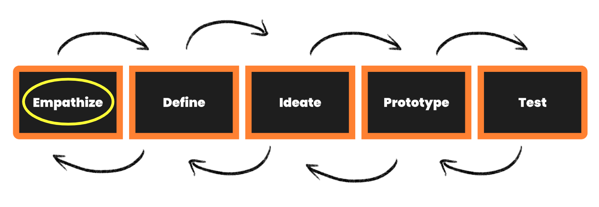

## Who is the User?

This stage is about conducting qualitative and some quantitative research in order to develop knowledge about what your users do, say, think and feel.

Empathy is at the core of the Design Thinking process. 

You need to understand the user, **you need to learn about their culture, knowledge, opinions, and world-view in order to understand their experiences deeply and meaningfully. The end goal is to design a solution that meaningfully addresses your user’s problem, so an emphasis is put onto this first step, in order to develop a crystal-clear understanding of exactly who your user is.**

Empathy is used to describe a wide range of experiences. Emotion researchers generally define empathy as the ability to sense other people’s emotions, coupled with the ability to imagine what someone else might be thinking or feeling.

For this entire step, your only focus is to think about your user. Who are they, in as much detail as possible. Try to keep your mind from floating to any problems or solutions just yet - there will be plenty of time for that in the steps to come. All you need to do is empathise, empathise, empathise! 

Watch this video for a brief summary on the **Empathise stage of Design Thinking** to get you started with your project.


