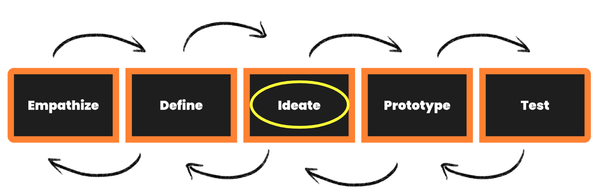

## Coming Up With Different Ideas
During Ideation, the aim is to generate a large quantity of ideas that the team can then filter and cut down into the best, most practical or most innovative, in order to inspire new and better design solutions and products. Ideation is often the most exciting stage in the Design Thinking process, as you are now out of the heavy detailed research and empathising, and are now free to explore ideas and really open up that right brain.

*“You ideate in order to transition from identifying problems to creating solutions for your users. Ideation is your chance to combine the understanding you have of the problem space and people you are designing for with your imagination to generate solution concepts. Particularly early in a design project, ideation is about pushing for a widest possible range of ideas from which you can select, not simply finding a single, best solution.”*
 **- d.school, An Introduction to Design Thinking PROCESS GUIDE**
 
Watch this video for a brief summary on the **Ideation stage of Design Thinking.** 

