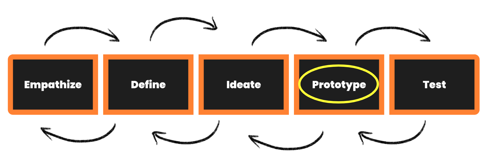

## Coming Up With a Solution
Prototyping is one of the wonders of Design Thinking, where problem solvers build out a basic version of what they think will address their user’s problem, and run it by them to see that it is actually useful. We want to learn if our users think our ideas are good before we build a product they don't like, an issue that so many problem solvers run into in the real world!. 

Prototyping gives the user of the product a sense of what the product can do for them by creating scenarios where they can experience and imagine how the product may look and feel.

*“Prototyping is about bringing the true nature of a product to light faster, in a collaborative, cross-functional way that reduces the emphasis on thorough documentation while increasing the focus on building a shared understanding of the actual product experience being designed”.* **- Jeff Gothelf**

Watch this video for a brief summary on the **Prototype stage of Design Thinking.** 


