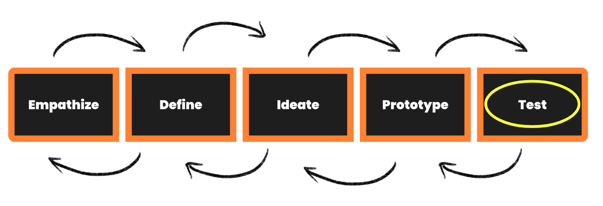

## Checking In With Your User
The final stage is called Test and is different to prototyping because now your product actually exists. You created a basic version of the tech and you've got some kind of service that users or customers can pay for and use. You’re out of the problem and solution finding phases and now into a real product or service - an actual thing!

This phase reminds us that the world of businesses, products, services etc is a messy and uncertain place. Product launch does not guarantee certain growth. It’s more about putting our product / service into the world and watching what happens. In this sense, we are always testing: testing different strategies, different marketing, different features. 

**It’s really important to check in with your user and make sure that you really have made something that will help them.**

Watch this video for a brief summary on the **Test stage of Design Thinking.**
