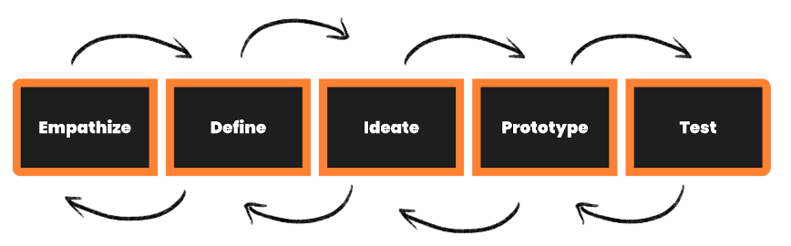

Design Thinking is a term that is used broadly to describe an iterative process to collaboratively solve problems that people, customers or users experience.  It is sometimes referred to as user or human-centred design (HCD), to emphasise the focus on the ‘human user’. There are a lot of new words which we’ll be touching on throughout the Sprint. Make sure to check out the TERMINOLOGY topic card to familiarise yourself with these new words or a recap as you progress through the sprint.

For a more in depth definition of Design Thinking, visit the [IDEO website](https://designthinking.ideo.com/) for an introduction to Design Thinking and how it came to be. 

*“Design thinking is a human-centred approach to innovation that draws from the designer’s toolkit to integrate the needs of people, the possibilities of technology, and the requirements for business success.”*
**- Tim Brown, Executive Chair of  IDEO**

*“User-centred design means understanding what your users need, how they think, and how they behave – and incorporating that understanding into every aspect of your process.”*  **- Jesse James Garrett, User Experience Designer**

In short, Design Thinking is a problem solving framework that puts the User (who you are solving for or is most impacted by a particular issue) at the CENTRE of all steps of a 5-part process. 

By keeping your user in mind throughout a series of different steps, you are able to come up with solutions that meaningfully address real problems that you derive from really understanding your user’s lived-experience. In a quickly evolving world, this is an exceptional tool that will create products and solutions rooted in real insights built around a particular user. Don’t worry. As we move along, things will start to make a lot more sense! 

## MOVING FROM PROBLEM FINDING TO SOLUTION FINDING

**Problem finding → Solution finding**

Design thinking usually starts with gaining a general understanding, a process called **problem finding** and then moves to a specific outcome, solution finding. This is key to Design Thinking. You do not start with the solution, but a better understanding of the **human problem** (remember, it’s human-centred design).

## 5 STEPS TO SOLVING PROBLEMS 

We are going to be learning these principles using the IDEO Design Thinking 5 step process which includes: Empathise, Define, Ideate, Prototype and Test.

[This video](https://www.youtube.com/watch?v=bpVzgW8TUQ0) will give you a brief overview of the 5 phase Design Thinking process.

Here is [another video](https://www.youtube.com/watch?v=-ySx-S5FcCI) to give you a holistic view of Design Thinking and how the 5 steps appear to be sequential, keep in mind that design thinking is less linear and more iterative.