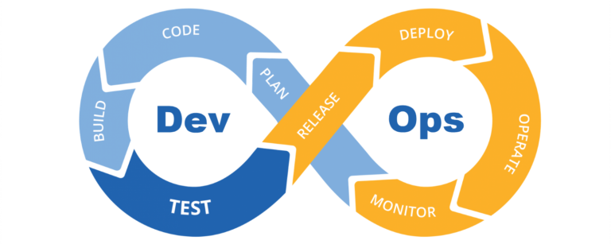

DevOps is a methodology (processes, culture and tools) used to increase the level of communication and collaboration between **development teams** and **operation teams** to speed up the design, development, testing and delivery of high quality software aiming for frequent updates, uninterrupted availability, transparency and rapid feedback.

It also expands to other teams within an organisation, like designers, product managers, quality assurance (QA), security and even end-users.

DevOps builds on top of Agile (breaking large software development projects into smaller tasks, leading to faster build, test and feedback cycles) to consolidate historical siloed teams – developers and operations.

### Other “xOps”: DevSecOps, DataOps.

**DevSecOps**: another culture mindset, now including the security IT teams into the DevOps methodology, taking security into consideration throughout the whole software development process. The practices include managing: standard environments, access and privileges, system’s isolation, cryptography, data encryption, system’s integrity, bug bounty, automate security tests during continuous integrations etc.

**DataOps**: seeks to provide tools, processes and structures to manage data at large scale, delivering new insights to customers with increasing velocity. It enables collaboration between data scientists, data analysts, IT operations and security teams. Day to day practices include: automated data tests (validate inputs and outputs), quality and performance checks for data pipelines, enable creating data analytics workspaces, automate data access process etc.