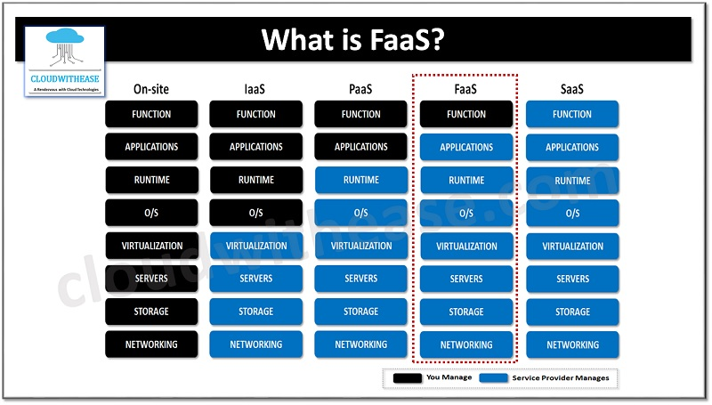

Cloud is the ability to consume computer system resources by demand, with a pay-as-you-go pricing model.

At the end of the day, "the cloud" is a set of interconnected data centers across the globe. The cloud metaphor is quite ephemeral, but its resources are very earthy.

Read more:  
- [Early history of Cloud Computing](https://en.wikipedia.org/wiki/History_of_cloud_computing#Early_history)  
- [History of AWS](https://en.wikipedia.org/wiki/Amazon_Web_Services#History)  
- [The NIST Definition of Cloud Computing](https://csrc.nist.gov/pubs/sp/800/145/final)  

**Cloud value proposition:**
- Cost reduction  
- Less maintenance  
- Scalability  
- Elasticity  
- High Availability  
- Security  

Read more:
- [Benefits of Cloud Computing: What are the Pros and Cons?](https://www.businesstechweekly.com/operational-efficiency/cloud-computing/pros-and-cons-cloud-computing/)

**Main Cloud providers:**
- Amazon Web Services (AWS)  
- Google Cloud Platform (GCP)  
- Microsoft Azure  
- Alibaba Cloud  
- IBM Cloud  
- DigitalOcean  

## Cloud models
**Infrastructure as a Service (IaaS)**: in this model, one rents low-level computing systems (servers, load balancers, raw block storage) to build your own infrastructure on top, being able to run arbitrary software. More flexibility and control, but also more responsibility. Examples: AWS, GCP, Microsoft Azure, Digital Ocean. 

**Platform as a Service (PaaS)**: a vendor providing services to build applications, like development tools, application runtime, database, developer services etc, while managing the underlying infrastructure. No need to worry about capacity planning, software updates, patching. Less flexibility to manage and configure the provided services. Examples: Heroku, Netlify.

**Software as a Service (SaaS)**: ready-to-use applications hosted by the cloud providers themselves to be used over the Internet, with very limited management and configuration. Examples: Gmail, Slack, GitHub.

**Function as a Service (FaaS)**: also known as Serverless Computing, is a cloud computing model where the user gives the provider a piece of code (a function) to run. The user doesn’t need to worry about the running environment, scalability and resource consumption, those are fully managed by the provider, while charging the user only the amount of time the code is running – down to the millisecond. Examples are: AWS Lambda, Google Cloud Run, CloudFlare Workers, OpenFaas etc.

  

## Cloud deployment models
**Private**: Built by and operated for a single organisation. Massive project and capital intensive. Built with systems like [OpenStack](https://www.openstack.org/).

**Public**: A cloud that is delivered over the Internet to the public, like AWS. It can be paid or free of charge. 

**Hybrid**: A mixture of both, when a cloud infrastructure is composed of both private cloud with on-premise resources, generally connected with a public offered cloud provider. Use cases are: storing sensitive data on-premises but running applications on a cloud provider, running very specific and costly workloads on-premises with more general code hosted on a public cloud etc.

Know more:  
- [Cloud Deployment Models](https://www.geeksforgeeks.org/cloud-deployment-models/)  
- [Multicloud](https://en.wikipedia.org/wiki/Multicloud)
- [What is multicloud?](https://cloud.google.com/learn/what-is-multicloud)  