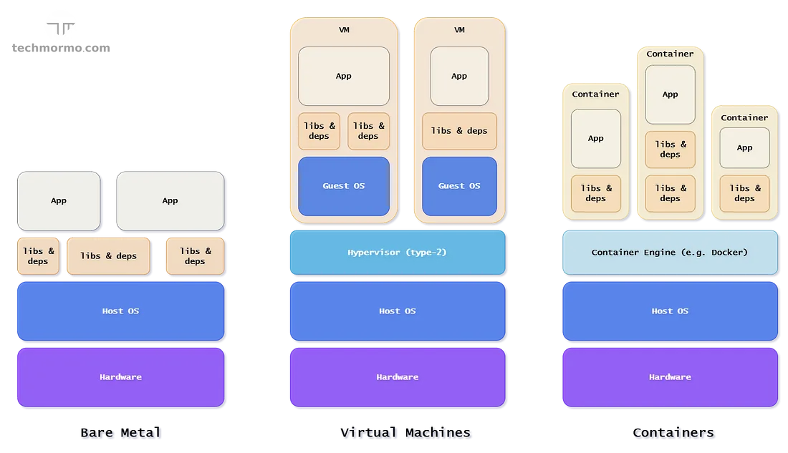

We now know a little bit about how the cloud works. Even if we don’t use this information in our day-to-day work, it is still crucial on our DevOps journey!

Now we will be focusing on the server and application layers, understanding how our code actually runs on a machine.

## Bare metal
With a bare metal deployment, one gets access to a server (bought or rented by a cloud provider), installs the operating system and needs to manage everything necessary to run the application, like libraries, dependencies, packages, services, before running the actual business app.

Pros:  
- Full access to the server, maximum flexibility and autonomy  
- Best performance, access to the raw computing resources  
- No *noisy neighbors*: other people running applications on a shared server like (VMs)  

Cons:  
- Needs a lot of management and care  
- Limited resource scalability  
- Resource can be underutilized if only one or few apps can run  
- Runs a single operating system, sometimes libraries and dependencies can conflict  

Challenges:  
- What if we want to run another app with a different set of dependencies?  
- What if we want to run an app that requires a different operating system?  
- What if we could slice the server into multiple, *virtual servers*?  

## Virtualisation
Virtualization is the act of creating a virtual version of something. Here, it means creating a virtual version of a **server**, called a virtual machine (VM).

A virtual machine (or *guest machine*) acts like a real computer with a real operating system and applications, but runs *on top of* a bare metal machine, also known as the *host* or *hypervisor*. For example, a server running Ubuntu Linux could host a Microsoft Windows virtual machine, or vice versa.

Some virtualization technologies are:  
- VirtualBox  
- KVM  
- VMware  

Nowadays we have technology to virtualize other IT components as well, like storage and networks.

Know more:  
- [The two types of hypervisor](https://en.wikipedia.org/wiki/Hypervisor#Classification)  

The benefits of virtualization over bare metal include:  
- **Efficient resource use**: one server can run multiple VMs with different applications, better using its resources and having fewer physical machines.  
- **Automation**: now that servers are virtual, one can build and use software to manage the VMs.  
- **High availability and disaster recovery**: with VMs, backups become faster and easier (one can backup a whole virtual machine!), they can also be easily cloned and moved to another location in case of disaster, making them more portable.  

Although virtualization brings many benefits to the table, it also comes with challenges, like increasing the tooling cost, learning curve and increased attack surface (hypervisor level).

The main issue with virtualization is that the VM *still* runs its own operating system, consuming gigabytes of memory and disk and much CPU resources.

Instead of running Linux as the host with multiple Linuxes as VMs, could one share the underlying Linux kernel and basic building blocks, creating only a thin layer of isolation for each VM?

## Containers
A container is a very fast and lightweight deployment solution because it doesn't require a hypervisor layer: *it shares the underlying host kernel*. The host only needs a Container Engine, like Docker or LXC.

Instead of running a whole operating system inside a VM, a container will bundle the application and its dependencies to be run in virtually any infrastructure.

Because of its size and portability, it became extremely easy and fast to create and destroy the most complex applications and infrastructure, becoming the stepping stone for the development and growth of the latest technology movements, like microservices, CI/CD pipelines, cloud native development, Serverless etc.

It also blurred the line between local development and production, making it easier to run production-like code on a personal machine and removing friction when moving an application through different deployment stages.

Know more:  
- [Cloud Native Computing](https://en.wikipedia.org/wiki/Cloud-native_computing)  
- [Microservices explained - the What, Why and How?](https://www.youtube.com/watch?v=rv4LlmLmVWk)  
- [Play with Docker: a simple, interactive and fun playground to learn Docker](https://labs.play-with-docker.com/)  

Containers brought many benefits to the table, like cost reduction, consistency, agility, portability and scalability.

It also came with its own disadvantages, like:  
- **Management complexity**: building and deploying one container is easy, but maintaining hundreds of containers across multiple servers is quite challenging. Container orchestration tools like Kubernetes came to the rescue, but they have an intense learning curve.  
- **Security**: since they share the same OS kernel, if it becomes vulnerable, all the containers running on that system become vulnerable as well.  
- **Observability**: monitoring, collecting and analyzing behavior data about 100s of small applications running everywhere becomes also challenging.  
- **Storage**: containers are ephemeral by nature, they may run for a couple of seconds on a machine and restart in another, making persistent storage availability another question to take into consideration.  

If someone screams the word “Docker” inside a cave they might get “Kubernetes” for an answer. While this chapter won’t cover Kubernetes, it will leave you with a few articles to read.

Know more:  
- [What is Kubernetes | Kubernetes explained in 15 minutes](https://www.youtube.com/watch?v=VnvRFRk_51k)

## Serverless
Now you throw away the servers, the virtual machines and the containers. In a Serverless architecture, you write a piece of code – usually a function – upload it to the cloud provider and it will set up everything needed to run the code. Attach that artifact with an API gateway and you have an application up and running.

No server management is necessary (or even possible). The developer has almost no control over the environment. A couple of configuration options are available, like amount of memory, environment variables, but one won’t be able to choose an operating system or IP address.

The pricing is radically different as well. The cost is calculated based on the amount of the time the code runs, usually down to the millisecond. If the code runs for 1 minute everyday, it will be charged only for that.

Scalability becomes less of an issue, since Serverless architectures will automatically scale as needed. If there’s a sudden load on the system and the function needs to be run 10x more than usual, the cloud provider will scale the environment accordingly.

Of course nothing is flowers. Less control means less flexibility and more vendor lock-in. The Serverless environment from AWS is quite different from GCP, making the application portability more tricky.

When writing Serverless software, one usually *glues* together many different cloud provider specific platforms that are quite hard to simulate locally. Debugging, testing and troubleshooting becomes harder and more complex, increasing the friction between a local developer machine and the production environment.

Main Serverless (FaaS) technologies:  
- AWS Lambda  
- Google Cloud Functions  
- Apache OpenWhisk  
- Kubernetes Knative  

Known more:  
- [What is Serverless?](https://www.youtube.com/watch?v=vxJobGtqKVM)