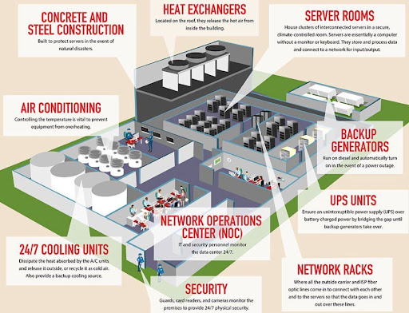

When we talk about a "DevOps person" or a "DevOps team", we are usually talking about people with an IT operations background who are working to break the silos between operations and development. For that matter, when studying DevOps, it is important to understand how the underlying IT infrastructure works. Even if your organisation is using a "cloud infrastructure" – which abstracts a lot of technicalities – knowing about IT componentes will give you a better understanding when designing, maintaining and troubleshooting your infrastructure and applications.

---

Everything begins with a **server**: a specially designed computer providing services to other computers, called clients. A server can serve a web page, databases, files, communication services etc.

## Server
A server is built with some key features in mind:
- Reliability: they should run with as little downtime as possible, so most components are redundant.
- Scalability: multiple CPU, memory and disk sockets.
- Remote Management: able to be accessed and managed remotely via a network, even without an operating system.
- High performance: powerful components that can be optimized for specific applications, like data processing, virtualization, training machine learning modules, rendering videos etc.
- Energy efficient: technology to use as little energy as possible, like reducing usage based on demand, disabling unused components, specialized cooling systems etc.
- Size: architectured to fit in a _server rack_.

Know more about servers:
- https://www.serverwatch.com/guides/what-is-a-server/
- https://en.wikipedia.org/wiki/Server_(computing)

**What if a server goes down?** Nowadays we expect services to be available all the time, 27/4. One way we can achieve this is by having a _service_ running on multiple servers, creating a highly available environment. It also shares the service load between servers, so we can add more servers when more resources (CPU, memory, disk) are needed.

## Network
We connect the servers using **network hardware**, like network interfaces, switches, routers and firewalls. These connections can be wired or wireless and they can happen within a server rack, between different buildings and cities or even across the ocean. The information exchanged between servers and network appliances follows a set of rules, known as communication protocols.

In a very simplistic way, **the Internet** is the interconnection between _lots and lots_ of these networks, which, in turn, connect the servers hosting services to their end users.

Know more about networks:
- https://en.wikipedia.org/wiki/Computer_network

## Storage
Let’s say we are hosting a simple web page from 10 different servers. What happens if the page needs to be updated? Shall we change the web page files in all 10 servers?

Another important piece of IT infrastructure are **storage servers**. They are highly specialized computers attached to the network, used to store and share data between servers. They have their own key features, like fault tolerant disks, communication protocols, network hardware etc.

When connected to the network, they can provide a single point of access to data shared between servers. In our previous example, we would need to change our web page in one single location, accessible by all the servers.

## Electrical power
We now have a bunch of servers, network appliances and storages in our, let’s call, "server room".

Our next problem to deal with is electrical power. **How can we make sure everything is up and running all the time?** Besides running our services on multiple servers, we need to design the electrical power system to be redundant using Uninterruptible Power Supplies (UPS). These systems will seamlessly switch the energy source from the electricity provider to a battery bank if the first fails.

Some servers will also have redundant energy systems: they can be connected to different energy sources at the same time, so, if one fails, they will continue up and running.

Another strategy is to have in-house backup power generators, commonly powered by gas, diesel or solar energy.

Know more about UPS:
- https://en.wikipedia.org/wiki/Uninterruptible_power_supply

## Cooling
All these components together will certainly generate one thing: heat. Another key design decision is how one will create an environment with specific temperature and humidity to not overheat servers, network, storage, power supplies – and the people working on these buildings.

Different considerations and strategies can be taken:
- How is the hardware cooled? Thermal paste, liquid cooling, server immersion cooling.
- What is the airflow within a server rack, within a server room? Where does the hot air go and the cool air comes?
- How are HVAC (heating, ventilation, and air conditioning) systems designed? 
- Where is the room located? Colder regions (Nordic countries, arctic) might require less cooling equipment.

## People
A lot of people are needed to keep the lights up in this building: managers, engineers, architects, support, security, cleaning, logistics.

## Data center
This building has an official name: a data center. A physical space within a building (or a group of buildings) dedicated to computing systems and associated equipment, like network, storage and telecommunications.

Know more:  
- [History of Data Centers](https://en.wikipedia.org/wiki/Data_center#History), also, a [timeline](https://analyticsindiamag.com/data-centres-eniac-cloud-mainframe-virtual-networks/)  
- [Overall Data Center concepts](https://aws.amazon.com/what-is/data-center/?nc1=h_ls)  
- [Data Center Tiers](https://blog.servermania.com/data-center-tiers)  
- [AI, Computing Power and Energy Consumption](https://disconnect.blog/ai-is-fueling-a-data-center-boom/)  
- [Data center impact on local communities](https://www.datacenterdynamics.com/en/analysis/data-center-nimbyism-how-to-engage-with-local-communities-properly-during-data-center-projects/)  

A data center is a very complex system. If you are curious about the intricacies of it, we recommend reading the [Data Center Handbook](https://onlinelibrary.wiley.com/doi/book/10.1002/9781119597537).

An organisation can build their own data center, rent a physical space on a third party data center to run their own hardware or rent a data center programmatically, via a dashboard or API (application programming interface), also known as "the cloud".

