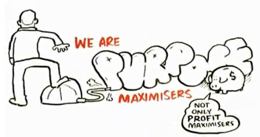

This subject is a little different from the others - it's much more personal, focusing on your most important selling tool: you! 

This is a quick and easy way to iterate through different options before investing too much time in your CV and digital profiles or in building a more powerful portfolio.

## What Is An Elevator Pitch & Why Do You Need One? 
An elevator pitch is a brief – around 30 seconds – way of introducing yourself. It is an opportunity to make a connection with someone and is called an ‘elevator pitch’ because it represents the amount of time you’d spend riding an elevator with someone. 

Imagine bumping into someone you’ve been dying to meet in an elevator – how would you introduce yourself, get your point across, and ask to stay connected—all before that person gets off the elevator? 

Elevator pitches are handy any time you’re at an event where you might meet prospective job or networking connections. It can be a powerful tool to leverage the network of people who know, like, and trust you. One of the many reasons this is such an important concept is the Outsider Problem – the fact that many jobs are never publicly listed. 

What this means is that speaking to lots of people in your industry should be a key part of your job-search process. Being active in the field every day, they are likely much more aware of what opportunities are available, what employers are looking for, and what the red flags are that frequently disqualify applicants. 

Take a look at [this article](https://www.businessnewsdaily.com/3937-elevator-pitch.html) as a guide. Remember, this is a general pitch about your strengths, but you can write it for a specific situation if you'd prefer.

## Key Principles For Effective Communication
You can apply these to just about any format in which you’re presenting your work/career – whether in a formal interview setting, or just at the bar with some friends. 

### Authentic & Purpose Driven
Renowned author Dan Pink wrote a [book](https://www.amazon.com/Drive-Surprising-Truth-About-Motivates/dp/1594484805) called Drive: The Surprising Truth About What Motivates Us, which looks into the science of motivation. This [animated summary video](https://www.youtube.com/watch?v=u6XAPnuFjJc&ab_channel=RSA) captures the key principles nicely. Here, we want to hone in on the principle captured in the image below: 

People are drawn to an authentic purpose/cause. We’re also better than we think at figuring out when others are being inauthentic. Sometimes this expresses itself in how we feel about people, even if we don’t cognitively realise we’re not 100% trusting what they’re saying. If you can tie all your career communication into a genuine and meaningful personal purpose/conviction, this will truly help you stand out from the crowd. 

When delivering your pitch, it might be wise to communicate the purpose first, before getting into the details, as suggested by Simon Sinek in his famous [Start with Why](https://www.youtube.com/watch?v=u4ZoJKF_VuA&vl=en) speech and book. 

### Focused & Efficient
We live in an age of instant gratification, and people have very short attention spans. **So get to the point!** 

Dan Pink very nicely summarises the powerful idea of the “One Sentence Project” in this [four minute video.](https://www.youtube.com/watch?v=u4ZoJKF_VuA&vl=en) 

### Memorable & Compelling 
Brothers Chip and Dan Heath wrote a very successful book called Made to Stick, in which they summarised the science behind why some ideas stick (are remembered) and some don’t. Their six SUCCESS principles are nicely summarised in [this short article.](https://medium.com/constraint-drives-creativity/the-6-principles-to-make-your-ideas-stick-91a17229c949) 

Professor Robert Cialdini wrote a classic [book](https://www.amazon.com/Influence-Psychology-Persuasion-Robert-Cialdini/dp/006124189X) called *Influence: The Psychology of Persuasion*, in which he researched and then distilled what science can tell us about persuasion. Lucky for you, this [12 minute video](https://www.youtube.com/watch?v=kv0sOX6Alrk&ab_channel=BigSpeakSpeakersBureau) summarised the core principles very nicely. 

### Practice (with good feedback!) Makes Perfect
This applies to just about every domain, and there’s little substitute for feedback from real end users. 

Good examples include: 
- Listening to customers in the [Lean Startup Movement.](https://hbr.org/2013/05/why-the-lean-start-up-changes-everything)
- Comedians testing their jokes on small audiences before selecting the most successful ones for the big show (e.g. [Chris Rock’s process](https://bakadesuyo.com/2012/07/how-does-chris-rock-create-such-brilliant-com/)).
- Pixar’s iterative and feedback-driven approach to storytelling. ([Pitching & Feedback](https://www.khanacademy.org/computing/pixar/storytelling/storyboard-your-film/v/pitching-feedback))

### Be Coachable
Honest feedback is golden. If you get defensive about critical feedback, people will stop telling you what they really think, and you will miss out on the opportunity to get the feedback you need to really improve. Not every piece of feedback will be correct, so listen out for repeated trends . Your confidence shouldn’t come from thinking that you’re a genius. It should come from your willingness to put in the hard yards, your ability to listen well, and to truly incorporate the consistent feedback you receive. 

There’s an old adage in the fundraising world that we’ve often found to be true: 
“Ask for money, and you’ll get advice. Ask for advice, and you’ll get the money”. 

The same very likely holds true for people helping you with the job search. If you’re respectfully asking for advice and implementing the feedback/suggestions you receive, people will naturally want to support you in your journey in whatever way they can – including warm introductions to their friends who are hiring.