## Welcome to the Hiration Resume Builder 
Umuzi has partnered with Hiration to give you access to the Hiration platform. Hiration is an online resume builder which supports you to create your CV and help you review your CV through its AI-powered features.

The platform includes the following:

**- Resume Builder**

**- Resume Reviewer**

**- Job based Resume Optimizer**

**- Cover Letter Builder**

**- LinkedIn Profile Optimizer**

### Quick Start Guide

Under the ‘Resume Builder’ tool tab, click on ‘Create a new Resume’ in the
Dashboard.

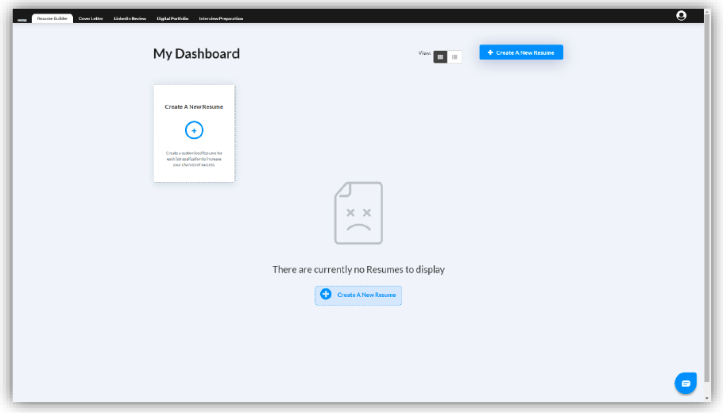

Select the design that you seem fit and relevant to the job you’re applying for.

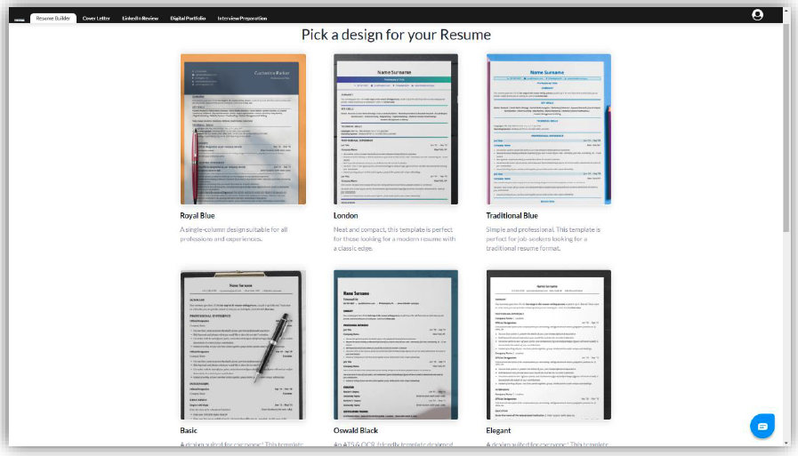

There are two ways to make a resume with Hiration AI resume builder:

If you’ve already created a resume, click on the ‘Upload my Resume’ button to upload your existing resume and all the contents from your resume will be
transferred to the new design you just selected.

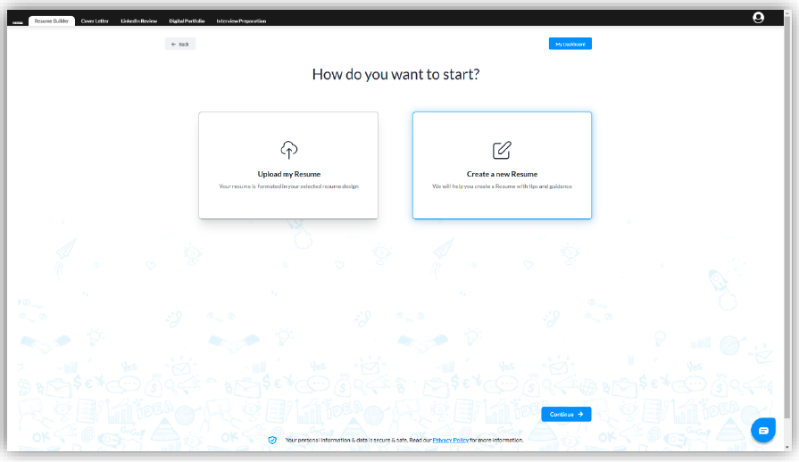

To start a new resume from the beginning, click on the ‘Create a new Resume’ button.

If you’ve decided to create a new resume from the beginning, you can either choose a blank template (as shown in the image below) or (recommended) start by clicking on the ‘Use Resume Examples’ to get started on a well-structured and content rich pre-written samples to get a head start.

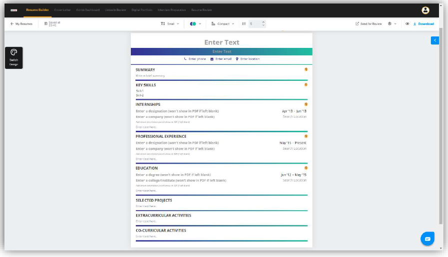

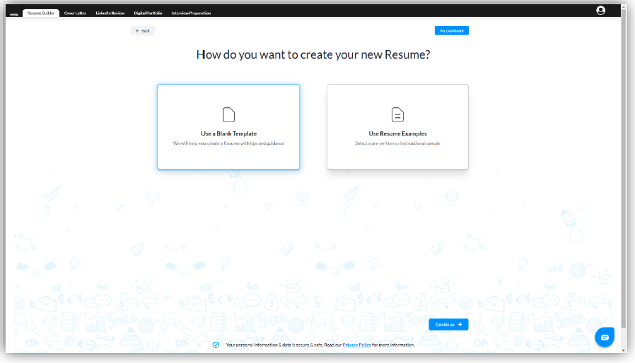

Choose a template that fits your course curriculum or the job that you want to apply to.

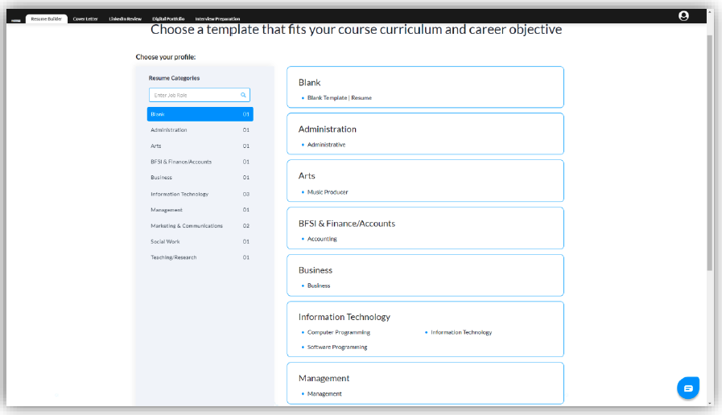

Below is an example of a pre-written sample in the Hiration AI resume builder created using the best practices followed by top resume experts and high-level recruiters across the world.

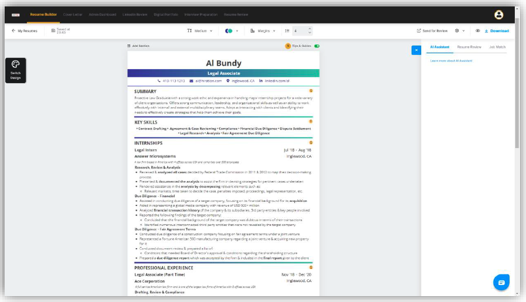

The yellow bulb icon, which can be switched on/off at the top right of the resume lists the best and appropriate tips that will help you fill in different sections of the resumes effectively.

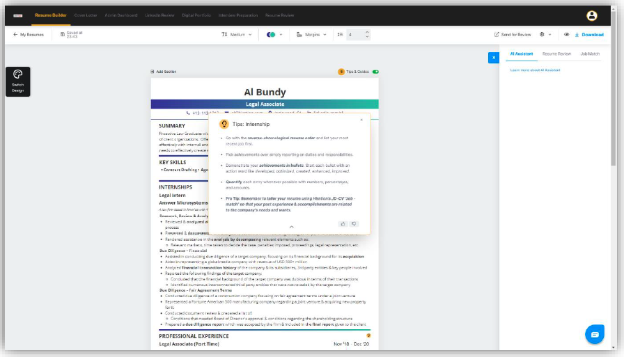

The AI assistant helps you efficiently type your bullet points as you keep typing a new sentence by intelligently giving you suggestions for the next word/sentence relevant to the resume you’re creating.

The Resume review helps you enhance the quality of content and chances of job shortlisting of your resume by analysing and giving suggestions based on a rubric (set of global resume best practices) out of a score of 100.

The Job Match feature gives a clear-cut idea of how effective your resume for a job you’re interested in though a score out of 100 by letting you copy that specific job description relevant to the resume from job boards like LinkedIn or Indeed and paste it in the space provided.

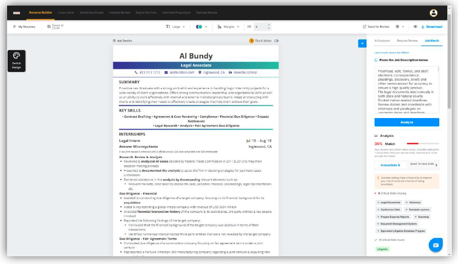

You can switch between other designs by clicking on the ‘Switch Design’ button on the left-hand side of the resume builder to find your most preferred design.

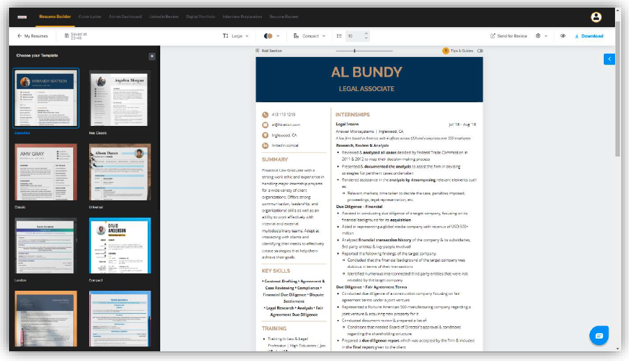

You can download in Word/PDF format depending on the design you select for your resume.

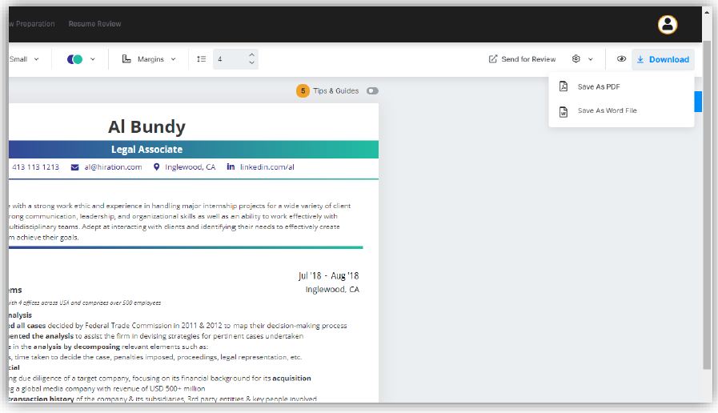

To use the LinkedIn review feature, go to your LinkedIn profile and download your LinkedIn profile as a PDF.

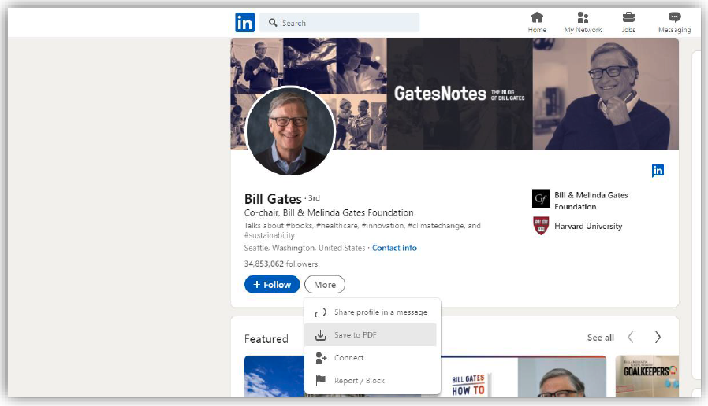

Under the LinkedIn review tab, click on the ‘Upload your profile PDF’ button to upload your newly downloaded LinkedIn profile into the reviewer.

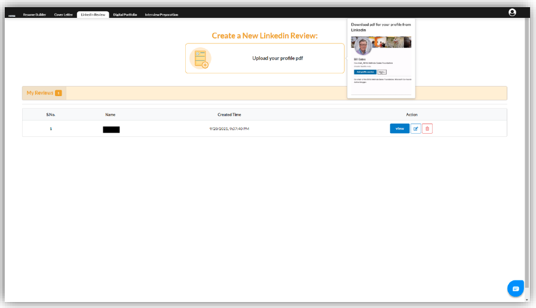

Use the section-wise scoring to go through the detailed descriptions, tips and guides on how to optimise your LinkedIn profile for maximum visibility and networking capability.

View a walkthrough of the Hiration platform [here](https://youtu.be/IhNwUjyxmDM)

