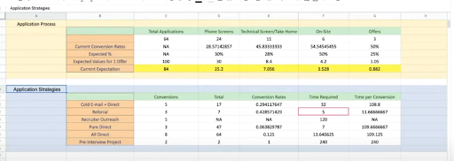

A job-search plan is a resource you create to help you take control of your job search. It enables you to track important data in each stage as you monitor your applications, interviews, and feedback. It also helps to keep you focused on the things you can control.  

A Job-Search Plan will help you:

- design your timeline 
- set your expectations 
- monitor your progress 
- make adjustments, as necessary, to improve your outcomes 

At each stage, you'll gather information to make decisions, like:

- the number of CVs you need to send out each week
- your application-to-interview ratio
- which types of outreach and cover letter formats are working for you

Remember that every application and interview experience is a learning opportunity. Your goals might also change over time, and information about your previous applications and interviews will help you analyse your past performance and set realistic expectations for future searches. Knowing what to expect and having visibility into what’s actually happening in your job search is key to being in control of your employment – and landing the job!

# Important Mindset Reminders 
Job searching in your early career is particularly difficult. It takes a ton of effort to do it well, but it’s so worth it. Putting in the effort now, and finding the right job for your growth, will pay off exponentially in the long run. Also, the good news is that job searching does get much, much easier once you’ve built up more experience in your field. 

There are a number of key things to remember about the process: 
- Interview processes aren’t perfect. They don’t always correctly identify the best candidates. So don’t take it personally. 
- Given the point above, it is, to some extent, a numbers game. Most people will be invited to interviews somewhere between 5% and 25% of the time. This means that you’ll need to submit between four and 20 applications to be invited to a single first-round interview. The more applications you submit, the more interview invitations you’ll receive.
- While it is a numbers game, there is also a lot to be said for putting in some extra effort on the roles you’re most excited about, or where you have a positive reference from someone with influence in the organisation you’re applying to. 
- One of the toughest decisions you’ll face is depth versus breadth of applications and preparation work. Our recommendation is to do as much general preparation as you can, so that even your “quick applications” are of a very high quality. 

## Patience & Perseverance
We are all about accelerating careers with effective and efficient learning-to-earning opportunities. As such, we’ve put together this employability sprint as a “crash-course” to help you land your first job. That said, the reality is that:
1. **A job search takes time.** The best companies usually take the most time to ensure that they’re hiring the best candidates. For the job seeker, this often means lots of waiting and uncertainty. 
2. **It’s a numbers game** – at least to some extent. Recruitment processes are far from perfect and the best candidate doesn’t always get hired – luck certainly plays a role. Plan for the long haul, don’t take rejection personally, and regularly audit and recalibrate around productive mindsets. (See below.) 
3. **Rejection Therapy:** Rejection is an inevitable part of the process. It’s best to build up some immunity: 
- [What I learned from 100 days of rejection (TED Talk)](https://www.youtube.com/watch?v=-vZXgApsPCQ&ab_channel=TED)  [(Text Transcript)](https://singjupost.com/jia-jiang-what-i-learned-from-100-days-of-rejection-at-ted-talk-transcript/)
- Play the rejection therapy game for the next three days. Aim for at least 10 “nos” per day.
- [How to come up with good rejection ideas](https://www.rejectiontherapy.com/blog/2013/07/23/3-ways-to-come-up-with-rejection-ideas)
4. **Growth Mindset:** Our brains are neuro-plastic, and neural pathways grow with practice. Skill sets take time to develop. So, failure really just means “not yet”. 
- [5 Min Intro to Growth Mindset](https://www.youtube.com/watch?v=KUWn_TJTrnU&ab_channel=Sprouts) 
- Some of the [Science of Growth Mindset](https://www.ncbi.nlm.nih.gov/pmc/articles/PMC5836039/#:~:text=Empirical%20studies%20have%20revealed%20that,challenges%20%5B11%2C12%5D.)
- Watch the intro video above, and then describe a time where you used to be really bad at something, but became a whole lot better through lots and lots of practice. The same thing applies to job searching. It’s a skill that needs to be developed, and this takes time and practice.

# Setting The Stage

## Have A Scientific Mindset
Given an environment where a very low percentage of applicants actually get through to the interview and some amount of rejection is inevitable, it’s wise to emotionally detach from the results of individual interviews as much as you can. 

It can be helpful to view the application process as a “sales funnel” in which your challenge is to run experiments aimed at optimising the funnel. I.e. optimising conversion from one stage to the next. 

The funnel might look something like this: 
Applications made >> First Interview >> Second Interview >> Offer Received 

Note that you might have as many as four interviews for any given role. Tracking your conversion rates across the above categories will, however, help you identify on which stage of the process you most need to improve to achieve success. 

Here is a nice example of how Data Scientist Jeff Li tracked the success of his job-search process:  

The short intro article: [7 job offers during the worst job market](http://www.jefflichronicles.com/blog/2020/9/26/i-got-7-job-offers-during-the-worst-job-market-in-history-heres-the-data)

A deeper dive [40 min overview video](https://www.youtube.com/watch?v=Pkrf8sGe_TQ&ab_channel=TowardsDataScience):

You’ll note that Jeff had a much higher success rate with companies where he had a referral/warm introduction. This is a consistent finding across the internet and in much of the research that’s been done on this. Positive referrals can improve your odds of getting the interview by as much as 10 times. 

Here is a similar example by Data Scientist Kelly Peng: [My journey to Airbnb](https://towardsdatascience.com/how-to-land-a-data-scientist-job-at-your-dream-company-my-journey-to-airbnb-f6a1e99892e8)

## Scheduling
Before you dive into populating your spreadsheet and firing off applications, it’s worth planning out a deliberate approach to how you want to spend your time during the job search. This is especially useful for Web Developers that usually do practical tests as part of their interview process and need to practise their skills. 

This [scheduling guide](https://interviewguide.dev/creating-a-schedule) from interviewguide.dev provides some useful pointers. 

## Goal Setting
People often underestimate the power of goal setting. This article reminds us just how effective it can be to pin some goals to a wall and to take them seriously: 
[Why 3% of Harvard MBAs make ten times as much as the other 97%](https://sidsavara.com/why-3-of-harvard-mbas-make-ten-times-as-much-as-the-other-97-combined/)

Be sure to focus on goals within your control. I.e. [Process Goals](https://www.developgoodhabits.com/process-goals/). Work really hard at them, and then allow yourself a suitable reward for all the hard work. 

# Creating Your Plan

[Template: Job search project plan](https://docs.google.com/spreadsheets/d/1b4nvFVSdb0EHvJ5jcZ9ftJ-wfeh3ZzI_yXGEoiiQvfY/edit?usp=sharing)

Assumptions to track should include:
- Application-to-interview success ratio
- Success rate of each round of interviews (e.g. how many first interviews led to second interviews)
- Number of interview rounds for each company

*Tip: It is always a good idea to track details of your job-search activities. You’ll gain insight into your success metrics and stay on top of important job-search information that might otherwise get lost as your activities progress.*

This [job-plan template](https://docs.google.com/spreadsheets/d/1b4nvFVSdb0EHvJ5jcZ9ftJ-wfeh3ZzI_yXGEoiiQvfY/edit?usp=sharing) will help you get started with tracking your applications. Make a copy and then make it your own by deciding what data you’d like to track across the “application funnel”. 

Experiments and measurement are the heart of the scientific method. Try and predict (hypothesise) how each interview will go, where you’ll do well, and where your offering or skill set is a little thin for the role. Reflect afterwards on your expectations versus the reality of what happened. 

Near the end of the interview, ask for feedback on which positive aspects of your interview most stood out for the interviewer. Be sure to take notes on all feedback received. 

If you later get a rejection letter, you can then follow up with a request for some honest feedback on how you could have done better. It’s best not to focus the interviewer on negatives during the interview, but the critical feedback (provided at a later date) can uncover some incredibly valuable insights for the rest of your job search.

## How You Can Improve The Efficiency Of Your Job Search Activities
### Apply To More Jobs
The more applications you submit, the more interview invitations you’ll receive.
Use the recommendations below to ensure that you are getting as many opportunities as possible:
- Make sure you are monitoring major job aggregators (engines pulling jobs from multiple sites) such as [Indeed](https://za.indeed.com/) and [ZipRecruiter](https://www.ziprecruiter.com/). You can set up alerts to receive new postings by email.
- Register and upload your CV on leading job portals in your area (refer back to **Online Profile**). Also make sure you are on LinkedIn as recruiters and employers use this as a sourcing tool for potential employees. 
- Separately track postings on LinkedIn jobs, as they might not be captured by aggregators. Also join the [Umuzi Community LinkedIn](https://www.linkedin.com/groups/13534511/) group.
- Monitor local job referral and networking groups on Facebook and other online communities where recruiters and hiring managers share opportunities not posted elsewhere.
- Join the [Umuzi Job Opportunities WhatsApp group](https://chat.whatsapp.com/HYhsGma2yMI4t8Eo0ZYtcV) where Alumni share opportunities in their networks.

### Optimise Your Applications
1. Make sure your CV follows all the best practices as covered in this sprint.
2. Get feedback on your CV from other people. 
- Recommendations from professionals in your target field are best, but others with experience in hiring can also help. Keep in mind that people might have different preferences, so don’t feel that you need to incorporate every word of feedback you receive. Instead, collect input from multiple people and look for advice that is consistent and makes sense to you. Your goal is to create a CV that is captivating to as many employers as possible! 
3. Ask for referrals.
- Referrals are the best way to turn more of your applications into interviews. Most companies review employee referrals ahead of other applicants, so, at the very least, a referral increases the chances of your application being properly considered. 
- Employees referring you might be able to provide additional information on the role or the status of your application.
- Before applying for a role, check LinkedIn to see if you, or someone you know, might have a connection at the company. If so, ask for a referral or an introduction.
- Create a list of companies where you know people. Go through each company’s careers page to see if there are relevant open roles for which you can request a referral.
- Make sure that everyone you know is aware of your job search so they can send opportunities your way. Reach out to people directly, post on social media, and mention it in conversations. Remember that opportunities can come from unexpected places such as your barber, book club, church, and more.

*Tip: Some companies offer referral bonuses to their employees, so even a stranger might be open to referring you if you are a qualified candidate. Be creative when seeking out referrals, and don’t hesitate to ask.*

## Leveraging Your Personal Networks
As mentioned earlier, your best odds of landing the interview are through trusted referrals from people who have influence at the company you’re applying to. Sometimes it’s about knowing someone in the company, but it can also be through a trusted friend of the company’s key decision maker.  

A general call out to your personal networks (via LinkedIn and the like) is a great idea! You never know which old school friend might know of an opportunity for which you’re a perfect fit. 

That said, reaching out to people individually for support is often more effective than a general broadcast, so we’d advise that you give that a try as well. The [job-plan template](https://docs.google.com/spreadsheets/d/1b4nvFVSdb0EHvJ5jcZ9ftJ-wfeh3ZzI_yXGEoiiQvfY/edit?usp=sharing) we shared earlier has a section for mapping out and tracking who in your personal network you should reach out to with a direct one-on-one request for support in your job search.

It’s best to keep these direct requests quite broad. Let them know that you’re looking, remind them of your qualifications and what type of job you’re after, and then ask if they know anyone in their network who is hiring for your skillset. Chances are you won’t even need to specifically ask for the referral – if your relationship is good, they’ll likely want to help, and will volunteer to do the referral without needing to be asked. 

Finally, be sure to use LinkedIn to search for people you know at the companies you really like. Those referrals can really make all the difference! 

## Closed Communities
This is closely tied to the personal networks section above. People tend to trust others who’ve been through the same experiences they have. Great examples of closed communities when job searching include the [Umuzi Community LinkedIn Group](https://www.linkedin.com/groups/13534511/) and [Umuzi Job Opportunities WhatsApp group](https://chat.whatsapp.com/HYhsGma2yMI4t8Eo0ZYtcV). 

Monitor local job referral and networking groups on Facebook and other online communities where recruiters and hiring managers share opportunities not posted elsewhere. The [ZA Tech Slack Group](https://zatech.co.za/) is a great option for software engineers. [SUGSA](https://sugsa.org.za/) is great for scrum masters – they have a Slack, as well as other meetups and events.

## The Honest Niche
Some people don’t believe in what they call the “spray and pray” numbers game approach. They’d suggest rather going the extra mile for a few companies/roles you really like. 

We think that there’s definitely something to be said for this approach, but it’s just incredibly difficult to know all of the variables at play. You might “go all in” on extra-mile research for a particular company, only to find out that they had already earmarked an exceptional employee for an internal promotion into the role. Or perhaps they lose out on a big sale they thought they had in the bag, and can no longer afford to hire for the role they advertised. 

That said, we do think there is value in being very clear about what you want, and in putting that out to the world. I.e. in defining a niche that you’d like to specialise in, and then looking for a company that needs that skill set. There might be fewer companies whose needs overlap with what you’re offering, but for those where there is alignment, you’ll be a stand-out near the top of their list, rather than be just one of many with a generic skill set and direction. More importantly, you’re likely to find a role that’s better aligned with your own career ambitions. 

Section three of [this video](https://www.youtube.com/watch?v=z0_xrtFdFj8&list=PL2zq7klxX5ARdms3L99sE8DTEsJ4_jCHP&index=67&ab_channel=KenJee) explains this quite nicely. 

## Job Portals + Platforms
See the previous section on Online Profiles for suggested job portals and platforms on which to list your CV. Also make sure you are on LinkedIn as recruiters and employers use this as a sourcing tool for potential employees. 

## Companies Who Don’t List On Aggregators
Identify companies you’d be interested in working for based on their geographic location or other parameters. Check their career pages directly once or twice a week for new opportunities that might not appear on aggregator websites.

## Millions Of Application Portals
It can be quite frustrating when you put a ton of effort into a CV, only to be asked by each company you apply to, to type the info that’s on the CV into their custom application portal. Our recommendation for making this process easier is that you set up and maintain a Google Doc with all of this info, so that you can copy and paste it in quickly and easily, while maintaining a quality representation of yourself. 

You’ll pick up after a few applications the type of info they ask for or the questions they want you to respond to in the application form. Having high-quality answers at the ready in your Google Doc can save you a ton of time and help you stand out from those who type quick and rough answers from scratch for each new application.

## Communication + Follow Ups
This is a quick, but crucial, reminder to communicate well throughout the application process:  [How to kick ass at your next interview](https://www.offerzen.com/blog/how-to-kick-ass-at-your-next-interview)
