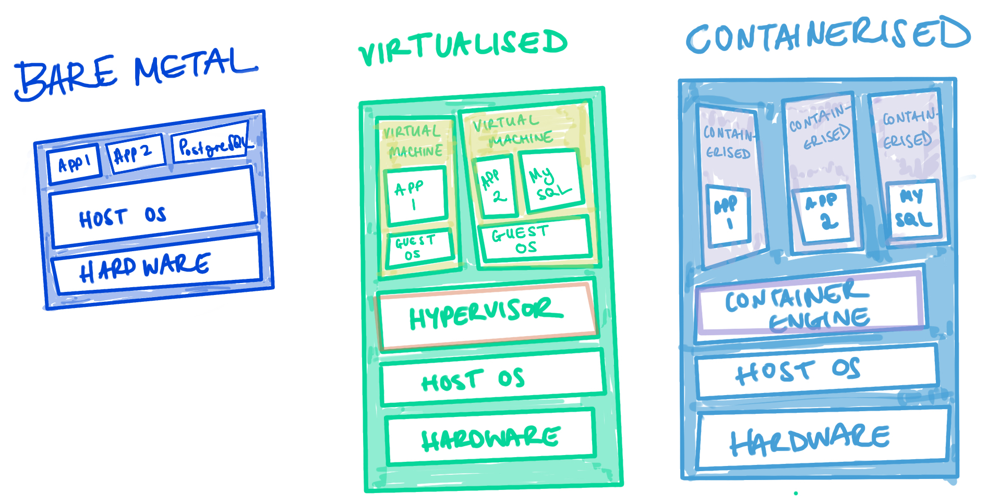

## What is Kubernetes?
In today's world of complex, web-scale application backends made up of many microservices and components running across clusters of servers and containers, managing and coordinating all these pieces is incredibly challenging.

That's where Kubernetes comes in. Kubernetes (also known as "k8s") is an open-source container orchestration platform that automates deployment, scaling, and management of containerized applications.

With Kubernetes, you don't have to worry about manually placing containers or restarting failed ones. You simply describe your desired application architecture and Kubernetes makes it happen and keeps it running.

We'll dive deep into Kubernetes and cover:

* Key concepts like pods, controllers, and services
* The components that make up a Kubernetes cluster
* When and why Kubernetes is useful for your applications
* Trade-offs to consider before adopting Kubernetes

We'll demystify Kubernetes and equip you with everything you need to determine if and when Kubernetes could be the right solution for your applications. You'll walk away with a clear understanding of what Kubernetes is, how it works, and how to put it into practice.

Whether you're a developer, ops engineer, or technology leader, you'll find invaluable insights in this deep dive into Kubernetes.

## History
Containers are a method of packaging and isolating applications into standardised units that can be easily moved between environments.&#x20;

Unlike traditional virtual machines (VMs) which virtualise an entire operating system, containers only virtualise the application layer, making them more lightweight, portable and efficient.

Kubernetes was created and offers automated deployment, scaling, and management of containerised applications. Through the utilisation of containers instead of VMs, Kubernetes delivers advantages such as heightened resource efficiency, faster application deployment, and portability between on-premises and cloud environments.

### Why abbreviate to k8s?
The number 8 in k8s refers to the 8 letters between the first letter “k” and the last letter “s” in the word Kubernetes.

## Why Use Kubernetes?

Containerisation has revolutionised the way applications are deployed and managed. However, deploying and managing multiple containers across a cluster of machines can quickly become complex. This is where Kubernetes comes in. Kubernetes abstracts the underlying infrastructure and provides a unified API and control plane for managing containers, making it easier to deploy, scale, and monitor applications.

Some key benefits of using Kubernetes include:

1. **Scalability**: Kubernetes supports horizontal scaling, allowing you to easily increase the number of containers running your application to handle increased traffic or workload.
2. **High Availability**: Kubernetes ensures that your applications are highly available by automatically monitoring, restarting, and distributing containers across the cluster. It also provides mechanisms for handling failures, such as managing replica sets and rolling updates.
3. **Self-Healing**: Kubernetes continuously monitors the health of your containers and applications, automatically restarting or replacing failed instances to maintain the desired state.
4. **Flexible Deployment**: Kubernetes allows you to deploy your applications in a variety of ways, including rolling updates, canary deployments, and blue/green deployments. This enables you to minimize downtime and easily roll back to a previous version if needed.
5. **Efficient Resource Utilization**: Kubernetes optimizes resource allocation by scheduling containers based on their resource requirements and availability. This helps to avoid resource contention and ensures efficient utilization of compute resources.