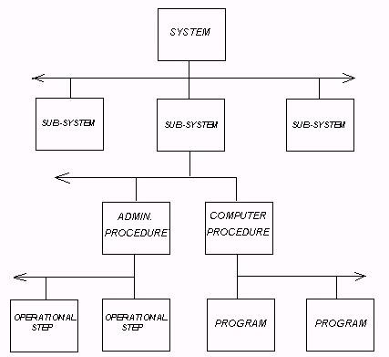
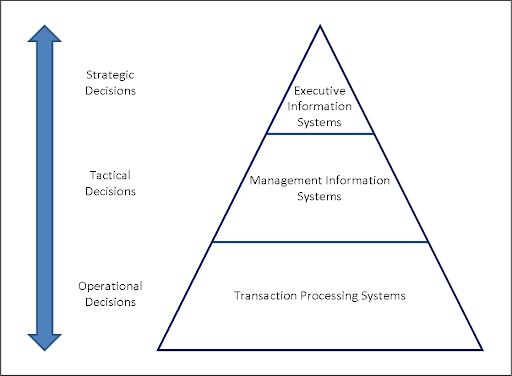
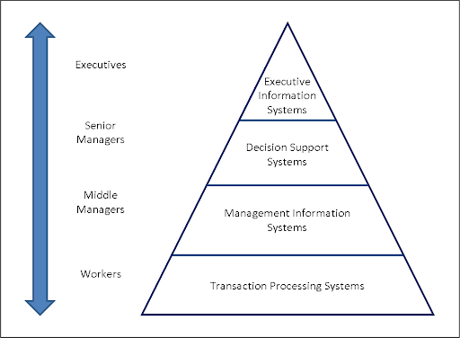

## DESCRIPTION

In the previous module you learned about what it means to be a professional and what acceptable behavior is. Now that you know all of that it's just as important for you to know that the workplace exists within a business and a business has ecosystems. 

In this module you will learn  about the different components of the business environment and how it affects the business.

## LEARNING OUTCOMES:

By the end of this module you will have an understanding of:

  - External business environment

  - Internal business environment 

  - Types of businesses 

  - Business systems 

  - Enterprise resource planning 

In addition to these skills you will also learn how to:

  - Identify the different types of business  environment 

  - Use a Porter's value chain Interact in a business environment 

## INTRODUCTION TO BUSINESS ECOSYSTEMS

In this module, you will be introduced to the multifaceted world of business. What does it take to set up a business? What does the environment look like? What regulations must we comply with? It is important for us to explore the business ecosystem before we get into how to run internal projects and solve real user problems. 

Let’s jump into it!  As a professional in the making, it's important to know the environment and ecosystems that the business you are consulting for operate in and you know the regulations that govern the business. So let's get to know more about the different business ecosystems.

### UNDERSTANDING THE BUSINESS ENVIRONMENT

Businesses do not operate in a vacuum but rather in a dynamic environment that has a direct influence on how they operate and whether they will achieve their objectives. This external business environment is composed of numerous outside organizations and forces. A business environment comprises both internal and external factors. The business environment poses threats to a firm or offers immense opportunities for potential market exploitation. 

Businesses operate in an environment that determines the businesses growth or failure depending on how the business adjusts to the dynamics of the environment. Businesses can manage the environmental components or have an influence on those components or even the business will just need to adjust.We have two different environments which are Micro and Macro environments.

For us to fully understand the business environment and all its moving parts, let's use Umuzi as an example. Sure we’re about providing access to high-quality education which leads to high-value employment opportunities, but there’s so much more to us than just that. What makes up Umuzi is our education side, our marketing department, our community and wellness teams, and much more.

***THE INTERNAL BUSINESS ENVIRONMENT***

An organization's internal environment consists of the entities, conditions, events, and factors within the organization that influence choices and activities. Factors could include employee behavior, the organization's culture, mission statement, and leadership styles.
What is an internal environment-: An internal environment is a set of elements that define the atmosphere within the company’s structure that the organization has control over.

Because these factors are internal, the business (in this case Umuzi) is able to control them. It’s not always easy, but it’s certainly easier to control internal factors than external factors. We’ll talk about the external factors later. 

Businesses like Umuzi are made up mostly of the common internal business environment factors, such as: 

  - Financial (resources, systems)  

  - Human (employees, management)

  - Technological (systems, processes) 

  - Physical (location)

  - Product 

While we have control over all these factors, a lot of effort is directed to our internal team at all times, from managers to existing recruits. We focus on our internal team to create a strong organizational culture, which is a critical business success factor.

***THE EXTERNAL BUSINESS ENVIRONMENT***

An external environment is composed of all the outside factors or influences that impact the operation of the business. The business must act or react to keep up its flow of operations. The external environment can be broken down into two types: the micro-environment and the macro-environment.

Watch [this video](https://www.youtube.com/watch?v=H8_W8tAEsfQ) below to recap what we’ve learned about the macro-environment.
[The External Business Environment](https://youtu.be/H8_W8tAEsfQ)

***MICRO ENVIRONMENT***

The term ‘micro-environment’ refers to those environmental factors which are closely associated with the business. Below are a few examples of these. Micro environment refers to the immediate factors that have an impact on the success of the business and the business has an influence on these to make them manageable.

***Customers***

Customers are people that buy goods and services from the business. Businesses have direct control over who their customers are and what their customers can buy from them. The relationships we build are vital to our success so we’ve got to understand the different types of customers and the influence they have on our success.

***Suppliers***

Suppliers are where businesses can acquire their resources, things that the business needs to continue running may differ from business to business however now that we are reliant on the internet the network provider of wifi becomes the supplier of that business. We have learned that businesses have direct control over the microenvironment which means the business can choose who their network provider is.

***Competitors***

Competing firms can influence business in a number of ways. They can do so by bringing new and cheap products into the market, by leveraging technology more effectively than their competitors, by meeting customer needs more effectively, or by undercutting the competition through marketing, positioning, and promotion. Think about guys like Vega, AAA, Boston City Campus, or even agencies creating their own learnerships. They might have better access to funds. 

***The Public***

The Public has different players like the local public, press or media, etc. The attitude or behavior of these players can affect business units. 

***Market Intermediaries***

Market intermediaries are the links that help to promote, sell, and distribute the products to final consumers. They are the physical distribution firms (transport firms), service agencies (media firms), financial intermediaries (banks, insurance companies), etc. that help in producing, marketing, and insuring the goods against loss or theft, fire, etc. 

***MACRO ENVIRONMENT***

The macro-environment consists of general factors that a business typically has no control over. The success of the company depends on its ability to adapt. The macro-environment consists of the economic and non-economic variables that provide opportunities and threats to firms. Below are examples of the macro-environment.  

Watch [this video](https://youtu.be/rFUs1wYKtKI?t=41) that explains the External Business Environment in  the macro-environment.

***ECONOMIC ENVIRONMENT***

Some of these in the list below won’t seem to directly affect our online community and wellness, but you’ll be surprised at how interlinked everything is. Take a look at the list below of what makes up the economic environment that affects business activities and then we’ll talk about how one thing can affect another.

  - Industrial production
  
  - Agriculture

  - Infrastructure

  - National income

  - Per capita income

  - Business cycles

  - Economic policies

  - Infrastructural facilities

  - Financial facilities

So what’s the point of knowing all about the economic system? Well, it helps in answering questions like:

  - Is it the right time to set up the business?

  - Can new products be added to the product line?

  - Is the market size large enough to provide the desired rate of returns?

  - Is the environment conducive in terms of availability of manpower, infrastructure, raw material, finance, building, plant, and machinery etc?

The economic environment clearly plays a vital role in shaping the culture of our organization and other businesses. We’ve always got to remember that market forces and state planning provide the constraints within which we can carry out our functions.

***NON-ECONOMIC ENVIRONMENT***

These influence and are influenced by the economic environment. A large number of variables actually affect the non-economic environment. This consists of: 
Socio-cultural

  - Demographic

  - Natural

  - Physical

  - Technological
  
  - Political

  - Legal environment

***POLITICAL-LEGAL ENVIRONMENT***

This is the legislative, executive, and judicial environment of the country that shapes and controls business activities.
In general, government regulations relating to standards of product, packaging of products, protection of environmental and ecological balance, a ban on advertisement of certain products (liquor), advertisement of certain products with a statutory warning (cigarette), etc.
The political-legal system helps in answering questions such as:

  - Is the political climate stable in the country so that government policies do not change time and again?

  - Do political organizations promote business activities, that is, the processing of paperwork is done without much delay because of bureaucracy and red tape?

  - Is the judiciary effective in decision-making to deal with business conflicts and law-suits?

  - Are the government policies conducive to business growth in terms of incentives, markets, taxation etc?

  - Are the licensing procedures for entering into a new business lenient or strict?

  - How conducive are the export and import policies to promote imports and exports, etc?

These points are interesting when you consider how attractive South Africa is to external investors. For example, all the different unions in South Africa across mining, transport, manufacturing, etc, ensure that we have a fair employment climate. Thing is, the union's love a good strike, and if a foreign company is interested in investing money in South Africa’s platinum production, for example, they might worry that the mineworkers will strike at any given time and therefore slow production and export of platinum.

***REGULATORY ENVIRONMENT***

Linked to the political-legal environment is the regulatory environment. In South Africa, different sectors and industries are governed and guided by rules and best practices which are laid out by their own relevant industry bodies, associations, or regulatory bodies. These organizations, while performing some of the same functions, are in fact quite different.

Here are a few points which specify the aspects of professional vs regulatory bodies.
Association/Professional Body

  - Acts in the interest of the profession

  - Independent of the regulatory body

  - Promotes and supports the practitioners and the profession

  - A membership organization of professional practitioners 

  - Ensures members meet their own standards which are at least those required by the regulatory body but may exceed them.

***Regulatory Authority***

  - Acts in the interest of the public and have processes open and accountable to the public and the profession

  - Independent of professional bodies

  - Promotes the process of regulation

  - Administers a single register of practitioners who meet agreed criteria.

  - Works with the profession to agree and oversee minimum standards.

  - Sets requirements for generic continuing professional development (CPD)

And a couple of points on the advantages and disadvantages of regulatory bodies.

***Advantages of Regulatory Compliance***

  - Quality control
  
  - Avoidance of costly litigation from unhappy clients, stakeholders or consumers

  - Avoidance of costly litigation from unhappy clients, stakeholders or consumers

  - Increased efficiency

  - Public and consumer trust and brand association

  - Fair competition - everyone plays by the same rules

  - Promote transparency in operations and decision making

Disadvantages of Regulatory Compliance

  - Regulatory bodies are inflexible

  - Bodies are often inefficient and unnecessarily bureaucratic, slowing down business operations.

  - Many of the regulations have little or no discernable public benefit

  - Can limit the adoption of technology that promotes safety and efficiency

  - Undermines proper conduct - people follow rules and tick boxes rather than considering the ethics/efficiency of a process or decision

  - Costly

  - Can limit internal creativity and innovation

***SOCIO-CULTURAL ENVIRONMENT***

This represents the values, culture, beliefs, norms, and ethics of the society in which we operate. People are important to organizations both as human resources and customers. Their buying habits, buying capacities, tastes, preferences, and education affect what we offer and how we do business. We understand that our potential Recruits don’t have very high buying/spending capacities, that’s why we work really hard to not only offer free education but offer a stipend as well. This is a very different model for private institutions.  Many firms and businesses change their production and marketing plans according to consumer demand.
The social environment consists of the social values; concern for social problems like protection of the environment against pollution, providing employment opportunities, health care for the aged and old, etc.; consumerism, that is, indulging in fair trade practices to satisfy the market.
The cultural environment represents the values and beliefs of society. These beliefs mold the attitudes of people and help business enterprises determine their need perception. The socio-cultural environment helps firms support the social and cultural values of society by encouraging fine arts projects, sports, communication media, donations to educational, religious, and charitable institutions, counseling centers, vocational and technical training centers, etc.

***TECHNOLOGICAL ENVIRONMENT***

Technology refers to the application of scientific and organized knowledge to organizational tasks. Basically, technology includes inventions and innovations regarding techniques of production. But it’s not the only production: technology can be used in the way in which we communicate and recruit potential applicants. Technology is changing at a fast pace and the technological environment is dramatically affecting the business environment.
You’ll hear a lot of people talk about how technology can disrupt an industry. Basically what this means is technology has the ability to change the game as we know it. Think about Uber, for example. In the old days if you wanted a private taxi there were about 10 steps to getting them to pick you up. Now, your ride is just 1 click away, thanks to some clever use of technology. Basically, disruptive technology takes the rule book and chucked it in the fire.

***DEMOGRAPHIC ENVIRONMENT***

This refers to the types of people that form the population in an economy. Demographics refer to factors such as gender, age, income, growth rate, language, and religion, etc. In a growing economy, there is an increase in products and labour.
NATURAL ENVIRONMENT

The natural environment consists of the renewable and non-renewable resources used in production processes. The renewable resources are air, water, and solar energy which can be replenished and non-renewable resources are oil, coal, wood, etc. which cannot be replenished.
Business enterprises should use these resources wisely and adopt methods to restrict environmental pollution. Legislative measures are also enforced by the Government to protect the natural environment. Even renewable resources should be used wisely so that we don’t use more than we have.

***THE GLOBAL ENVIRONMENT***

It represents the global environment characterised by the “borderless world”. The global business environment is significantly influenced by the principles and agreements of the World Trade Organization (WTO). WTO monitors and regulates the business transacted in the international environment.

### BUSINESS SECTORS IN SOUTH AFRICA

There is more than one way to classify businesses by sector. Some economists divide businesses by corporate, government and nonprofit organizations. But most prefer to divide the economy into three broad sectors: primary, secondary and tertiary. 

The primary sector serves as the foundation of all business. Think of this as the raw materials that support everything else. The primary sector involves the extraction of raw materials from the earth. This extraction results in raw materials and basic foods, such as coal, wood, iron and corn. 

The secondary sector involves the transformation of raw materials into goods. This transformation results in wood being made into furniture, steel being made into cars or textiles being made into clothes, as examples. 

The tertiary sector involves the supplying of services to consumers and businesses. This sector provides services to the general population and businesses, including retail, sales, transportation and restaurants. The types of workers in this sector include restaurant bartenders, accountants and pilots. The service industry makes up 80% of the labor force today.

Among the key sectors that contribute to the gross domestic product and keep the economic engine running are:

   - Manufacturing

  - Wholesale and retail trade

  - Financial services

  - Transport

  - Mining

  - Agriculture

  - Tourism

***TYPES OF BUSINESSES***

Whether you're a retailer, supplier of services (like Umuzi), or manufacturer, there are various legal ways in which you can set up your business.

A business that is altogether separate and distinct from its members is a legal entity, in other words, if its members jumped ship tomorrow, it would still stay afloat.

A business that is set up as a legal entity has:

  - Legal capacity and is competent to have rights and duties
  
  - Capacity to act is competent to contract

  - Capacity to litigate. It has the capacity to appear in court, as a party to legal action.

  - This protects the owners of the business. If the business is taken to court, for example, it is the business' assets that are at risk, not the personal assets of the owners.

From a legal point of view, there are five types of businesses:

  - Sole proprietorships

  - Partnerships

  - Non-Profits

  - Companies

  - Co-operatives

  Let's look into these.

***Sole Proprietorships***

The simplest and most common form of business ownership, sole proprietorship is a business owned and run by someone for their own benefit. The business’ existence is entirely dependent on the owner’s decisions, so when the owner dies, so does the business.
Sole Proprietorships are for-profit entities, meaning that they are designed to generate profit for the owner.

Advantages of sole proprietorship:

  - All profits are subject to the owner

  - There is very little regulation for proprietorships
 
  - Owners have total flexibility when running the business

  - Very few requirements for starting—often only a business license

Disadvantages  of sole proprietorship:

  - Owner is 100% liable for business debts

  - Equity is limited to the owner’s personal resources

  - Ownership of proprietorship is difficult to transfer

  - No distinction between personal and business income

Watch the videos below to learn more about a sole proprietorship. 

[What Is A Sole Proprietorship? - QuickBooks US](https://youtu.be/aKkcggE7SRw0)
 
***Partnerships (Personal Liability Companies)***

A partnership is an agreement in which two or more persons combine their resources in a business. In order to establish the terms of the business and to protect partners/shareholders in the event of disagreement or dissolution of the business, a partnership/shareholders agreement should be drawn up with the assistance of a lawyer.
Partners share in the profits according to the terms of their agreement. Personal Liability Companies are often denoted by the letters “Inc.” in their title. Eg: Ja Rule’s Murder INC.

***TYPES OF PARTNERSHIPS***

***General Partnership***

All  members share the management of the business and each is personally liable for all the debts and obligations of the business.

***Limited Partnership***
Some members are general partners who control and manage the business and may be entitled to a greater share of the profits, while other partners are limited and contribute only capital. Limited partners take no part in control or management and are liable for debts to a specified extent only.

**Partnerships are for-profit entities, meaning that they are designed to generate profit.**

Advantages of Partnerships:

   - Shared resources provides more capital for the business

   - Each partner shares the total profits of the company

   - Inexpensive to establish a business partnership, formal or informal

Disadvantages of Partnerships

  
  - Each partner is 100% responsible for debts and losses

  - Selling the business is difficult—requires finding new partner

  - Partnership ends when any partner decides to end it

  - Watch these videos to get an insight into the things you should consider when getting into a partner

[Business Partnership](https://youtu.be/HXaBVFnZ_dQ)
[How To Make A Business Partnership Work](https://youtu.be/fG_NBTeNN2s)

***COMPANIES***

A company is a legal entity that is separate from its owners, the shareholders. No shareholder of a corporation is personally liable for the debts, obligations or acts of the corporation. A company is identified by the terms "Limited", "Ltd.", "Corporation", or "Corp.".

Companies are mainly divided into private and public companies.

A private company, Pty Ltd or proprietary limited company is treated as a separate legal entity. So even if you launch your business single-handedly, this type of business is registered as a separate legal entity.

Advantages of being a Pty Ltd:

  - You don’t have to explain your finances and decisions to anyone 

  - The business is a separate entity, so it continues to run smoothly even if you sell your shares or take on partners

  - Shareholders are typically not liable for company debts, although there are some tax liabilities

  - Anyone acting recklessly or fraudulently can be personally liable for all or any debts of the Pty Ltd

Disadvantages of being a Pty Ltd:

  - Private companies are required to comply with a large number of legal requirements

  - This type of business is challenging and expensive to register

  - As this is a private company, you can’t offer shares to the public or list the business on a stock exchange

A public company is a business that issues securities through an initial public offering (IPO) and trades its stock on at least one stock exchange. The daily trading of the public company’s stock determines the value of the whole business. Publicly traded companies are defined as public because, unlike Pty Ltd businesses, shareholders can be anyone who purchases stock. Anyone can then become equity owners of the business.

Advantages of publicly traded companies:

  - Since you can sell your shares to the public, this offers you more capital to work with
  
  - Being listed on a stock exchange means that fund managers and traders are keeping an eye on your business. The more interest you have, the more business opportunities will come your way

  - The risk is spread out amongst the various shareholders. The more shareholders, the less risk everyone holds

Disadvantages of publicly traded companies:

  - Setting up a public company is more challenging compared to the other types of business structures

  - Since there are now more shareholders, directors and managers, making decisions can take significantly longer

  - You’ll need to reveal some of your documents and annual accounts are published for inspection to the public. This improves transparency but doesn’t enable you to guard your secrets effectively

  - When you go public, you’re selling the ownership of your company to strangers. It’s challenging to raise the money you need while keeping a 51% majority

 Watch the video below to learn more about Private and Public companies.
 
[Private vs Public limited company: Difference between them with definition & comparison chart](https://youtu.be/jtM5EoV6obY)

***Cooperatives***

A cooperative is a corporation organized and controlled by its members, who pull resources to provide themselves and their customers with goods, services, or other benefits. Cooperatives are for-profit entities. A cooperative business structure provides:

  - Democratic control based on one member one vote

  - Open and voluntary membership

  - Patronage dividends
   
Advantages of Cooperatives:

  - Owned and controlled by members
  
  - Democratic control (i.e. one member, one vote)

  - Limited liability

  - Profit distribution (surplus earnings) to members in proportion to use of service; surplus may be allocated in shares or cash

Disadvantages of Cooperatives:

  - Possibility of development of conflict between members

  - Longer decision-making process

  - Participation of members required for success

  - Extensive record-keeping necessary

  - Less incentive to invest additional capital
  - 
An interesting video explaining cooperatives:
[What is a Co-operative?](https://youtu.be/90FL_bBE4mw)

***Non-profit Companies***

Nonprofits are companies set up for public benefit, or for a purpose relating to cultural or social activities, or communal or group interests, such as religion, sciences, education, arts, charity, or recreation. Under the old Act, these were known as Section 21 companies. Umuzi falls under this type of business! 

The income and property of a non-profit company are to be applied solely to the promotion of the non-profit company’s main objective and cannot be distributed to owners or shareholders. So basically, the money we make from learnerships goes back into the business to pay for things such as salaries, wellness sessions between recruits and counselors, pay for marketing for our recruitment campaigns and, of course, go back into funding more learnerships.

Advantages of Non-Profits:

  - Owned and controlled by members
  
  
  - Tax and other benefits

  - Limited liability

  - A non-profit organization can receive grants or aid in contrast to business entities that have to use loans as a means of raising funds

  -Satisfaction from being able to contribute to social development

Disadvantages of Non-profits:

  - Frequently do not generate enough income to cover all their expenses, so they fundraise from the public or donors

  - Non-profit organizations are subject to stricter reporting requirements

  - Benefits arising out of the non-profit organization cannot be inferred for the personal benefit of its members, directors, officers beyond a permissible limit

  - Getting grants is a tedious job

  - In case the incorporators decide to move onto some other pursuits in life, they cannot take along the assets accumulated by the non-profit organization

Watch this video to learn more about NGOs:
[What is a non profit organization](https://youtu.be/Mc5YlnqvrqA)

## THE BUSINESS OF DOING BUSINESS

Why do we do business? Why does business exist and why does it do what it does? The obvious answer is money. One could argue that businesses simply exist to generate cash. But this is not entirely true (although this is certainly a part of the ‘why’). In Umuzi's case, we exist to bring more people into the talent pipeline and give access to high-value and innovative education so that our recruits can have access to high-value employment opportunities.

This section deals with broad business objectives and then demonstrates a model called the Value Chain Model, for thinking about what needs to be done to achieve these objectives. At a high level, we are looking at why businesses exist and, at a generic level, how they add value.

Business objectives are by no means universal - they are impacted by your industry, the environment in which you are operating, the type/structure of your business, and the product or service that you are creating/packaging/selling. However, there are some broad strategic objectives that most businesses prescribe to in one form or another.

***BUSINESS STRATEGY***

A business strategy typically is a document that clearly articulates the direction a business will pursue and the steps it will take to achieve its goals. In a standard business plan, the business strategy results from goals established to support the stated mission of the business. A typical business strategy is developed in three steps: analysis, integration, and implementation.

In the analysis step of business strategy development, one of several methods is used to analyze a firm’s market, resources, obstacles to success, and specific advantages. The goal of strategic analysis is to identify what a business wants to accomplish, the strengths it can bring to bear on accomplishing the goal, and weaknesses that need to be addressed prior to integration and implementation. Strategic assessment methodologies can include evaluating the business environment, gaming various competitive scenarios, determining what market forces are at work, and rating competitors, among others.

Integrating a business strategy usually is one of many steps in a larger planning process. A business plan begins with an overall vision. 

A business vision is a company's road map, indicating both what the company wants to become by setting a defined direction for the company's growth; it is a mental picture of where you would like your business to be in the future. 

From the vision, a mission statement for the business is constructed, usually the shorter and more precise the better.

A mission statement is a short written statement of your business goals and philosophies; it defines what an organization is, why it exists, and its reason for being. A mission leads to specific goals the business will achieve to accomplish its mission and that in turn leads to strategy to achieve goals. Specific tactics are usually then developed to support the business strategy. 

***COMMON BUSINESS OBJECTIVES***

**Increasing Profitability**

Most organizations operate because their owners want to maximize wealth. Therefore, improving profitability is one of the prime objectives of a business. And it’s easy to understand why, right? A business cannot survive without generating profit. The following objectives can be seen as somewhat more secondary, where increasing and generating profitability are primary and vital functions to business success. 

**Increasing Return on Investment (ROI)**

Increased return on investment shows how quickly your business returns to profit on the money or capital that interested parties have invested in it. A higher rate ROI ensures that owners receive funds more quickly for investments in other ventures, or that funds can be further reinvested in the business. It’s like, if you lend your cousin money to buy sweets for him to sell on the corner, how quickly will he be able to pay you back?

**Maintaining/Improving Cash Flow**

Increased cash flow is a financial objective that allows the smooth running of the business in the form of timely payments to employees and creditors. It also enables business owners to draw earnings in cash from the business. Cash flow can be a real issue for businesses that are just getting started. They need to spend money to make money, but it may take a while for the money to come back into the business, and that sometimes makes or breaks a business.

**Improving Market Share**

Businesses often compete to rule a market by growing their market share. You can obtain increased market share by increasing revenues; your revenue increases as customers buy more of your products. This video shows how brands can move into new markets altogether to increase market share.
Improved market share also shows that your products or services may be more desirable. Through our recruitment campaigns, we aim to attract more talent to us, rather than going to the other education facilities. From there, we also want the agencies to pay our learnerships through us, rather than the others. If we get this right, we own a good share of the market.

**Creating Process Improvements**

Businesses have significant internal objectives that they try to achieve to create superior customer values. Your company can eliminate non-value-added activities from its processes by setting process improvement goals. This enables your organization to be more efficient and cost-effective in delivering its products and services. Our recruitment campaigns are highly targeted and follow really stringent processes to make sure they are delivering as much value as possible.

**Research and Development**

Research and development, or other learning or innovation goals, improve your company’s capabilities for serving the market and its interests. Basic market research resulting in the identification of your product’s minor flaws may go a long way in helping you attain your financial, market, and reputational objectives. We like to interview those who make it into Umuzi through the recruitment campaign and find out what worked for them, what didn’t, and how we can improve the campaign for the next round of recruitment.

**Garnering Goodwill**
Some businesses strive to maintain their image and goodwill in the market. These enterprises want the masses to view them favorably. For this purpose, enterprises need to comply with moral, ethical, and legal standards and let these compliances be known to relevant stakeholders. We’re all about transformation and access. Who doesn’t love that!? :)

Watch this video to learn the differences between objectives, goals and strategies: [Goals, Objectives, Strategies & Tactics:  What's the difference?](https://www.youtube.com/watch?v=voZI75TyeHI) 

***BUSINESS ACTIVITIES - VALUE CHAIN***

A value chain is a set of activities that an organization carries out to create value for its customers. Michael Porter proposed a basic value chain that companies can use to examine all of their activities and see how they're connected. The way in which value chain activities are performed determines costs and affects profits, so this tool can help you understand the sources of value for your organization.

How do you change business inputs into business outputs in such a way that they have a greater value than the original cost of creating those outputs? Basically, how do you turn lemons into lemonade? How do you create value?

Manufacturing companies create value by acquiring raw materials and using them to produce something useful. Retailers bring together a range of products and present them in a way that's convenient to customers, sometimes supported by services such as fitting rooms or personal shopper advice. The value that's created and captured by a company is the profit margin:

***Value Created and Captured – Cost of Creating that Value = Profit.***

Understanding how your company creates value, and looking for ways to add more value, are critical elements in developing a competitive strategy. Michael Porter discussed this in his influential 1985 book "Competitive Advantage," in which he first introduced the concept of the value chain.

Watch the video below to learn more:

[Porter's Value Chain](https://www.youtube.com/watch?v=a9LWp9y2fMw&t=6s)

***The Elements of Porter’s Value Chain***

Rather than looking at departments or accounting cost types, Porter's Value Chain focuses on systems, and how inputs are changed into the outputs purchased by consumers. Using this viewpoint, Porter described a chain of activities common to all businesses, and he divided them into primary and support activities, as shown below.

***Primary Activities***

Primary activities relate directly to the physical creation, sale, maintenance and support of a product or service. They consist of the following:

**Inbound logistics**

Inbound logistics is where purchased inputs such as raw materials are often taken care of. Because of this function, it is also in contact with external companies such as suppliers. The activities associated with inbound logistics are receiving, storing and disseminating inputs to the product.
Examples: include functions like receiving, warehousing, and managing inventory.

**Operations** 

Once the required materials have been collected internally, operations can convert the inputs to the desired product. This phase is typically where the factory conveyor belts are being used. The activities associated with operations are therefore transforming inputs into the final product form.
Examples: machining,packaging,assembly,equipment maintenance,testing, printing and facility operations.

**Outbound logistics**

Outbound logistics are activities  that take place within the businesses to get the goods and services to customers.

**Marketing and sales**

The fact that products are produced doesn’t automatically mean that there are people willing to purchase them. This is where marketing and sales come into place. It is the job of marketers and sales agents to make sure that potential customers are aware of the product and are seriously considering purchasing them. Activities associated with marketing and sales are therefore to provide a means by which buyers can purchase the product and induce them to do so. 

Examples: advertising, promotion, salesforce, quoting, channel selection, channel relations, and pricing.

**Service** 

The activities associated with this part of the value chain are providing service to enhance or maintain the value of the product after it has been sold and delivered.
Examples: installation, repair, training, parts supply and product adjustment.

Support Activities

These activities support the primary functions above. In our diagram, the dotted lines show that each support, or secondary, the activity can play a role in each primary activity. For example, procurement supports operations with certain activities, but it also supports marketing and sales with other activities.

Procurement (purchasing) 

This is what the organization does to get the resources it needs to operate. This includes finding vendors and negotiating best prices.

Human resource management

This is how well a company recruits, hires, trains, motivates, rewards, and retains its workers. People are a significant source of value, so businesses can create a clear advantage with good HR practices.

Technological development

These activities relate to managing and processing information, as well as protecting a company's knowledge base. Minimizing information technology costs, staying current with technological advances, and maintaining technical excellence are sources of value creation.

Infrastructure 

These are a company's support systems, and the functions that allow it to maintain daily operations. Accounting, legal, administrative, and general management are examples of necessary infrastructure that businesses can use to their advantage.
For Umuzi, seeing as we don’t actually produce a tangible product, it seems that we could focus a lot more on the support activities when it comes to our recruitment.
Companies use these primary and support activities as "building blocks" to create a valuable product or service.
Watch this fun video to summarize the learnings: [Porter's Value Chain Analysis - What is a product worth?](https://youtu.be/Nc-2dhw6ZsI)

***Using Porter's Value Chain***

To identify and understand your company's value chain, follow these steps:
**Step 1: Identify sub-activities for each primary activity.** 
For each primary activity, determine which specific sub-activities create value. There are three different types of sub-activities:
  - **Direct activities** create value by themselves. For example, in our recruitment business marketing and sales activity, direct sub-activities include follow-up emails, making sales calls to outstanding applicants, and advertising.

  - **Indirect activities** allow direct activities to run smoothly. Indirect sub-activities in recruitment include collaborating with the heads of department, managing the social media team and keeping applicants’ records.

Quality assurance activities ensure that direct and indirect activities meet the necessary standards. For our sales and marketing activity, this might include proofreading and editing the communications we send to applicants.

**Step 2 – Identify sub-activities for each support activity**
For each of the Human Resource Management, Technology Development and Procurement support activities, determine the sub-activities that create value within each primary activity. For example, consider how human resource management adds value to inbound logistics, operations, outbound logistics, and so on. As in Step 1, look for direct, indirect, and quality assurance sub-activities. Then identify the various value-creating sub-activities in your company's infrastructure. These will generally be cross-functional in nature, rather than specific to each primary activity. Again, look for direct, indirect, and quality assurance activities.

**Step 3 – Identify link**
Find the connections between all of the value activities you've identified. This will take time, but the links are key to increasing competitive advantage from the value chain framework. For example, there's a link between developing the social media team (an HR investment) and number of applicants. There's another link between order feedback to applicants and phone calls from applicants waiting for assistance.

**Step 4 – Look for opportunities to increase value**
Review each of the sub-activities and links that you've identified, and think about how you can change or enhance it to maximize the value you offer to customers (customers of support activities can be internal as well as external).

## SYSTEMS

A system is simply a view of a whole unit, organisation, team, problem etc. broken down into its components. These are ordered, viewed, and considered in line with a plan or strategy.

Organisations use information systems to guide business decisions. They use information systems to collect data and process it according to the needs of the business. Businesses operate more efficiently by using varied information systems to interact with customers and partners, curtail costs and generate revenues. For Umuzi’s recruitment, it’s all about understanding who has applied to which department, is there enough space in the chosen department, and are there agencies and other companies out there looking for a recruit from that department. Info coming in from all angles!

In Systems Theory, a system is defined in two ways:

  - Externally, by its purpose. Each system has a role that it plays in the higher-level system in which it exists. 

  - Internally, by its subsystems and internal functions. Each system is made up of components and sub-systems that interrelate and contribute to the overall purpose of the parent system.
   
This approach identifies organisational behavior by mapping the repeated cycles of input, throughput, output, and feedback between an organization and its external environment. Example, an applicant sees our marketing, registers, and gets signed up (hooray!), gets the qualification and then goes out to work.

A system has three components - inputs, processes and outputs.

Systems receive input from the environment either as information or in the form of resources. The systems then process the input internally, which is called throughput, and release outputs into the environment in an attempt to restore equilibrium to the environment. So our clients give us the input of how many recruits they need to hire, we then recruit them, train them and then meet the needs of our clients. The system then seeks feedback to determine if the output was effective in restoring equilibrium. As can be seen, the systems approach focuses on the means used to maintain organizational survival and emphasize long-term goals rather than the short-term goals of the goal-attainment approach.
Watch this video to summarize the learning on systems theory:

[Systems Theory of Organizations](https://www.youtube.com/watch?v=1L1c-EKOY-w)

## BUSINESS SYSTEMS

***Characteristics of Information Systems***

**Information = Data + Processing (I = D + P)**
Information is not synonymous with data. Data is the raw material needed to produce information. Data by itself is meaningless. It is simply a single element used to identify, describe or quantify an object used in a business, such as a product, an order, an employee, a purchase, a shipment, etc. Only when data is presented in a specific arrangement for use by the human being does it become information. If the human being cannot act on it or base a decision on it, it is nothing more than raw data. This implies data is stored, and information is produced. Back to our example, once data is processed, it becomes useful information, right? So once the kernel is popped, it becomes delicious, edible popcorn.

So data is input and information is output. Information, therefore, can be defined as "the intelligence or insight gained from the processing and/or analysis of data."
The other variable in our formula is "processing" which specifies how data is to be collected, as well as its retrieval in order to produce information. For example, heat is the process that turns a kernel into popcorn. This is ultimately driven by when the human being needs to make certain actions and decisions. Information is not always needed "upon request" (aka "on-demand"); sometimes it is needed once daily, weekly, monthly, quarterly, annually, etc. These timing nuances will ultimately dictate how data is collected, stored, and retrieved.

***Integral Components***

The six components that must come together in order to produce an information system are:

  - Hardware - The term hardware refers to machinery. This includes the computer itself, which is often referred to as the central processing unit (CPU), and all of its support equipment. Among the support, equipment is input and output devices, storage devices, and communications devices.

  - **Software** - The term software refers to computer programs and the manuals (if any) that support them. Computer programs are machine-readable instructions that direct the circuitry within the hardware parts of the system to function in ways that produce useful information from data. Programs are generally stored on some input/output medium, often a disk or tape.
 
  - **Data** - Data are facts that are used by programs to produce useful information. Like programs, data is generally stored in machine-readable form on disk or tape until the computer needs them.

  - **Procedures** - Procedures are the policies that govern the operation of a computer system. "Procedures are to people what software is to hardware" is a common analogy that is used to illustrate the role of procedures in a system.

  - **People** - Every system needs people if it is to be useful. Often the most overlooked element of the system are the people, probably the component that most influences the success or failure of information systems. This includes "not only the users, but those who operate and service the computers, those who maintain the data, and those who support the network of computers."

  - **Feedback** - it is another component of the IS, that defines that an IS may be provided with feedback (although this component isn't necessary to function).
Data is the bridge between hardware and people. This means that the data we collect is only data until we involve people. At that point, data is now information.

***SYSTEMS ARE LOGICAL***

An information system is a collection of processes (aka, "sub-systems") to either collect and store data, to retrieve data and produce information, or a combination of both. Who applied to which department? Who clicked on our Facebook ad? Those sorts of questions. The link between these components is the data that should be shared and reused throughout the system (as well as other systems).
The subsystems of the system simply define logically WHAT data must be processed, WHEN it must be processed, and WHO will consume the information (aka "end-users"), but it most definitely does not specify HOW the sub-system is to be implemented.

Following this, developers determine a suitable approach for physically implementing each sub-system. This decision should ultimately be based on practicality and cost-effectiveness, basically, what makes the most sense? Depending on the complexity of the sub-system, several procedures may be involved.

By defining the procedures in this manner, from start to end, the developers are defining the "workflow" of the sub-system, which specifies HOW the data will be physically processed (including how it is to be created, updated, or referenced).

***SYSTEMS ARE PRODUCTS***

An information system can be depicted as a four-level hierarchy (aka, "standard system structure"):

**LEVEL 1** - System

**LEVEL 2** - Sub-systems (aka "business processes") - 2 or more

**LEVEL 3** - Procedures (manual, computer, office automation) - 1 or more for each sub-system

**LEVEL 4** - Programs (for computer procedures), and Steps (for all others) - 1 or more for each procedure (Standard System Structure)

As we go further into each level, each level becomes more acute. Basically, we go from general to specific. This means the design is a top-down effort. As systems designers move down the hierarchy, they finalize design decisions.

This approach also suggests parallel development. After the system has been designed into subsystems, separate teams of developers can independently design the subsystems into procedures, programs, and steps. They run parallel to one another but have different inputs, processes, and outputs.
A parallel development is the more effective use of human resources on project work as opposed to the bottleneck of a sequential development process. Rather have things running semi-independently in parallel than one process after another. That’s where the bottleneck may occur.

***TYPES OF INFORMATION SYSTEMS***

***Common Types of Information Systems***

As most organisations are hierarchical, the way in which the different classes of information systems are categorized tends to follow the hierarchy. This is often described as "the pyramid model" because the way in which the systems are arranged mirrors the nature of the tasks found at various different levels in the organisation.

For example, this is a three-level pyramid model based on the type of decisions taken at different levels in the organisation.
While there are several different versions of the pyramid model, the most common is probably a four-level model based on the people who use the systems. Basing the classification on the people who use the information system means that many of the other characteristics such as the nature of the task and informational requirements are taken into account more or less automatically.

Five-level pyramid model based on the processing requirement of different levels in the organization
While there are several different versions of the pyramid model, the most common is probably a four-level model based on the people who use the systems. Basing the classification on the people who use the information system means that many of the other characteristics such as the nature of the task and informational requirements are taken into account more or less automatically.
Four-level pyramid model is based on the different levels of hierarchy in the organization.

***Transaction Processing Systems***

Transaction Processing Systems are operational-level systems at the bottom of the pyramid. They are usually operated directly by shop floor workers or front-line staff, which provide the key data required to support the management of operations. This data is usually obtained through the automated or semi-automated tracking of low-level activities and basic transactions. In our case, it would be the social media team that keeps us up to date with the level of engagement our posts are experiencing with our audience.
Examples include:

  - Payroll systems

  - Order processing systems

  - Reservation systems

  - Stock control systems

  - Systems for payments and funds transfers

These systems cross boundaries, interacting with both the internal and external environment. The role of these systems is to produce information for other systems. They are often geared towards creating efficiency and are primarily used (in large organisations) by operational and supervisory employees. They also feed data and information into other systems.

***Management Information Systems***

For historical reasons, many of the different types of Information Systems found in commercial organisations are referred to as "Management Information Systems". However, within our pyramid model, Management Information Systems are management-level systems that are used by middle managers to help ensure the smooth running of the organisation in the short to medium term. The highly structured information provided by these systems allows managers to evaluate an organization's performance by comparing current with previous outputs. So here it would be the system the managers use to screen applicants’ department tests, portfolios and CVs.

Examples of these include:

  - Sales management systems

  - Inventory control systems

  - Budgeting systems

  - Management Reporting Systems (MRS)

  - Personnel (HRM) systems

  - Customer Relationship Management Systems

  - Knowledge Management Systems

Management information systems are based on internal information flows and support relatively structured decisions. In our case, it would be the decision to invite the applicant to an interview. These systems are generally quite inflexible and typically do not have advanced analytical capability. Used by lower and middle managers, these systems deal with the past and the present as opposed to the future.

***Decision Support Systems***

A Decision Support System can be seen as a knowledge-based system, used by senior managers, which facilitates the creation of knowledge and allows its integration into the organization. These systems are often used to analyze existing structured information and allow managers to project the potential effects of their decisions into the future. Such systems are usually interactive and are used to solve ill-structured problems. They offer access to databases, and analytical tools, allow "what if" simulations, and may support the exchange of information within the organisation. For us, this would refer to the system that tracks the number of recruits required to meet the needs of our external clients. This integrates with the management information systems but is mostly used to guide the overall outcome of recruitment.
Decision support systems support ill-structured or semi-structured decisions and usually have the analytical or modeling capability. Generally used at the senior managerial level, these systems are concerned with predicting the future.

***Executive Information Systems***

Executive Information Systems are strategic-level information systems that are found at the top of the Pyramid. They help executives and senior managers analyze the environment in which the organization operates, identify long-term trends, and plan appropriate courses of action. The information in such systems is often weakly structured and comes from both internal and external sources. The Executive Information System is designed to be operated directly by executives without the need for intermediaries and is easily tailored to the preferences of the individual using them.

Executive Information Systems tend to be highly individualized and are often custom-made for a particular client group; however, several off-the-shelf EIS packages do exist and many enterprise-level systems offer a customizable EIS module.

These systems are typically easy to use and are concerned with predicting the future. Effectiveness-oriented, they are highly flexible, leverage internal and external data sources and support unstructured decision-making. Generally, these systems are used only by senior managers.

## SYSTEMS IN ORGANISATIONS

***Interdependence of Business Systems***

In business terminology, a business system refers to the value-added chain, which describes the value-added process, meaning the supply of goods and services. 
A business can span one or several business systems. We’ve got our online community and wellness, our recruitment team, our various platforms which serve as marketing, etc. Each one of these systems generates some kind of economic benefit for Umuzi and is linked.

Different business systems have linkages that relate to the functioning of an organization. The points at which these systems link with one another may vary from organization to organization but would include:

  - Supply chain systems
  
  - Customer resource planning systems

  - Enterprise Resource Planning (ERP) systems

  - Financial systems

  - Workflow and

  - Human resource systems

## ENTERPRISE RESOURCE PLANNING

What is Enterprise Resource Planning? Watch the video below before we dive in. [What is ERP software](https://youtu.be/6qys-562kp4)

Enterprise Resource Planning (ERP) systems provide an integrated real-time view of core business processes, using common databases maintained by a database management system. ERP systems track business resources—cash, raw materials, production capacity—and the status of business commitments: orders, purchase orders, and payroll. ERP facilitates information flow between all business functions and manages connections to outside stakeholders. This means we are able to give potential employers status updates on their recruitment needs.
The applications of ERP make up the system and share data across the various departments (manufacturing, purchasing, sales, accounting, etc.) that entered the data. ERP systems typically include the following characteristics:

  - An integrated system that operates in (or near) real-time without relying on periodic updates

  - A common database that supports all applications

  - A consistent look and feel.

Installation of the system without elaborate application/data integration by the IT department provided the implementation is done in small steps. For us, we used existing tech such as Airtable to help us create our ERP system for recruitment.
ERP can positively (and if poorly implemented, negatively) impact various areas of the business. Consider each of the functional areas and their underlying principles and processes of the business below and how ERP may influence the practice of each. 

Financial accounting - General ledger, fixed asset, payables including vouchering, matching and payment, receivables cash application and collections, cash management, financial consolidation. How much can we spend on a Facebook campaign?

  - Management accounting - Budgeting, costing, cost management, activity-based costing
Human resources - Recruiting, training, payroll, benefits, diversity management, retirement, separation. Do we need a dedicated recruitment team, and if so, how many people?

  - Manufacturing - Engineering, bill of materials, work orders, scheduling, capacity, workflow management, quality control, manufacturing process, manufacturing projects, manufacturing flow, product life cycle management.

  - Order Processing - Order to cash, order entry, credit checking, pricing, available to promise, inventory, shipping, sales analysis and reporting, and sales commissioning.

  - Supply chain management - Supply chain planning, supplier scheduling, product configurator, order to cash, purchasing, inventory, claim processing, and warehousing (receiving, putaway, picking, and packing).

  - Project management - Project planning, resource planning, project costing, work breakdown structure, billing, time and expense, performance units, and activity management. Knowing when to implement the next form of communication in the recruitment campaign, and why.

  - Customer relationship management - Sales and marketing, commissions, service, customer contact, call center support - CRM systems are not always considered part of ERP systems but rather Business Support systems (BSS). Staying in touch with our potential recruits and keeping them up to date as to where they are in the recruitment process.

  - Data services - Various "self–service" interfaces for customers, suppliers, and/or employees. We don’t need some IT geek (no disrespect to the coders) to help us use our system. It needs to be user-friendly and easy to adjust on the fly.

Let’s watch this video to summarize the learnings:
[What is ERP? (Enterprise Resource Planning)](https://youtu.be/PVRgIXLWDHs)

## WHY ERP?

The fundamental advantage of ERP is that integrating a load of business processes saves time and money. No back and forth about how many applicants have applied to each department, for example. It’s all there so management can make decisions faster and with fewer errors. We can see at a glance which department needs more applications, which means we can decide which ads to push on social media. Data becomes visible across the organization.

Activities that are streamlined in most organizations through this integration can include:

  - Sales forecasting

  - Chronological transaction tracking

  - Order tracking, from acceptance through fulfillment

  - Revenue tracking, from invoice through cash receipt

  - Matching purchase orders (what was ordered), inventory receipts (what arrived), and costing (what the vendor invoiced).

### ERP BEST PRACTICES

**Be patient**

Realize that a successful ERP implementation does not happen overnight. Proper planning and preparation are necessary and can take time. Investing the time and resources upfront to get it right will save your business time and money in the long run.

**Define business strategy and desired outcomes**

Of all the best practices for a successful ERP implementation, this step is the most critical. Business leaders must establish a vision and define the desired outcomes. Perhaps a key objective is to shorten the month-end close process, increase inventory turns or scale operations to support revenue growth. Defining a business strategy sets the course for positive results.

**Establish measurable goals**

Define goals and metrics you can use to measure progress throughout your ERP implementation, such as reducing time spent on forecasting by 20% or completing the lead to opportunity process in less than 10 steps. Concrete goals also provide a basis for making trade-off decisions about how best to deploy scarce resources; choose the functionality or approach that best achieves the goals for the money or time spent. Goals should be revisited throughout the life of the project to ensure the implementation remains on the right track.

**Map the customer journey**

Most businesses will ultimately want a new ERP system to help employees deliver a more seamless customer experience. To accomplish this, you must invest time in mapping the current state of your customer’s journey and identifying the links between your internal processes and the customers’ experience. Identify proven and potential friction points so you and your implementation partner can identify specific improvements.     

**Maintain leadership commitment**

An ERP implementation requires ongoing leadership and involvement across your organization. In addition, support from subject matter experts and end-users from diverse functional areas is equally beneficial. Support from the top-down sets the tone from the very start and goes a long way in improving user adoption when ERP goes live.

**Keep the focus**

Deploying ERP can be overwhelming, so focus on implementing essential features first and avoid the ‘kitchen sink’ approach. Implementations that deliver new capabilities in a series of releases often result in improved adoption, a superior new system and less business disruption. Prioritize improvements for your most inefficient or error-prone processes. Keeping this focus will save time and money throughout the ERP implementation project.
 
## ADDITIONAL RESOURCES:

Videos:

[External environment](https://youtu.be/rFUs1wYKtKI)

[Types of business](https://youtu.be/NBFIW4AUbNs)

[Porter's Value Chain](https://www.mindtools.com/pages/article/newSTR_66.htm)
