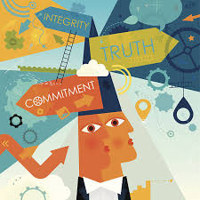
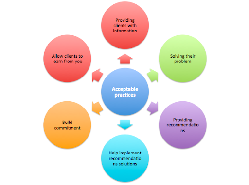
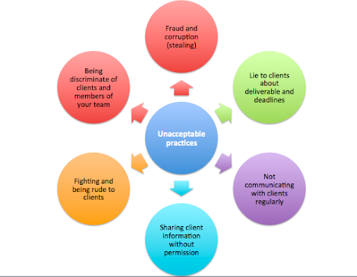
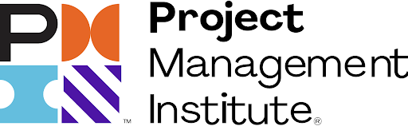
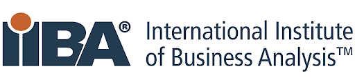

## DESCRIPTION

In this first module of the NCBA you will learn about how a professional is expected to conduct themselves in an ethical manner that is acceptable and respectful of one another, and the different bodies that govern the universal compliance of professionals in different industries. 

You will be required to identify the different codes of ethics and behavioural standards that govern your professional workplace that ensures professionals behave in a manner that is acceptable and respectful of one another.

## LEARNING OUTCOMES

   - By the end of this module you will be developed the following skills:

   - Clear understanding of ethical behaviour.

   - How to conduct yourself ethically towards other professionals.
   
   - Interact in a professional business environment

   - Acceptable and unacceptable behaviour for professionals.
  
   - Identify the professional bodies that govern the different industries.

## PROFESSIONAL CONDUCT

### INTRODUCTION TO BEING PROFESSIONAL

When dealing with various clients and stakeholders of a business, it is important to keep a professional relationship. We should commit ourselves to doing what is honourable and right. Ethical and professional behaviour instils business confidence, and it's mandatory in establishing the credibility of professionals. Ethical behaviour is not always a black or white issue, nor is it always easy. Conflicts of interest, contradictory requirements or processes, fear of failure, and business pressures can all affect ethical behaviour. Being professional in all circumstances can benefit your reputation, morale, and the success of your career. 

You can achieve this by adopting clear standards of ethics and appropriate professional behaviour. These standards and behaviours will assist you in always making wise decisions even when confronted with difficult situations which may compromise your integrity.

### *PROFESSIONAL CONDUCT WHEN INTERACTING WITH CLIENTS AND STAKEHOLDERS* 

You should always maintain a professional relationship when dealing with your clients and in business analysis, this is guided by mandatory standards for all professionals. The standards of conduct are aligned with the four ethical values which were identified as the most important for all professionals by the Project Management Institute(PMI).) These standards should form the basis of all decision-making processes and guide your actions in your professional interactions.

### CODES OF CONDUCT AND ETHICAL BEHAVIOUR

### *ETHICAL VALUE: RESPECT*

We recognize that it is our duty to show high regard for ourselves, others, and the resources entrusted to us. Resources entrusted to us may include people, money, reputation, the safety of others, and natural or environmental resources.

#### *OUR COMMITMENT*
To create an environment of respect which engenders trust, confidence, and performance excellence by fostering cooperation. An environment where diverse perspectives and views are encouraged and valued.

#### *STANDARDS FOR CONDUCT*

   - We professionally conduct ourselves, even when it is not reciprocated.
 
   - We inform ourselves about the norms and customs of others and avoid engaging in behaviours they might consider disrespectful.

   - We do not exercise the power of our expertise or position to influence the decisions or actions of others to benefit personally at their expense.

   - We do not act in an abusive manner toward others
  
   - We respect the property rights of others

### *ETHICAL VALUE: HONESTY* 

We undertake that it is our duty to understand the truth and act truthfully both in our communications and in our conduct. 

#### *OUR COMMITMENT:*
To create an environment that engenders credibility through transparency and integrity and all of our interactions. 

#### *STANDARDS OF CONDUCT:*

   - We earnestly seek to understand the truth.

   - We do not engage in or condone behaviour that is designed to deceive others, including but not limited to, making misleading or false statements, stating half-truths, providing information out of context or withholding information that, if known, would render our statements as misleading or incomplete.

  - We do not engage in dishonest behaviour with the intention of personal gain or at the expense of another.

   - We provide accurate information in a timely manner.

### *ETHICAL VALUE: FAIRNESS*

We undertake that it is our duty to make decisions and act impartially and objectively. Our conduct must be free from competing for self-interest, prejudice, and favouritism. 

#### *OUR COMMITMENT:*
To create an environment free from bias, dishonesty or injustice and to fully disclose any conflicts of interest. We engender to treat other professionals in the manner that we would want to be treated.

#### *STANDARDS OF CONDUCT:*

   - We demonstrate transparency in our decision-making process and ensure our decisions are not made based on personal considerations, including but not limited to, favouritism, nepotism, or bribery.

   - We provide equal access to information to those who are authorised to have that information.

   - We constantly reexamine our impartiality and objectivity, taking corrective action as appropriate.

   - We proactively and fully disclose any real or potential conflicts of interest to the appropriate stakeholders and if the risk is identified we refrain from engaging in the decision-making process or otherwise attempting to influence outcomes.

   - We do not discriminate against others based on, but not limited to, gender, race, age, religion, disability, nationality, or sexual orientation.

### *ETHICAL VALUE: RESPONSIBILITY*

We undertake that it is our duty to take ownership for the decisions we make or fail to make, the actions we take or fail to take, and the consequences that result.

#### *OUR COMMITMENT:*
We commit to only providing service within the boundaries of our level of expertise, knowledge and skill or experience. We endeavour to improve your proficiency and commitment to learning and increase your professional knowledge.

#### *STANDARDS OF CONDUCTS:* 

   - We fulfil the commitments that we undertake – we do what we say we will do.

   - When we make errors or omissions, we take ownership and make corrections promptly.

   - We accept accountability for any issues resulting from our errors or omissions and any resulting consequences.

   - We protect proprietary or confidential information that has been entrusted to us.

   - We inform ourselves and uphold the policies, rules, regulations and laws that govern our work and professional activities.

   - We uphold this Code and hold each other accountable to it.

### ACCEPTABLE & UNACCEPTABLE BEHAVIOUR

Ethics are not just a vague theory but a working concept that can have an important and real effect on your professional practice. Ethics are not simply a matter of obeying the law; it goes much beyond this. You will also see that the ethical decision  is not always simple, there are always a lot of factors to consider when making a decision. You will however be required to act with integrity.

Below, in Figures 1 and 2, are some guidelines that define what is acceptable and unacceptable behaviour and conduct for professionals.

Figure 1: Acceptable practices

Figure 2: Unacceptable practices

Now that we've identified some acceptable and unacceptable practices in consultancy, why do you think it's important to know the difference between the two?

Please watch the following [video](https://www.youtube.com/watch?v=ohmOCHYz530) on being ethical even when no one is watching. 

To further guide our decision-making process in upholding this code of ethics and professional conduct PMI has compiled a framework for decisions making which can be found [here.](https://www.pmi.org/-/media/pmi/documents/public/pdf/ethics/ethical-decision-making-framework.pdf?v=53450dfb-bf1d-4596-b639-018ab1163300&sc_lang_temp=en)

### PROFESSIONAL BODIES

All major industries in the corporate world are governed by professional bodies that set guidelines to help protect and inform the benchmark for standard conduct for all the professionals in the industry. As a professional, it is a good idea for you to stay up to date with new guidelines and rules in your field of work Business Analysis.

The Business Analytics discipline aims at understanding the needs of the business stakeholders and at defining the characteristics of the solution to meet those needs while Project management focuses on the creation of the “product, service, or result '' of the project in order to meet its objectives. Because of the strategic opportunities that lie in the integration of these two disciplines their governing bodies are also integrated.  

Two professional bodies have for decades made great contributions to both PM and BA as disciplines. 

#### 1. The Project Management Institute (PMI)

#### 2. The International Institute of Business Analysis (IIBA)

Now that we understand ethics and why they exist, and what we can learn from them you will be better equipped to apply them to your context and working environment.  

Let's move on to the next module to learn about Business Ecosystems. 

### ADDITIONAL RESOURCES

There are some additional resources below for you to review at your own pace and interest, feel free to contribute and share with your peers if you find anything else of interest.

#### *VIDEOS*
Ethics in the work place 

#### *ARTICLES*
[The Global Standard for Business Analysis | IIBA®](https://www.iiba.org/) 

[Project Management Institute | PMI](https://www.pmi.org/)

[PMI_EDMF_ENG_11-12-21_LowRes.indd](https://www.pmi.org/-/media/pmi/documents/public/pdf/ethics/ethical-decision-making-framework.pdf?v=53450dfb-bf1d-4596-b639-018ab1163300&sc_lang_temp=en)

[Ways to behave in a professional way in the workplace ](https://www.indeed.com/career-advice/career-development/professional-behavior-workplace)

[Umuzi Policies ](https://drive.google.com/drive/folders/1Ki06-3-MCFxbb71Io9d-LPDaBjopofzP?usp=sharing)
