## DESCRIPTION

In this module we focus on the second stage Define. In the Design Thinking process, the Define stage is dedicated to defining the problem. You’ll gather all of your findings from the empathise phase and start to make sense of them: what difficulties and barriers are your users coming up against? What patterns do you observe? What is the big user problem that your team needs to solve?

In this stage of design thinking, you will be required to develop a problem statement, you should be concise and brief about the problem statement based on the information you gathered in the previous stage.

## LEARNING OUTCOMES:

 - By the end of this module you will be developed the following skills:

 - Clear understating of problem statements 

 - How to create a user persona 

 - Clear understanding of the different business process modeling notation 

In addition to these skills you will also learn:

 - How to create a business process model 

 - How to write a problem statement

 - How to create a “how might we” statement 

 - Interact in a business environment

## INTRODUCTION
It’s time to accumulate the information gathered during the Empathise stage. You then analyse your observations and synthesize them to define the core problems you and your team have identified. These definitions are called problem statements. During the Define stage, you put together the information you have created and gathered during the Empathise stage. This is where you will analyse your observations and synthesise them to define the core problems that you and your team have identified up to this point. You should seek to define the problem as a problem statement in a human-centered manner.
 
 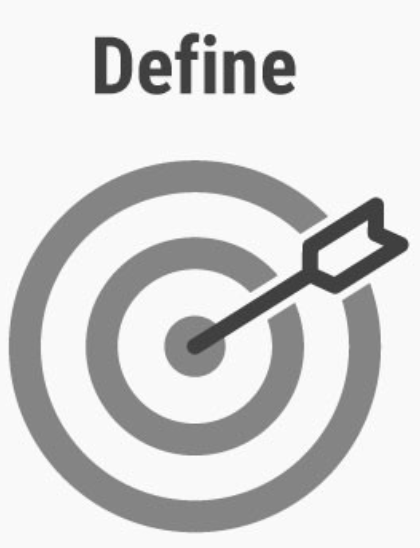

## THE DEFINE STAGE OVERVIEW

The define stage is perhaps the most challenging part of the Design Thinking process, as the definition of a problem (also called a design challenge) will require you to synthesise your observations about your users from the first stage in the Design Thinking process.

The define stage is preceded by the empathise stage, where you learn as much as possible about your users, conduct interviews, and used a variety of immersion and observation techniques. Once you have a good idea of who your users are and, most importantly, their wants, needs, and pain points, you’re ready to turn this empathy into an actionable problem statement.

The relationship between the empathise and define stages can best be described in terms of analysis and synthesis. In the empathise phase, we use analysis to break down everything we observe and discover about our users into smaller, more manageable components—dividing their actions and behaviour into “what”, “why” and “how” categories, for example. In the define stage, we piece these components back together, synthesising our findings to create a detailed overall picture.

## WHY IS THE DEFINE STAGE SO IMPORTANT?
The defined stage ensures you fully understand the goal of your design project. It helps you to articulate your design problem and provides a clear-cut objective to work towards. The define phase allows you the chance to interpret, understand, synthesize and analyse the data into actionable information that represents the problems our users/clients face.

## *ANALYSIS AND SYNTHESIS*

Analysis and synthesis are “equally important, and each plays an essential role in the process of creating options and making choices.”

**Analysis** is about breaking down complex concepts and problems into smaller, easier-to-understand constituents. We do that, for instance, during the first stage of the Design Thinking process, the Empathise stage, when we observe and document details that relate to our users. Synthesis, on the other hand, involves creatively piecing the puzzle together to form whole ideas. This happens during the Define stage when we organise, interpret, and make sense of the data we have gathered to create a problem statement.

Although analysis takes place during the Empathise stage and synthesis takes place during the Define stage, they do not only happen in the distinct stages of Design Thinking. In fact, analysis and synthesis often happen consecutively throughout all stages of the Design Thinking process. 

## THE PUZZLE

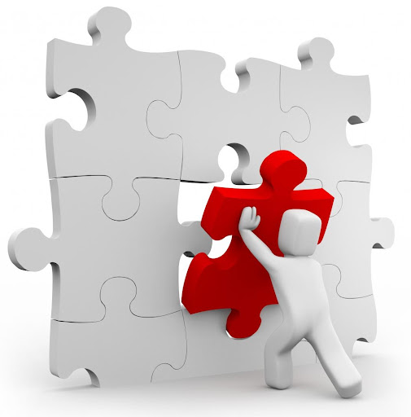

In empathising, you were gathering the data and information; you collected all the little pieces of the puzzle together into one box. In the define phase, you are trying to organise those puzzle pieces into something recognisable.

Imagine that the puzzle pieces are the feedback and research from your users and clients - the user journeys, the empathy maps, and the interviews. In figuring out how the puzzle fits together, you need to synthesise and analyse all these findings. The puzzle itself, once complete, represents the challenge/problem that the user/client faces which you will tackle.

What you are doing here is trying to build a picture of the entire experience held by your user/client to identify the main issues faced during their experience; you are getting a picture of the challenge that is being faced by your user.

## *FOCUS ON THE PROBLEM*

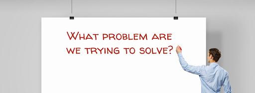

You may find that there are several problems faced by your users/clients, but the focus in this section needs to be on the problem that has the greatest impact on your user/client. Why solve something that only affects a few people? You want to solve the issue that is present in most people's experiences.

The aim is to develop the main problem you have identified into a succinct problem statement. We will explore problem statements later in this section.

The key is to remember that you may uncover a whole list of user/client problems that you cannot solve all at once. You need to rank the problems and choose the one that is impacting the widest user group because solving that will create the greatest impact/value for your users.

## JO EXAMPLE

Let’s have a look at this quick and rather strange example which should help you understand why it’s so important to dig deeper and find the ‘real’ problem that we are solving for our user.

The below 5 points are pieces of data that we pulled from an interview with someone named ‘Jo’.

1. Jo loves to take a walk in the park with his dog.

2. Jo even goes when it is raining

3. When Jo goes during the rain, he comes back home and uses the elevator to get up to his apartment.

4. When it’s not raining, he goes up the elevator but only halfway, and then he uses the stairs to get to his floor

5. Jo really wants to use the elevator to go all the way up every day.

**Challenge: We want to be able to help Jo use the elevator every day to get to his floor.**

**Already, you may be ideating solutions:**

- You may suggest that he only goes for walks on rainy days.

- Or maybe you suggest he find a new apartment with fewer floors.

- ...STOP!

If you find yourself in a space of ideation before you get to the ideation phase...STOP! It is very important to avoid getting into a solution space before you have identified the problem you are working with. This is done by being conscious and guiding the team when empathising and defining. 

Ideally, though, you would decide to dig a bit deeper in defining this problem for Jo. So you decide to ask him some more questions. By asking some why questions, you may find out that:

- Jo is very short, he actually has dwarfism

- Jo takes an umbrella walking with him when it rains

- He uses the umbrella to reach the highest button in the elevator

Now that you have these vital pieces of information, you can better define the problem that Jo faces: 

- Jo cannot reach the highest floor level in the elevator because he is too short.

The problem is now much clearer for us to solve. Let’s take a brief look at the output/outcome of the defined phase before we get into problem statements, and how we can turn the problem identified for Jo into a useful and actionable ‘How Might We’ statement.

## THE OUTPUT

The **outcome** of the defined phase is a **“Problem Statement”**, and a **“How might we” (HMW)** statement. An HMW statement is a proactive expression of the problem statement. Very briefly, a problem statement is an exact expression of the problem the user faces: “The problem is that people can’t butter toast with a fork”. We transform the statement into something proactive: “How might we help people butter bread with a fork?”

We will go deeper into both of these concepts, but hopefully for now you can see that a problem statement is a general definition of the current situation experienced, and a HMW is an active statement that looks at finding a resolution for the problem faced. Simply, it’s rewording the problem statement into something forward-looking and focused on a solution.

Now that you have a good overview of the define phase, let’s jump into some of those tools. First, we will look at ‘Problem Statements’.

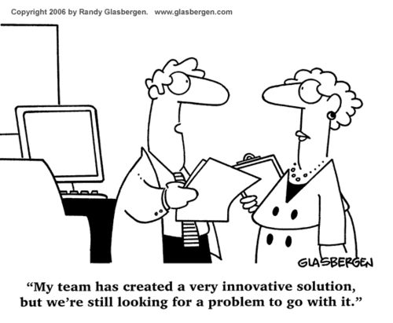

Take some time to watch [this video](https://www.youtube.com/watch?v=TNAdanuvwtc) to summarise what we are doing in the define phase.

## PROBLEM STATEMENT

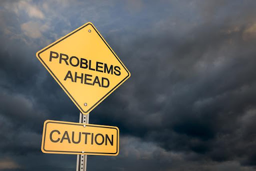

When we spoke about Jo in our example above, we noticed that there were a whole host of elements that contribute to Jo’s situation. But to solve the situation that Jo is in, we need to understand precisely what the problem is that he is facing. What we need is a problem statement to help us frame Jo’s problem accurately.

So what is a problem statement? Well, simply put, **a problem statement is: a concise description of an issue to be addressed or a condition to be improved upon. It is a descriptive statement that discusses the concerns or obstacles faced by your user that you discovered during empathising and further defining.** We need this type of statement as it helps guide the design team when ideating and ensures that there is a tight focus on the precise problem the user faces so that we design an appropriate solution.

What is also important to note is that you may only come up with one problem statement during this phase. This is perfectly fine. Having one statement shows that you have a clear focus and direction. Having multiple problem statements might indicate that you are solving problems for multiple user types, or one user but in multiple scenarios. This is perfectly acceptable too. Your challenge will be having to decide which problem statement is most crucial for you to solve in this design thinking process.

This process step can be hard for some. The idea that you need to take all of your thoughts, stats, facts, research, and findings and consolidate them into one succinct statement is quite intimidating. Not all of your research and findings will be relevant or useful, and some might lead to one type of problem statement, while other leads to another - remember, it’s perfectly fine to have more than one statement.

[Let's recap on what a problem statement is.](https://youtu.be/vjCCC2kFJcQ)

### POV STATEMENT
You may come across the term “Point of View Statement (POV)”. This is synonymous with a Problem Statement. Both of these terms are the name given to a succinct sentence that stipulates the essence of the problem that a user faces. The POV statement merely aims to indicate to us that the statement is from the perspective of the user, and it’s an explicit expression of the problem you are striving to address for them.

### WHAT MAKES A GOOD PROBLEM STATEMENT

A good problem statement is:

**Human-Centered:** The focus should be on the user that we are solving for, not on products or services. Do not think about feasibility or viability here.

**Broad/Non-Solution-focused:** The statement should not be limited to including any specific solution.

**Narrow:** The statement needs to have restrictions and limitations, otherwise we will solve too broad of a problem that may be unattainable.

**Action Orientated:** The statement should focus on what the user wants to achieve or do.

**Concise:** The statement is a short description - it is not a 5 sentence paragraph explaining the issue; it is a simple sentence that fully encompasses the issue faced by the user.

## BUILDING YOUR PROBLEM STATEMENT

A great tactic to help you build your statement is to think about it in terms of the 5 question words: Who, what, where, when, how, and why.

 - **Who:** Who does the problem affect? Specific groups, organizations, customers, etc.
 - **What:** What does the user want to achieve? What do they need?
    - What is the issue?
    - What is the impact of the issue?
**When:** When does the issue occur?; When does it need to be fixed?
**Where:** Where is the issue occurring? Only in certain locations, processes, products, etc.
**How:** How is the problem affecting the user?
**Why:** Why is it important that we fix the problem?

However, in building your problem statement, you are focused on: Who, what, and why.
*Who* needs *what* and why?

So your format of the statement would look like this:

**User (X ) characteristics (use your persona to describe your user)  needs ( what do they need/ what are their motivations)  insights ( why do they need what they need)**

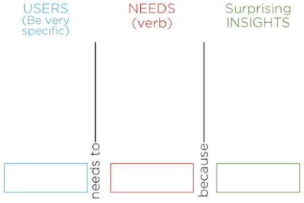

Example

**Let’s go back to Jo and let’s try to build out his problem statement.**

Remember, we are looking for: ***who*** is the person experiencing the problem, ***what*** do they need/desire, and ***why*** do they need it.

**If we tend to each element on its own:**

 - Who: Jo, who is a person with dwarfism
 
 - What: Jo wants to be able to select buttons in the lift that are out of reach no matter the weather.
 
 - Why: Jo wants to get to his floor without having to get out and use the stairs.

So the problem statement for Jo could be: “As a person with dwarfism, I need to be able to select buttons in the elevator that are out of reach no matter the weather because I need to get to my floor without having to get out and use the stairs.”

## CURRENT VS FUTURE

You may find that some problem statements are ***forward-looking** while others are focused on the **current situation**. An example would best explain this:

**Current:** As a car driver, I have problems reading road signs, because my eyesight is bad.

**Future:** As a car driver with bad eyesight, I need to be able to read road signs better, because it will make me a safer driver.

The current situation describes the problem the user is facing now without looking forward as to what they need, whereas the future looking focuses on the current situation as well as what the user needs/desires. ***Your focus should always be on the future focused statement as it includes an action for us to focus on - fulfilling what the user needs.**8

Let’s take a look at **HMW (How Might We)** statements before looking at some more examples of problems and HMW statements.

## HOW MIGHT WE STATEMENTS

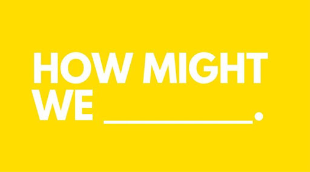

Now that you have learned how to develop your problem statement, we need to learn how to reframe it into something that allows us to be solution-oriented. The original problem statement is exactly that, it’s a problem. **We want to reword it so that we are focusing on solving the problem.** We do this by transforming the problem statement into a “How Might We” statement.
**“Every problem is an opportunity for design. By framing your challenge as a How Might We question, you’ll set yourself up for an innovative solution.” — Designkit.org**

Let’s take a look at [this short video](https://youtu.be/mRpUV-uIkF8) explaining How Might We.

Also take a look at [this short video](https://youtu.be/6BfIK3suMBo) to understand why reframing the wording of the problem statement into an HMW is so important.

***DEVELOPING YOUR HMW***

Let’s head back to our main-man Jo. If you recall, we had defined his problem statement as:
*“As a person with dwarfism, I need to be able to select buttons in the elevator that are out of reach no matter the weather because I need to get to my floor without having to get out and use the stairs”*. As you can see, this isn’t forward-looking; we need to transform it into something that is solution orientated.
Transforming this, we may find our HMW looks something like this: “How might we assist Jo in selecting any floor level in any elevator he enters so that he can access any floor no matter the situation”.

What can we see from this? Well, the first thing to note is that we are action-oriented; we are focused on achieving something for Jo. We want to be able to alleviate his need or want. You will also notice that we are focused on the part of the problem statement that lists Jo’s ‘need’. We are not concerned with the ‘because’ part of the statement; we understand why we need to help him, but what is the thing we want to help him with?

What we can also do is go back to Jo before we begin our HMW and make sure we have gotten his problem statement down perfectly. If we haven't, then we will be solving a problem he either doesn't have or the wrong problem! And even after we have developed our HMW, we need to go back to our problem statement and ensure that we have developed our HMW accordingly.

The same limitations on problem statements - being too broad, too narrow, not concise enough, etc - are also relevant for your HMW. If you are too broad, you will not have boundaries to keep you in check when you ideate; if you are too narrow, you might limit yourself in the ideation phase and miss out on great solutions. Keep in mind that your HMW is the basis on which you will ideate; it is, in essence, your ‘brief’ when you begin to ideate: it’s your starting point. You need to ensure that your starting point is stable and based on sound research and empathising.

Before we continue with some examples, let’s take a look at this screenshot which does a great job of showing how different types of HMWs can be developed from just one problem statement. Take note of the methods they use to find the HMW - thinking about applying the good, removing the bad, or even changing the way the problem is traditionally solved.

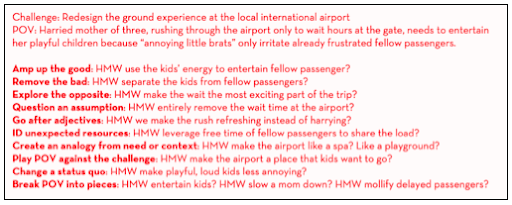

Let’s summarise this by watching [this video](https://youtu.be/MJWLON3Sy4E)

***EXAMPLES***

Remember, you will start by having a ‘challenge’ or a brief you need to work on - this is the puzzle that you have built from all your synthesizing in the empathise and define phase. This challenge will represent the problem situation or environment in which our user is experiencing something.

**Let’s look at a challenge and see what a problem statement and HMW might look like:**

**Example 1**
 - Before any empathising begins, we have our original Brief/challenge:
 
   - “Cleaning staff isn’t finishing cleaning by knock-off time. We want to fix this.”

 - You then conduct your empathising with office staff and the cleaning staff.
 You find a few things:
 
   - Staff members leave their rubbish on their desks because the bins are too far away.
 
   - Cleaning staff don’t have large enough collection bins to gather all the trash at once.
  
 - Now that we have this deeper definition of the problem, we can develop some potential problem statements:

   - 1. “As a cleaner, I need to be able to clean more efficiently, because currently there is too much trash and I need to be done cleaning by the end of the day”
 
   - 2. “As a staff member, I need to be able to dispose of trash easier because I currently leave a huge mess every day which adds on cleaning time for the cleaner”

   - 3. “As a cleaner, I need a better way to collect trach because I currently have to make multiple collection rounds.”

 - As you can see, we have some potential problem statements. How do we choose? Well, it can be tough, but what we know from our definition of the problem is that a root cause of why the cleaners take long is that staff members leave a huge mess at their tables. So we would go with Problem statement 2 as it’s the best indicator of the problem faced. It’s not the cleaners who are doing a poor job, but rather the staff is leaving more of a mess than what would be standard.

(Statement 1 is likely too broad, and statement 3 too narrow.)

  - So now for the How Might We. Remember from above, that we can develop several HMWs - we just need to be aware of the requirements to not be too broad/specific. Some HMWs’ could be:

    - “How might we make it easier for staff to dispose of trash during the day so that they don’t leave such a mess?”

    - “How might we motivate staff to dispose of trash so that they don’t leave a huge mess?”

    - “How might we punish staff for leaving a mess so that they don't continue to do so?”

    - “How might we limit the number of things/food/items brought into the space so that we decrease the overall amount of trash in the space?”

 - As you can see, you can develop several HMWs. Your challenge is trying to choose the one that best represents the problem statement. I’d argue that the first HMW is appropriate but this is something the team would decide on together.  

**Let’s take a look at 2 examples at a higher level.**

**Example 2:**

 - Challenge:

    - “We have certain students who are introverts and do not like engaging socially very much, however they want to engage because they are currently being bullied and feel like outcasts.”

 - Problem Statement:

   - “Socially awkward students need structured opportunities to socialize because they are often made fun of”

 - Potential HMW Statements:

   - How might we diversify afterschool programs to attract more students?

   - How might we ensure that afterschool programs focus on social interaction?

   - How might we better connect socially awkward students to other kids?

**Example 3**

 - Challenge:

   - “Finding a physician’s practice information is time-intensive for contact center agents”

 - Problem Statement:

   - “Contact center agents have to search for information about a physician's practice on almost every phone call”

 - How Might We: (Let’s look at some bad ones and some really different options)

   - Too broad HMW: How might we improve the search process for agents?

   - Better HMW: How might we design a tool that makes it easy to find a practice’s office hours?

   - Speed Modifier HMW: How might we quickly deliver physician practice information to contact center agents?

   - Problem Flip Modifier HMW: How might we make the caller's experience valuable while the agent searches for physician practice information?

   - Analogy Modifier HMW: How might we make searching for physician practice information more like searching on Google?

Hopefully, you are now familiar with the Define process and how we go about getting our problem statement and HMW statement. These two statements are the main outputs for the Define phase.

The next section is going to take a look at business process modeling. Not technically part of Design Thinking, but an important skill to have as a business analyst.

## MODELING THE PROBLEM - BUSINESS PROCESS MODELING

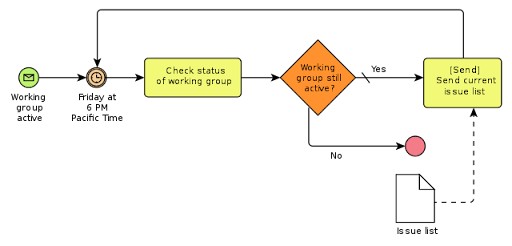

### WHAT IS PROCESS MODELING?

Before we discuss the modeling of a process, let’s define what a process is first. A process is a series of connected business activities that result in a specific outcome.
Therefore, logically, a process model is the visualization or depiction of the internal business processes, focusing on the sequence of activities and information that is required to produce the output.
“A standard Business Process Model and Notation (BPMN) will provide businesses with the capability of understanding their internal business procedures in a graphical notation and will give organizations the ability to communicate these procedures in a standard manner.” ([http://www.bpmn.org/](http://www.bpmn.org/))

The point of process modeling is to not only visualize the processes but to standardize them so that any stakeholder can communicate effectively around any component of the process or the process itself. The true aim however with modeling processes is to find opportunities for improvement or innovation within the process.  

To think about it differently, think of process modeling as the act of going through all the steps that you take to get from point A to point B, drawing them out as they occur, and then trying to pinpoint where you can improve things. Think about the process you take to get to work every day. What are the steps and activities that occur in your daily commute? How does each step tie into the next? Does each step occur one after the other, or perhaps they can all be done simultaneously?

What we want to do with mapping is to give an analytical representation of 'as-is' processes in an organization and contrast it with 'to-be' processes for making them more efficient.
The main question to come out of this mapping is: what can we improve, and where? We map so that we can find places to optimise.

In essence, process modeling is the act of mapping out a journey. You could even argue that User Journeys are process maps. The difference between them though is that a process map focuses on the entire journey - both backend and frontend - and every user that is involved, and it is bound by a prescribed notation used for modeling.

A few quick points on process modeling:

 - A process model can either be hand drawn or digitized.
 
 - ‘Workflow’ is synonymous with ‘process’ in this context.

 - ‘Modeling’ and ‘mapping’ can be used interchangeably.

 - It often combines the disciplines of process discovery, process simulation, process analysis, and process improvement

 - It is only useful if there is a focus on finding and implementing improvements.
 
 - Multiple notation conventions are used, all of which aim to simplify and standardize the way business analysts map processes.
 
 - The most common process modeling notation is the BPMN

Let's watch this video on [What Constitutes a BPMN Process Diagram](https://youtu.be/iMHF1ZStOdE)

### WHY PROCESS MODELING?

Process modeling isn't something that is normally used within the DT process, however, it is still an incredibly valuable skill to learn for any business analyst. As discussed above, one could argue that process mapping is similar or the same as user journey mapping. So as you go through this content, consider how process mapping can assist you in your user journey mapping that you do in the empathise phase.

One of the main reasons we map is that a diagram can be far easier to understand than narrative text would be. A diagram allows for easier communication and collaboration within the business and creates better opportunities to achieve an efficient process that produces high-quality results.

**There are many benefits to business process modeling:**

 - Helps to identify and eliminate redundancies and inefficiencies

 - Sets a clear start and end to the process
 
 - Visual representations help provide a comprehensive picture.
 
 - Helps focus and stay within the overall organizational strategy as improvements are found.
 
 - Helps identify bottlenecks and inefficiencies.
 
 - Improve operational efficiency by reducing cycle time and promoting better resource utilization.
 
 - Enforces best practices and standardization – in a large organisation, some teams may map differently; by using one standard language, we can all communicate effectively.
 
 - Improves transparency - it allows the entire organisation to be aware of how your processes work: what’s the goal, how it operates, etc. This leads to accountability; who owns what process becomes transparent.

### EXAMPLES

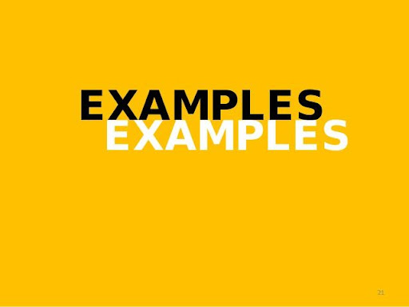

Below are several examples of different process models. Read through and see if you can logically follow the process prescribed in each model. Note how each model uses a different notation and layout; after these examples, we will look at the correct notation and the importance of sticking to a standardised convention. As you go through each, consider if they are extensive enough or if you think some are too thin or missing steps in the process. Some are certainly better than others; think about what would make the process simpler or more efficient.  

**Example 1 - Making Breakfast.**

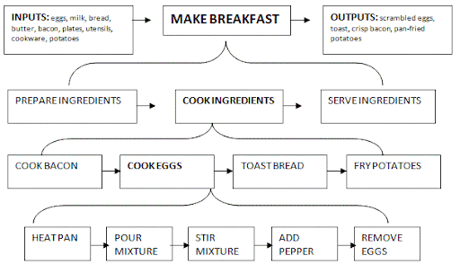

**Example 2 - Do a thing. (Very general and broad process map which looks at how to do ‘a thing’)**

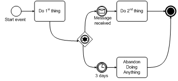

**Example 3 - Make an online payment.** 

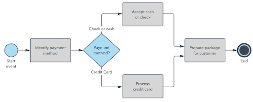

**Example 4 - Order a Pizza at a Pizza shop.**

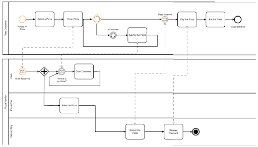

**Example 5 - Booking for and seeing a Doctor**

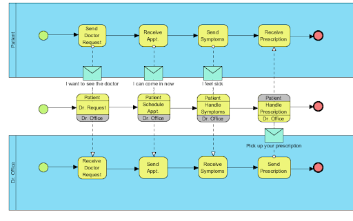

### TYPES OF MODELING NOTATION

There are several types of BPM (Business Process Modeling) notation. We will discuss 3 of them below. Each has its own merits, however, the most commonly used method is the BPMN 2.0. When you start mapping your first process, use this BPMN standard.

### *BUSINESS PROCESS MODELING NOTATION (BPMN)*

This notation method was developed by BPMI (Business Process Modeling Initiative) and has become a standard ‘language’ used by most analysts in the industry. Its wide use is due to its simplistic toolbox, focusing on using simple imagery such as lines, arrows, and shapes to indicate the flow of the process.

You can imagine that this process is similar to creating a flowchart; however, you are limited by the notation stipulated in this standard, and not what you want to do. Basically, instead of drawing a flow/map and using whatever symbols you want, you stick to the standard notation.

Let’s take a brief look at the main elements that exist in this notation.
The following bullet list, until “UML”, has been taken directly from the website [smartsheet.com](https://www.smartsheet.com/); article: [here](https://www.smartsheet.com/beginners-guide-business-process-modeling-and-notation-bpmn).
The 5 Main Elements in this notation are:

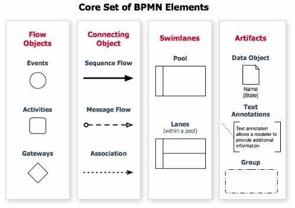

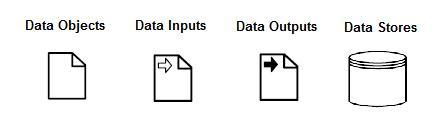

1. Flow Objects
2. Data
3. Connecting Objects
4. Swimlanes
5. Artifacts

**1. Flow objects:** These define the behavior of business processes. These include:
   - **Events** - What happens during a process. There are three main ones: Start, Intermediate, and End. An event is also what is happening during a process. For example, an event could be that “a message is sent,” “an error occurred,” or “cycle is completed.”  

   - **Activities** - Work performed in a process. Also known as tasks.

   - **Gateways** - These determine the sequence flow path in a process. Gateways have internal markers (marks inside the element that gives additional detail) to show how the flow is controlled. These are decision points in a process. For example, if a condition is true then processing continues one way; if false, then another.

**2. Data:** Information about the activities is called out with these elements. Data is either provided or stored for the activity. These include:

   - **Data Objects**
   - **Data Inputs**
   - **Data Outputs**
   - **Data Stores** - where processes can either read or write information to/from. A data store continues beyond the life of the process.

**3. Connecting objects:** These connect the flow objects together or to other information. These include:

   - Sequence flows - This element shows the order that activities are performed.

   - Message flows - This displays the messages and the order of flow between participants.

   - Associations - This element is used to link information and artifacts (see below).

   - Data associations - These have an arrowhead to indicate the direction of flow in an association.

**4. Swimlanes:** Broken down into pools and lanes, a swimlane in BPMN is an element that shows where the responsibility for the process lies. These pools may represent the participant. Lanes break apart the pool as a partition of responsibility, showing the location of activities. Lanes can also be used for other purposes, like delineating phases (first phase, second phase, etc.). In other words, a pool is a container for a single process, and a lane is a way to classify the activity within it.

   - Lanes do not have semantics in BPMN; they are just a partitioning concept. Swimlanes can be arranged either vertically or horizontally. Lanes are optional and may be nested. Some issues with swimlanes are as follows:
  
     - Flow elements are connected differently depending on whether they are in a pool or between pools.

     - Only message flows can be used when communicating between pools. Message flows designate the exchange of messages.

     - A pool cannot contain more than one process.

     - Sequence flows should not be used between pools. Lanes are more appropriate where sequence flows are necessary, not pools.

**5. Artifacts:** These are used to give extra detail about the process. The two standardized artifacts are:

   - **Groups** - This is a hatched box around a group of elements to designate visually that they are somehow related. This does not affect sequence flows.

   - **Text Annotations** - Extra text, attached with an association, that gives additional information. Also known as a comment.

**Here are some great resources which include detailed breakdowns of the BMN process and cheat sheets with the prescribed notation.**

Check out [this website](http://www.bpmb.de/images/BPMN2_0_Poster_EN.pdf) for a cheat sheet with all of the notation
[This site](https://www.lucidchart.com/pages/bpmn-symbols-explained) lists the notation as well
A [detailed](https://www.bpmnquickguide.com/view-bpmn-quick-guide/) guide can be found here:

### *UNIFIED MODELING LANGUAGE (UML)*

UML is another commonly used notation. It is mainly used to assist system and software developers in specifying, visualizing, constructing, and documenting the components of artifacts in the system they are building. It is also used for business modeling, however, its focus is on software modeling. The main use however is in mapping object-oriented software and the software development process, focusing on the architecture, design, and implementation of complex software.  

The main difference between BPMN and UML is that UML is better suited for software processes, and BPMN is better for business processes.

UML has different types of diagrams that are used.

 - Structure Diagrams focus on what things must be in the system.
 
 - Behaviour Diagrams emphasize what must happen in the system being modeled.

- Interaction Diagrams, a subset of behaviour diagrams, emphasize the flow of control and data among the things in the system being modeled.
 
If you would like to learn more about UML, check out these great websites platforms:
- [http://www.uml.org/what-is-uml.htm](http://www.uml.org/what-is-uml.htm)
- [https://www.lucidchart.com/pages/what-is-UML-unified-modeling-language](https://www.lucidchart.com/pages/what-is-UML-unified-modeling-language)

### *INTEGRATED DEFINITION METHODS (IDEF)*

This notation is used less in the industry than BPMN or UML, however, it is useful to be aware of it.

IDEF is another visual methodology that focuses on creating a standardised process. Its focus, like UML, is more on software development and engineering. They are used mainly in object-oriented analysis, data functional modeling, and knowledge acquisition.

There are a total of sixteen methods, from IDEF0 to IDF14 (and including IDEF1X), which are each designed to capture a particular type of information through the modeling processes. Having now familiarized yourself with the different models, check out this research piece if you would like to explore further the differences between the various modeling processes:

(Note: [this article](http://iopscience.iop.org/article/10.1088/1757-899X/128/1/012010/pdf) includes some standard notations that haven’t been discussed above.)

### HOW TO MODEL

When you start to model, the first step is to actually sit down with pen and paper. You need to sketch and be able to make quick adjustments, without the pressure of sticking to the notation and the visuals; sticking to the notation during sketching will make your life easier later. However, once you have developed your hand-drawn version and have iterated on it until it’s ‘complete’, you will need to digitise it using one of many online tools. Digitizing the model allows workflow engines to understand the process and indicate points for optimisation; so long as you have used the appropriate notation.

When it comes to process modeling, there is no set standard on how to do it. The only set standard is the notation used. However, the general process when creating process models is to:

 1. **Model the existing process** – Use one of the techniques to put the process you’re working with down on paper or digitized using software.

 2. **Identify inefficiencies and potential improvements** – Consider things like:

    a. How well is the current process performing?

    b. Is it efficient?

    c. Is it meeting operational goals?

    d. Are there any wasteful steps?

 3. **Design the desired Process** – Here you will design a new and improved process factoring in your findings from step #2

 4. **Implement the new Process** -  Put the new process into practice.

Some of the things you should consider when developing your map:
 - Keep the elements in the process to a minimum.
 - From the point above - do not include unnecessary or frivolous steps or elements.
 - However, you need to include all important steps in the process.
 - Keep the look and feel of the document consistent
 - You can always add extra detail as notes.

Have a look at a very detailed breakdown of BPM [here.](http://www.modernanalyst.com/Resources/Articles/tabid/115/ID/864/Why-How-Business-Process-Modelling.aspx.) 

There is so much more we can say about BPM, but for now, the above is more than enough to get you going and be familiar with the tool and process. The only way to get better at anything is to practice! So try to build some problems, try to map some processes, and build those HMWs!

That’s it for definition. Let’s quickly look at what’s coming next.

### WHAT’S NEXT?
Great! We’ve now learned how to find problems!

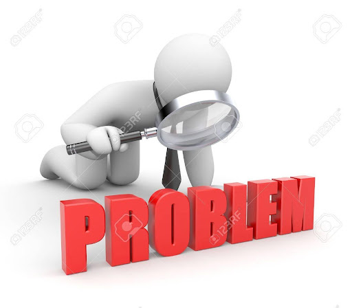

Next up: we learn how to solve problems!

The next step in Design Thinking is ideation. If you like coming up with ideas and enjoy brainstorming then the next section is right up your alley. In essence, the next section will focus on how to create an environment conducive to idea generation, how to ideate, and how to choose which idea to take forward into prototyping.

See you there!

## ADDITIONAL RESOURCES:

#### VIDEOS:

[Webinar: Design Thinking : Define](https://youtu.be/SEnHgwasdks)
[Define](https://www.youtube.com/watch?v=TNAdanuvwtc&feature=youtu.be)

#### ARTICLES: 

Design Thinking - Define, Problem Statements, How Might We

[https://www.interaction-design.org/literature/article/5-stages-in-the-design-thinking-process](https://www.interaction-design.org/literature/article/5-stages-in-the-design-thinking-process)

[https://www.interaction-design.org/literature/article/stage-2-in-the-design-thinking-process-define-the-problem-and-interpret-the-results](https://www.interaction-design.org/literature/article/stage-2-in-the-design-thinking-process-define-the-problem-and-interpret-the-results)

[https://webdesign.tutsplus.com/articles/define-stage-in-design-thinking--cms-31538](https://webdesign.tutsplus.com/articles/define-stage-in-design-thinking--cms-31538)

[https://blog.prototypr.io/design-how-to-define-the-problem-5361cccb2fcb](https://blog.prototypr.io/design-how-to-define-the-problem-5361cccb2fcb)

[https://www.sciencebuddies.org/science-fair-projects/engineering-design-process/engineering-design-problem-statement#definingtheproblem](https://www.sciencebuddies.org/science-fair-projects/engineering-design-process/engineering-design-problem-statement#definingtheproblem)

[https://www.interaction-design.org/literature/article/stage-2-in-the-design-thinking-process-define-the-problem-and-interpret-the-results](https://www.interaction-design.org/literature/article/stage-2-in-the-design-thinking-process-define-the-problem-and-interpret-the-results)

[https://www.sheffield.ac.uk/polopoly_fs/1.440722!/file/HowtoWriteaProblemStatement.pdf](https://www.sheffield.ac.uk/polopoly_fs/1.440722!/file/HowtoWriteaProblemStatement.pdf)

[http://www.ceptara.com/blog/how-to-write-problem-statement](http://www.ceptara.com/blog/how-to-write-problem-statement)

[https://study.com/academy/lesson/problem-statement-in-design-thinking-definition-example.html](https://study.com/academy/lesson/problem-statement-in-design-thinking-definition-example.html)

BUSINESS PROCESS MODELING.

[https://kissflow.com/bpm/business-process-modeling/](https://kissflow.com/bpm/business-process-modeling/)

[https://www.smartsheet.com/beginners-guide-business-process-modeling](https://www.smartsheet.com/beginners-guide-business-process-modeling)

[https://tallyfy.com/business-process-modeling/](https://tallyfy.com/business-process-modeling/)

[http://www.modernanalyst.com/Resources/Articles/tabid/115/ID/864/Why-How-Business-Process-Modelling.aspx](http://www.modernanalyst.com/Resources/Articles/tabid/115/ID/864/Why-How-Business-Process-Modelling.aspx)

[https://www.lucidchart.com/pages/bpmn-symbols-explained](https://www.lucidchart.com/pages/bpmn-symbols-explained)

[https://www.lucidchart.com/pages/bpmn](https://www.lucidchart.com/pages/bpmn)

[https://camunda.com/bpmn/](https://camunda.com/bpmn/)

[https://www.smartsheet.com/beginners-guide-business-process-modeling-and-notation-bpmn](https://www.smartsheet.com/beginners-guide-business-process-modeling-and-notation-bpmn)

[https://searchmicroservices.techtarget.com/definition/IDEF-Integrated-Definition](https://searchmicroservices.techtarget.com/definition/IDEF-Integrated-Definition)
