## DESCRIPTION

In this module we will introduce you to the Design Thinking Framework. Design Thinking is an innovative problem-solving non-linear, iterative process that teams use to understand their users better, challenge assumptions, redefine challenges, and develop and test novel solutions.  

Design Thinking is a five-stage process. These phases aren’t often conducted in order, and teams frequently perform them in tandem, out of order, and iteratively. We will explore all 5 stages; Empathize, Define, Ideate, Prototype, and Testing in the next modules. 

Empathising is the first stage of the 5 design thinking stages in which you conduct research on the user problems for the sole purpose of being able to empathize with the problem you're seeking to solve. The key to the human-centered design is empathy, as it allows you to put your worldview aside and gain insight into the needs of consumers. 

### LEARNING OUTCOMES:

By the end of this module you will be developed the following skills:

  - Conduct user research relative to their problem

  - Use digital anthropology to understand user vs problem

  - How to analyze and interpret data about your users and the problem 

  - How to combine research insights and user need to define a Point of view 

  - How to create user persona

### INTRODUCTION TO DESIGN THINKING
Before we dive into Empathising, let’s first take a broader look at Design Thinking. Design thinking is a methodology that provides a solution-based approach to solving problems. It’s extremely useful when used to tackle complex problems that are ill-defined or unknown—because it serves to understand the human needs involved, reframe the problem in human-centric ways, create numerous ideas in brainstorming sessions, and adopt a hands-on approach to prototyping and testing. Learning about the five stages of design thinking will empower you and allow you to apply the methodology to your work and solve complex problems that occur in our companies, our countries, and across the world.

Design thinking is a non-linear, iterative process that can have anywhere from three to seven phases, depending on the life cycle of your solution design. We focus on the five-stage design thinking model because they are world-renowned for the way they teach and apply design thinking.

### THE FOUR PRINCIPLES OF DESIGN THINKING

**The human rule:** No matter what the context, all design activity is social in nature, and any social innovation will bring us back to the “human-centric point of view”.

**The ambiguity rule:** Ambiguity is inevitable, and it cannot be removed or oversimplified. Experimenting at the limits of your knowledge and ability is crucial in being able to see things differently.

**The redesign rule:** All design is redesigned. While technology and social circumstances may change and evolve, basic human needs remain unchanged. We essentially only redesign the means of fulfilling these needs or reaching desired outcomes.

**The tangibility rule:** Making ideas tangible in the form of prototypes enables designers to communicate them more effectively.

Let's take an overview look at DT. Watch these two videos for a quick overview first:

**The Design Thinking Process:**



**What Is Design Thinking?:**



### THE 5 STAGES OF DESIGN THINKING

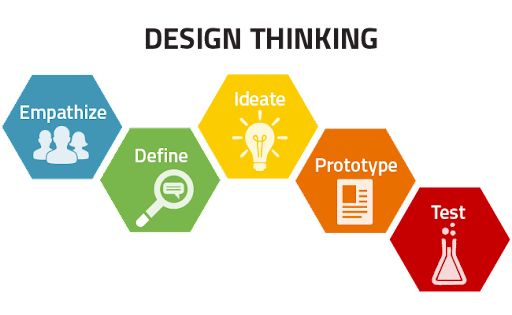

Let’s dive into each stage of the design thinking process

**Empathise:** This stage is about conducting qualitative, and some quantitative, research to develop knowledge about what your users do, say, think, and feel.

**Define:** Here we combine all the research and observations from empathising to clarify where your users’ problems actually exist. This stage is about defining or redefining/clarifying the problem for which you are solving. In pinpointing your users’ problems, you’ll begin to highlight opportunities for innovation.

**Ideate:** We now begin to brainstorm a range of crazy, creative ideas that address the problem/s the users face which we identified in the define phase. Give yourself and your team total freedom; no idea is too “far-fetched”, and quantity supersedes quality. You’ll need to refine ideas and choose one or two to take forward to prototype.

**Prototype:** Here we build real, tactile representations for your chosen ideas. The goal of this phase is to understand what components of your ideas work, and which do not. In this phase, you begin to weigh the impact vs. feasibility of your ideas through feedback on your prototypes.

**Test:** We now return to our users for feedback. In this phase, you are testing the validity of the idea against your original empathising and defining of the problem. Ask yourself: ‘Does this solution meet our users’ needs?’ and ‘Has it improved how they feel, think, or do their tasks?

In this module, we will focus on **Empathize**, the first phase of design thinking, where you will learn how to gain real insight into who your possible users are and what their needs are in relation to your problem.

### NEEDS, REQUIREMENTS, AND LONG-TERM OBJECTIVES

So where do we start? 

Empathising is all about understanding your users. It’s about stepping into their shoes so that you solve their problems from their perspective, and not the problems you think they have. It is about gaining clarity or checking the assumptions you may have about your client or user to ensure that you are on the right track. It is about gaining perspective and about truly listening and understanding the needs and problems that they face. This will help you solve them much more efficiently and effectively.

Well, before you begin the journey of ideating and building solutions for the client, you need to first empathise with your client and users. You need to meet with the client to learn what their requirements are for the current project.

Requirements gathering and analysis is a very critical process that allows for the success criteria of a system or software project to be assessed. Requirements are generally split into two types: Functional and Non-functional requirements.

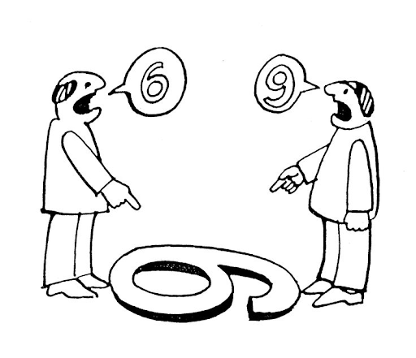

**Functional requirements** are the requirements that the user will specifically demand as the basic functionalities the software system should offer. It is compulsory to have all these requirements incorporated into the system as part of the scope contract. The functionalities will be captured from the user as Use Cases which include an input or operation by the user and output produced by the system as a final product of the use case. 

Example of functional requirements:

  - The user must be able to sign up to the system

  - The user must be able to reset their password in the system

**Non-functional requirements** are the quality constraints of the functional requirements that the system must satisfy. These are captured by the technical team as quality attributes to be applied to the system as a whole. The requirements are not mandatory and the priority or extent to which these are implemented differs from project to project.

Examples of non-functional requirements:

   - How often emails can be sent 

   - The operating systems that we must comply with

   - The tone of the emails that we send to users

   - The font and style of the user interface that users engage with

   - The colour scheme that we choose for our marketing

Below is a table of examples which highlight the differences between functional and non-functional requirements:

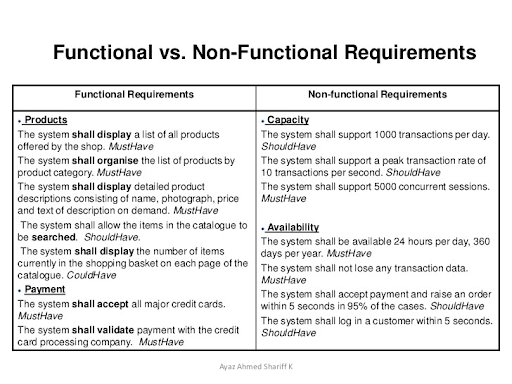

An important point to consider is that your client or users might not know what they require or need. Your job, as the person responsible for requirements gathering, is to help them verbalise and actualise their desires or concerns. You need to probe them and guide them into giving you the information that you need. Your job is to help discover the requirements; in certain versions of DT or Human-Centered Design, the empathise phase is called Discovery. Keep this in mind when dealing with clients/users - they may not even know how to indicate what they want.

The goal of empathising is to ensure that all stakeholders, team members, consultants, etc have the same ‘goal’ in mind by the end of this phase. It is crucial that a team all works towards the same vision, and that can only be done if a shared view of the end goal is.

## EMPATHISE: UNDERSTANDING THE CLIENT AND USER

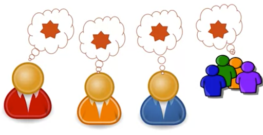

## CLIENT vs USER

There is a difference between client requirements for the project, and user requirements/needs. For the client, the requirements are almost ‘limitations’ or ‘boundaries’ that need to be considered during the project. By understanding these, you are empathising with the client. This requirements gathering entails conducting interviews, doing questionnaires and having stakeholder meetings where the requirements of the client are discussed. The idea is to discover a list of all the 'things' that the client needs or wants, or things that need to be considered during the project.

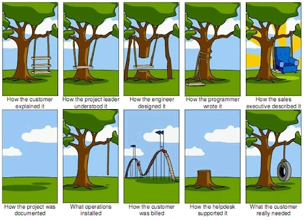

Imagine you are contracted to build a house for a client. The client gives you the project brief which is “I want a house”. You say, “great!” and you go and build the house. You go back to the client once it’s done and it turns out that they hate it.

***But why?***

Well, the client actually wanted to have a 2 bedroom house with an indoor swimming pool, but because they didn’t tell you that and you didn’t ask, you’ve now built a 4 bedroom house with an outdoor pool. Is anybody going to be happy in this business relationship? No. The client is going to make you rebuild the house, and you’re going to hate having to fix it and tear down your previous work.

So, how do we avoid this? Well, we sit down with the client at the start of the project after they have given us the brief and we ask them questions. We ask things like: How many bedrooms do you need? Do you have any preference for the colour of the house? What is your budget like? How long do we have to build the house? As you can see, these questions now start to list the things that the client requires. You’ve found what they need and what they want, and you’ve also found out the limits and restrictions of the project.

As you can see in the above image, when we don’t do client (and other stakeholders) requirements gathering, we end up with everybody building, doing, and expecting different things. It is vitally important to empathise with the client and key stakeholders to find out exactly what they are expecting and what you, as the consultant, can and cannot do during the project.

For the user, you also need to do requirements gathering. But now, you are exploring the problems the user faces, and you’re gathering their needs which you are going to solve to solve the broader goals of the client. By engaging with users and conducting interviews and questionnaires, we can find out what the users’ pains and gains are - what works for them, and what does not work for them.

In summary, the client has a set of objectives that they want to achieve. We need to know this so that we can meet their objectives. For recruitment, the objective is to have a successful intake round. You as the consultant need to discover all the other requirements and needs that surround this overarching objective. You also then need to identify who the users are and discover their problems and their needs.

Remember, the goal is to empathise with the user so that we can better define the problem/s they face, so that we can ideate appropriate solutions and create working prototypes

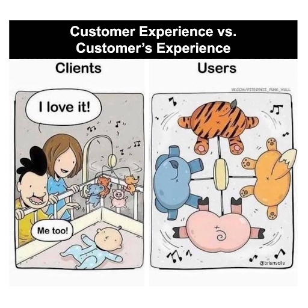

### IDENTIFYING THE CLIENT’S LONG-TERM GOAL AND OBJECTIVES

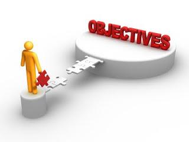

As a team before you conduct interviews you need to identify the client’s goals and objectives that they have for the project.

Goals or objectives can be divided into short and long-term goals.

A **short-term goal** is something you want to do in the near future. The near future can mean today, this week, this month, or even this year. A short-term goal is something you want to accomplish soon.

A **long-term goal** is something you want to complete in the future. Long-term goals require time and planning. They are not something you can do this week or even this year. Long-term goals usually take 12 months or more to achieve.

So before we can begin helping our clients we need to discover what their long-term goal is. It’s possible that they have already discovered this internally, and you simply need to get that information from them; however it’s also possible that they aren’t aware of what their long-term objective is, and you will need to help them discover it.  

It’s important to know what the long-term goal is, as it provides a big picture of where they are heading and helps to clarify short-term goals or decisions.

### IDENTIFYING THE MISSION OF THE ORGANISATION

Most companies will already have a mission statement developed that you can ask them to share with you. However, if they don’t, you will need to assist them in developing a mission statement.

So, what is a mission statement and why is it important for Design Thinking?

A mission statement is a short statement of an organisation's purpose, identifying the goal of its operations: what kind of product or service it provides, its primary customers or market, and its geographical region of operation.

To establish a mission statement, you would need to sit with key stakeholders and C-suite (C-level executives: CEO, COO, etc) within the organisation to help explore what the organisation is trying to achieve. You would need to interview them and ask things like: “What is their primary focus?”, “What kind of service do they aim to offer?”, “What type of customers do they want to focus on working with?”.

**Umuzi’s mission statement is:**
***Umuzi works with top employers to support young people to access high-value tech and creative careers.***

The mission statement enables you to better step into your client’s shoes and understand what problem they are trying to solve and the overall purpose of the project. This will help you with empathising from their perspective and will help you to better understand the problems and challenges that they have been facing and the requirements they have for the project.

In the next section, we are looking at the tools and processes that you can use in Empathise to help get clarity on your client's requirements and needs, as well as the user you are trying to serve.

Remember, empathising is about getting greater clarity on who your client or user is, how they think, how they operate, what they like, what they dislike, what they need, and what problems they face.

Let’s watch this video which discusses how to  [Find Your Mission.](https://www.youtube.com/watch?v=c5-LfK2i2J4)

## HOW TO EMPATHISE

### INTRODUCTION

Empathy is at the core of the Design Thinking process. As a team you need to understand the user; you need to learn about their culture, knowledge, opinions, and worldview to understand their experiences of things deeply and meaningfully.

Empathy is used to describe a wide range of experiences. Emotion researchers generally define empathy as the ability to sense other people’s emotions, coupled with the ability to imagine what someone else might be thinking or feeling.

Sometimes, being an empathic listener in a Design Thinking project is not as simple as it seems, because consciously or subconsciously from our prior experience we naturally form judgments and opinions about others rather than absorbing and understanding the raw data. It’s your goal as a consultant to gain an empathic understanding of the people you’re designing for.

Take a look at [this video](https://www.youtube.com/watch?v=747u3_Ms2tU) which highlights how empathy is different from sympathy. Remember, you don’t want to sympathise with your users, you want to empathise with them.

### HOW TO EMPATHISE?

As a team, you would need to conduct research during this stage. This is a vital part of this phase because research helps you understand and learn from the users that you are designing for as you explore unfamiliar contexts. 

As a team, you would need to research users' behavior, knowledge, and motives.

As a team, you need to observe and/or interact with the users in their real-life environment. This type of research will help you gain a deeper understanding of the user’s experiences and their pains and gains.

During the empathy phase, you will be dedicated to understanding the lives of the users that you are designing for. Therefore you would need to thoroughly immerse yourself in their lives and communities.

Take as much time as you need to conduct the research activities; don’t be rushed. However, if you are running a Google Venture sprint (which is a 1-week version of the Design Thinking process), you will only have 1 day to complete your empathising and one day each for the following stages. Also, consider how Design Thinking accords with Agile.

Remember, Agile is all about iterating and getting working products/software released as quickly as possible. So you don't ideally want to spend too long in each Design Thinking phase. The quicker you can get through each phase, the quicker you can iterate. If you spend too long empathising and you only find out in the testing phase that your empathising was wrong, then you will have wasted a lot of time. You need to work through each phase quickly, but thoroughly so that you can rectify any mistakes in the following iteration of the process.

Let's have a look at this video about [Empathy.](https://youtu.be/M5kJ2coKgrE)

***Assuming the Beginner's Mindset (Listen, Don’t Judge!)***

Setting aside your assumptions is absolutely critical when it comes to building empathy. As human beings, we all come with our own preconceptions, experiences, and misconceptions; this is how we make sense of the world around us. However, these can hinder our ability to build empathy.

When listening to and engaging with people, get into the habit of suspending your own judgments and assumptions. You can think of it as a mental reset; assume a “blank” mindset, free of any preconceived ideas and beliefs. Really listen attentively to what other people are saying, and you’ll uncover much deeper insights about how they tick as a person.

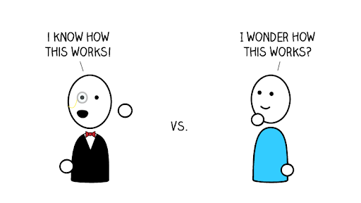

***Ask What-How-Why***

***Constant curiosity: Ask what, how, and why.***

Throughout the empathise phase, you should constantly be considering the what, how, and why of your users’ behaviour. The what-how-why framework can help you translate your (assumption-free) observations into more abstract user motivations. Divide your page into three sections and break down what you’ve observed as follows:

**What?** Refers to the details of what has happened: for example, the user took the following actions when entering their personal details on the website.

**How?** Here you will consider how the user has completed these actions. What were their facial expressions? Were they exerting a lot of effort? Did they seem at ease, frustrated, or confused?

**Why?** Now it’s time to make some educated guesses about the user’s motivations and emotions as they complete these tasks.

The more you reflect on how and why your users might behave in a certain way, the more you can empathise with (and design for!) them.

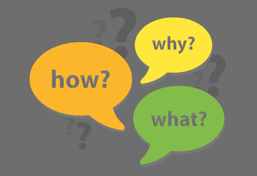

***The Five Whys***
***The Five Whys...okay, but why?***

This easy research method will help you uncover the deep motivations and assumptions that underpin a person’s behaviour.

The Five Whys is a fantastic method to use to get to the core of a person’s beliefs and motivations. Sure, you may feel like a four-year-old asking “why” every time a person answers your previous question, but if you stick with it, and give the person you’re interviewing the time, space, and permission to go deep, you’re likely to wind up with a few key insights. 

You’ll use this method while you’re conducting an interview and start with really broad questions like “How is your Umuzi journey?” Then, by asking why five times you’ll get some essential answers to complicated problems. This can be a great method to use if you’re trying to get at the human and emotional roots of a problem.

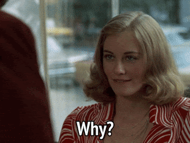

### USER INTERVIEWS

***Conduct Interviews with Empathy***

One way to build empathy is by conducting empathy interviews. The key to an effective empathy interview is to structure it as an open conversation; don’t try to steer the session with a setlist of questions. Remember, the goal is to uncover as much insight as possible - not to confirm or negate a preconceived notion.

One of the most important things to bear in mind when conducting an empathy interview is that you need to be present and attentive. Don’t be distracted by taking notes; set up a recorder or have someone there to take notes for you.

Interviews are an important part of the UX designer’s skill set for empathizing with users. However, an interview will yield only minimal results if you are not prepared to conduct it with genuine empathy.

One-on-one interviews can be a productive way to connect with real people and gain insights. Talking directly to the people you’re designing for may be the best way to understand needs, hopes, desires, and goals. The benefits are similar to video and camera-based studies, but interviews are generally structured, and interviewers will typically have a set of questions they wish to ask their interviewees. Interviews, therefore, offer the personal intimacy and directness of other observation methods, while allowing the design team to target specific areas of information to direct the Design Thinking process.

Most of the work happens before the interviews: team members will brainstorm to generate questions to ask users and create themes or topics around the interview questions so they can flow smoothly from one to another.

Go over this [link](https://www.nngroup.com/articles/user-interviews/) to learn more about user interviews.

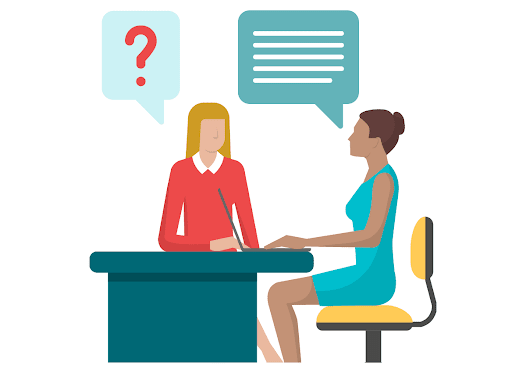

## ANALOGOUS EMPATHY
### BUILD EMPATHY WITH ANALOGIES

Using analogies can help the design team to develop new insights. By comparing one domain with another, we as designers can conjure different solutions that would not necessarily come to mind when working within the constraints of one discipline.

For example, the highly stressful and time-sensitive procedure of operating on a patient in a hospital emergency room might be analogous to the process of refueling and replacing the tires of a race car at a pit stop. Some of the methods you might use in analogous empathy include comparing your problem and another in a different field, creating an 'inspiration board' with notes and pictures, and focusing on similar aspects between multiple areas.

Go to this [link](https://www.interaction-design.org/literature/article/learn-how-to-use-the-best-ideation-methods-analogies) to learn more about analogies.

***Photo and Video User-Based Studies***

Photographing or recording target users, like other empathizing methods, can help you uncover needs that people have that they may or may not be aware of. It can help guide your innovation efforts, identify the right end-users to design for, and discover emotions that guide behaviors.

In user camera-based studies, users are photographed or filmed either: (a) in a natural setting, or (b) during sessions with the design team or consultants you’ve hired to gather information. For example, you might identify a group of people who possess certain characteristics that are representative of your target audience. You record them while they’re experiencing the problem you’re aiming to solve. You can refresh your memory at a later time with things people said, feelings that were evoked, and behaviors that you identified. You can then easily share this with the rest of your team.

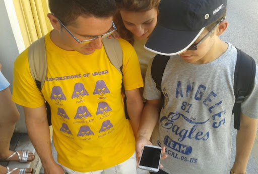

### EXTREME USERS

***Engage with Extreme Users***

Extreme users help to reframe the problem and uncover new insights: “Extreme users’ needs are somewhat amplified. They need/want less or more of something to solve their problems. They often find workarounds to existing problems, unlike average users.”

Engaging with extreme users can help you to identify problems and needs that so-called mainstream users may have trouble voicing. By building empathy with both the “averages” and the “extremes” of your target user base, you are much better equipped to come up with innovative solutions.

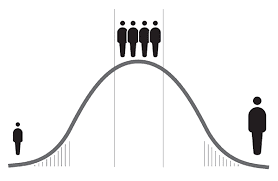

***Story Share-and-Capture***

***Use story share-and-capture***

In the words of the great author Terry Pratchett, “People think that stories are shaped by people. In fact, it's the other way around.” We might paraphrase slightly here, as it’s true that products are shaped by the stories that people tell about them.

Each person in a design team will collect different pieces of information, have different thoughts, and come up with different solutions. For this reason, you should share your inspiring stories to collect all of the team members’ research, from field studies, interviews, etc. By sharing the stories that each member has observed, the team can get up to speed on progress, draw meaning from the stories, and capture interesting details of the observation work.

***BODYSTORM***

***Use bodystorming***

Bodystorming is the act of physically experiencing a situation to immerse oneself fully in the user’s environment. This requires a considerable amount of planning and effort, as the environment must be filled with the artifacts present in the real-world environment, and the general atmosphere/feel must accurately depict the users’ setting. 

Bodystorming puts the team in the users’ shoes, thereby boosting the feelings of empathy we need as designers to come up with the most fitting solutions. Having that ‘real-life’ experience will serve as a reference point for later in the process, enabling us to stop, stand back and ask ourselves: “Remember when we tried being the user? How would this new thing fit in with that?”

***RECORDING AND UNDERSTANDING YOUR FINDINGS***

Let's take a look at the tools we use to help record the data that we found during our empathising. 

Note: Some of these tools are also listed as tools in the Define phase. What's important to remember is that because Empathise and Define are so closely linked, you can draw the line between them slightly differently. So just be aware that you may find these referred to as Define tools. 

### EMPATHY MAPS

Empathy maps are a great tool not only for getting to know your users but for sharing this knowledge across the wider team. As defined by the Nielsen Norman Group, an empathy map is “a collaborative visualization used to articulate what we know about a particular type of user. It externalizes knowledge about users to 1) create a shared understanding of user needs, and 2) aid in decision making.”

Empathy mapping requires you to consider your users in relation to four different quadrants:

 1. **Says:** Contains direct quotes based on what the user has said, for example during an empathy interview.

 2. **Thinks:** Considers what the user might be thinking, but may not want to explicitly reveal. For example: “Am I stupid for not being able to navigate this website?”

 3. **Does:** Looks at concrete actions the user takes, for example: refreshing a page, clicking a button, and comparing different options before making a purchase.

 4. **Feels:** Considers what emotions the user is experiencing at certain points. For example: “Frustrated: Can’t find what they are looking for on the page.”

Empathy maps will also help you to define user personas. A user persona is a fictional representation of your ideal customer. As a UX designer, you’ll start the design process by conducting user research—building empathy with your target users and identifying exactly what they need from the product you’re designing. A persona is generally based on user research and incorporates the needs, goals, and observed behavior patterns of your target audience.

### WHY USE EMPATHY MAPS

Empathy maps should be used to establish common ground among team members and to understand and prioritize user needs. 

**Capture who a user or persona is.** The empathy-mapping process helps distill and categorize your knowledge of the user into one place. It can be used to:

   - Categorise and make sense of qualitative research (research notes, survey answers, user-interview transcripts)

   - Discover gaps in your current knowledge and identify the types of research needed to address it. A sparse empathy map indicates that more research needs to be done
   - Create personas by aligning and grouping empathy maps covering individual users

**Communicate a user or persona to others:** An empathy map is a quick, digestible way to illustrate user attitudes and behaviors. Once created, it should act as a source of truth throughout a project and protect it from bias or unfounded assumptions.

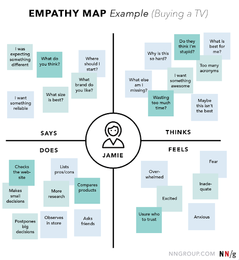

Be sure to keep empathy maps ‘alive’ by revising and adjusting them as you do more research.

## USER PERSONAS

As mentioned briefly in the previous chapter, personas are fictional characters, which you create based on your research to represent the different user types that might use your service, product, site, or brand in a similar way. Creating personas will help you to understand your users’ needs, experiences, behaviours, and goals.

Creating personas can help you step out of yourself. It can help you to recognise that different people have different needs and expectations, and it can also help you to identify with the user you’re designing for. Personas make the design task at hand less complex, guide your ideation processes, and they can help you to achieve the goal of creating a good user experience for your target user group.

**GUIDELINES FOR CREATING PERSONAS**
Persona creation is best done as a team, not because it is difficult, but because it will garner more support for the use of personas from team members able to contribute to the process.

To initiate the persona-creation process, start with identifying characteristics of users observed from user-research activities. Group these attributes into clusters to begin forming clear characters. If several seem too similar, merge them or eliminate any groups that appear less important to the business. Once distinct roles emerge, add details to make the character more realistic, believable, and memorable.

***Common pieces of information to include are:***

   - Name, age, gender, and a photo

   - Tagline describing what they do in “real life”; avoid getting too witty, as doing so may taint the persona as being too fun and not a useful tool

   - Experience level in the area of your product or service

   - Context for how they would interact with your product: Through choice or required by their job? How often would they use it? Do they typically use a desktopcomputer to access it, or their phone or other devices?

   - Goals and concerns when they perform relevant tasks: speed, accuracy, thoroughness, or any other needs that may factor into their usage
Quotes, to sum up, the persona’s attitude

Your goal should be to create a believable and alive character. Avoid adding extraneous details that do not have any implications for design. While a name and photo may seem irrelevant, their function is to aid memorability, which is the #1 job of a persona: to make sure that all team members remember the users they’re building the product for. On the other hand, a lot of unessential details can overwhelm the relevant ones and make them harder to remember.

Thus, each piece of information should have a purpose for being included: if it would not affect the final design or help make any decision easier, omit it. 

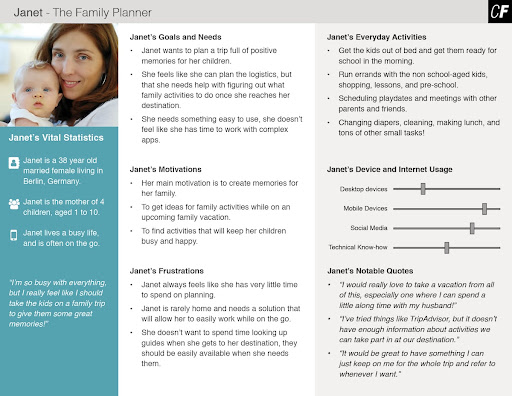

### USER JOURNEYS

A user journey is a path a user may take to reach their goal when using a particular service/product. User journeys are used in designing services/products to identify the different ways to enable the user to achieve their goal as quickly and easily as possible.

They can be used to:

   - Demonstrate the way users currently interact with the service/product

   - The way you may want users to use your product/service in the future

   - They help us understand user behavior – user journeys can help you work out how users are going to interact with your system and what they expect from it

   - They help identify possible functionality at a high level – by understanding the key tasks they will want to do so you can start to understand what sort of functional requirements will help enable those tasks
They help you define your taxonomy and interface – By understanding the ‘flow’ of the various tasks the user will want to undertake, you can start to think about what sort of taxonomy can help support those tasks and what kind of interface the user will be needing to accomplish them

It is also important to note that journey maps can be both high and low fidelity. This means that they can be as simple as some hand drawing on a whiteboard, all the way to a fully designed map using software and tools.

Another note is that you need to choose a persona to focus the journey map on. So you can only work on journey maps once you have developed your personas and empathy maps.

So before attempting a user journey make sure you understand:

   - Your user’s goals

   - Their motivations

   - Their current pain points

   - Their overall character

   - The main tasks they want to achieve

   - Context – Where is the user? What is around them? Are there any external factors that may be distracting them? Further reading: Contextual product backlogs

   - Progression – How does each step enable them to get to the next?

   - Devices – what device are they using? Are they a novice or experts? What features does the device have

   - Functionality – What type of functionality are they expecting? Is it achievable?

   - Emotion – What is their emotional state in each step? Are they engaged, bored, or annoyed?

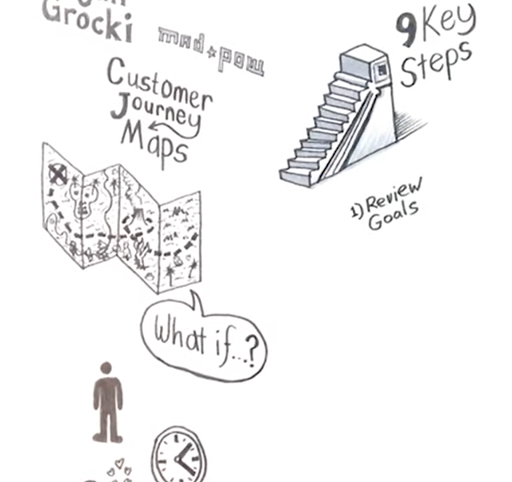

Let’s take a look at the following video on [How to Create User Journeys](https://www.youtube.com/watch?v=mSxpVRo3BLg)

### WHAT’S NEXT?

Well, by now you should see that getting to know your user is the main focus of the Empathising phase. 

You’ve learnt the following from the module:

   - The fundamentals of Design Thinking

   - How to identify the long-term goal and objectives

   - How to identify the mission of the organisation

   - How to identify the client requirements to achieve the long-term objective

   - How to do ‘empathising’

   - How to conduct interviews and create questionnaires

   - How to observe and report on user behaviour

   - How to build User Journeys

   - How to build Empathy Maps

Next up, in Module 5, we will be looking at the **Define** phase of Design Thinking :)

### ADDITIONAL RESOURCES

#### ARTICLES: 

[How to empathise](https://www.interaction-design.org/literature/article/stage-1-in-the-design-thinking-process-empathise-with-your-users) 

[https://www.interaction-design.org/literature/topics/empathy](https://www.interaction-design.org/literature/topics/empathy) 

[https://careerfoundry.com/en/blog/ux-design/what-is-design-thinking-everything-you-need-to-know-to-get-started/](https://careerfoundry.com/en/blog/ux-design/what-is-design-thinking-everything-you-need-to-know-to-get-started/)

