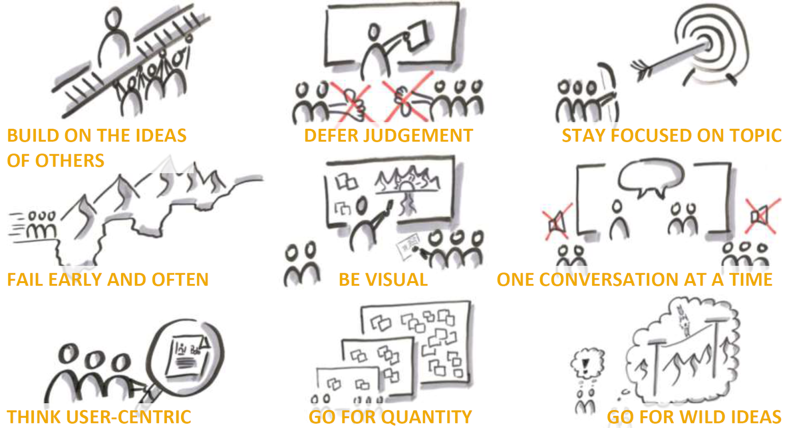
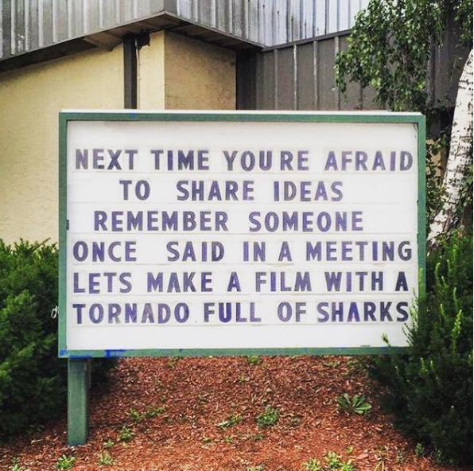
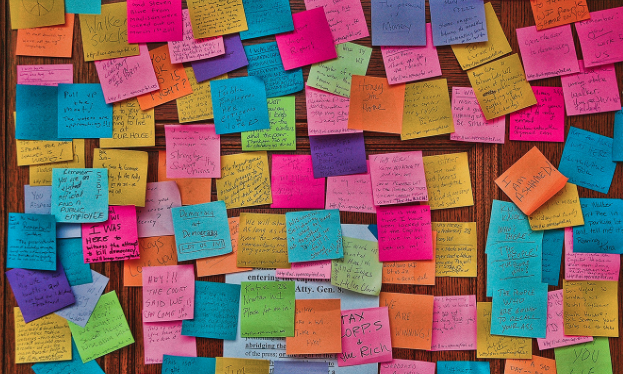
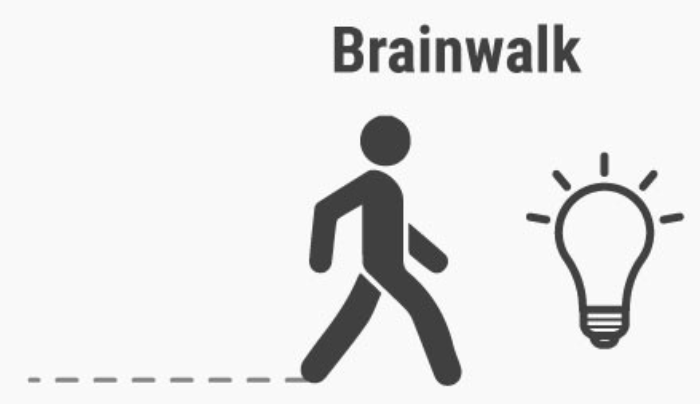

## DESCRIPTION

Now that you’ve formulated the problem into words, you can start working on solutions and ideas, which brings us onto the third stage of the Design Thinking process Ideate.

With a solid understanding of your users and a clear problem statement in mind, it’s time to start working on potential solutions. Ideas are best generated in a specific environment that allows you to think in a creative way. There are methods used to generate ideas and you are going to learn what those methods are and how to decide on the most feasible solution.

### LEARNING OUTCOMES:

By the end of this module you will have developed the following skills:

 - How to ideate 
 - Learn the different methods of choosing an idea 

In addition to these skills you will also learn:

 - How to conduct an ideation session
 - Interact in a business environment 

## INTRODUCTION

By this point, you have learned how to run an organised and structured Empathising and Define phase. You’ve learnt how to understand your user, pinpoint user needs by interviewing them, document your findings into a synthesized user journey or persona, build an accurate problem statement and finally a *how might we statement*.

Up until now you have focused on the problem entirely and have avoided any form of ideation. This is crucial for a meaningful and accurate design thinking process. Now its time to start thinking of creative ways that you can address your user’s needs. Your focus is entirely on being solution oriented; the problem is going to be your guiding point for your ideation. At this point, we assume that the problem statement you've developed is accurate and true, 

Let’s first take an overview look at the **ideation phase** before we get into the methods and tools used in this step of the process.

### THE IDEATE PHASE

During Ideation the aim is to generate a large quantity of ideas that the team can then filter and cut down into the best, most practical or most innovative ones in order to inspire new and better design solutions and products. Ideation is often the most exciting stage in the Design Thinking process, as you are now out of the heavy detailed research and empathising, and are now free to explore ideas and really open up that right brain.

The reason why we focus heavily on ideation is that:

 - It allows us to move away from obvious solutions, which allows us to explore more innovative ideas.
 - Including the whole team allows for a mix of opinions, ideas and perspective. The more varied viewpoints we have, the more chance there is for unique ideas to be generated.
 - We generate an abundance of ideas, not limiting ourselves to a fixed number of solutions.
 - It discourages linear thinking that focuses on one idea.

*“You ideate in order to transition from identifying problems to creating solutions for your users. Ideation is your chance to combine the understanding you have of the problem space and people you are designing for with your imagination to generate solution concepts. Particularly early in a design project, ideation is about pushing for a widest possible range of ideas from which you can select, not simply finding a single, best solution.”*

So what’s the point of this phase? Simple: come up with ideas!

Your aim is to take your problem statement developed by understanding your users that you defined from your empathising and use it as a guiding light as you imagine new and innovative solutions to their problem. It’s not just about ideating, it’s about thinking outside the box to be innovative, to find unique solutions, to think freely, to challenge the ordinary or generic solutions one would generally propose in order to find the solution that truly tackles the users’ problem.

So how do you ideate? Well there are actually a number of tools one can use, from brainstorming to worst-possible-idea to SCAMPER; we will focus on brainstorming as the main tool in our ideation toolkit, however several alternate methods will also be discussed. We will also focus on how to choose your best idea and how to begin thinking about prototyping it.

Let’s watch the video below to quickly recap some of the main points:



“It’s not about coming up with the ‘right’ idea, it’s about generating the broadest range of possibilities.”

## IDEATION GUIDELINES

Ideation is something that many teams struggle with, and a lot of that struggle comes down to not following some important ‘rules’ for collaborative and innovative ideation sessions.

Below is a comprehensive list of do’s, dont’s and things to consider when forming an ideation team and working through ideation sessions. These guidelines should apply to any of the ideation process tools that you will learn about later in this section.

 - Humans naturally fall into the trap of sticking to what they know and staying in their comfort zone. Make sure you are pushing yourself and stretching your team to think outside the box and move away from what makes them feel safe.
  - This is the notion that we are creatures of habit - we generally revert back to what we know. For example, we always conform back to the same restaurants when choosing what to eat; it’s difficult to think of somewhere new and then take the chance - we’d rather stick to what we know.
  - Be highly self-aware during this process. Do not let yourself fall into old habits.
  - Do not stick to what you know and believe. You need to be able to overturn your assumptions and allow yourself to even contradict your normal beliefs.
 - You need to be adaptive. Your ability to change the way you think and see solutions is vital. Actively train yourself to think in a new way.
 - Try to have a birds eye view of the ideas generated to see if you can connect unrelated solutions or ideas together to form new and innovative solutions.
 - Think BIG! Don’t limit yourself to viable or feasible solutions. You need to throw those constraints out the window and allow yourself to really imaginate.
 - Remove all constraints. Don’t limit yourself to ‘how people normally do things’. You need to move away from social conventions or norms and allow yourself to propose solutions that could even create new norms or conventions. Take risks with your ideas and be willing to challenge the status quo.  
 - Keep referring back to your problem or POV statement to make sure you are headed in the right direction. Refer back to your personas or user journey if need be.
 - Get visual. Use drawings to help convey your idea.
 - Remember that it’s all about quantity, not quality. You want to generate as many ideas as you can, however crazy or wild they may seem. We don’t want to focus on only the highest quality ideas, as it may trap us into thinking that those are the only high quality ideas.

There is no such thing as a bad idea. Don’t be quick to assess an idea as bad; and even then, don’t dismiss it. ‘Bad’ ideas are sometimes the ones that inspire great ideas. Bad ideas even help to guide you to know what you don’t want.

There certainly are ideas that seem bad; but some suggest that bad ideas are just good ideas poorly executed. 

 - Ideation sessions need to be fun! They need to be full of energy! Get pumped, get motivated. Keep it interesting by bringing snacks and drinks, meet in strange places or even wear comfortable clothing.
 - But most importantly: don’t judge. Don’t be quick to judge other ideas. You may disagree with the idea, but during ideation the objective is to list as many ideas as we can and to avoid ranking them or judging them. When you judge people's ideas, they are less likely to share ideas, and they may be sitting on something really amazing. So, don’t judge. Let’s leave it to Judy.

 - Have fun! Ideation, for most people, is the best part of the process. Enjoy it!
 
You might be thinking that some of the above guidelines are hard to implement and not natural qualities that your team has, which is most likely the case. You need to make sure to take extra caution in following these guidelines and encourage your team to as well. Although this process step is fun, it’s also difficult to implement well. A good ideation session is not easy, it’s hard work! You and your team need to consciously consider all of the above while you engage in solution findings; you may find some people struggle with one of the above, and it’s your and your team's job to help them through the journey.

**Enjoy a couple more examples of ‘bad’ ideas:**

Not necessarily a ‘bad’ idea...just poorly executed. Not safe at all!

I’m sure there are people out there who enjoy pickles enough to want to brush with pickle flavored toothpaste. However, the vast majority of people will likely find this to be a bad idea!

This is probably the worst of the ideas. There is no ‘good’ reason to have decided to put the charging cable underneath the mouse. The only reason could be for look and feel - they didn’t want an open port ruining the aesthetics. A bad idea though, or just a poorly executed good idea?

One last point on bad ideas: although there may not be any bad ideas, there are certainly wrong ideas. A wrong idea is one that does not align with our HMW or problem statement; it doesn't help us achieve our goal or actually solve the problem.

For example:

 - How might we help huge cruise ships turn faster?
 - “Bad” Idea: Just make the ship smaller. (This isn’t a ‘great’ idea, because if we made them smaller, than they wouldn't be cruise ships anymore)
 - Wrong Idea: Cruise ships shouldn't exist.  

Having taken a look at the ideation guidelines, the next section is going to look at the main method we will be using to ideate - brainstorming. We will go deep into this method to look at the dos and don’ts and how to run a good brainstorming session. Following that, we will take a look at some alternate methods for ideating.

## IDEATION METHODS (BRAINSTORMING)

Brainstorming is the tool of choice when it comes to ideation. It’s so widely used because it stimulates creative thinking, allows for a wide range of ideas to be generated, and it allows for all team members to be included in the process.
There is a simple reason for wanting all team members to be involved: the more brains there are in the room, the more diverse the ideas are. This does assume that all those brains aren’t all the same. If you have a room of 6 designers or you have a room of 2 designers, 2 strategists and 2 developers which do you think would generate the broadest range of ideas? The mixed group should be your answer. Having people with different mindsets, backgrounds and demographics will allow for a more diverse array of ideas being generated as they engage, listen and build on each other's ideas.

What’s also crucial about brainstorming is that it allows you to set aside a dedicated block of time for ideation. This allows you to ensure you switch off that analytical side and turn up the creative side.

Let’s watch the below video: Brainstorming are we Doing It Wrong



Also watch the video below from IDEO founder David Kelly talking about brainstorming and it’s value (Listen up until 1:30 for the main bits on Ideation)



## SETUP

### STAKEHOLDERS

Before you begin ideation, consider who your involved stakeholders will be.
As stated above, you want to have a highly diversified team of people involved in ideation to allow for the widest breadth of ideas. For most of us, we struggle to identify and understand the viewpoint or situation of someone with a different background or demographic type. By involving a diverse group, we can listen and understand each other better.

Make sure that you involve at least one person from each department that would be involved in developing the solution or part of the solution at some point. If your solution requires a call center to be set up so that people can get assistance, then you should include the head of the call center department to be a part of the ideation so that they can share insights which you otherwise wouldn't have known about. This helps you avoid developing solutions that will have future problems for other involved stakeholders.

### ENVIRONMENT AND GUIDELINES

Jumping straight into brainstorming is never a good idea. If you are facilitating the session, you need to ensure that you set the scene, manage expectations and ensure the purpose is clearly defined before you begin. If this is not done, you run the risk of each stakeholder entering the session with different preconceptions and with the focus unclear; this is bound to lead to infighting, arguments and confusion which can all cause damage within the team, ruin existing team cohesion and ruin future creative sessions.

Below are a couple of important things to consider which should ensure a productive and successful brainstorming session:

 - Break the Ice
  - Begin the session with an icebreaker. This allows people to relax and become more comfortable in the setting. There are tons of ice-breaker ideas, from asking people to answer a silly question to playing a no-smiling game. Have fun with the ice-breaker, that’s what it’s meant for!
 - Set the tone
  - Whomever is leading the session needs to be passionate and enthusiastic.  You want the team to understand that the tone is fun and engaging, not serious and programmatic.
  - There should be laughter and joking as we explore wild and crazy ideas. Don’t let anyone be the joy-suck.
  - Ensure the team is aware that one person speaks at a time.
 - The leader should ensure that everyone is aware that:
  - Comments and responses need to be brief.
   - We are not engaging in debate and conversion. This is about producing as many ideas as we can in the time we have. We will debate the ideas afterwards
  - The team should focus on building on other people's ideas.
  - There is mutual understanding and trust within the team, and ensure that that trust is not broken. This generally happens when someone gets too negative and starts rejecting ideas or labeling them as bad. The facilitator should be ready to put out any fires like these, in order to ensure the session doesn't get derailed.
  - Judgments and analysis are discouraged. The team must avoid judging other’s ideas. The team should be encouraged to internalise their disagreement, and channel that into building on or improving the idea.
  - Wild and crazy ideas are fully encouraged!

 - **Ensure the entire team is aware that we are basing our ideation off of our HMW statement produced in the previous phase.** There will be no debate or rehashing of this HMW.
 - **The team should be aware of the time limits.** Brainstorming is not an entire day's exercise; it needs to be focused and punchy - an hour is a good amount of time. Some suggest that you can reach 100 ideas inside 30mins.
 - **The focus is on quantity.** The more ideas generated, the more chances there are for revolutionary ideas.
Every idea must be captured and displayed. Remember, no idea is a bad idea; every idea needs to be written down and documented. This allows team members who are not confident to feel better when suggesting ideas.

Some of the important points from above:

And always remember:

### OUTPUTS

The main method for documenting the ideas generated during brainstorming is with sticky notes. Give every team member a stack of sticky notes and a pen to write with. Each team member can jot down as many ideas as they want, but each must be written on a single sticky.

When writing your idea on the sticky, make sure to be concise. You are not writing a paragraph, you just want to have the main idea in a few words written down. If you can show the idea by using drawings, then you can do that too.

Do not be protective of ideas - you don’t need to write down your name on the sticky. It should not be important whose idea it is.

The short video below talks about why sticky notes are useful and how you should use them:



### GROUPING IDEAS

Once you have concluded the brainstorming and reached the time limit that had been stipulated, you now need to organise all the ideas.

The facilitator will start to group ideas based on similarity or repetition first. Any ideas that are the same get grouped together. Once that is done, ideas then need to be organised according to theme, or even a stage of the user journey.

For example, if our user journey is: Stand up -> walk to fridge -> open fridge -> choose drink option -> close fridge -> open drink -> enjoy the refreshment; when we group ideas, we group them based on each stage of this journey.

This step can be a challenge if the sticky notes are not simple and descriptive enough, which might require the idea-generator to stand up and explain their idea. So make sure your team is aware that each sticky must be simple and easy to understand.

Let’s check out this video to see a brainstorm in action.



Also, take a look at this video to summarise the learnings from brainstorming.



### VARIATIONS OF BRAINSTORMING

There are 3 variations of brainstorming. These have been designed because of a few ‘big’ issues with generic brainstorming: there are schools of thought and research which show that ideating alone as opposed to groups is actually better and generates more ideas. From this research, these 3 variations have been invented. Some of which focus solely on individuals while others include a mix of solo and group thinking.

#### BRAIN DUMPING 

The idea with this method is that we all generally have a bunch of ideas and thoughts running around in our head even before we begin to brainstorm. To help clear up the brain to allow for even greater ideation, this method prescribes that we ideate individually. To facilitate this process:  

 - The facilitator should hand out sticky notes at the start of the session and allow each member 5-10 minutes to jot down all of their ideas.
 - Each member then takes it in turn to walk up to the board and stick up their ideas while explaining them.
 - Once each member has done this, the team then moves into the idea selection and voting phase. (You will learn how to select and vote in the next section)

#### BRAIN WRITING 

This is a very different technique to the one’s above. Instead of sharing your ideas with the broader team, each team member writes down their ideas like a braindump and then passes their ideas along to the person next to them in the room.
 - During each passing phase, each individual should be ideating on the other person's ideas to either build on them or generate new ideas.
 - Each round should be 3-5 minutes.
 - This happens in silence - there is no discussion of ideas at this point.
 - The cycle ends once the round has been completed 3 or more times.
 - Once concluded, each team member stands up and presents the ideas that they have in their possession, which will include ideas that are both theirs and those of others.

This method helps allow each team member to have an equal voice. With normal brainstorming it sometimes occurs that the biggest personalities or the loudest voices dominate the process and the introverts get left behind.

This method also allows for each team member to jot down all of their ideas as they arrive. In normal brainstorming you sometimes forget your idea while you wait for someone to stand up and present theirs. This method allows you to focus and get all those ideas down quickly.

#### BRAIN WALKING 

This might sound like a strange technique, but it has its merits. The idea is similar to brainwriting, however instead of passing along your ideas, you actively get up and walk around to sit in another seat or even at another desk.

The idea is that by moving around and being physically active, you will be more active mentally too. It also helps to keep the group stimulated and avoid the feeling that you’re stuck in a long session.

Note that with either of the three alternate methods above, you can still continue into a round of brainstorming or further ideation once complete. No one method is conclusive or wholy encompassing.

**Other Ideation Methods**

There are a ton of other methods you can use to help during ideation. The list below comprises the most common alternate methods. If you’d like to read further on any of them, you can follow the links that appear after the list to learn more; the links also include even more ideation methods which aren’t listed below.

 - Challenge Assumptions
 - SCAMPER
 - Mindmap
 - Sketch or Sketchstorm
 - Storyboard
 - Analogies
 - Provocation
 - Movement
 - Bodystorm
 - Gamestorming
 - Cheatstorm
 - Crowdstorm
 - Co-Creation Workshops
 - Prototype
 - Creative Pause

**Learn more about each method:**

 - https://www.designorate.com/ideation-design-thinking-tools/
 - https://www.interaction-design.org/literature/article/introduction-to-the-essential-ideation-techniques-which-are-the-heart-of-design-thinking
 - https://www.cleverism.com/18-best-idea-generation-techniques/
 - https://www.linkedin.com/pulse/10-lesser-known-ideation-tools-design-thinking-process-manoj-kothari/

## CHOOSING YOUR IDEA

Having ideated, you should now have a whole bunch of potential ideas. In order to more forward, you need to somehow sift through those ideas and choose the best few. This section explains how to go about choosing your best idea.

There are a whole host of different ways to choose the best ideas, here is a list of some of the methods most commonly used:
Post-it Voting or Dot Voting.
Four Categories Method
Bingo Selection
Idea Affinity Maps
Now Wow How Matrix
Six Thinking Hats
Lean Startup Machine Idea Validation Board
Idea Selection Criteria

We will be focusing on Dot-Voting and the Now Wow How Matrix methods.

DOT VOTING

This is one of the more popular methods. It’s very democratic, in the sense that everyone gets an equal and fair vote.
This method works as follows:
Each team member gets 5 (or more/less, it’s up to the facilitator) ‘votes’
These can be represented by dots - either sticky dots that can get stuck onto each note, or a coloured marker that can be used to mark the note.
Each member goes through the board and places their votes onto the idea that they like the best.
There is no need to take it in turns, everyone can stand up and place stickies simultaneously.
The facilitator must choose if each member gets to put a maximum of 1 vote per idea, or if they can add all their votes to 1 idea.
Once voting is done, group the ideas based on dots and order them based on most to least.
Take the top X ideas (usually 2 or 3) and explore them further through discussion.

An important point to consider is: what are we voting on? Are we voting on how easy the idea is to prototype, or how beneficial it will be to the end user?
The team must decide on the vital metric/s before voting, so that everyone is voting on the same thing.

A final note on this method, is that there is one problematic area: if voting is visible to the team, then members can be swayed one way or another if they see one idea has gotten more votes than other. It’s almost like peer pressure; if you see 4 people vote for A and 1 for B, you’re more likely inclined to vote with A. We will look at Poker Planning/Playing as an alternate method to dot-voting after the Now Wow How matrix method.
NOW WOW HOW MATRIX

This is another popular method commonly used. This method involves using a matrix grid, like the one you see above, to help the team rank ideas.

The focus of this method is in terms of ranking ideas based on 3 important metrics:
“Now” - Ideas which can be implemented right away
“Wow” - Ideas which are innovative and unique
“How”  - Ideas which could be done in the future
As you can see in the grid above, there are two axis. The vertical (y) shows us the difficulty of implementing the idea - how hard would it be to execute. The horizontal axis (x) shows us the level of innovation within the idea - how unique and creative it is. From this grid, we can see there are 4 quadrants; in this method, we care about 3.

The first quadrant: Normal idea & hard to implement. These are not ideas we want to try out because they are, as the quadrant says, very hard to make real and they are just average or normal idas.
The second: Now - Normal idea & easy to implement. These are ideas that require little effort, but they also aren't anything special.
The third: Wow - Unique/Innovative idea & easy to implement. These are the ideas we really want. They are easy to make happen and they are unique and new solutions.
The fourth is: How - Unique/innovative ideas & hard to implement. These are ideas that we want to do, but we can’t do them now because they require lots of effort. So we look at them as future ideas.
The team can either each have a dot/sticky/pen which they can mark each idea with to show if they think it’s a Wow/How/Now idea. Each person will vote once on each idea and indicate their choice. Once each person has voted, the ideas are reviewed and placed inside the matrix, which you can do visually on a whiteboard.

POKER PLANNING/PLAYING

This method is not one that you will normally find in the list of idea selection techniques, however it can be very useful. As stated above, this method is in response to Dot-voting and the issue of peer-pressure, as this method allows for voting to be unbiased.

Before we begin with this method, the team needs to decide on 1 or more (2 is ideal) factors or metrics to rank the ideas by. Ideally you would pick metrics such as: difficulty to implement, cost of implementing or difficulty to prototype.

Once these metrics are decided upon, each idea is voted on based on these metrics and we generally rank on scale from 1-5.

Voting is done in secret (under the table/behind your back). Each person holds up the number of fingers that correspond to their rank. Then, at once, everybody reveals their vote by holding up 1-5 fingers.

Ideally, there will be consensus amongst the team and most people will vote close to each other. If not, then the outliers need to have a conversation to discuss why they have different opinions. At the end of that conversation there should be a consensus and agreement on what rank to give the idea.

Making the Choice
Now that you have ranked all of your ideas, it should be relatively easy to choose which one you are going to use as the solution to your problem statement.

The list of ideas you have will be ranked according to which method of screening you chose above. If there is a clear ‘winner’ then you take that idea forward, otherwise you take the top X ideas and you need to debate them amongst the team until a consensus is reached to determine which idea should be taken forward.

Don’t forget that the metrics you choose to use in the voting process can be whatever you and your team choose to use. However, you need to make sure you consider the most important factors in your project.
MODEL SOLUTION
Modeling your solution is an odd step. It’s not a prototype; we aren’t focused on creating a working representation of the idea just yet. However, it’s important as it prescribes the basis on which the prototype will developed. This step is not part of the normal Design Thinking process; we need to consider it as ‘Business Process Modelling’ is a key skill that business analysts and strategists need to know.

For this step, we simply want to showcase the idea in a very low-touch, low-effort way. This can be done by using user journey mapping/BPM which you learned in the define stage.

When you learned about BPN in the previous section, we spoke about the ‘as-is’ and the ‘to-be’ model. You would have developed your as-is while you empathised and defined the problem. 

Now, you want to develop the to-be user journey. To help you, ask questions such as the following:
How will the user journey change with your new solution in place?
What new challenges might it open up which we must consider?
What dependencies does the idea have?
On other projects
Other stakeholders
On budget
Where will the pain be diminished for our users?
Where will they see gains?
Remember, this is not a prototype yet; a prototype will be a real working representation of the idea. For now, we are modelling the proposed solution in terms of the process and steps in the user and client journeys.

PLAN THE PROTOTYPE AND TESTING

Before we go ahead and start prototyping, we need to understand how long it will take, and what resources will be needed. To do so, you need to sit with your team and relevant stakeholders and think about:
What resources will we need to create it
What stakeholders will be involved in the creation
What limitations are there on the prototyping phase
What major requirements must we meet
What level of fidelity are we aiming for
What is the budget for this prototype
Are there any limitations on how much time we have to complete it.
What do we require for testing
How long will testing take
Who is involved in testing
Once you have done this, you then need to consider how all these factors influence the timeline and factor in all the relevant dependencies.

Draw up a visual representation of this timeline. Make sure to indicate when testing occurs or where any decisions need to be made. Indicate as well if there are any potential points of failure and what resolutions we may take to solve them.

The below examples are meant to show you how you can visually represent your timeline. Do not look at these examples from a content perspective.

COMMUNICATE THE SOLUTION

PITCH TO THE CLIENT
Before you go ahead with prototyping the solution you have just ideated, you need to first present the idea to your client. You need to have buy-in from your client before you go and spend time and money on creating the model/prototype of you solution.
Below, you will learn about what continent to contain in the presentation and how to execute a good presentation.
PITCH THE CONTENT
You will need to create a pitch-deck, a powerpoint presentation, which contains visuals and information that allows the client to understand the empathise, define and ideate process you’ve just gone through and the related findings and decisions.  

You will need to ensure your pitch contains content on:
Introduction
Summarise the aim of this project and the objective of the client.
List the team members involved
What is the user problem
This is your problem statement and our How Might We, which you developed in the define phase.
How you are solving the users problem
This is your chance to showcase the idea you have come up with. Talk about how it solves the users' pains and creates more gains.
Show the new user journey/BPM to show the client how the idea will impact the current process.
How you’re meeting the client’s Objectives
You had identified the client’s objectives in your empathising section and listed them in the introduction. You now need to show how your solution has taken into account their objectives and is solving for them.
How your solution is innovative and using latest technology
Ideally your solution is using new and innovative technology. Showcase how you're doing this and where the technology is used in the solution.
How your idea is being cost effective and practical.
In the ideation selection phase, you had certain key metrics which helped you decide on which idea to choose. These metrics now need to be reported on in terms of how they affect the solution. If being cost-effective was a key metric, then you need to express how you are being cost-focused with your solution. If you have alternate metrics, then explain their effect here.
Show a timeline for prototyping and testing the solution.
Here you need to showcase the proposed timeline for executing the prototype and testing it.
Show the stakeholders involved and their roles in for the project
You also need to showcase who the team is and who the other members are who are involved in various parts of the process.
Consider who the testing team is and how you will work with them. Consider if you need designers or copywriters or developers for your prototype. Will you need strategists to document the process? Will you need a scrum master to help with managing the daily tasks?
List any resourcing requirements that are needed for the project
You should also be indicating if you require any non-human resources.
Do we need any computers or servers for the prototyping?
Will we need any specific office space? (usually you take over a boardroom for the duration of the prototyping and testing so that the team is together and can be more productive).
Will we need any office supplies like pens, paper etc.
List any success factors that will help indicate if the prototype is successful
Here you can list out any potential critical success factors (or KPI’s) that you will use to help measure the success of the prototype.

Note that all of this is living-information, which means that it is all subject to change. You are pitching what you think will be the case, and ideally you’ll be pretty close to the proposed process; however, you may find that once you begin to prototype that you forgot to include certain stakeholders or account for specific resources. This is not a problem, you can alter things once you are in the prototype phase. Ideally though the changes should be minor; if you are making wholesale changes, then you may land up with an unhappy client if what you pitched them and what you do is completely different.

WHAT MAKES A GOOD PITCH
When you present to a client, there are certain do’s and don't's that you need to stick by. The success of a project, no matter how good the idea may be, depends on how the client receives the pitch. You need to be very aware of the pitching phase and ensure that you are knocking the ball out the park - you don’t want all your hard work jeopardized because you failed to explain it well enough to your client.

Let’s take a watch of this video on How to Pitch to Potential Clients before we get into it.
Here are some great tips and tricks to help you:
Introduce yourself.
Start off your presentation by introducing yourself and your team.
This can be short and sweet. Don’t drag it out by talking too much about yourself.

Introduce the presentation
Explain to the audience why they are here and what the aim of the presentation is.
Quickly run through the content of the presentation to ensure your audience isn’t in the dark.

Practice Practice Practice
Make sure you stick to your time limit.
Try presenting to a test audience so that you can fix and improve things before the main pitch.

During the pitch
Be energetic. Show enthusiasm and interest. The worst type of pitch is one where the presenter isn’t engaged and interesting.
Focus on your body language. People respond to how you convey yourself. Ensure you have an open and relaxed body language.
Know when to stop speaking. You need to be able to know when to keep quiet and listen to your audience. Remember, you want as much feedback as possible, so make an effort to pause and ask for feedback.
Be confident. You need to speak with purpose and authority. Make sure your voice carries across the room and you can be heard.
Before the pitch:
Dress to impress. Make sure you present yourself in the best way. Keep neat and tidy and make sure you look the part.
Identify who the main note-taker is to document feedback and actions.
Choose who the main presenter is going to be.

Lastly, ensure you use lots of imagery in your presentation - a picture paints a thousand words

DOCUMENT  CLIENT FEEDBACK
To finish up this phase, you’ll need to ensure that you are documenting the client feedback received during the pitch and thereafter.

Are they completely happy? Have they down-right rejected the pitch? What parts do they have a problem with? Can we still go ahead with the project and prototyping? Do we need to go back to empathising or define? Do they disapprove of the idea and we need to go through ideation again? Have we got a clear go-ahead?

Send around the feedback from the meeting and list any major decisions that were made or need to be made. List any actions that must be taken as well.

WHAT'S NEXT?

Let’s watch this video to recap what we have learned about ideation. 

Next up we will take a look at how to prototype and test your idea. You’ve spoken to your users, you’ve identified the problem, you’ve ideated a solution, you’ve pitched to the client and gotten the go-ahead, and now it’s time to build out a model of the idea and test its validity with your users.

ADDITIONAL RESOURCES:

VIDEOS:
1. Design Thinking: Ideate 

ARTICLES: 
https://www.interaction-design.org/literature/article/what-is-ideation-and-how-to-prepare-for-ideation-sessions
https://www.interaction-design.org/literature/article/5-stages-in-the-design-thinking-process
http://knowwithoutborders.org/unpacking-design-thinking-ideate/
https://www.cleverism.com/18-best-idea-generation-techniques/
https://www.interaction-design.org/literature/article/three-ideation-methods-to-enhance-your-innovative-thinking
https://www.justinmind.com/blog/8-ux-ideation-techniques-to-try-out/
https://www.designorate.com/ideation-design-thinking-tools/
https://www.uxpin.com/studio/blog/design-thinking-ideation/

