## DESCRIPTION

In this module you will learn that in each project that you work on there is planning that needs to be done, allocation of resources and clear goals to be achieved. This is where your skills and knowledge in project management will come essential.
Project management is the application of processes, methods, skills, knowledge, and experience to achieve specific project objectives according to the project acceptance criteria within agreed parameters. Project management has final deliverables that are constrained to a finite time, scope and budget.

## LEARNING OUTCOMES:

 - By the end of this module you will have an understanding of:
 - Project management
 - Software Development Life Cycle
 - Waterfall methodology
 - Agile methodology 

In addition to these skills you will also learn how to:

 - Run scrum events 
 - Develop a project plan 
 - Use project management tools 
 - Interact in a business environment
 - Perform activities to assist with requirement specifications
 - Provide support on the analysis of the requirements
 - Perform activities to assess that the requirement specification has been met

## INTRODUCTION

### WHAT IS PROJECT MANAGEMENT?

Imagine that you're a successful business person running your own company or organisation. You'll now need to take charge and come up with plans, strategies, and tactics, for you to conquer your opponents successfully. Well, project management is the same in the sense that your team will have to come up with plans and processes to oversee the online community and wellness programme at Umuzi.

Before we dive into that, let's make sure we're all on the same page about what a project is. The formal definition of a project can be described as a temporary endeavor that has a unique goal, and usually a budget. That's a start, but what does it really mean? Let's begin with a temporary endeavor. Unlike day-to-day operations, a project has a definite beginning and end. A project produces a unique result, which could be a product, service, or other outcomes. 

Project management is more than showing off your organisational skills and supervising others. It means applying knowledge, skills, tools and techniques to achieve your project's objectives.

Project management can be summed up as answering a few crucial questions. The first question you have to answer is, what problem are you solving? The second question is, how are you going to solve this problem? Whether you're solving a problem, or pursuing an opportunity, you might have to choose from several possible strategies. The next question is, what's your plan? A big part of project management is planning your project. You have to identify the work to be done, in detail. How long it might take, the resources you need, and how much they cost. With that info in hand, you can build a schedule of when work should occur.

When you get to the end of the project, you're ready to answer the last question, how well did the project go? You need to take time to review the project. What worked well? What didn't? Why? How could we have done better? Project management boils down to answering several questions about your project, what problem are you solving, how are you going to solve it, what's your plan for getting the project done, how can you tell when you're done, and how well did the project go?

Let's watch [this video](https://www.youtube.com/watch?v=Jk-JwtScIlw) below to learn a bit more about project management!

## PROJECT LIFE CYCLE

### WHAT IS THE PROJECT LIFE CYCLE?

The project life cycle (PLC) is a collection of logical stages or phases that maps the life of a project from its beginning to its end to define, build, and deliver the product of a project—that is, the information system. Each phase should provide one or more deliverables. A deliverable is a tangible and verifiable product of work. Deliverables at the end of each phase also provide tangible benefits throughout the project and serve to define the work and resources needed for each phase.

Projects should be broken up into phases to make the project more manageable and to reduce risk. Phase exits, stage gates, or kill points are the phase-end review of key deliverables that allow the organisation to evaluate the project's performance and to take immediate action to correct any errors or problems. Although the deliverables at the end of a stage or phase usually are approved before proceeding to the next stage, fast-tracking or starting the next phase before approval is obtained can sometimes reduce the project's schedule. Overlapping of phases can be risky and should only be done when the risk is deemed acceptable.

***DEFINE THE PROJECT GOAL***

Defining the project's overall goal should be the first step of the project. This goal should focus on providing business value to the organisation. A well-defined goal gives the project team a clear focus and drives the other phases of the project.

***PLAN PROJECT***

Once the project's goal has been defined, developing the project plan is a much easier task. Some of the questions asked are about the project and the product: 

   1. What are we going to do?

   2. Why and how are we going to do it?

   3. Who is going to be involved?

   4. How long will it take and how much will it cost?

   5. What can go wrong and what can we do about it?

   6. How did we estimate the schedule and budget?

   7. How will we know if we are successful?

In addition, the deliverables, tasks, resources, and time to complete each task must be defined for each phase of the project. This project plan defines the agreed-upon scope, schedule, and budget and is used as a tool to gauge the project's performance throughout the life cycle.

***EXECUTE THE PROJECT PLAN***

After the project's goal and plan have been defined, it's time to put the plan into action. As work on the project progresses, scope, schedule, budget, and people must be actively managed to ensure that the project achieves its goal. The project's progress must be documented and compared to the project's baseline plan. In addition, project performance must be communicated to all of the project's stakeholders. At the end of this phase, the project team implements or delivers a completed product to the organisation.

***CLOSE PROJECT***

A project should have a definite beginning and end. The closing phase of a project ensures that all of the work is completed as planned and as agreed to by the project team and the sponsor. Therefore, there should be some kind of formal acknowledgment by the sponsor that they will accept the product delivered. This closure is often capped with a final project report and presentation to the client that documents that all promised deliverables have been completed as specified.

***EVALUATE PROJECT***

Evaluating whether the project met its goal can be made only after the system has been implemented. The project team should document its experiences in terms of lessons learned - those things that it would do the same and those things it would do differently on the next project, based on its current project experiences. This post-mortem should be documented, stored electronically, and shared throughout the organisation. Subsequently, many of these experiences can be translated into best practices and integrated into future projects. The project manager may evaluate each project team member's performance to provide feedback and as part of the organisation's established merit, acknowledge the processes and procedures employed in the project.

### How PLC relates to SDLC

The PLC focuses on the phases, processes, tools, knowledge and skills of managing a project, while the software development life cycle (SDLC) focuses on creating and implementing the project’s product – the information system. How a project team chooses to implement the SDLC will directly affect how the project is planned in terms of phases, tasks, estimates, and resources assigned. The SDLC is part of the PLC because many of the activities for developing the information system occur during the execution phase. The last two stages of the PLC, closing and evaluating the project, occur after the implementation of the information system. The integration of project management and system development activities is one important component that distinguishes IT projects from other types of projects.

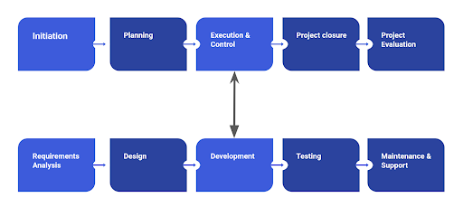

## SDLC METHODS

### SOFTWARE DEVELOPMENT METHODOLOGIES AND STRUCTURES

A software life cycle model is a descriptive representation of the software development cycle. The most well-known method and most commonly used in project management is called the SDLC. SDLC models might have a different approach but the basic phases and activity remain the same for all the models. 

This framework defines the tasks performed at each step in the software development process. The SDLC is a structure followed by a development team within a software organisation. It consists of a detailed plan describing how to develop, maintain, and replace specific development tasks. For projects to be carried out correctly until the end, they have to be planned, executed, and monitored.

Each stage has its own defined objectives and deliverables. Sometimes, the deliverables of one phase are used as inputs to the next phase until the final product. Each stage has its own defined objectives and deliverables.

***PHASES OF SDLC***

The SDLC method has been well-known for successfully shaping and developing many industries and has been the format and backbone of many projects. SDLC models have been developed from the Waterfall model (which has been around since the 70s) as a new version of how to manage a project.

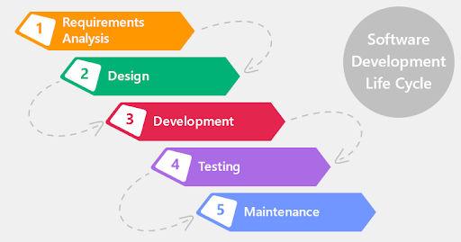

**Requirement Gathering and Analysis**

During this phase, all the relevant information is collected from the customer to develop a product as per their expectation. Any ambiguities must be resolved in this phase only. Once the requirement gathering is done, an analysis is done to check the feasibility of the development of a product. In case of any ambiguity, a call is set up for further discussion.

**Design**

In this phase, the requirements gathered are used as input, and software architecture that is used for implementing system development is derived.

**Development**

Development also known as implementation/coding starts once the developer gets the Design document. The Software design is translated into source code. All the components of the software are implemented in this phase.

**Testing**

Testing starts once the coding is complete and the modules are released for testing. In this phase, the developed software is tested thoroughly and any defects found are assigned to developers to get fixed.

**Deployment**

Once the product is tested, it is deployed in the production environment, or the first UAT (User Acceptance testing) is done depending on the user's expectation. In the case of UAT, a replica of the production environment is created and the customer along with the developers does the testing. If the customer finds the application as expected, then sign-off is provided by the customer to go live.

**Maintenance**

After the deployment of a product in the production environment, maintenance of the product i.e. if any issue comes up and needs to be fixed or any enhancement is to be done is taken care of by the developers.

### WATERFALL SDLC

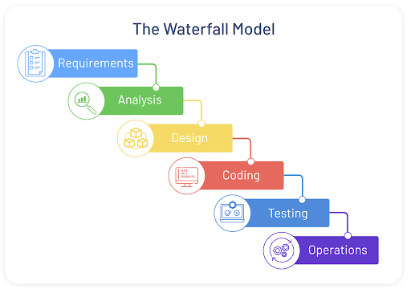

***PHASES OF WATERFALL PROJECT MANAGEMENT***

The Waterfall model is widely considered the oldest of the structured SDLC methodologies. 

Simply put, waterfall project management is a sequential, linear process of project management. It consists of several discrete phases. No phase begins until the prior phase is complete, and each phase’s completion is terminal—waterfall management does not allow you to return to a previous phase. The only way to revisit a phase is to start over at phase one.

If waterfall methodology sounds strict, that’s because the system’s history demanded it. Waterfall project management has its roots in non-software industries like manufacturing and construction, where the system arose out of necessity. In these fields, project phases must happen sequentially. You can’t put up drywall if you haven’t framed a house. Likewise, it’s impossible to revisit a phase. There’s no good way to un-pour a concrete foundation. 

Let's go over the Waterfall SDLC methodology.

The specific phases of the system vary somewhat from source to source, but they generally include:

**Requirement gathering and documentation**

In this stage, you should gather comprehensive information about what this project requires. You can gather this information in a variety of ways, from interviews to questionnaires to interactive brainstorming. By the end of this phase, the project requirements should be clear, and you should have a requirements document that has been distributed to your team.

**System design**

Using the established requirements, your team designs the system. No coding takes place during this phase, but the team establishes specs such as programming language or hardware requirements.

**Implementation**

Coding takes place in this phase. Programmers take information from the previous stage and create a functional product. They typically implement code in small pieces, which are integrated at the end of this phase or the beginning of the next.

**Testing**

Once all coding is done, testing of the product can begin. Testers methodically find and report any problems. If serious issues arise, your project may need to return to phase one for reevaluation.

**Delivery/deployment**

In this phase, the product is complete, and your team submits the deliverables to be deployed or released.

**Maintenance**

The product has been delivered to the client and is being used. As issues arise, your team may need to create patches and updates to address them. Again, big issues may necessitate a return to phase one

### AGILE SDLC

***THE AGILE METHOD OR AGILE PROCESS***

In the Agile model, “fast failure” is a good thing. The approach produces ongoing release cycles, each featuring small, incremental changes from the previous release. At each iteration, the product is tested. The Agile model helps teams identify and address small issues on projects before they evolve into more significant problems, engage business stakeholders and get their feedback throughout the development process.

As part of their embrace of this methodology, many teams are also applying an Agile framework known as Scrum to help structure more complex development projects. Scrum teams work in “sprints,” which usually last two to four weeks, to complete assigned tasks. Daily Scrum meetings help the whole team monitor progress throughout the project. And ScrumMaster is tasked with keeping the team focused on its goal.  

***The Agile Manifesto***

*"We are uncovering better ways of developing software by doing it and helping others do it. Through this work we have come to value:*

 - *Individuals and interactions over processes and tools*

 - *Working software over comprehensive documentation*

 - *Customer collaboration over contract negotiation*

 - *Responding to change over following a plan*

*That is, while there is value in the items on the right, we value the items on the left more".*

Take a look at [this video](https://www.youtube.com/watch?v=MPzMOWohqxQ) as it explains the Agile method and the advantages of using this method. 

***PHASES OF AGILE METHOD***

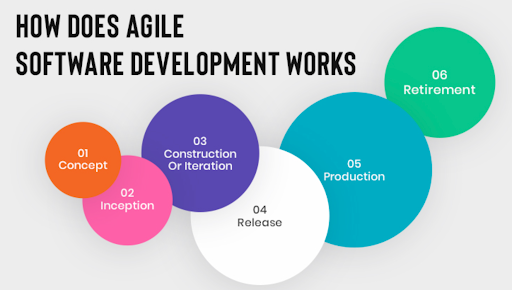

**Concept**

Projects are envisioned and prioritised. The recruitment team has to visualize and prioritise the project/tasks briefed to them.

**Inception**

Team members are identified, funding is put in place, and initial environments and requirements are discussed. The recruitment team members are identified, funding is put in place, and initial environments and requirements are discussed.

**Construction/Iteration**

The development team works to deliver working software based on iteration requirements and feedback. The team will work together to create the recruitment process from start to finish.

**Release**

A Quality Assurance (QA) testing, internal and external training, documentation development, and final release of the iteration into production. The QA recruitment team will now test the process and the systems used in the process, to check if it all works.

Production
Ongoing support of the software and reassessing and updating the process.

**Retirement**

End-of-life activities including customer notification and migration. getting into Umuzi and completing their courses.

Remember that the agile process/method allows the team to update and change the process at any stage.

### AGILE VERSUS WATERFALL

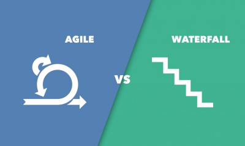

There are some key differences between a traditional waterfall project and an agile project and these include the following:

***AGILE PROJECT***

   - Shorter planning based on iterations and multiple deliveries

   - Flexible, cross-functional team composition

   - Changes in deliverables are expected and less impactful

   - Product delivered in functional stages

   - Collaborative and interactive approach to requirements

   - The user is involved throughout the sprint

   - The concurrent approach seeks to reduce dependencies

***WATERFALL***

   - Detailed, long-term project plans with a single timeline

   - Definitive and rigid project management and team roles

   - Changes in deliverables are discouraged and costly

   - Fully completed product delivered at the end of the timeline

   - Contract-based approach to scope and requirements

   - The user is typically involved only at the beginning and end of a project

   - The linear-phased approach creates dependencies

**As a consulting team which project method would you use?**

As a consulting team, you might want to consider using the agile method because it is flexible and leaves room for trial and error, which will grow you as a team and ensure that you are meeting the needs of your customer.

### THE SCRUM FRAMEWORK

The Agile project step follows a methodology called Scrum. The Scrum framework allows you to implement the Agile development methodology. The one unique feature of Scrum is that the team can review work over and over again during the development process.

Scrum development can be divided into several stages. Each of these stages should produce a  ready-to-use product. At the end of each step (called sprint in Scrum terminology), a ready product is delivered to clients and the client's feedback helps reveal possible problems or changes in the initial plan if needed.

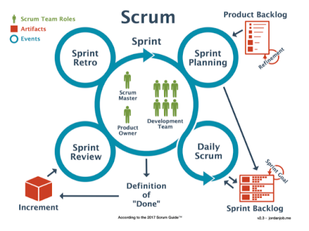

 ***THE TEAM***

Before we continue with Scrum, we should talk about the core roles involved in the process. The fundamental unit of Scrum is a small team of people, a Scrum Team. The Scrum Team consists of one Scrum Master, one Product Owner, and Developers. Within a Scrum Team, there are no sub-teams or hierarchies. It is a cohesive unit of professionals focused on one objective at a time, the Product Goal.
Scrum Teams are cross-functional, meaning the members have all the skills necessary to create value for each Sprint. They are also self-managing, meaning they internally decide who does what, when, and how.

The People Involved in Scrum include:

**Product Owner**

The Product Owner is accountable for maximizing the value of the product resulting from the work of the Scrum Team. How this is done may vary widely across orrganisations, Scrum Teams, and individuals. The Product Owner is also accountable for effective Product Backlog management, which includes:

   - Developing and explicitly communicating the Product Goal;

   - Creating and communicating Product Backlog items;

   - Ordering Product Backlog items; and

   - Ensuring that the Product Backlog is transparent, visible and understood.

The Product Owner may do the above work or may delegate the responsibility to others. Regardless, the Product Owner remains accountable.

**Scrum Master**

The Scrum Master is accountable for establishing Scrum as defined in the Scrum Guide. They do this by helping everyone understand Scrum theory and practice, both within the Scrum Team and the organisation. The Scrum Master is accountable for the Scrum Team’s effectiveness. They do this by enabling the Scrum Team to improve its practices, within the Scrum framework. Scrum Masters are true leaders who serve the Scrum Team and the larger organisation. The Scrum Master serves the Scrum Team in several ways, including:

   - Coaching the team members in self-management and cross-functionality;

   - Helping the Scrum Team focus on creating high-value Increments that meet the Definition of Done;

   - Causing the removal of impediments to the Scrum Team’s progress; and,

   - Ensuring that all Scrum events take place and are positive, productive, and kept within the timebox.

**Development / Scrum Team:**

Developers are the people in the Scrum Team that are committed to creating any aspect of a usable Increment for each Sprint. The specific skills needed by the Developers are often broad and will vary with the domain of work. However, Developers are always accountable for:

   - Creating a plan for the Sprint, the Sprint Backlog;

   - Instilling quality by adhering to a Definition of Done;

   - Adapting their plan each day toward the Sprint Goal; and,

   - Holding each other accountable as professionals.

**Stakeholders:** 

These are external persons or people in the scrum team, who have specific knowledge and interests that will help create, develop and implement the project. 

**The Users:**

The people who use the system while it is being developed.

The recruitment scrum team has to liaise with external customers (applicants). The recruitment team needs to understand the product owner's interest, the marketplace, competition, and the type of system being developed. During the duration of this project, YOU and your team will form part of the development team/scrum team. 

***TERMINOLOGY***

Before we have a look at the scrum process, you need to familiarize yourselves with these terms to understand the Scrum framework better.

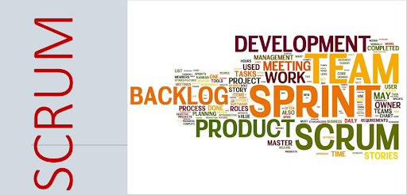

**The Scrum Events**

**The Sprint**

Sprints are the heartbeat of Scrum, where ideas are turned into value. They are fixed-length events of one month or less to create consistency. A new Sprint starts immediately after the conclusion of the previous Sprint. All the work necessary to achieve the Product Goal, including Sprint Planning, Daily Scrums, Sprint Review, and Sprint Retrospective, happen within Sprints. During the Sprint:

   - No changes are made that would endanger the Sprint Goal;

   - Quality does not decrease;

   - The Product Backlog is refined as needed; and,

   - The scope may be clarified and renegotiated with the Product Owner as more is learned.

**Sprint Planning**

Sprint Planning initiates the Sprint by laying out the work to be performed for the Sprint. This resulting plan is created by the collaborative work of the entire Scrum Team. Sprint Planning addresses the following topics:

   - Topic One: Why is this Sprint valuable?

   - Topic Two: What can be done this Sprint?

   - Topic Three: How will the chosen work get done?

**Daily Scrum**

The purpose of the Daily Scrum is to inspect progress toward the Sprint Goal and adapt the Sprint Backlog as necessary, adjusting the upcoming planned work.

**Sprint Review**

The purpose of the Sprint Review is to inspect the outcome of the Sprint and determine future adaptations. The Scrum Team presents the results of their work to key stakeholders and progress toward the Product Goal is discussed. During the event, the Scrum Team and stakeholders review what was accomplished in the Sprint and what has changed in their environment. Based on this information, attendees collaborate on what to do next. The Product Backlog may also be adjusted to meet new opportunities. The Sprint Review is a working session and the Scrum Team should avoid limiting it to a presentation.

**Sprint Retrospective**

The purpose of the Sprint Retrospective is to plan ways to increase quality and effectiveness. The Scrum Team inspects how the last Sprint went with regards to individuals, interactions, processes, tools, and their Definition of Done. Inspected elements often vary with the domain of work. Assumptions that led them astray are identified and their origins explored. The Scrum Team discusses what went well during the Sprint, what problems it encountered, and how those problems were (or were not) solved.

***SCRUM ARTIFACTS***

Scrum’s artifacts represent work or value. They are designed to maximize the transparency of key information. Thus, everyone inspecting them has the same basis for adaptation. Each artifact contains a commitment to ensure it provides information that enhances transparency and focus against which progress can be measured:

   - For the Product Backlog it is the Product Goal

   - For the Sprint Backlog it is the Sprint Goal

   - For the Increment it is the Definition of Done

**Product Backlog**

The Product Backlog is an emergent, ordered list of what is needed to improve the product. It is the single source of work undertaken by the Scrum Team. Product Backlog items that can be done by the Scrum Team within one Sprint are deemed ready for selection in a Sprint Planning event.

**Sprint Backlog**

The Sprint Backlog is composed of the Sprint Goal (why), the set of Product Backlog items selected for the Sprint (what), as well as an actionable plan for delivering the Increment (how).

**Increment**

An Increment is a concrete stepping stone toward the Product Goal. Each Increment is additive to all prior Increments and thoroughly verified, ensuring that all Increments work together. To provide value, the Increment must be usable.

Check out [The Scrum Guide](https://www.scrum.org/resources/scrum-guide) to learn more about this amazing framework. Thank me later :)

Now that you are familiar with the people involved in Scrum and the terminology, let us now go through the planning and processes of this framework.

***PHASES/PROCESS - STEP 1 & 2***

**Step 1: Product backlog**

A product backlog in Agile is, essentially, a list of items that are “on deck” for the development team. It’s a to-do list of items that need to be completed within a larger product. It’s worth noting that these aren’t items that you’re working on within the two-week sprint, but it helps you see what’s coming up so your team can plan and work quickly to release new features.

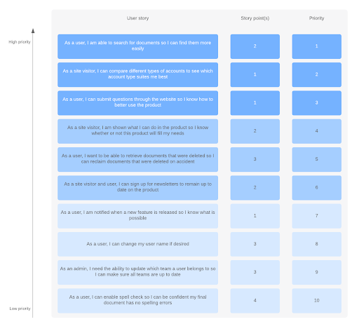

Product Backlog Example

**What is a product backlog in Agile?**

According to the official Scrum Guide, the product backlog is “...an ordered list of everything that is known to be needed in the product.”

The product backlog sits outside of the sprint loop (meaning it contains work that will not be completed during the current sprint) but informs how your sprint will be planned. The product backlog is composed of feedback from:
   
   - The development team

   - User/customer

   - Stakeholders

***Why does a product backlog matter?**

Think of a product backlog as a way of putting a brainstorm or a product plan into action. You’ll undoubtedly be approached by stakeholders (or customers) who have many ideas for improving the product. Not all the ideas are good and not all the ideas are valuable, but without an organised product backlog, it’s difficult to differentiate between the great, valuable ideas and the ideas that would only be a waste of time. Here are some other benefits of the product backlog:

   - It’s an organised list that’s easily wrangled.

   - It’s simple to prioritise.

   - It can be changed as priorities change.

   - It allows you to immediately see dependencies and order them.

   - It allows you to think about products in the long-term, not just in terms of immediate needs.

   - In short, a product backlog allows you and your team to make systematic, smart improvements to a product over the long haul.

**What’s in the product backlog?**

The Scrum Guide is fairly prescriptive about what can be in the product backlog, which helps keep unnecessary items out. The product backlog contains:

   - Features

   - Functions

   - Requirements

   - Enhancements

   - Fixes

It’s not just a simple to-do list, though. Each item in the product backlog:

   - Adds value for the customer

   - Is prioritised

   - Is estimated

There should be no low-level tasks in your backlog (like sending emails), and the backlog itself should be a living document that’s regularly rearranged.

**Product backlog prioritisation**

The product backlog itself is owned by the product owner. The product owner’s job is to produce the very best product possible, so that means developing the most valuable additions to the software first. Since the product backlog is ranked in order of most valuable components, it would stand to reason that the most valuable addition would be at the very top. But that’s not necessarily the case, as the most valuable addition likely has dependencies that need to be developed first. 

   - Higher-priority items should be refined and have great value to the product.

   - Mid-priority items should be candidates for refinement (the process of detailing each task)

   - Low-priority items should not be a dependency and can be safely ignored until they are candidates for refinement.

This list is formatted in order of priority and everything listed is called a User story and each user story has a unique ID number. The user story describes the type of user (the person responsible for completing the task) as well as what the user requires. You need to indicate what is needed for the task and why. A user story reads as follows: "As a User, I need to...so that I...". The story tells us who needs what and why they need what they need. For example,

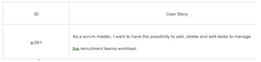

The description of every user story should include the following required fields:

   - Importance of a user story, which is done during the prioritisation phase once the backlog is populated with user stories
    
   - The overall capacity of work and time needed to complete the task
   
   - How to demo. Describes the way how the working product will be demonstrated.

**Step 2: Sprint Planning and Sprint Backlog Creation**

A scrum product backlog ultimately makes sprint planning much easier. After all, your to-do items are already defined for you in the backlog, and they can be easily moved onto your scrum board. Using each item’s estimation allows you to determine how many action items can be added to the next sprint. Then it’s a matter of following the sprint cycle guidelines to follow each item through to completion. 

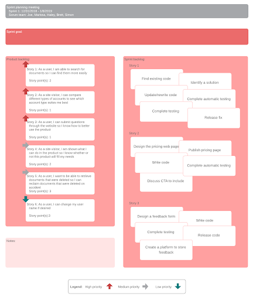

*Sprint Backlog Example*

The Sprint Backlog is composed of the Sprint Goal (why), the set of Product Backlog items selected for the Sprint (what), as well as an actionable plan for delivering the Increment (how).

The Sprint Backlog is a plan by and for the Developers. It is a highly visible, real-time picture of the work that the Developers plan to accomplish during the Sprint to achieve the Sprint Goal. Consequently, the Sprint Backlog is updated throughout the Sprint as more is learned. It should have enough detail that they can inspect their progress in the Daily Scrum.

The Online Community team needs to determine the duration of each sprint. A short sprint allows you to work quickly and produce work faster. As a result, the user’s feedback will be received more often and all the possible errors will be revealed in time.

There are also longer sprints that allow the team to work thoroughly through each task. As a rule, a sprint should last about 2 weeks. However, what is more important at this phase is the collaboration between stakeholders and team members. The product owner determines the importance of a proper user story, while the scrum team defines the appropriate labor costs.

After that, the scrum team can select the most important user stories from the product backlog. Then team members should decide how they will solve this or that task and from here the team must create a Sprint backlog.

The sprint backlog should consist of user stories that will be completed during the current sprint. The user story needs to be developed into a ticket. A user story may be an incredibly complex task that requires lots of different actions to happen for it to be complete. Each ticket needs to be as simple as possible.

The tickets are what go into the sprint backlog to be done during each sprint. During each sprint planning, the team takes a set amount of tickets from the backlog which goes into the next sprint. These are estimated based on how complex they are to complete and how much time they could take. If there are only 80 hrs of available work time in the week, we can only work on tickets that total 80 hours. So it could be 10 tickets each at 8 hours or 5 at 16 hours each.

***PHASES/PROCESS - STEP 3, 4 & 5***

**Step 3: Working On The Sprint And Scrum Meetings** 

Once the Scrum Team has identified the user stories the development process begins, to track the current working process, a task board is a commonly used tool such as Scrum Board and KanBan board can be used to help manage the work process.

Scrum boards and Kanban boards are similar in that they both are used as visual representations to track the progress of specified tasks—and either one can help your development team build and release quality products faster.

Both boards are used to visually track work that needs to be done, is in progress, and has been completed. These Agile boards help keep the team engaged and focused on the goal.

However, scrum boards follow a very specific, rigid methodology, while kanban boards are much more fluid and can be more easily adapted. Take a look at a few major differences between the two boards.

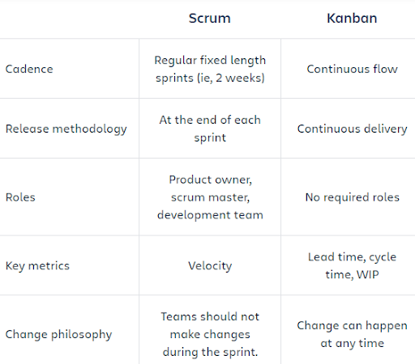

Difference between a Scrum and Kanban board.

An example of what the scrum task board can look like is shown below:

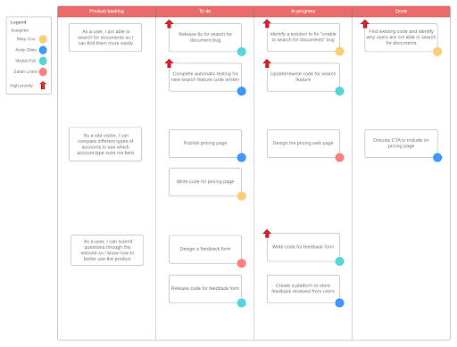

Scrum Board Example

Using a scrum board can be as simple as 1, 2, 3.

   1. Assign tasks from the To-Do column to members of the team. As tasks are assigned, move them to the In Progress column. If the tasks are sub-tasks of a larger user story, the story remains in the To-Do column until all tasks are completed.

   2. When team members report that tasks in the To-Do column are completed, move them to the In Test column.

   3. If the task passes in testing, it is moved to Done. If all of the sub-tasks of a user story are moved to the Done column, the story is moved to Done as well. If the task does not pass the test, it is moved back to In Progress for revision.

The work that is tracked on a scrum board is limited to the number of tasks that the team has committed to complete in the current iteration. New items cannot be added to the To-Do list until all the work makes it to the Done column. There is nothing that prevents you from having all of the tasks in the In Progress column at the same time.

**Step 4: Testing and Product Demonstration**

The ideal result of every sprint’s tasks is a complete working product. The process will need to be tested, as this is the most important part of the scrum method. To save money and minimize costs during the testing stage you can get members of the scrum team to review and test the end product. However, you should be focused on testing with real end-users as they will be able to provide the most realistic feedback. The result of every sprint is a product demonstration. The Scrum team creates a review and demonstrates the results of their work to the stakeholder and product owners. The product owner and stakeholders will make the final decision on further changes made in the project. The product owner and stakeholders help make decisions on how to solve issues that are identified by the user during user testing.

**Step 5: Retrospective and Next Sprint Planning**

At the end of the sprint, teams hold a sprint retrospective to discuss what went well and how they can improve. Once solutions have been put in place and have been clearly defined, the team can now concentrate on the next sprint planning.

Let's have a look at [this video](https://www.youtube.com/watch?v=TRcReyRYIMg) to gain a better understanding of the Scrum framework so far.

***AGILE/SCRUM EXAMPLE***

**An Example Of Sprint Planning And Daily Scrum**

***First: Choose Your Tools***

Select collaboration tools to be used by the team. Pick tools that match your process, tools such as:

   **- Scrum boards:** is a tool that helps the Scrum Team make Sprint Backlog items visible aboard. The board is updated by the Scrum Team and shows all items that need to be completed in the current sprint.

   **- Kanban board:** is a work and workflow visualization tool that enables you to optimize the flow of your work.

***Second: Facilitate a Project Initiation Meeting***

Complete a Project Agreement with the team’s involvement, by doing the following:

   **- Define the definition of Done:** What will the Online Community team need to accomplish in this sprint? To make sure that when each person says they are ‘done’ or finished with a task it means the same thing to everyone on the team.

   **- Define team agreement:** What rules will the team follow to hold themselves accountable? This is part of the team's self-organizing and acknowledging of what they need to be successful.

***Third: Plan Sprint Ceremonies and Communication***

   - Initial backlog grooming (story mapping): This phase only happens once at the start of the project, however during the project, new tickets or stories can occur if the need to add them arises. In testing, new 'features' are normally identified that need to be added as user stories. The people involved during this phase are: (Stakeholders, the Development team, the Product Owner, and the Scrum Master).

   - Sprint planning: First day of each sprint, time box for 1 hour per week of the sprint (2 hours for a typical 2-week sprint). Again: In this phase, the team needs to figure out HOW to execute a user story. What are all the sub-tasks that need to be done to get the story completed? Each ticket must be as simple as possible.

For example: If U01 = As a user I need to be able to log in so that I can save my progress, then:
   - T01 = U01: Create a login page

   - T02 = U01: Create a forgot password link on the login page

   - T03 = U01: Create a dashboard to land onto once you have logged in.

The people involved in this phase: Development Team and scrum master.

Daily scrum/stand-up: This phase is recurring and happens daily during a sprint or time box for 15 minutes. Add the 16th minute for additional collaboration, time box for 15 more minutes, and dismiss any team members not necessary for discussion. People involved include the Product Owner, Development Team, and Scrum Master.
Backlog grooming: This should be done continually throughout the sprint by the Product Owner. However, a set time should be set aside to groom the backlog and to flesh out tickets that need more information or clarity, a time-box can last for 1-6 hours depending on the needs and complexity of stories, but you will only know this once you have speculated the tickets.

The people involved during this phase include the Product owner, however, this depends on the availability of the team, it can be done without the team and just by the Product Owner, but it is better to do it with the full team, as having the designer (e.g.) in the room can help with understanding the complexity of a design element. Without the designer, the Product Owner must use an educated guess to determine the size and difficulty of the ticket.

   - Sprint review and retrospective:  This happens continuously on the last day of each sprint, you have to review and check the work that was done and ensure that all the tickets are done. A review can be short. The estimated time for this time box is 1-2 hours. A retrospective follows right after and goes into detail about how and why as a team we did or did not meet our goals for the sprint. The people involved include the Product Owner, Development Team, and Scrum Master.

   - Sprint retrospective: Recurring last day of each sprint, time-box for 1 hour. The people involved include the Product Owner, Development Team, and Scrum Master.

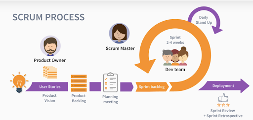

## Sprint Example

***Here is an example of how a sprint should be carried out:***

**Beginning of the Sprint Planning Day one.**

   - The recruitment team will take tasks such as the social media campaigns, and recruiting for applicants, as well as other priorities of the product owner/stakeholders And users, based on user feedback and user testing. After the first sprint, the team will use average speed which is shown using burndown charts to guide them on how much to commit to in a given sprint.

   - They will then determine the capacity based on the hours available in the day to complete the tasks. They will add up all the hours from each team member and subtract the time needed during the sprint and will assign tasks accordingly. For example, 4 recruiters have 40 hours each week which totals 160 hours per week, each for the 2-week sprint, then subtract the daily standups, sprint planning, backlog grooming, sprint review, and sprint retrospective time to determine actual hours to complete tasks.

**Daily Scrum/Standup**

   - This is where all team members meet up to relay what they did the day before and what they plan to do today. This is more for collaboration purposes rather than status meetings. Remember, no one is telling each team member what to do, they are organizing to ensure all tasks are accomplished by the end of the sprint. So, team members can ask each other questions such as: “What did you do yesterday? What are you doing today? Do you need any help with anything?” It's a chance for the team to voice if they need help from other team members.

**Last Day: Sprint Review and Retrospection**

   - Review: The recruitment team will review/demonstrate tasks for the product owner to capture immediate feedback and evaluate the potential impact on future development. User testing is done during the week, the deployment of tickets happens on the last day of the sprint, for short sprints, and potentially multiple times during the sprint for long sprints. They should be prepared with dummy data and examples set up to show the new feature.

   - Retrospection: The recruitment team will consider the sprint and determine what they want to stop doing, start doing, and keep doing. Reflection at the end of each sprint gives them a lot of opportunities to make improvements. A great difference in quality, administration, and practice could occur in only 2-3 sprints (as short as 4-6 weeks). Feedback is highly encouraged and vital to the success of the team!

“Scrum is kind of like poker; you can learn the rules in 10 minutes, but it takes a long time to get great at it” Here is a link to the scrum guideline that you might what to have a look at to further understand this framework [http://scrumguides.org](http://scrumguides.org/)

## ADDITIONAL RESOURCES

### VIDEOS

[What is project management](https://youtu.be/Jk-JwtScIlw) 

### ARTICLES

[https://www.scrum.org/resources/scrum-guide](https://www.scrum.org/resources/scrum-guide)

[https://www.lucidchart.com/blog/how-to-develop-a-product-backlog-in-agile](https://www.lucidchart.com/blog/how-to-develop-a-product-backlog-in-agile)

[https://www.atlassian.com/agile/kanban/kanban-vs-scrum](https://www.atlassian.com/agile/kanban/kanban-vs-scrum)

[https://www.lucidchart.com/blog/kanban-vs-scrum](https://www.lucidchart.com/blog/kanban-vs-scrum)

[https://project-management.com/agile-vs-waterfall/](https://project-management.com/agile-vs-waterfall/)

[https://www.lucidchart.com/blog/waterfall-project-management-methodology](https://www.lucidchart.com/blog/waterfall-project-management-methodology)  

[Project management basics](https://www.wrike.com/project-management-guide/agile-methodology-basics/)

[Agile methodology basics](https://www.wrike.com/project-management-guide/agile-methodology-basics/)