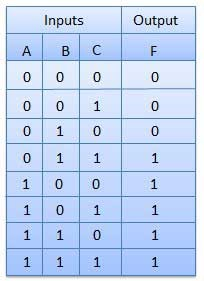

## 1. Problem-solving

In this unit, we’ll explore how computers work at a fundamental level. This will help you understand how to be better at using computer programming as a problem-solving tool. Your goal should be to become a good problem solver no matter what technology you use. By learning more about computer programming basics like logical operators and the laws of Boolean algebra, you’ll be better equipped to harness the power of computing to solve problems.

We’ll start this unit by introducing some basic problem-solving methods, and then move on to computer science concepts in the next sections. To start, watch the first three videos in [this playlist](https://www.youtube.com/watch?v=YgzpqlF54lo&list=PLKQ5LYb497AZIZe9dBWy8GwLluVaMQVj0).

As you become a better programmer, you may want to watch more videos from this playlist. It covers some good topics and tools for solving programs through code.

**Now, let’s put some problem-solving skills to the test.**

What number goes inside the final triangle?


Next, try playing the game Mastermind [(you can play online here)](http://www.webgamesonline.com/mastermind/). It may seem like you need a lot of luck to win this game, but there are algorithms you can use to win every time. Can you find an algorithm to win this game?

## 2. Logical operators

If you think you know what "logic" means, you probably don't... In this section, we'll be going through what it means in the context of computer programming.

You know about True and False by now. These are referred to as boolean values. Some coding expressions evaluate boolean values, and you can store boolean values inside variables.

eg:
```[js]
even = input_number %2 === 0
```

In this case, if the input_number is 5 then `even` would be false. And if `input_number` was equal to 2 then `even` would be equal to true.

Now a Logical Operator is a way of combining boolean values into new boolean values. Some of these logical operators have some very normal sounding names. `and` and `or` are logical operators.

Here's an example:

If `it is a Tuesday` AND `Mom hasn't phoned me for 7 days` then `call Mom`.

The `and` logical operator results in a boolean true output like so:

|it is a Tuesday | Mom hasn't phoned me for 7 days | Call Mom
|-----|-----|----|
|false|false|false|
|false|true|false|
|true|false|false|
|true|true|true|


Here is another example


If `it is a Tuesday` OR `Mom hasn't phoned me for 7 days` then `call Mom`.

The `OR` logical operator results in a boolean true output like so:

|it is a Tuesday | Mom hasn't phoned me for 7 days | Call Mom
|-----|-----|----|
|false|false|false|
|false|true|true|
|true|false|true|
|true|true|true|

Different languages have different syntax for writing this stuff as code. But the concepts are the same across languages.

### Truth Tables

Truth tables are used to help show the function of a logic gate. You will see these tables in the videos below.

### Logic gates

Digital systems are constructed by using logic gates. These gates are the AND, OR, NOT, NAND, NOR, XOR and XNOR gates.

Watch the videos below to learn more about Truth Tables and Logic Gates.

Boolean Algebra - Part 1

https://www.youtube.com/watch?v=2zRJ1ShMcgA

Boolean Algebra - Part 2

https://www.youtube.com/watch?v=aQosPmPAaF8

Here is a summary of all the logic gates and the symbols used to represent them (when you see E, it means the same thing as X. So EOR and XOR both mean “exclusive OR”.)


## 3. Boolean algebra

### Description of the Laws of Boolean Algebra

- **Annulment Law** – A term AND´ed with a “0” equals 0 or OR´ed with a “1” will equal 1.

  - A . 0 = 0    A variable AND’ed with 0 is always equal to 0.

  - A + 1 = 1    A variable OR’ed with 1 is always equal to 1.

- **Identity Law** – A term OR´ed with a “0” or AND´ed with a “1” will always equal that term.

  - A + 0 = A   A variable OR’ed with 0 is always equal to the variable.

  - A . 1 = A    A variable AND’ed with 1 is always equal to the variable.

- **Idempotent Law** – An input that is AND´ed or OR´ed with itself is equal to that input.

  - A + A = A    A variable OR’ed with itself is always equal to the variable.

  - A . A = A    A variable AND’ed with itself is always equal to the variable.

- **Complement Law** – A term AND´ed with its complement equals “0” and a term OR´ed with its complement equals “1”.

  - A . A = 0    A variable AND’ed with its complement is always equal to 0.

  - A + A = 1    A variable OR’ed with its complement is always equal to 1.

- **Commutative Law** – The order of application of two separate terms is not important.

  - A . B = B . A    The order in which two variables are AND’ed makes no difference.

  - A + B = B + A    The order in which two variables are OR’ed makes no difference.

- **Double Negation Law** – A term that is inverted twice is equal to the original term.

  - A = A     A double complement of a variable is always equal to the variable.

- **de Morgan's Theorem** – There are two “de Morgan´s” rules or theorems,
  - Two separate terms NOR´ed together is the same as the two terms inverted (Complement) and AND´ed for example, A+B = A. B.
  - Two separate terms NAND´ed together is the same as the two terms inverted (Complement) and OR´ed for example, A.B = A +B.

more info: https://www.electronics-tutorials.ws/boolean/bool_6.html

### Boolean Functions/Expressions

A Boolean function is described by an algebraic expression consisting of binary variables, the constants 0 and 1, and the logic operation symbols AND, OR and NOT.

Every Boolean function can be expressed by an algebraic expression, like F = A+B.C, or in terms of a Truth Table. A function may be expressed through several algebraic expressions, on account of them being logically equivalent, but there is only one unique truth table for every function.

#### Boolean Expression

In the example below, F is the output of the Boolean function, and A, B and C are the inputs. The '+' means OR and the '.' means AND.

F = A+B*C

#### Truth Table

Here is an example of a truth table for the Boolean expression listed above



### Karnaugh Maps (K-Maps)

A Karnaugh Map is a grid-like representation of a truth table.  It is just another way of presenting a truth table, but the mode of presentation gives more insight.  A Karnaugh map has zero and one entry at different positions. Each position in a grid corresponds to a truth table entry. They are useful for simplifying complex Boolean expressions, especially those with more than 2 variables.

(Optional) For more information about using K-Maps to simplify Boolean expressions, watch this video: https://youtu.be/PA0kBrpHLM4