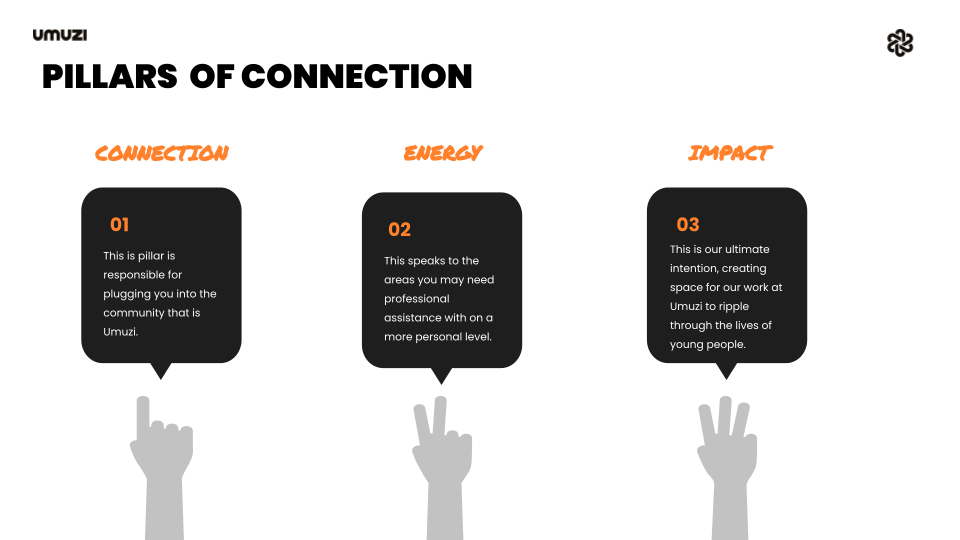
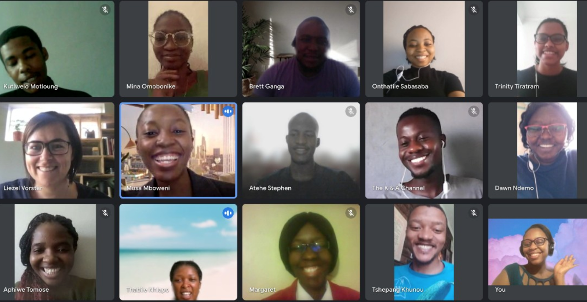
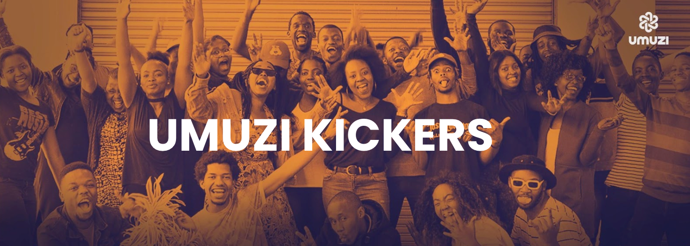
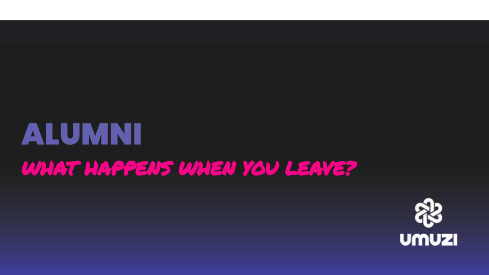

We’re so happy to have you here and aim to help you connect and network with other learners in the Umuzi Community. We encourage you to use every opportunity to collaborate with others and grow your social capital during your time with us.
Let’s get you plugged in!

##**My Umuzi Learner Site**

This is the Learner Intranet to help you find the information and documents you need to make the best of your journey at Umuzi. From Wellness resources, info on how to claim your data refund and tips on how to optimise your LinkedIn. This is YOUR space, make sure to make good use of it. [Click here](https://sites.google.com/umuzi.org/umuzi-recruits-home/whats-news?authuser=1) to access the site.

##**Let's Mingle**

**Connection Sessions**

 

Working remotely is intense and can be lovely and lonely all at the same time! That’s why we hold regular connection sessions for you as a cohort and as part of the bigger Umuzi community!
The best way to meet different recruits and leaders in the organisation in the comfort & safety of your home! These sessions are filled with themed, deep and relevant conversations that will inspire you. 

Let's not forget the fun and games that will get you coming out of your shell in no time!

##**Umuzi Clubs**

We have our Umuzi Clubs – This is a space in our community where anyone can jump into familiar territory by joining a club they have an interest in or have been looking to get into. There is also always space for a new club with a new captain. If you’re the captain now, pitch your plan and let’s start an extreme Ironing club. [Click here](https://docs.google.com/document/d/1enVkEgaxvWwhODBHEYWHFMrjJ3zL6L_VCEBE6gwit8A/edit) to join a club.

**The Podcast Club**

Podcasts are an incredible way of sharing experience, knowledge and laughter. If you’ve got some goodies, share them here! If you’re keen to get into them, we’ve got an archive of past poddies too. 

**Umuvi Club**

Anything involving movement. Do you dance, run, plank for 4 minutes a day or want to? Get involved here. We share plank challenges, body-weight workout programmes etc. Accountability is key.

**The BIB**

For the bookworms-nuff said.

**The cooking club**

To those of you who can boil an egg with great precision, are young master chefs in the making, or you just simply enjoy eating. This is definitely going to be your favourite hangout spot because we've got you covered.

##**Umuzi Kickers**

Once a month we put together a newsletter-esque comms piece, chock full of what’s been going down in our remote space, who’s bagging roles in industry, where everyone is on their journey and just generally a nice big update on the exponentially wonderful things happening around us. Our pillars at Umuzi are energy, connection and change - and we want to make sure nothing slips through without the recognition it deserves! So when November’s edition rolls around, get ready to feast your eyes on the incredible spectacle that is our evolving organisation and community (and that includes you!)

##**Beyond Umuzi**

This is the official Umuzi collaborative talk series. The topics focus on masterclasses from Umuzi alumni and other industry professionals, industry talks and alumni sessions. Everyone leaves feeling inspired.
[Click here](https://www.youtube.com/watch?v=jS-UcDK-bBA&list=PLybRNzuiivp8hFddaNO1iz3oeuo2uPU8_) to watch the first session we hosted.

#**Socials & Shoutouts**

Follow our pages to see what we, current learners and alumni are getting up to!

[Facebook](https://www.facebook.com/UmuziOrg?_rdc=1&_rdr)

[Instagram](https://www.instagram.com/umuziorg/)

[Twitter](https://twitter.com/UmuziOrg?ref_src=twsrc%5Egoogle%7Ctwcamp%5Eserp%7Ctwgr%5Eauthor)

[LinkedIn](https://www.linkedin.com/company/umuzi-photo-club/mycompany/?viewAsMember=true)

##**Closed Group**

We have our growing community of Umuzi Alumni in various industries. This is a great space to network & share your  community where anyone can jump into familiar territory by joining a club they have an interest in or have been looking to get into.

[Click here](https://docs.google.com/document/d/1HH1zDwUrZCtvOW9SJ2EPCxsQWp6SkptcHj_Qjt0z3gU/edit) to join.

#**We love seeing what you're doing!**

Right, now that you know where we are, let’s get you on the socials and shouting us out! Tag us and use this hashtag:
#UmuziC37

On top of the Kickers we often feature a few of our amazing learners and ask them some interesting questions about how their time at Umuzi has been. So look out for us.

The name Umuzi comes from the word ‘Home’. When you branch out into the world after your time with us, don’t lose touch, the power of Umuzi is walking through the streets of Newtown and bumping into an Alumni from Cohort 3 and saying hi. In a society that has lost connection, we are committed to changing that narrative and finding strength in Community.
We’ll be knocking on your digital door with newsletters, initiatives to engage in, job opportunities, workshops and masterclasses - maybe even an event here and there, and most importantly - blowing all the smoke when you’re out in the world killing it at what you do :) 

#**Happy Connecting!**

