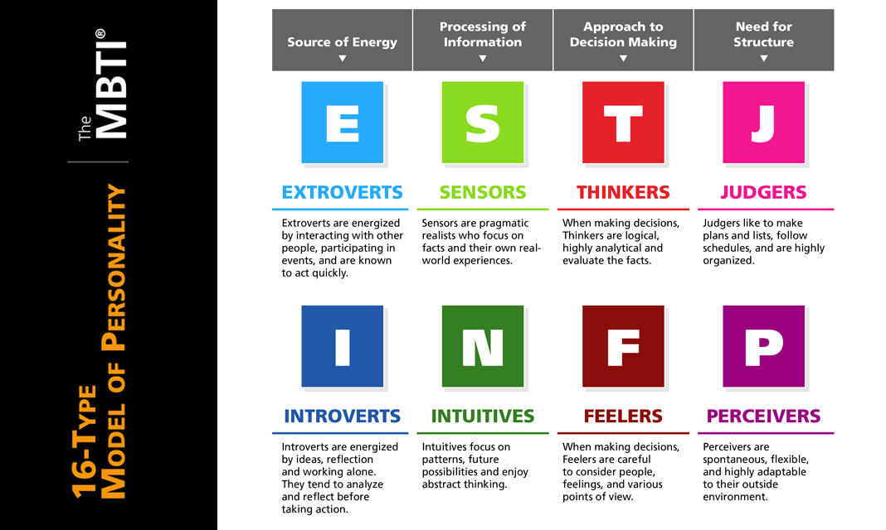
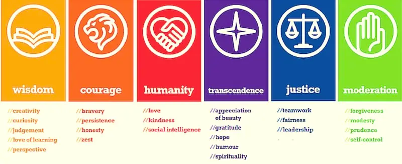

As part of your learning journey, we would also like to support you in your personal growth. Getting to know yourself and understanding yourself is an important part of reaching your full potential in life. 

These are some of the questions you need to ask yourself:

 - **Who am I?** 
 - **Do I know myself and what my strengths are?** 
 - **Am I setting myself up for success?** 
 - **Am I taking responsibility for my own life?**

If you would like to understand yourself better, [click here](https://www.16personalities.com/free-personality-test) to take a free online personality test. It will help you understand yourself and others better. It’s not difficult. It just requires a bit of thoughtful, objective honesty.

The below diagram will help you interpret your Meyers-Briggs personality test results and understand what each letter represents. 

## **Character Strengths**

Character strengths are the core personality traits that define your unique identity and make you feel authentic, alive and engaged in life. Character strengths are the positive parts of your personality that make you feel authentic and engaged. You possess all 24 character strengths in different degrees, giving you a unique character strengths profile.

Research shows learning about your strengths and how to express them can make you happier, less stressed, more productive at work and better connected to others.

[Watch this video](https://www.youtube.com/watch?v=U3nT2KDAGOc) on The Science of Character.

If you want to start learning about your own character strengths, complete the [VIA Survey](https://www.viacharacter.org/character-strengths-via) and find your ranking of strengths from highest to lowest. 

Your character strengths are key elements to living an authentic, meaningful life. Research shows that people who use their strengths a lot are 18 times more likely to be flourishing than those who do not. 

Check out this [video](https://www.facebook.com/watch/?ref=saved&v=5277183705658753). It will definitely change how you think about your strengths and weaknesses going forward.

Have a great day!

Umuzi Wellness Team.