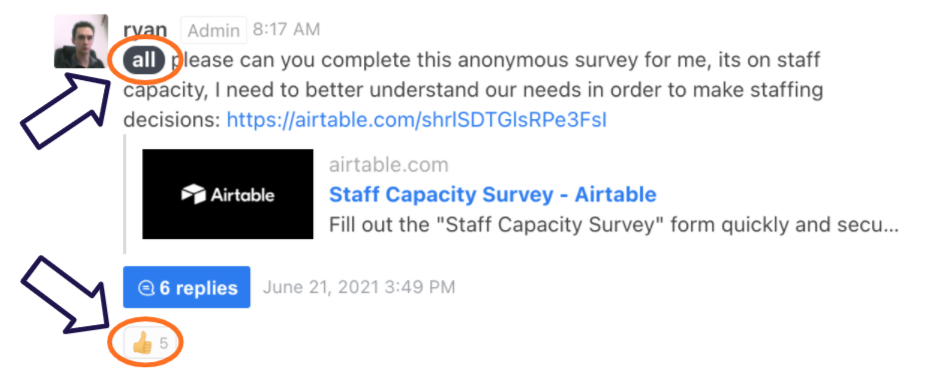

#**Vitual Work Guide**

The world of work has evolved tremendously since the start of the pandemic and many organisations, just like Umuzi, have had to adjust to being a remote training organisation. This has meant providing our learners the necessary support to ensure that learning and productivity are not interrupted. 
Below are a few guidelines to help you as you navigate the virtual world of learning and work!

##**STRUCTURING YOUR WORKDAY TO GET WORK DONE!**

**Your working hours**

The standard working hours at Umuzi are 08h30 - 17h30 with an hour lunch break every day. Although we are in no way clock watchers, we believe that having set hours of work gives one structure for the day, helps create boundaries that divide time for working and time for resting or living life, as well as to act as preparation for the workplace where these are the usual hours of work in many organisations. 

Now we understand that even in a virtual work environment, things happen! If any personal emergency arises, make sure to communicate with your main contact person, usually your Learner Support Manager,  as soon as you can. We can’t offer the support you need if we don’t know what is happening. We’re just a quick call, WhatsApp text or email away.

**Some ideas to help you stay on track**

Keep some kind of diary - play around to see what kind of task management system works for you: digital, analogue, an app of some kind. Here are some free systems that we suggest experimenting with:
The [bullet journal](https://bulletjournal.com/pages/learn) method;
[Trello](https://trello.com/?&aceid=&adposition=&adgroup=105703213888&campaign=9843285526&creative=437184392305&device=c&keyword=trello&matchtype=e&network=g&placement=&ds_kids=p53016482445&ds_e=GOOGLE&ds_eid=700000001557344&ds_e1=GOOGLE&gclid=Cj0KCQjw7MGJBhD-ARIsAMZ0eeuu9gyMtuTDnrwTJoC5VXLNiabURwVThzFxDc-8pEreYrDnDFp8GVUaAiWYEALw_wcB&gclsrc=aw.ds) / [Asana](https://asana.com/?utm_source=unknown&utm_campaign=app.asana.com) / [Notion](https://www.notion.so/personal?utm_source=adwords&utm_campaign=14083469691&utm_medium=123977436423&utm_content=502429039670&utm_term=trello&targetid=kwd-3609071522&gclid=Cj0KCQjw7MGJBhD-ARIsAMZ0eetf-zkN_iRDIeXjEsaPGFzkImWk0uePPWOz_8Fn7u9M46OyQKvs7JYaAhyaEALw_wcB)
If you have Microsoft Office - To Do app (search for it to download it)

**How is your work environment set up?**

Now that we’re all working from home, it may be obvious, but you will require;
-A quiet area where you can focus on your work

-A background that is appropriate for professional meetings - your messy room and unmade bed are probably not going to leave the best impression ;) 

-A reliable internet and electricity connection as far as that is something that is under your control. If you know that where you live, the internet is unreliable and you frequently experience load shedding, then you are going to struggle to get your work done. It then becomes your responsibility to find an alternative workspace, where you can perform your duties. 

It is your responsibility to ensure that you have what you need to get your job done. 

##**COMMUNICATION**

The importance of mastering this soft essential skill for your own career success cannot be overstated. Different divisions and departments will communicate differently but there are some common themes that will take you a long way.

**Communication channels:**

Umuzi has various communication channels / platforms that we expect learners to stay on top of. These include:

Email

Rocket Chat

Discord

WhatsApp groups

To prevent you from constantly task switching, it may be a good idea to have set periods where you check comms e.g. first thing as you start work, at lunch and just before ending your day. This way, you can focus on getting work done instead of getting distracted by little noises every 5 seconds but the greatest delay someone will have in hearing from you will be max a couple of hours.

In general, a 24-hour response time to communications is considered professional best practice. While sometimes this is difficult, you should strive to achieve this as often as possible, even if it is just to acknowledge the communication and let your contact know you will revert with further feedback.

##**Acknowledging comms:**

If you receive a message or if there is a general comm that goes out and you are an intended recipient (e.g. someone who is meant to be receiving the comm) then you either need to reply to the message, where necessary, or react with an emoji - if that’s an established practice for your department.

This is to acknowledge that you’ve seen the message. For example:

Remember: should the message contain a task for you to complete - add that task to whatever task management system you’re using so that you remember to get it done!

##**Team communication:**

When it affects a team you might be part of for a project, communicate where the whole team can see it. Where possible, communicate challenges like loadshedding or connection issues on a public channel (e.g tech team RocketChat or WhatsApp) so that the whole team is aware of the issue and there is no broken telephone.

Other considerations:

-Try to organise stand-ins for duties you will not be able to perform

-When taking leave, communicate with your co-learners to organise stand-ins for events

-Communicate publicly who will be doing what so that the team is not in the dark and confused while you are away

-When you need help but don’t know who to ask, ask publically

-Your team members can tag someone that is able to help or offer help themselves

-If the issue is of a personal nature and you don’t feel comfortable posting to a public platform, then of course rather go straight to your LSM or line manager

**E-mails:**

You are in a professional, albeit learning, environment and as a result you need to use professional business language in your emails. Some guidance:
Keep it as short and to the point as possible - people stop reading when an email is longer than necessary.
Write in full sentences with full words. E.g. Text language is not OK.

**Phone calls:**

If this is something that is second nature to you and you’ve got it down, then great, if not, here are some guidelines:
If it’s a work-related call - which is what this document is addressing, then start by identifying yourself: “Hi, this is Anele from Umuzi” and then go into the details. 
We have diaries that are open for a reason: if possible, check to see that the person’s diary is open before calling or message to ask if they have time to chat at some point and ask what time works for them.

##**MEETINGS**

-Where possible, send your meeting request at least 1 day in advance

-Avoid double booking - everyone’s calendars are visible for this reason

-Respond to calendar invites as soon as you see them, so that others can plan their time effectively

-If you responded “yes” but something changes e.g. no electricity, let the meeting host know in advance that you can’t make it (and explain why)

-Check your calendar the night before or early in the morning to be able to plan your day effectively

-PREP for every meeting! If anything is sent to you in advance, go through it. If you know that the meeting will use some sort of tech e.g. Mural then make sure you have access etc.

-Ensure you have a working microphone so that you can join in on the discussion

**A word on your professional “brand”:**

-Out of sight, out of mind: if you’re wanting to accelerate your career, you need to be noticed. One way of doing this is by focusing on the fact that you are a professional brand. If you want to build your brand as someone who is a competent team player - then participate in the meetings you’re in! 

-If you can, turn your camera on: there are plenty of studies that say people trust you more when they can see you!

**Daily stand-ups:**

-Stand-ups are an important tool for us to communicate and coordinate. To have effective stand ups, it’s a good idea to:

-Prepare for your stand-up in advance, by the time you get to stand-up you should have a rough plan for your day prepared

Communicate what you need:

-Reviews

-Help

-Blockers

Communicate and take note of your colleagues’ plans

If your plans are going to collide, stand-up is the time to address this.

If you know you will be absent, send your plan in advance.

If you are unable to send it in advance, send it as soon as you come online

Your manager will make sure to communicate the order of priority different tasks that you’re involved in, however, if they don’t cover it, or you’re left unsure - ASK them:

-Where should I focus my attention first?

-What’s the max amount of time I should spend on this?

##**SOCIAL MEDIA**

Remote working has forced us to use various social media platforms to communicate with colleagues in real-time. Umuzi has several social media platforms which are used for a variety of work-related objectives. 

All our social media groups/channels are an extension of a professional work environment, so our conduct in these groups needs to reflect the level of professionalism required in a physical working environment. Here are things to note when conducting yourself on company groups/channels.

**Social Media Etiquette**

Remember to be considerate and respectful to others in your online conduct

Be polite and observe the same level of courtesy as you would do if you were speaking to someone face to face at work

Always keep to the purpose of the group. Do not spam the group, by sharing irrelevant messages about other topics, memes, or promotional deals

Try to only discuss work related matters in the group and use alternative groups or chats for personal discussions or organising out of work activities 

We all have our different beliefs, religions and opinions on the world - you can share yours in a respectful manner, but not in any way that seems forceful or as though your opinion / belief or religion is the only correct one to hold

Please do not share (Screenshots) or discuss (voice notes) confidential work with people outside of Umuzi (this includes names, issues / treatment details,       especially anything relating to our Employer Partners)

Avoid one on one personal conversations, in the group. Switch to private messages

Refrain from arguments, heated opinions, fear mongering and fake news. Check your sources before you share.

Understand that the discussions will be moderated by the group admins/managers and any inappropriate activity may lead to further investigation and potential disciplinary.

**Time spent on social media platforms during work hours:**

Let’s face it, fun social media is an inescapable part of our everyday life. Whether your kryptonite is Instagram, TikTok or Facebook, we all plug in to social platforms for our personal use almost every day. Now that we are working remotely, we often have to engage these platforms for work purposes as well, which can cause us to run into unnecessary distractions which we sometimes can’t resist. We may find ourselves trapped in a mindless scrolling session on social media. That’s a chunk of work time you’ll need to make up for.

You need to be able to set boundaries that reflect the respect you have for your work. Here are some measures to put in place if you are struggling to get work done because you are easily distracted by social media.

1. Turn off your social network alerts and notifications

2. Close any news and livestreaming tabs

3. Close all social media tabs that aren’t work related

4. Log off all the social media apps on your phone that you gravitate towards when work gets challenging. If this doesn’t work, try no. 5.

5. Delete the app. Seems extreme, but if you just can’t resist the temptation, it may be worth it, while you pursue bigger goals at work.

If all else fails, try getting some assistance from these software programs: 
[Cold Turkey](https://getcoldturkey.com/), [Freedom](https://freedom.to/?rfsn=1011885.qt02j4o&subid=kssbncn7vo00ypei058d6), or [RescueTime](https://www.rescuetime.com/)

[Momentum](https://momentumdash.com/) is a great chrome plugin that helps you to avoid all the pages that Google tries to lead you to. 

##**Ways to beat the sheds⚡:**

There is no denying the impact that load shedding has on everyone’s productivity and of course, connectivity. Ensuring that you are able to complete your tasks within the required time remains each learner’s responsibility as our programmes are time-sensitive and at times, collaborative, meaning that your delays in reviewing a peer’s work for example, can delay their overall progress.

To help remedy this as reasonably as possible, we’ve put together a few tips:

**Check your load shedding schedule**

Stay prepared so that you are not interrupted. The ESP (EskomSePush) app keeps you up to date with the load shedding stages we’re on as well as what time to expect an outage in your area. Remember to keep all of your devices charged before you have load shedding.

**Save your data where you can**

If you are able to buy data for the day or week, try not to use it excessively on social media when you still have power so that you are still able to continue learning during an outage. 

**Change locations**

A great way to beat load shedding is to find other places to work from that have power during outages. Check out your local library, a coffee shop if you can or if you have a friend or relative with a load shedding schedule different to yours, you can work at their place

**Communicate**

If you are unable to attend a check-in or stand-up session due to power outages, try your best to communicate with your LSM or line manager as soon as possible so that your absence is recorded and important information can still be communicated with you afterwards.

**Consider purchasing a UPS**

If you have wifi in your home or workspace, there is a nifty little tool called a UPS that can keep you online for a few hours during a power outage. There are lots of brands and price ranges on the market. It’s just a matter of finding one that works best for your needs and pocket. This  is one of the smaller and more reasonably priced ones on the market.

**RESOURCES**

If you’re eager to learn more and polish up those virtual work skills, here are some additional resources:
Open Classrooms Course: Learn to work autonomously - [link](https://openclassrooms.com/en/courses/5291566-learn-to-work-autonomously)

