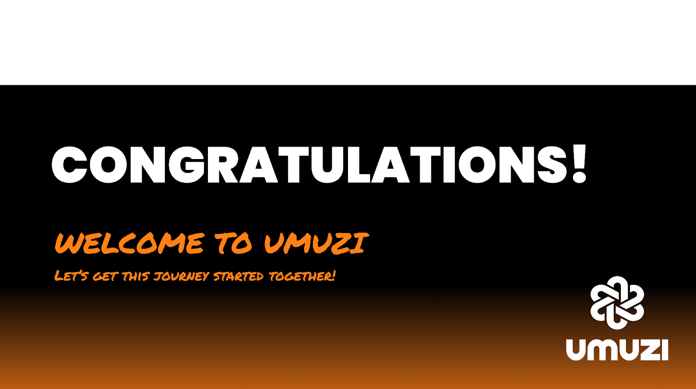

## Who are we and what do we do?

At the heart of Umuzi is our energy, our commitment and passion to reduce social inequality in Africa through digital education. We are excited about what we do, who we work with and the value we are adding on a daily basis. We do this with warmth, empathy, and dynamism. We are a bold, daring and exciting organisation, creating meaning through sharing our energy - it’s contagious!

Through our energy we create connection with individuals that enables a shift to occur, causing a ripple effect, creating communities. This ripple effect has an impact on the people we meet, we work with, partner with, and then their families and friends, not just in the present, but in the future too. 

The people that move through our programmes are at the heart of what we do at Umuzi. It is their journeys and stories that drive us to continue on this mission.

Join us in being part of this movement!

**ENERGY, CONNECTION, IMPACT**

## Now for a little bit of admin before we move forward!

Have you completed the below pre-onboarding task list?
**If not**, check your first email from us for the links you need to complete the required forms and upload the documents requested.
**Complete this task before moving on to the next card.**

- [ ] Payroll Info form
- [ ] Certified Documents uploaded
- [ ] Baseline Survey
- [ ] Joined Whatsapp group