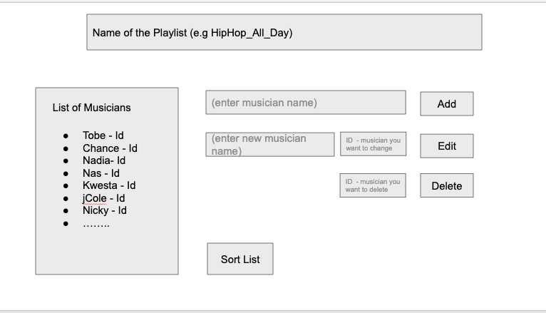

### Instructions

You are required to create an API which will allow you to create a Playlist of your favorite musicians and their songs
This should run on a node server at PORT 3090

#### Section 1

This API should do the following

1. Add A new musician to the list
2. Edit an existing musician
3. Delete an existing musician from the list
4. List all the musicians on the Playlist
5. Sort the musicians alphabetically using query parameters(this will require a middleware in express)
   You have two choices as to where you can store these details
   option1: Use a JSON file to store the data
   option2: Use a database to store the data

#### Section 2

In the same project folder you should:

1. Create a front-end(html page only - you will automatically fail if you use frameworks like Angular/React/Vue)
   the front-end should consume this API and it should look like the image attached
2. Test the API using jasmine and Request see examples here https://www.thepolyglotdeveloper.com/2017/08/unit-testing-node-js-application-jasmine-testing-framework/

#### If this is TOO fun (Optional)

- Add an ability to Add/delete/list songs associated to each musician
- Add that to a new page, a route in the frontend which goes to localhost:3090/songs/:id

