## Task 1: Create the AboutMe Project

1 - Open Android Studio, if it's not already open.

2 - If a project is already open in Android Studio, select File > New > New Project.

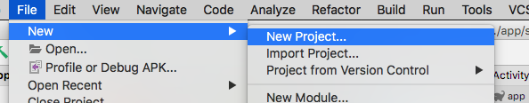

3 - If a project is not already open, select + Start a new Android Studio project in the Welcome to Android Studio dialog.

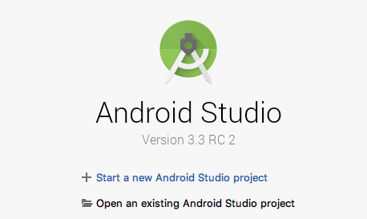

4 - In the Create New Project dialog, in the Phone and Tablet tab, select the Empty Activity template. Click Next.

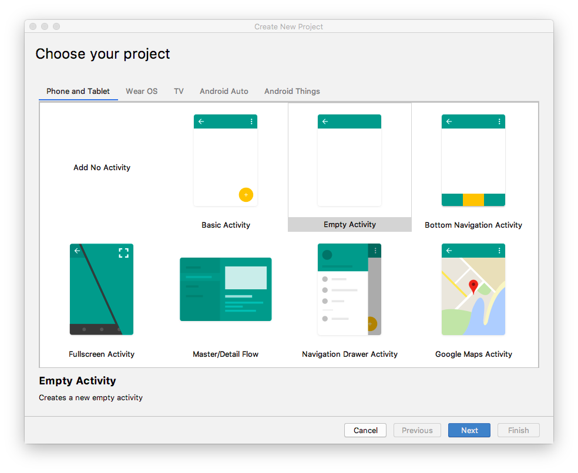

5 - In the next Create New Project dialog, set the following parameters and click Finish.

Use this details below as a guideline and not the actual data for your settings:
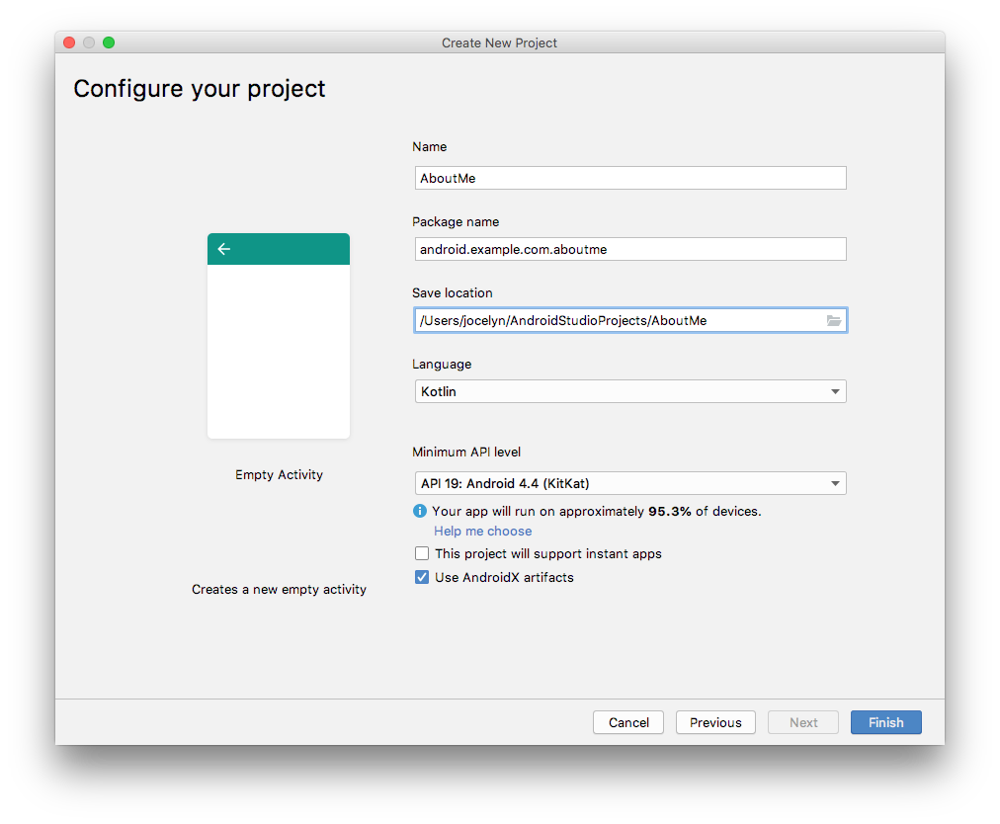

Android Studio will take a moment to generate the project files.

6 - Run your app. You will see the string "Hello World" on the blank screen

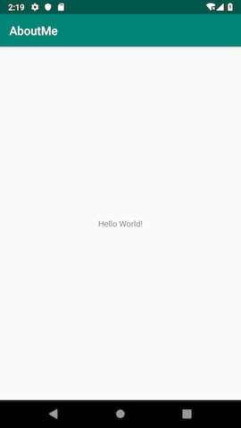

The Empty Activity template creates a single empty activity, Mainactivity.kt. The template also creates a layout file called activity_main.xml. The layout file has ConstraintLayout as its root ViewGroup, and it has a single TextView as its content.

## Task 2 : Change the root layout to use LinearLayout\

In this task, you change the generated root ViewGroup to a LinearLayout. You also arrange the UI elements vertically.

View groups
A ViewGroup is a view that can contain child views, which are other views and view groups. Views that make up a layout are organized as a hierarchy of views with a view group as the root.

In a LinearLayout view group, the UI elements are arranged either horizontally or vertically.

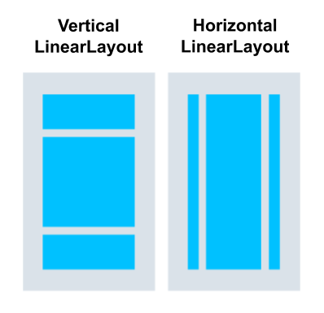

Change the root layout so that it uses a LinearLayout view group:

1.  Select the Project > Android pane. In the app/res/layout folder, open the activity_main.xml file.
2.  Select the Text tab and change the root view group from ConstraintLayout to LinearLayout.
3.  Remove the TextView. In the LinearLayout element, add the android:orientation attribute and set it to vertical.

Before:

```
<androidx.constraintlayout.widget.ConstraintLayout xmlns:android="http://schemas.android.com/apk/res/android"
   xmlns:app="http://schemas.android.com/apk/res-auto"
   xmlns:tools="http://schemas.android.com/tools"
   android:layout_width="match_parent"
   android:layout_height="match_parent"
   tools:context=".MainActivity">

   <TextView
       android:layout_width="wrap_content"
       android:layout_height="wrap_content"
       android:text="Hello World!"
       app:layout_constraintBottom_toBottomOf="parent"
       app:layout_constraintLeft_toLeftOf="parent"
       app:layout_constraintRight_toRightOf="parent"
       app:layout_constraintTop_toTopOf="parent" />

</androidx.constraintlayout.widget.ConstraintLayout>
After:

<LinearLayout
       xmlns:android="http://schemas.android.com/apk/res/android"
       xmlns:tools="http://schemas.android.com/tools"
       xmlns:app="http://schemas.android.com/apk/res-auto"
       android:layout_width="match_parent"
       android:layout_height="match_parent"
       android:orientation="vertical"
       tools:context=".MainActivity">

</LinearLayout>
Back
```

After:

```
<LinearLayout
       xmlns:android="http://schemas.android.com/apk/res/android"
       xmlns:tools="http://schemas.android.com/tools"
       xmlns:app="http://schemas.android.com/apk/res-auto"
       android:layout_width="match_parent"
       android:layout_height="match_parent"
       android:orientation="vertical"
       tools:context=".MainActivity">

</LinearLayout>
```

## Task 3 : Add a TextView using Layout Editor

The Layout Editor is a visual-design tool inside Android Studio. Instead of writing XML code by hand to build your app's layout, you can use the Layout Editor to drag UI elements into the design editor.

To see the Layout Editor, click the Design tab. The screenshot below shows the parts of the Layout Editor.

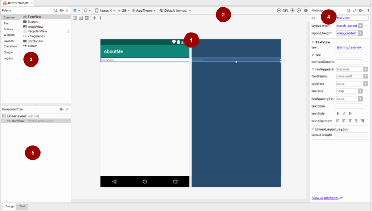

#### Key

1 - **Design editor:** Displays a visual representation of your screen layout in design view, blueprint view, or both. The design editor is the main part of the Layout Editor.

2 - **Toolbar:** Provides buttons to configure your layout's appearance in the design editor, and to change some layout attributes. For example, to change the display of your layout in the design editor, use the Select Design Surface drop-down menu:

- Use **Design** for a real-world preview of your layout.
- Use **Blueprint** to see only outlines for each view.
- Use **Design** + Blueprint to see both displays side by side.

3 - **Palette:** Provides a list of views and view groups that you can drag into your layout or into the Component Tree pane.

4 - **Attributes:** Shows attributes for the currently selected view or view group. To toggle between a complete list of attributes and commonly used attributes, use the icon at the top of the pane.

5 - **Component Tree:** Displays the layout hierarchy as a tree of views. The Component Tree is useful when you have small, hidden, or overlapping views that you could not otherwise select in the design editor.

#### Step 1: Add a TextView

1 - Open the `res/layout/activity_main.xml` file, if it's not already open.

2 - Switch to the **Text** tab 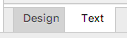 and inspect the code. The code has a `LinearLayout` as its root view group. (View groups are views that contain other views.)

The `LinearLayout` has the required attributes `layout_height`, `layout_width`, and `orientation`, which is `vertical` by default.

3 - Switch to the **Design** tab to open the Layout Editor.

**\*Note:** The **Design** tab and the **Text** tab shows the same layout, just in a different way. Changes you make in one tab are reflected in the other.\*

4 - Drag a text view from the **Palette** pane onto the design editor.

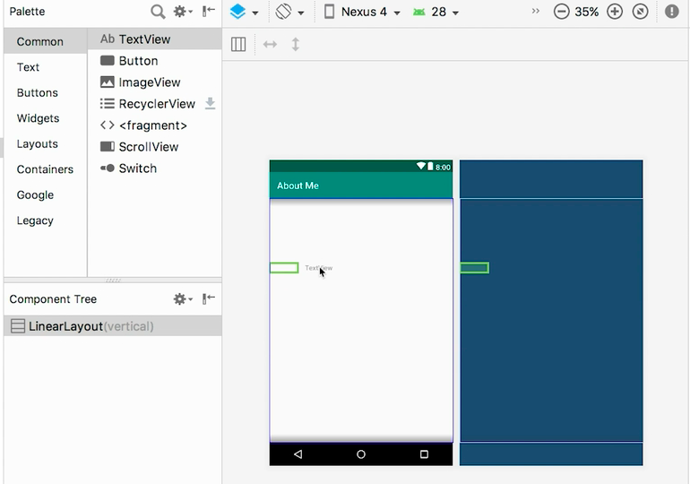

5 - Notice the **Component Tree** pane. The new text view is placed as a child element of the parent view group, which is the `LinearLayout`.

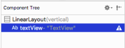

6 - Open the **Attributes** pane, if it's not open already. (To open the pane, double-click the newly added `TextView` in the design editor.)

7 - Set the following attributes in the `Attributes` pane:

| **Attribute**                  | **Value**                                                                                                                                                                                                     |
| ------------------------------ | ------------------------------------------------------------------------------------------------------------------------------------------------------------------------------------------------------------- |
| ID                             | name_text                                                                                                                                                                                                     |
| text                           | Set it to your name. (One of the text fields shows a wrench icon to indicate that it's for the `tools` namespace. The one without the wrench is for the `android` namespace—this is the text field you want.) |
| textAppearance > textSize      | 20sp                                                                                                                                                                                                          |
| textAppearance > textColor     | @android:color/black                                                                                                                                                                                          |
| textAppearance > textAlignment | Center                                                                                                                                                                                              |

### Step 2: Create a string resource

In the **Component Tree**, next to the `TextView`, you will notice a warning icon 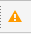 . To see the warning text, click the icon or point to it, as shown in the screenshot below.

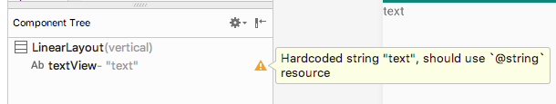

To resolve the warning, create a string resource:

1 - In the **Attributes** pane, click the three dots next to the **text** attribute that you set to your name. The resource editor opens.

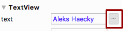

2 - In the **Resources** dialog, select **Add new resource > New string Value**.

3 - In the **New String Value Resource** dialog, set the **Resource name** field to `name`. Set the **Resource value** field to your own name. Click **OK**. Notice that the warning is gone.

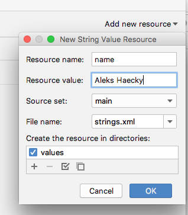

4 - Open the `res/values/strings.xml` file and look for the newly created string resource called `name`.

```
<string name="name">Aleks Haecky</string>
```

### Step 3: Create a dimension resource

You just added a resource using the resource editor. You can also extract resources in the XML code editor to create new resources:

1. In the `activity_main.xml` file, switch to the \*_Text_ tab.

2. On the `textSize` line, click on the number (`20sp`) and type `Alt+Enter` (`Option+Enter` on a Mac). Select **Extract dimension** resource from the popup menu.

3. In the **Extract Resource** dialog, enter `text_size` in the **Resource name** field. Click **OK**.

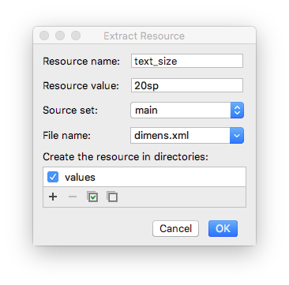

4 - Open the `res/values/dimens.xml` file to see the following generated code:

```
<dimen name="text_size">20sp</dimen>
```

_Note: If the dimens.xml file was not already present inside your res/values folder, Android Studio creates it._

5 - Open `MainActivity.kt` file, and look for the following code at the end of the `onCreate()` function:

```
setContentView(R.layout.activity_main)
```

The `setContentView()` function connects the layout file with the `Activity`. The specified layout resource file is `R.layout.activity_main`:

- `R` is a reference to the resource. It is an auto-generated class with definitions for all the resources in your app.

- `layout.activity_main` indicates that the resource is a layout named `activity_main`.

6 - Run your app. A `TextView` with your name is displayed.

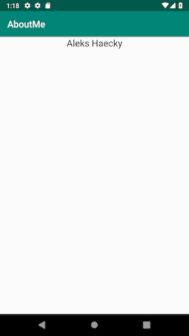

## Task 4 : Style your TextView

When you look at your app screen, your name is pushed up against the top of the screen, so now you add padding and a margin.

### Padding versus margin

**Padding** is the space inside the boundaries of a view or element. It is the space between the edges of the view and the view's content, as shown in the figure below.

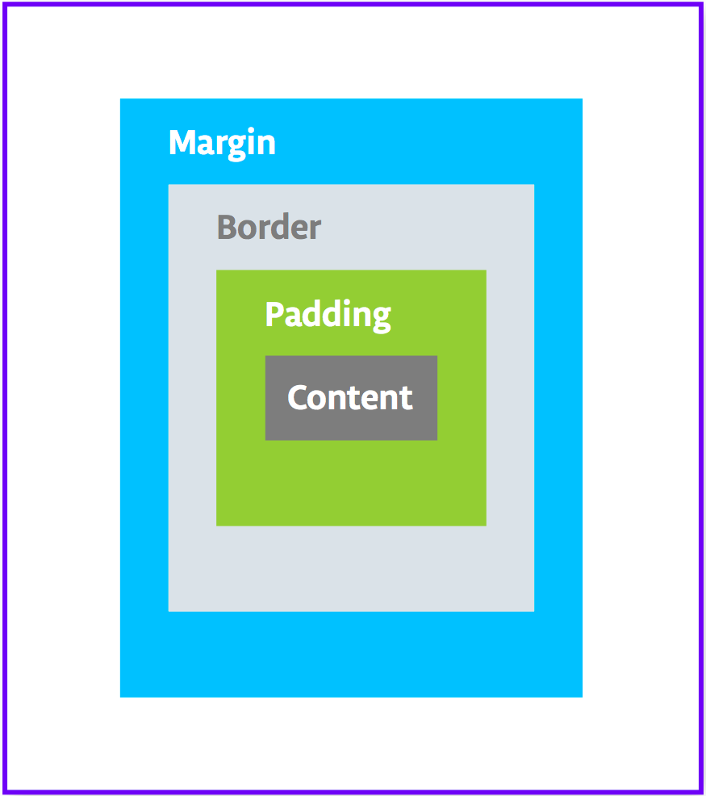

A view's size includes its padding. The following are commonly used padding attributes:

- **android:padding** specifies padding for all four edges of the view.
- **android:paddingTop** specifies padding for the top edge.
- **android:paddingBottom** specifies padding for the bottom edge.
- **android:paddingStart** specifies padding for the "starting" edge of the view.
- **android:paddingEnd** specifies padding for the "ending" edge of the view.
- **android:paddingLeft** specifies padding for the left edge.
- **android:paddingRight** specifies padding for the right edge.

**Margin** is the space added outside of the view's borders. It is the space from the edge of the view to its parent, as shown in the figure above. The following are commonly used margin attributes:

- **android:layout_margin** specifies a margin for all four sides of the view.
- **android:layout_marginBottom** specifies space outside the bottom side of this view.
- **android:layout_marginStart** specifies space outside the "starting" side of this view.
- **android:layout_marginEnd** specifies space on the end side of this view.
- **android:layout_marginLeft** specifies space on the left side of this view.
- **android:layout_marginRight** specifies space on the right side of this view.

```
Right/left versus start/end

"Right" and "left" always refer to the right and left sides of the screen, whether your app uses a left-to-right (LTR) flow or a right-to-left (RTL) flow. "Start" and "end" always refer to the start and end of the flow:

For a LTR flow, start = left and end=right.
For a RTL flow, start=right and end=left.
If your app targets API level 17 (Android 4.2) or higher:

Use "start" and "end" instead of "left" and "right".
For example, android:layout_marginLeft should become android:layout_marginStart to support RTL languages.
If you want your app to work with versions lower than Android 4.2; that is, if the app's targetSdkVersion or minSdkVersion is 16 or lower:

Add "start" and end" in addition to "left" and "right".
For example, use both android:paddingLeft and android:paddingStart.
```

### Step 1: Add padding

To put space between your `name` and the top edge of the name text view, add top padding.

1. Open `activity_main.xml` file in the **Design** tab.

2. In the **Component Tree** or in the design editor, click the text view to open its **Attributes** pane.

3. At the top of the **Attributes** pane, click the double-arrow 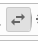 icon to see all the available attributes.

4. Search for **Padding**, expand it, and click the three dots ... next to the **top** attribute. The **Resources** dialog appears.

5. In the **Resources** dialog, select **Add new resource > New dimen Value**.

6. In the **New Dimension Value Resource** dialog, create a new `dimen` resource called `small_padding` with a value of `8dp`.

The _dp_ abbreviation stands for _density-independent_. If you want a UI element to look the same size on screens with different densities, use dp as your unit of measurement. When specifying text size, however, always use sp (scalable pixels).
Click **OK**.

### Step 2: Add a margin

To move the `name` text view away from the edge of the parent element, add a top margin.

In the **Attributes** pane, search for "margin" to find **Layout_Margin**.

Expand **Layout_Margin**, and click the three dots ... next to the **top** attribute.

Create a new `dimen` resource called `layout_margin` and make it `16dp`. Click **OK**.

### Step 3: Add a font

To make the `name` text view look better, use the Android Roboto font. This font is part of the support library, and you add the font as a resource.

1. In the **Attributes** pane, search for "fontFamily".

2. In the **fontFamily** field, click the drop-down arrow, scroll to the bottom of the list, and select **More Fonts**.

3. In the **Resources** dialog, search for `rob` and choose Roboto. In the **Preview** list, **select Regular**.

4. Select the **Add font to project** radio button.

5. Click **OK**.


The `res` folder now has a `font` folder that contains a `roboto.ttf` font file. The `@font/roboto` attribute is added to your `TextView`.

### Step 4: Extract the style

A _style_ is a collection of attributes that specify the appearance and format for a view. A style can include font color, font size, background color, padding, margin, and other common attributes.

You can extract the `name` text view's formatting into a style and reuse the style for any number of views in your app. Reusing a style gives your app a consistent look when you have multiple views. Using styles also allows you to keep these common attributes in one location.

1 - Right-click the `TextView` in the `Component Tree` and select `Refactor > Extract Style`.

2 - In the **Extract Android Style** dialog, clear the `layout_width` checkbox, the `layout_height` checkbox, and the `textAlignment` checkbox. These attributes are usually different for each view, so you don't want them to be part of the style.

3 - In the **Style name** field, enter `NameStyle`.

4 - Click **OK**.

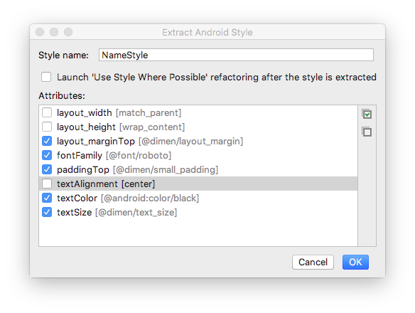

5 - A style is also a resource, so the style is saved in the `res/values/` folder in a `styles.xml` file. Open `styles.xml` and examine the generated code for the `NameStyle` style, which will look similar to this:

```
<style name="NameStyle">
   <item name="android:layout_marginTop">@dimen/layout_margin</item>
   <item name="android:fontFamily">@font/roboto</item>
   <item name="android:paddingTop">@dimen/small_padding</item>
   <item name="android:textColor">@android:color/black</item>
   <item name="android:textSize">@dimen/text_size</item>
</style>
```

6 - Open `activity_main.xml` and switch to the **Text tab**. Notice that the generated style is being used in the text view as `style="@style/NameStyle"`.

7 - Run the app and notice the changes in the font and the padding around your `TextView`.

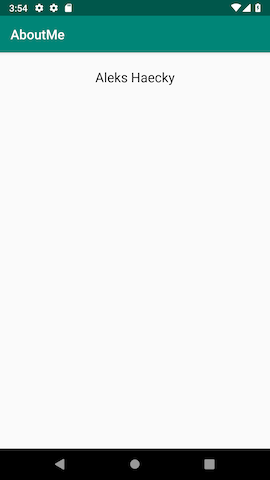

Task 5 : Add an ImageView

Most real-world Android apps consist of a combination of views to display images, display text, and accept input from the user in the form of text or click events. In this task, you add a view to display an image.

An **ImageView** is a view for displaying image resources. For example, an `ImageView` can display **Bitmap** resources such as PNG, JPG, GIF, or WebP files, or it can display a **Drawable** resource such as a vector drawing.

There are image resources that come with Android, such as sample icons, avatars, and backgrounds. You will add one of these resources to your app.

1 - Display the layout file In the **Design** tab, then drag an **ImageView** from the **Palette** pane to below `name_text` in the **Component Tree**. The **Resources** dialog opens.

2 - Select **Drawable** if it's not already selected.

3 - Expand **android**, scroll, and select **btn_star_big_on**. It's the yellow star 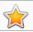.

4 - Click OK.


The star image is added to the layout below your name. Because you have a vertical `LinearLayout`, views you add are vertically aligned.

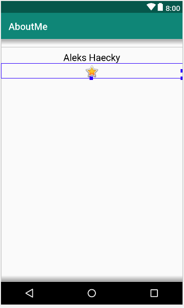

5 - Switch to the **Text tab** and look at the generated `ImageView` code. The width is set to `match_parent`, so the view will be as wide as its parent element. The height is set to `wrap_content`, so the view will be as tall as its content. The `ImageView` references the `btn_star_big_on` drawable.

```
<ImageView
   android:id="@+id/imageView"
   android:layout_width="match_parent"
   android:layout_height="wrap_content"
   app:srcCompat="@android:drawable/btn_star_big_on" />
```

8 - To rename the id of the `ImageView`, right-click on **"@+id/imageView"** and select **Refactor > Rename**.

7 - In the **Rename** dialog, set the `id` to `@+id/star_image`. Click **Refactor**.

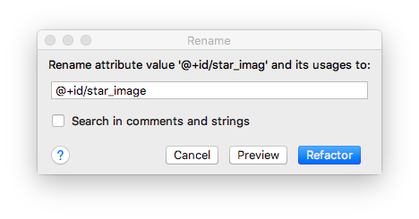

_Tip: Refactor > Rename renames all the occurrences of an attribute or variable name in your app project._

8 - In the **Design** tab, in the **Component Tree**, click the warning icon  next to `star_image`. The warning is for a missing `contentDescription`, which screen readers use to describe images to the user.

9 - In the **Attributes** pane, click the three dots ... next to the `contentDescription` attribute. The **Resources** dialog opens.

10 - In the **Resources** dialog, select **Add new resource > New string Value**. Set the **Resource name** field to `yellow_star`, and set the **Resource value** field to `Yellow star`. Click **OK**.

11 - Use the **Attributes** pane to add a top margin of **16dp** (which is `@dimen/layout_margin`) to the `yellow_star`, to separate the star image from the name.

12 - Run your app. Your name and the star image are displayed in your app's UI.


## Task 5 : Add a ScrollView

A **ScrollView** is a view group that allows the view hierarchy placed within it to be scrolled. A scroll view can contain only one other view, or view group, as a child. The child view is commonly a `LinearLayout`. Inside a `LinearLayout`, you can add other views.

The following image shows an example of a `ScrollView` that contains a `LinearLayout` that contains several other views.

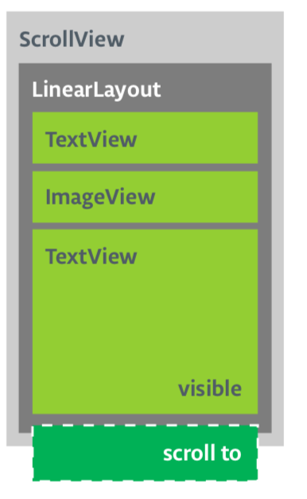

In this task, you will add a `ScrollView` that allows the user to scroll a text view that displays a brief biography. If you are only making one view scrollable, you can put the view directly into the `ScrollView`, which is what you do in this task.

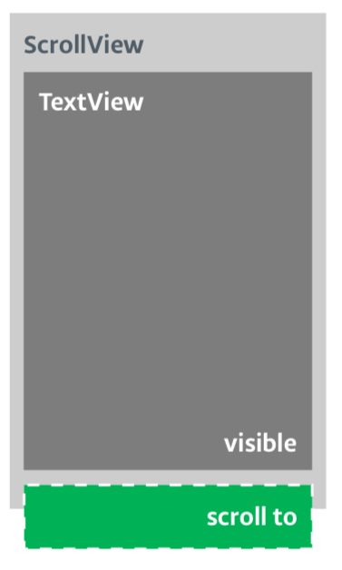

### Step 1: Add a ScrollView that contains a TextView

1 - Open the `activity_main.xml` file in the **Design** tab.

2 - Drag a scroll view into the layout by dragging it into the design editor, or into the **Component Tree**. Put the scroll view below the star image.

3 - Switch to the **Text** tab to inspect the generated code.

```
// Auto generated code
<ScrollView
   android:layout_width="match_parent"
   android:layout_height="match_parent">

   <LinearLayout
       android:layout_width="match_parent"
       android:layout_height="wrap_content"
       android:orientation="vertical" />
</ScrollView>
```

The height and width of the `ScrollView` match the parent element. Once the `name_text` text view and the `star_image` image view have used enough vertical space to display their contents, the Android system lays out the `ScrollView` to fill the rest of the available space on the screen.

4 - Add an id to the `ScrollView` and call it `bio_scroll`. Adding an id to the `ScrollView` gives the Android system a handle for the view so that when the user rotates the device, the system preserves the scroll position.

5 - Inside the `ScrollView`, remove the `LinearLayout` code, because your app will only have one view that's scrollable—a `TextView`.

6 - Drag a `TextView` from the **Palette** to the **Component Tree**. Put the `TextView` under the `bio_scroll`, as a child element of `bio_scroll`.

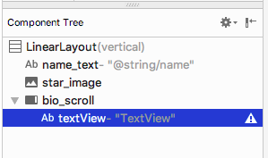

7 - Set the **id** of the new text view to `bio_text`.

8 - Next you add a style for the new text view. In the **Attributes** pane, click the three dots ... next to the **style** attribute to open the **Resources** dialog.

9 - In the **Resources** dialog, search for `NameStyle`. Select `NameStyle` from the `list`, and click **OK**. The text view now uses the `NameStyle` style, which you created in a prior task.

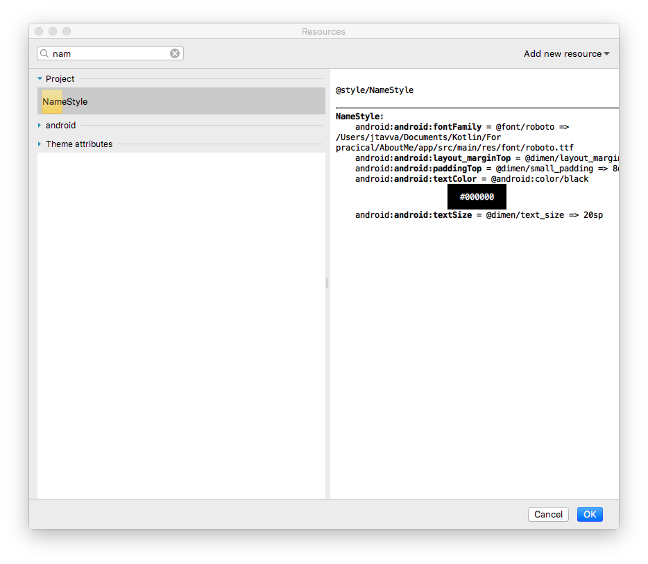

### Step 2: Add your biography to the new TextView

Open `strings.xml`, create a string resource called `bio`, and put in some long text about yourself, or about anything that you want.

_Use \n to indicate a line break.
If you use an apostrophe, you must escape it with a backslash. For example:
"You mustn\'t forget the backslash."
For bold text use <b>...</b>, and for italicized text use <i>...</i>. For example:
"This text is <b>bold</b> and this text is <i>italics</i>."_

Here is a sample biography:

```
<string name="bio">Hi, my name is Aleks.
\n\nI love fish.
\n\nThe kind that is alive and swims around in an aquarium or river, or a lake, and definitely the ocean.
\nFun fact is that I have several aquariums and also a river.
\n\nI like eating fish, too. Raw fish. Grilled fish. Smoked fish. Poached fish - not so much.
\nAnd sometimes I even go fishing.
\nAnd even less sometimes, I actually catch something.
\n\nOnce, when I was camping in Canada, and very hungry, I even caught a large salmon with my hands.
\n\nI\'ll be happy to teach you how to make your own aquarium.
\nYou should ask someone else about fishing, though.\n\n</string>
```

2 - In the `bio_text` text view, set the value of the `text` attribute to the `bio` string resource that contains your biography.

3 - To make the `bio_text` text easier to read, add spacing between the lines. Use the **lineSpacingMultiplier** attribute, and give it a value of 1.2.

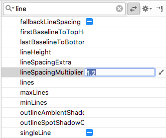

Notice how in the design editor, the **bio** text runs all the way to the side edges of the screen. To fix this problem, you can add left, start, right, and end padding attributes to the root `LinearLayout`. You do not need to add bottom padding, because text that runs right up to the bottom signals to the user that the text is scrollable.

4 - Add start and end padding of `16dp` to the root `LinearLayout`.

5 - Switch to the **Text** tab, extract the dimension resource, and name it `layout_padding`.

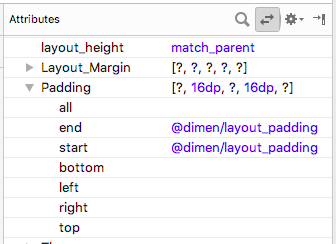

_Note: Starting from API level 17, use "start" and "end" instead of "left" and "right" for padding and margin to adapt your app for RTL languages like Arabic._

6 - Run your app and scroll through the text.


## Congratulations!

## You have created a complete app from scratch, and it looks great!