## App overview

In this project, you extend the AboutMe app to add user interaction.
You add a nickname field, a DONE button, and a text view to display the nickname.
Once the user enters a nickname and taps the DONE button, the text view updates to show the entered nickname. The user can update the nickname again by tapping the text view.

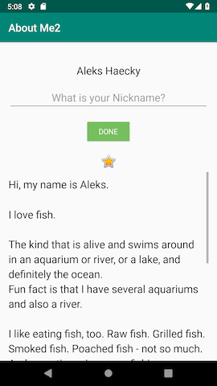 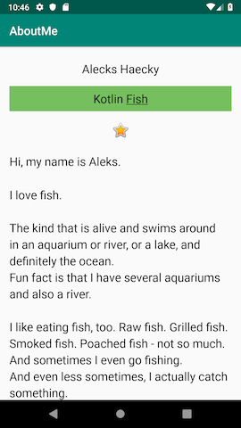

## Task : Add an EditText for text input

In this task, you add an EditText input field to allow the user to enter a nickname.
This you need to do to with a clone of your previous project 'About Me'.

Apps are more interesting if the user can interact with the app, for example if the user can enter text. To accept text input, Android provides a user interface (UI) widget called an edit text. You define an edit text using EditText, a subclass of TextView. An edit text allows the user to enter and modify text input, as shown in the screenshot below.

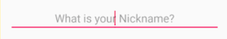

### Step 1 : Add an EditText

In Android Studio, open the activity_main.xml layout file in the Design tab.
In the Palette pane, click Text.

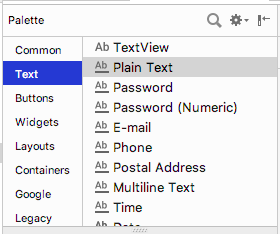

Ab TextView, which is a `TextView`, shows at the top of the list of text elements in the Palette pane. Below Ab TextView are multiple `EditText` views.

In the Palette pane, notice how the icon for `TextView` shows the letters Ab with no underscoring. The `EditText` icons, however, show Ab underscored. The underscoring indicates that the view is editable.

For each of the `EditText` views, Android sets different attributes, and the system displays the appropriate soft input method (such as an on-screen keyboard).
Drag a PlainText edit text into the Component Tree and place it below the `name_text` and above the `star_image`.

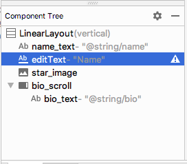

Use the Attributes pane to set the following attributes on the EditText view.

| Attribute     | Value                  |
| ------------- | ---------------------- |
| id            | nickname_edit          |
| layout_width  | match_parent (default) |
| layout_height | wrap_content (default) |

Run your app. Above the star image, you see an edit text with default text "Name".

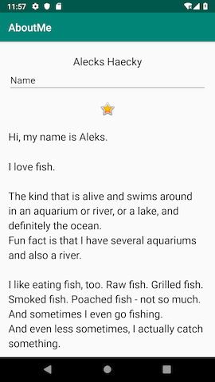

## Task: Style your EditText

In this task, you style your EditText view by adding a hint, changing the text alignment, changing the style to the NameStyle, and setting the input type.

### Step 1: Add hint text

1 - Add a new string resource for the hint in the string.xml file.

```
<string name="what_is_your_nickname">What is your Nickname?</string>
```

`Tip: It's a good practice to show a hint in each EditText view to help users figure out what input is expected for editable fields.`

2 - Use the Attributes pane to set the following attributes to the EditText view:

| Attribute     | Value                         |
| ------------- | ----------------------------- |
| style         | NameStyle                     |
| textAlignment | (center)                      |
| hint          | @string/what_is_your_nickname |

3 - In the Attributes pane, remove the Name value from the text attribute. The text attribute value needs to be empty so that the hint is displayed.

### Step 2 : Set the inputType attribute

The `inputType` attribute specifies the type of input users can enter in the `EditText` view. The Android system displays the appropriate input field and on-screen keyboard, depending on the input type set.

To see all the possible input types, in the Attributes pane, click the `inputType` field, or click the three dots ... next to the field. A list opens that shows all the types of input you can use, with the currently active input type checked. You can select more than one input type.

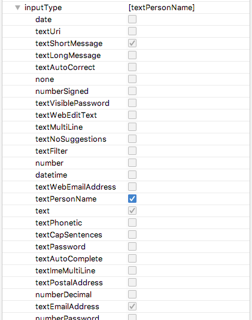

For example, for passwords, use the `textPassword` value. The text field hides the user's input.

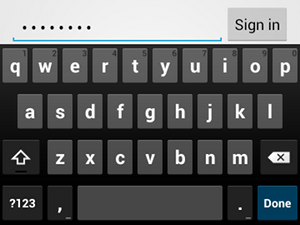

For phone numbers, use the `phone` value. A number keypad is displayed, and the user can enter only numbers.

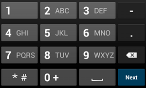

Set the input type for the nickname field:

1 - Set the `inputType` attribute to `textPersonName` for the `nickname_edit` edit text.

2 - In the **Component Tree** pane, notice an `autoFillHints` warning. This warning does not apply to this app and is beyond the scope of this project, so you can ignore it.

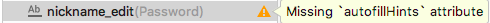

3 - In the Attributes pane, verify the values for the following attributes of the EditText view:

| Attribute     | Value                           |
| ------------- | ------------------------------- |
| id            | nickname_edit                   |
| layout_width  | match_parent (default)          |
| layout_height | wrap_content (default)          |
| style         | @style/NameStyle                |
| inputType     | textPersonName                  |
| hint          | "@string/what_is_your_nickname" |
| text          | (empty)                         |

## Task: Add a button and style it.

A `Button` is a UI element that the user can tap to perform an action. A button can consist of text, an icon, or both text and an icon.

  

In this task, you add a DONE button, which the user taps after they enter a nickname. The button swaps the `EditText` view with a `TextView` view that displays the nickname. To update the nickname, the user can tap the `TextView` view.

### Step 1: Add a DONE button

1 - Drag a button from the Palette pane into the Component Tree. Place the button below the `nickname_edit` edit text.

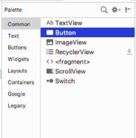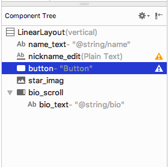

2 - Create a new string resource named `done`. Give the string a value of `Done`,

`<string name="done">Done</string>`

3 - Use the Attributes pane to set the following attributes on the newly added Button view:

| Attribute      | Value             |
| -------------- | ----------------- |
| id             | done_button       |
| text           | @string/done      |
| layout_gravity | center_horizontal |
| layout_width   | wrap_content      |

The `layout_gravity` attribute centers the view in its parent layout, `LinearLayout`.

4 - Change the style to `Widget.AppCompat.Button.Colored`, which is one of the predefined styles that Android provides. You can select the style from either the drop-down or from the Resources window.

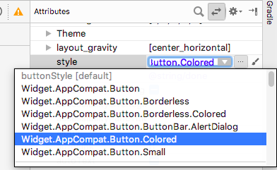

This style changes the button color to the accent color, colorAccent. The accent color is defined in the `res/values/colors.xml` file.

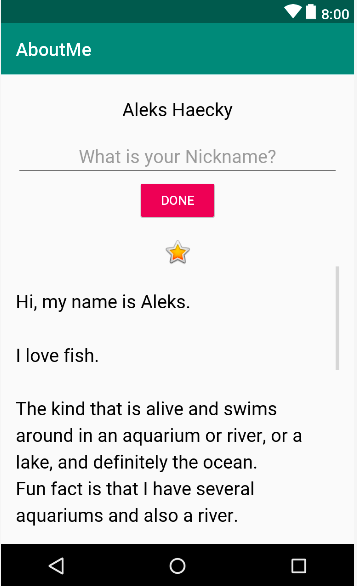

The `colors.xml` file contains the default colors for your app. You can add new color resources or change the existing color resources in your project, based on your app's requirements.

Sample `colors.xml` file:

```
<?xml version="1.0" encoding="utf-8"?>
  <resources>
     <color name="colorPrimary">#008577</color>
     <color name="colorPrimaryDark">#00574B</color>
     <color name="colorAccent">#D81B60</color>
  </resources>
```

### Step 2: Style the DONE button

1 - In the Attributes pane, add a top margin by selecting `Layout_Margin` > Top. Set the top margin to layout_margin, which is defined in the `dimens.xml` file.

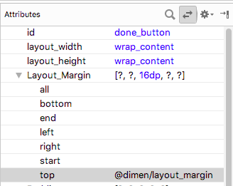

2 - Set the fontFamily attribute to roboto from the drop-down menu.


3 - Switch to the Text tab and verify the generated XML code for the newly added button.

```
<Button
   android:id="@+id/done_button"
   style="@style/Widget.AppCompat.Button.Colored"
   android:layout_width="wrap_content"
   android:layout_height="wrap_content"
   android:layout_gravity="center_horizontal"
   android:layout_marginTop="@dimen/layout_margin"
   android:fontFamily="@font/roboto"
   android:text="@string/done" />
```

### Step 3: Change the color resource

In this step, you change the button's accent color to match your activity's app bar.

1 - Open `res/values/colors.xml` and change the value of the `colorAccent` to `#76bf5e`.

`<color name="colorAccent">#76bf5e</color>`

You can see the color corresponding to the HEX code, in the left margin of the file editor.

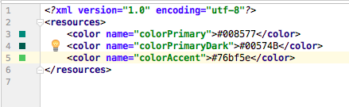

Notice the change in the button color in the design editor.

2 - Run your app. You should see a styled DONE button below the edit text.

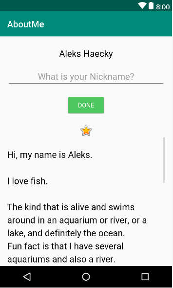

## Task: Add a TextView to display the nickname

After the user enters a nickname and taps the DONE button, the nickname displays in a `TextView` view. In this task, you add a text view with a colored background. The text view displays the user's nickname above the `star_image`.

### Step 1: Add a TextView for the nickname

Drag a text view from the Palette pane into the Component Tree. Place the text view below the `done_button` and above the `star_image`.


2 - Use the Attributes pane to set the following attributes for the new TextView view:

| Attribute     | Value         |
| ------------- | ------------- |
| id            | nickname_test |
| style         | NameStyle     |
| textAlignment | (center)      |

### Step 2: Change the visibility of the TextView

You can show or hide views in your app using the visibility attribute. This attribute takes one of three values:

- visible: The view is visible.
- Invisible: Hides the view, but the view still takes up space in the layout.
- gone: Hides the view, and the view does not take up any space in the layout.

1 - In the Attributes pane, set the visibility of the nickname_text text view to gone, because you don't want your app to show this text view at first.

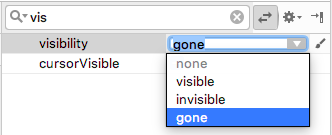

Notice that as you change the attribute in the Attributes pane, the nickname_text view disappears from the design editor. The view is hidden in the layout preview.

2 - Change the text attribute value of the nickname_text view to an empty string.

Your generated XML code for this TextView should look similar to this:

```
<TextView
   android:id="@+id/nickname_text"
   style="@style/NameStyle"
   android:layout_width="match_parent"
   android:layout_height="wrap_content"
   android:textAlignment="center"
   android:visibility="gone"
   android:text="" />
```

Your layout preview should look something like the following:

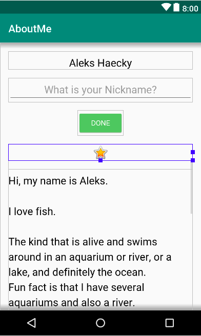

## Task: Add a click listener to the DONE button

A click handler on the `Button` object (or on any view) specifies the action to be performed when the button (view) is tapped. The function that handles the click event should be implemented in the `Activity` that hosts the layout with the button (view).

The click listener has generically this format, where the passed in view is the view that received the click or tap.

```
private fun clickHandlerFunction(viewThatIsClicked: View) {
// Add code to perform the button click event
}
```

ou can attach the click-listener function to button click events two ways:

In the XML layout, you can add the `android:onClick` attribute to the `<Button>`element. For example:

```
<Button
      android:id="@+id/done_button"
      android:text="@string/done"
      ...
      android:onClick="clickHandlerFunction"/>
```

OR

You can do it programmatically at runtime, in `onCreate()` of the `Activity`, by calling `setOnClickListener`. For example:

```
myButton.setOnClickListener {
   clickHanderFunction(it)
}
```

In this task, you add a click listener for the `done_button` programmatically. You add the click listener in the corresponding activity, which is `MainActivity.kt`.

Your click-listener function, called `addNickname`, will do the following:

Get the text from the `nickname_edit` edit text.
Set the text in the `nickname_text` text view.
Hide the edit text and the button.
Display the nickname `TextView`.

### Step 1: Add a click listener

1 - In Android Studio, in the java folder, open the `MainActivity.kt` file.

2 - In `MainActivity.kt`, inside the `MainActivity` class, add a function called `addNickname`. Include an input parameter called `view` of type View. The `view` parameter is the `View` on which the function is called. In this case, view will be an instance of your DONE button.

```
private fun addNickname(view: View) {
 }
```

3 - Inside the `addNickname` function, use `findViewById()` to get a reference to the `nickname_edit` edit text and the `nickname_text` text view.

```
val editText = findViewById<EditText>(R.id.nickname_edit)
val nicknameTextView = findViewById<TextView>(R.id.nickname_text)
```

4 - Set the text in the `nicknameTextView` text view to the text that the user entered in the `editText`, getting it from the `text` property.

```
nicknameTextView.text = editText.text
```

5 - Hide the nickname `EditText` view by setting the `visibility` property of `editText` to `View.GONE`.

```
editText.visibility = View.GONE
```

6 - Hide the DONE button by setting the `visibility` property to `View.GONE.` You already have the button's reference as the function's input parameter, `view`.

```
   view.visibility = View.GONE
```

7 - At the end of the `addNickname` function, make the nickname `TextView` view visible by setting its `visibility` property to `View.VISIBLE`.

`nicknameTextView.visibility = View.VISIBLE`

### Step 2: Attach the click listener to the DONE Button

Now that you have a function that defines the action to be performed when the DONE button is tapped, you need to attach the function to the `Button` view.

1 - In `MainActivity.kt`, at the end of the `onCreate()` function, get a reference to the DONE Button view. Use the `findViewById()` function and call `setOnClickListener`. Pass in a reference to the click-listener function, `addNickname()`.

```
findViewById<Button>(R.id.done_button).setOnClickListener {
            addNickname(it)
        }
```

In the above code, `it` refers to the `done_button`, which is the view passed as the argument.

2 - Run your app, enter a nickname, and tap the DONE button. Notice how the edit text and the button are replaced by the nickname text view.

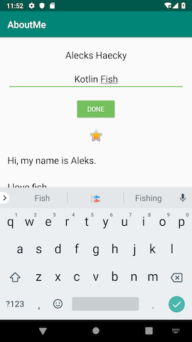 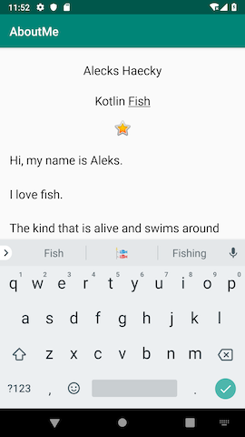

Notice that even after the user taps the DONE button, the keyboard is still visible. This behavior is the default.

### Step 3: Hide the keyboard

In this step, you add code to hide the keyboard after the user taps the DONE button.

1 - In `MainActivity.kt`, at the end of `addNickname()` function, add the following code. If you'd like more information on how this code works, see the `hideSoftInputFromWindow` documentation.

```
// Hide the keyboard.
val inputMethodManager = getSystemService(Context.INPUT_METHOD_SERVICE) as InputMethodManager
inputMethodManager.hideSoftInputFromWindow(view.windowToken, 0)
```

2 - Run your app again. Notice that after you tap DONE, the keyboard is hidden.

 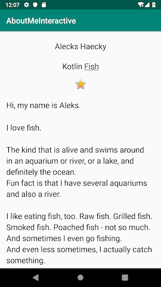

There's no way for the user to change the nickname after they tap the DONE button. In the next task, you make the app more interactive and add functionality so that the user can update the nickname.

## Task: Add a click listener to the nickname TextView

In this task, you add a click listener to the nickname text view. The click listener hides the nickname text view, shows the edit text, and shows the DONE button.

Step 1: Add a click listener

1 - In `MainActivity`, add a click-listener function called `updateNickname(view: View)` for the nickname text view.

```
private fun updateNickname (view: View) {
}
```

2 - Inside the `updateNickname` function, get a reference to the `nickname_edit` edit text, and get a reference to the DONE button. To do this, use the `findViewById()` method.

```
val editText = findViewById<EditText>(R.id.nickname_edit)
val doneButton = findViewById<Button>(R.id.done_button)
```

3 - At the end of the `updateNickname` function, add code to show the edit text, show the DONE button, and hide the text view.

```
editText.visibility = View.VISIBLE
doneButton.visibility = View.VISIBLE
view.visibility = View.GONE
```

4 - In `MainActivity.kt`, at the end of the `onCreate()` function, call `setOnClickListener` on the `nickname_text` text view. Pass in a reference to the click-listener function, which is `updateNickname()`.

```
findViewById<TextView>(R.id.nickname_text).setOnClickListener {
   updateNickname(it)
}
```

5 - Run your app. Enter a nickname, tap the DONE button, then tap the nickname `TextView` view. The nickname view disappears, and the edit text and the DONE button become visible.

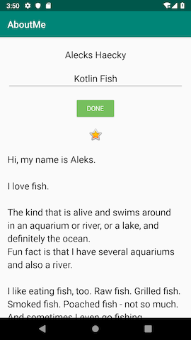

Notice that by default, the `EditText` view does not have focus and the keyboard is not visible. It's difficult for the user to figure out that the nickname text view is clickable. In the next task, you add focus and a style to the nickname text view.

### Step 2: Set the focus to the `EditText view and show the keyboard

1 - At the end of the `updateNickname` function, set the focus to the `EditText` view. Use the `requestFocus()` method.

```
// Set the focus to the edit text.
editText.requestFocus()
```

2 - At the end of the `updateNickname` function, add code to make the keyboard visible.

```
// Show the keyboard.
val imm = getSystemService(Context.INPUT_METHOD_SERVICE) as InputMethodManager
imm.showSoftInput(editText, 0)
```

### Step 3: Add a background color to the nickname TextView view

1 - Set the background color of the `nickname_text` text view to `@color/colorAccent`, and add a bottom padding of `@dimen/small_padding`. These changes will serve as a hint to the user that the nickname text view is clickable.

```
android:background="@color/colorAccent"
android:paddingBottom="@dimen/small_padding"
```

2 - Run your final app. The edit text has focus, the nickname is displayed in the edit text, and the nickname text view is styled.

 

Now go show your interactive AboutMe app to a friend!