## App overview

The ColorMyViews app is inspired by the Dutch artist, Piet Mondrian. He invented a style of painting style called neoplasticism, which uses only vertical and horizontal lines and rectangular shapes in black, white, gray, and primary colors.

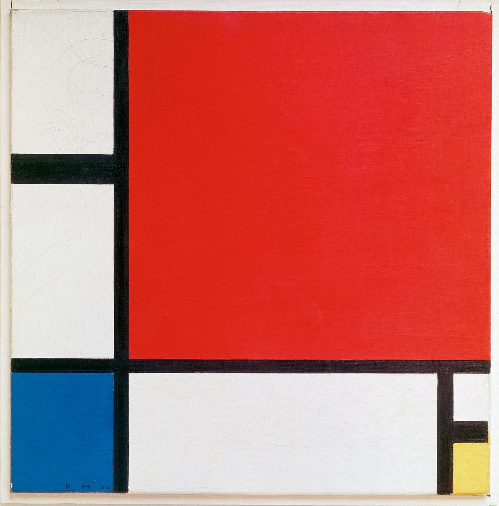

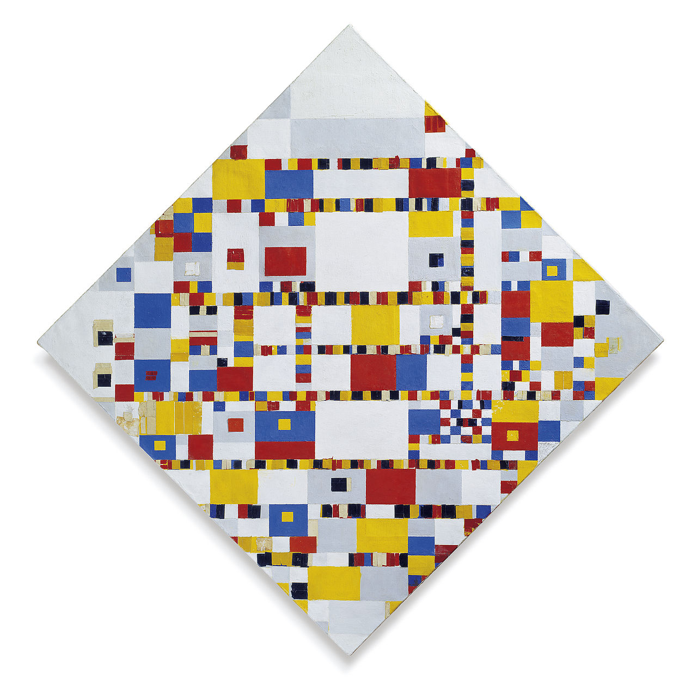

Although paintings are static, your app will be interactive! The app consists of clickable text views that change color when tapped, and button views in a `constraintLayout`.

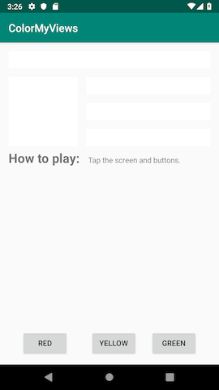

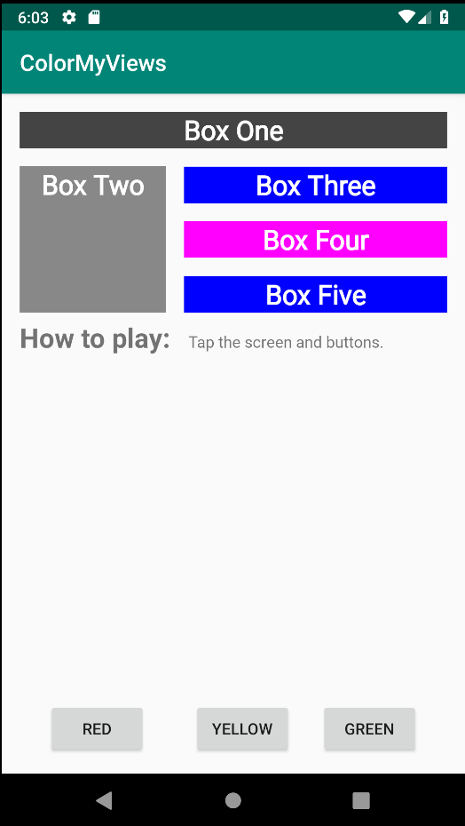


### ConstraintLayout

A `ConstraintLayout`t is a `ViewGroup` that allows you to position and size child views in a flexible way. A constraint layout allows you to create large, complex layouts with flat view hierarchies (no nested view groups). To build a constraint layout, you can use the Layout Editor to add constraints, and to drag-and-drop views. You don't need to edit the XML.

Note: `ConstraintLayout` is available as a support library, which is available in API level 9 and higher.

### Constraints

A `constraint` is a connection or alignment between two UI elements. Each constraint connects or aligns one view to another view, to the parent layout, or to an invisible guideline. In a constraint layout, you position a view by defining at least one horizontal and one vertical constraint.

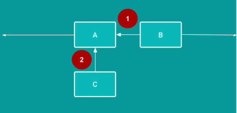

1 - Horizontal constraint: B is constrained to stay to the right of A. (In a finished app, B would need at least one vertical constraint in addition to this horizontal constraint.)

2 - Vertical constraint: C is constrained to stay below A. (In a finished app, C would need at least one horizontal constraint in addition to this vertical constraint.)

## Task: Create the ColorMyViews project

1 - Open Android Studio, if it's not already open, and create a new project with the following parameters:

| Attribute                              | Value                                                 |
| -------------------------------------- | ----------------------------------------------------- |
| Template                               | Empty Activity in the Phone and Tablet tab            |
| Application Name                       | ColorMyViews                                          |
| Company Name android                   | com.android.example.colormyviews (or your own domain) |
| Language                               | Kotlin                                                |
| Minimum API level                      | API 19: Android 4.4 (KitKat)                          |
| This project will support instant apps | (Leave this box cleared)                              |
| Use AndroidX artifacts                 | Select this box.                                      |

The Empty Activity template creates a single empty activity in the `Mainactivity.kt` file.

The template also creates a layout file called `activity_main.xml`. The layout uses `ConstraintLayout` as its root view group, with a single `TextView` as the layout's content.

1 - Wait for Android Studio to finish the Gradle build. If you see any errors, select Build > Rebuild Project.

2 - Run the app and wait for a few seconds for the build to complete. You should see a screen with "Hello World!" in the middle of it.

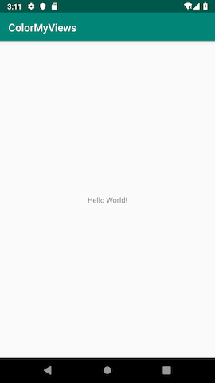

## Task: Use Layout Editor to build a constraint layout

In this task, you use the Android Studio Layout Editor to build a constraint layout for your app.

### Step 1: Set up your Android Studio work area

1 - Open the `activity_main.xml` file and click the **Design** tab.

2 - You'll add constraints manually, so you want autoconnect turned off. In the toolbar, locate the **Turn Off/On Autoconnect** toggle button, which is shown below. (If you can't see the toolbar, click inside the design editor area of the Layout Editor.) Make sure autoconnect is off.

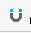 Autoconnect is on.
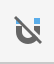 Autoconnect is off—this is what you want for this project.

3 - Use the toolbar to set the default margins to `16dp`. (The default is `8dp`.)

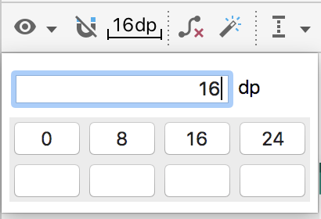

When you set the default margin to `16dp`, new constraints are created with this margin, so you don't have to add the margin each time you add a constraint.

4 - Zoom in using the **+** icon  on the right side of the toolbar, until the Hello World text is visible inside its text view.

5 - Double-click on the Hello World text view to open the Attributes pane.

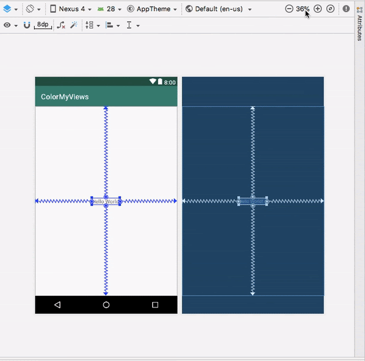

### The view inspector

The view inspector, shown in the screenshot below, is a part of the Attributes pane. The view inspector includes controls for layout attributes such as constraints, constraint types, constraint bias, and view margins.

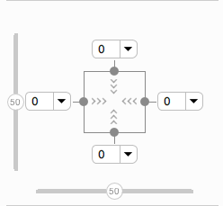

Tip: The view inspector is available only for views that are inside a `ConstraintLayout`.

### Constraint bias

Constraint bias positions the view element along the horizontal and vertical axes. By default, the view is centered between the two constraints with a bias of 50%.

To adjust the bias, you can drag the bias sliders  in the view inspector. Dragging a bias slider changes the view's position along the axis.

### Step 2: Add margins for the Hello World text view

1 - Notice that in the view inspector, the left, right, top, and bottom margins for the text view are `0`. The default margin was not automatically added, because this view was created before you changed the default margin.

2 - For the left, right, and top margins, select 16dp from the drop-down menu in the view inspector. For example, in the following screenshot you are adding `layout_marginEnd` `(layout_marginRight)`.

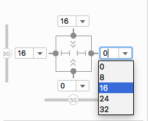

### Step 3: Adjust constraints and margins for the text view

1 - In the view inspector, the arrows 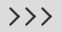 inside the square represents the type of the constraint:

-  **Wrap Content**: The view expands only as much as needed to contain its contents.

- 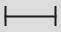 **Fixed**: You can specify a dimension as the view margin in the text box next to the fixed-constraint arrows.

-  **Match Constraints**: The view expands as much as possible to meet the constraints on each side, after accounting for the view's own margins. This constraint is very flexible, because it allows the layout to adapt to different screen sizes and orientations. By letting the view match the constraints, you need fewer layouts for the app you're building.

1 - In the view inspector, change the left and right constraints to **Match Constraints**  (Click the arrow symbol to toggle between the constraint types.)

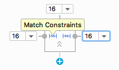

2 - In the view inspector, click the Delete Bottom Constraint dot  on the square to delete the bottom constraint.

3 - Switch to the Text tab. Extract the dimension resource for `layout_marginStart`, and set the Resource name to `margin_wide`.

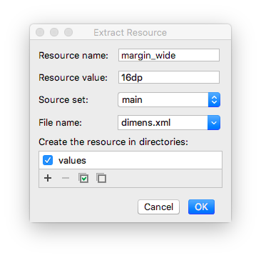

4 - Set the same dimension resource, `@dimen/margin_wide`, for the top and end margins.

```
android:layout_marginStart="@dimen/margin_wide"
android:layout_marginTop="@dimen/margin_wide"
android:layout_marginEnd="@dimen/margin_wide"
```

## Task: Style the TextView

### Step 1: Add a font

1 - In the Attributes pane, search for `fontFamily` and select the drop-down arrow next to it. Scroll down to More Fonts and select it. The Resources dialog opens.


2 - In the Resources dialog, search for roboto.

3 - Click Roboto and select Regular in the Preview list.

4 - Select the Add font to project radio button.

5 - Click OK.


This adds a `res/font` folder that contains a `roboto.ttf` font file. Also, the `@font/roboto` attribute is set for your text view.

### Step 2: Add a style

1 - Open `res/values/dimens.xml`, and add the following dimension resource for the font size.

```
<dimen name="box_text_size">24sp</dimen>
```

2 - Open `res/values/styles.xml` and add the following style, which you will use for the text view.

```
<style name="whiteBox">
   <item name="android:background">@android:color/holo_green_light</item>
   <item name="android:textAlignment">center</item>
   <item name="android:textSize">@dimen/box_text_size</item>
   <item name="android:textStyle">bold</item>
   <item name="android:textColor">@android:color/white</item>
   <item name="android:fontFamily">@font/roboto</item>
</style>
```

In this style, the background color and the text color are set to default Android color resources. The font is set to Roboto. The text is center aligned and bolded, and the text size is set to `box_text_size`.

### Step 3: Add a string resource for the text view

1 - In the Attributes pane, find the text attribute. (You want the one without the wrench icon.)

2 - Click the ... (three dots) next to the text attribute to open the Resources dialog.

3 - In the Resources dialog, select Add new resource > New string Value. Set the resource name to `box_one`, and set the value to `Box One`.

4 - Click OK.

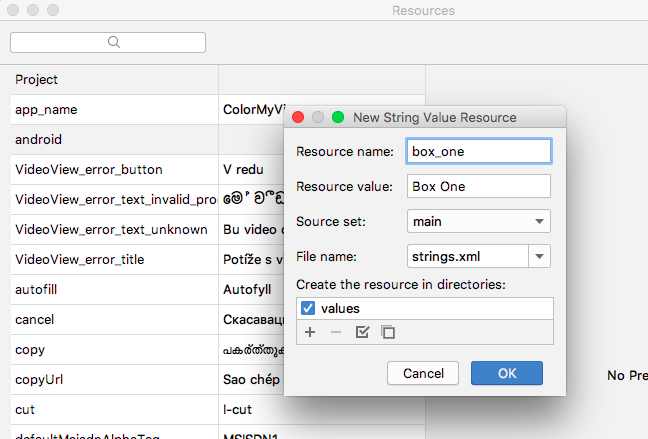

### Step 4: Finish setting attributes for the text view

1 - In the Attributes pane, set the `id` of the text view to `box_one_text`.

2 - Set the `style` to `@style/whiteBox`.

3 - To clean up the code, switch to the Text tab and remove the `android:fontFamily="@font/roboto"` attribute, because this font is present in the `whiteBox` style.

4 - Switch back to the Design tab. At the top of the design editor, click the Device for preview (D) button. A list of device types with different screen configurations is displayed. The default device is Pixel.

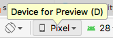

5 - Select different devices from the list and see how the `TextView` adapts to the different screen configurations.

6 - Run your app. You see a styled green text view with the text "Box One".

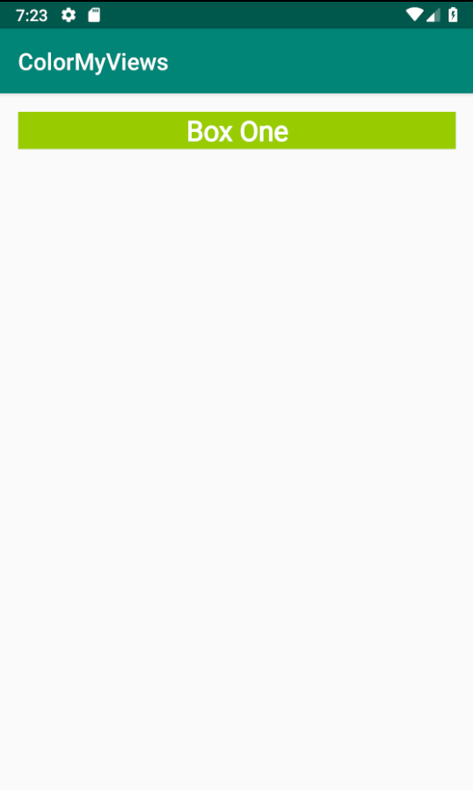

## Task: Add a second TextView and add constraints

In this task, you add another text view below the `box_one_text`. You constrain the new text view to `box_one_text` and the layout's parent element.

### Step 1: Add a new text view

1 - Open the `activity_main.xml` file and switch to the Design tab.

2 - Drag a `TextView` from the Palette pane directly into the design editor preview, as shown below. Place the text view below the `box_one_text`, aligned with the left margin.

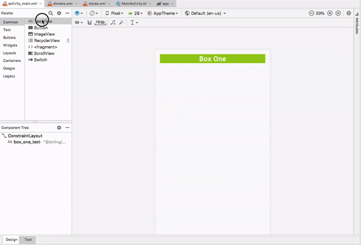

3 - In the design editor, click the new text view, then hold the pointer over the dot on the top side of the text view. This dot, shown below, is called a _constraint handle_.

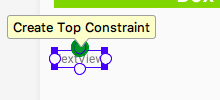

Notice that when you hold the pointer over the constraint handle, the handle turns green and blinks.

### Step 2: Add constraints to the new text view

Create a constraint that connects the top of the new text view to the bottom of the Box One text view:

1 - Hold the pointer over the top constraint handle on the new text view.

2 - Click the top constraint handle of the view and drag it up. A constraint line appears. Connect the constraint line to the bottom of the Box One textview, as shown below.

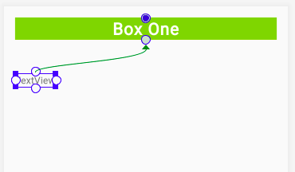

As you release the click, the constraint is created, and the new text view jumps to within 16dp of the bottom of the Box One. (The new text view has a top margin of 16dp because that's the default you set earlier.)

#### Now create a left constraint:

1 - Click the constraint handle on the left side of the new view.

2 - Drag the constraint line to the left edge of the layout.

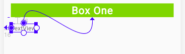

**Tip**: You can also create constraints using the view inspector. For example, to create a left constraint on the new text box:

1 - In the preview, click the new text box to select it.
2 - In the view inspector, click the + icon on the left side of the box, as shown below.

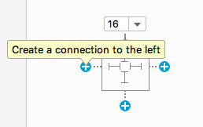

When you create a constraint this way, the constraint is attached to the parent or to a view closer to it.

### Step 3: Set attributes for the new text view

1 - Open `res/values/strings.xml`. Add a new string resource with the following code:

`<string name="box_two">Box Two</string>`

2 - Open `activity_main.xml` and click the Design tab. Use the Attributes pane to set the following attributes on the new text view:

| Attribute     | value           |
| ------------- | --------------- |
| id            | box_two_text    |
| layout_height | 130dp           |
| layout_width  | 130dp           |
| style         | @style/whiteBox |
| text          | @string/box_two |

In this case, you're assigning fixed sizes for the height and width of the text view. Assign fixed sizes for height and width only if your view should always have a fixed size on all devices and layouts.

Important: When developing real-world apps, use flexible constraints for the height and width of your UI elements, whenever possible. For example, use `match_constraint` or `wrap_content`. The more fixed-size UI elements you have in your app, the less adaptive your layout is for different screen configurations.

3 - Run your app. You should see two green `TextView` views, one above the other, similar to the following screenshot:

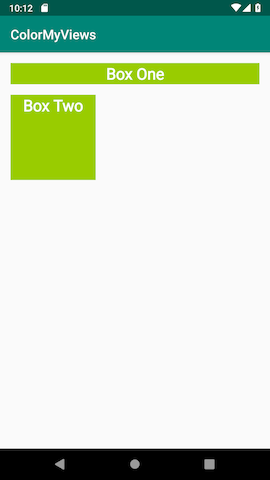

### Task: Create a chain of TextView views

In this task, you add three `TextView` views. The text views are vertically aligned with each other, and horizontally aligned with the Box Two text view. The views will be in a chain.

#### Chains

A _chain_ is a group of views that are linked to each other with bidirectional constraints. The views within a chain can be distributed either vertically or horizontally. For example, the following diagram shows two views that are constrained to each other, which creates a horizontal chain.


#### Head of the chain

The first view in a chain is called the head of the chain. The attributes that are set on the head of the chain control, position, and distribute all the views in the chain. For horizontal chains, the head is the left-most view. For vertical chains, the head is the top-most view. In each of the two diagrams below, "A" is the head of the chain.

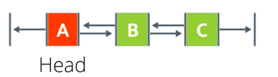

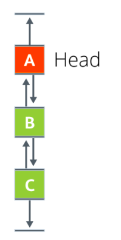

#### Chain styles

Chain styles define the way the chained views are spread out and aligned. You style a chain by assigning a chain style attribute, adding weight, or setting bias on the views.

There are three chains styles:

- **Spread**: This is the default style. Views are evenly spread in the available space, after margins are accounted for.

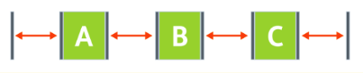

- **Spread inside**: The first and the last views are attached to the parent on each end of the chain. The rest of the views are evenly spread in the available space.


- **Packed**: The views are packed together, after margins are accounted for. You can then adjust the position of the whole chain by changing the bias of the chain's head view.

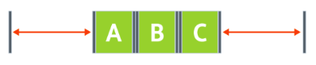 Packed Chain.

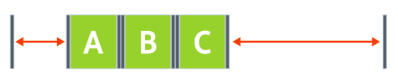 Packed chain with bias.

- **Weighted**: The views are resized to fill up all the space, based on the values set in the `layout_constraintHorizontal_weight` or `layout_constraintVertical_weight` attributes. For example, imagine a chain containing three views, A, B, and C. View A uses a weight of 1. Views B and C each use a weight of 2. The space occupied by views B and C is twice that of view A, as shown below.


To add a chain style to a chain, set the `layout_constraintHorizontal_chainStyle` or the `layout_constraintVertical_chainStyle` attribute for the head of the chain. You can add chain styles in the Layout Editor, which you learn in this task.

Alternatively, you can add chain styles in the XML code. For example:

```
// Horizontal spread chain
app:layout_constraintHorizontal_chainStyle="spread"

// Vertical spread inside chain
app:layout_constraintVertical_chainStyle="spread_inside"

// Horizontal packed chain
app:layout_constraintHorizontal_chainStyle="packed"
```

### Step 1: Add three text views and create a vertical chain

1 - Open the `activity_main.xml` file in the Design tab. Drag three `TextView` views from the Palette pane into the design editor. Put all three new text views to the right of the Box Two text view, as shown below.

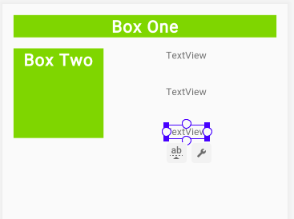

2 - In the `strings.xml` file, add the following string resources for the names of the new text views:

```
<string name="box_three">Box Three</string>
<string name="box_four">Box Four</string>
<string name="box_five">Box Five</string>
```

3 - Set the following attributes for the new text views:

| Attribute | Top text view     | Middle text view                  | Bottom text view |
| --------- | ----------------- | --------------------------------- | ---------------- |
| ID        | box_three_text    | box_four_text                     | box_five_text    |
| text      | @string/box_three | @string/box_four\@string/box_five |
| style     | @style/whiteBox   | @style/whiteBox                   | @style/whiteBox  |

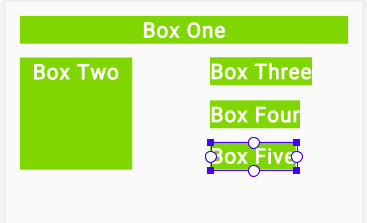

In the Component Tree, you see errors about missing constraints. You fix these errors later.

### Step 2: Create a chain and constrain it to the height of Box Two

1 - Select all three new text views, right-click, and select Chains > Create Vertical Chain.

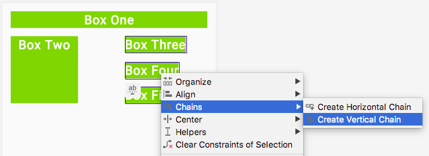

This creates a vertical chain that extends from Box One to the end of the layout.

2 - Add a constraint that extends from the top of Box Three to the top of Box Two. This removes the existing top constraint and replaces it with the new constraint. You don't have to delete the constraint explicitly.


3 - Add a constraint from the bottom of Box Five to the bottom of Box Two.

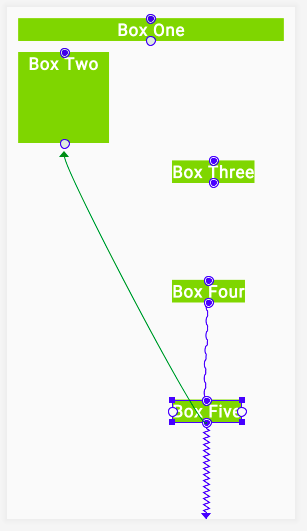

Observe that the three text views are now constrained to the top and bottom of Box Two.

### Step 3: Add left and right constraints

1 - Constrain the left side of Box Three to the right side of Box Two. Repeat for Box Four and Box Five, constraining the left side of each to the right side of Box Two.

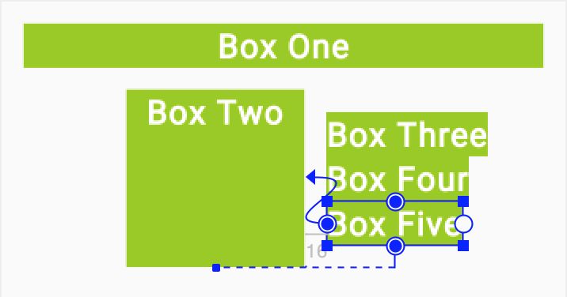

2 - Constrain the right side of each of the three text views to the right side of the layout.

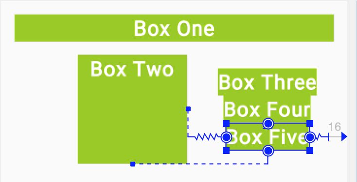

3 - For each of the three text views, change the `layout_width` attribute `0dp`, which is equivalent to changing the constraint type to Match Constraints.

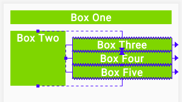

### Step 4: Add margin

Use the **Attributes** pane to set **Layout_margin** attributes on the three text views to add spacing between them.

1 - For Box Three, use `@dimen/margin_wide` for the start and end margins. Remove the other margins.

2 - For Box Four, use `@dimen/margin_wide` for the start, end, top, and bottom margins. Remove the other margins.

3 - For Box Five, use `@dimen/margin_wide` for the start and end margins. Remove the other margins.

4 - To see how the text views in your app adapt to device-configuration changes, change the orientation of the preview. To do this, click the Orientation for Preview (O) icon  in the toolbar and select Landscape.

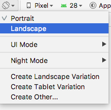

5 - Run the app. You should see five styled `TextView` views. To see how the constraints behave on a wider screen, try running the app on a larger device or emulator, such as a Nexus 10.

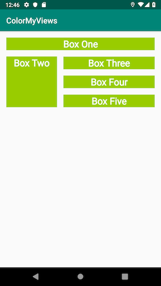

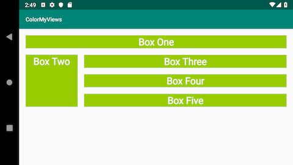

### Task: Add clickHandlers to the text views

In this task, you make the ColorMyViews app a little more colorful. First you change the color of all the text views to white. Then you add a click handler that changes the view's color and the layout background color when the user taps it.

1 - In `styles.xml`, inside the `whiteBox` style, change the background color to white. The text views will start out white with white font, then change colors when the user taps them.

`<item name="android:background">@android:color/white</item>`

2 - In `MainActivity.kt`, after the `onCreate()` function, add a function called `makeColored()`. Use View as the function's parameter. This view is the one whose color will change.

```
private fun makeColored(view: View) {
}
```

Every view has a resource ID. The resource ID is the value assigned to the view's `id` attribute in the layout file, `activity_main.xml`. To set a color, the code will switch using a `when` statement on the view's resource ID. It's a common pattern to use one click-handler function for many views when the click action is the same.

3 - Implement the `makeColored()` function: Add a `when` block to check the view's resource ID. Call the `setBackgroundColor()` function on each view's id to change the view's background color using the `Color` class **constants**.

To fix the code indentation, choose **Code > Reformat code**.

```
private fun makeColored(view: View) {
   when (view.id) {

       // Boxes using Color class colors for the background
       R.id.box_one_text -> view.setBackgroundColor(Color.DKGRAY)
       R.id.box_two_text -> view.setBackgroundColor(Color.GRAY)
       R.id.box_three_text -> view.setBackgroundColor(Color.BLUE)
       R.id.box_four_text -> view.setBackgroundColor(Color.MAGENTA)
       R.id.box_five_text -> view.setBackgroundColor(Color.BLUE)
   }
}

```

4 - To run, the code that you just added needs the `android.graphics.Color` library. If Android Studio hasn't imported this library automatically, use an `import` statement to add the library before the `MainActivity` class definition.

5 - If the user taps the background, you want the background color to change to light gray. A light background will reveal the outlines of the views and give the user a hint about where to tap next.

If the `id` doesn't match any of the views, you know that the user has tapped the background. At the end of the `when` statement, add an `else` statement. Inside the `else`, set the background color to light gray.

`else -> view.setBackgroundColor(Color.LTGRAY)`

6 - In `activity_main.xml`, add an id to the root constraint layout. The Android system needs an identifier in order to change its color.

`android:id="@+id/constraint_layout"`

7 - In `MainActivity.kt`, add a function called `setListeners()` to set the click-listener function, `makeColored()`, on each view. Use `findViewByID` to get a reference for each text view, and for the root layout. Assign each reference to a variable.

```
private fun setListeners() {

   val boxOneText = findViewById<TextView>(R.id.box_one_text)
   val boxTwoText = findViewById<TextView>(R.id.box_two_text)
   val boxThreeText = findViewById<TextView>(R.id.box_three_text)
   val boxFourText = findViewById<TextView>(R.id.box_four_text)
   val boxFiveText = findViewById<TextView>(R.id.box_five_text)

   val rootConstraintLayout = findViewById<View>(R.id.constraint_layout)
}
```

For this code to run, it needs the `android.widget.TextView` library. If Android Studio doesn't import this library automatically, use an `import` statement to add the library before the `MainActivity` class definition.

8 - At the end of `setListeners()` function, define a `List` of views. Name the list `clickableViews` and add all the view instances to the list.

```
fun setListeners() {
...
   val clickableViews: List<View> =
       listOf(boxOneText, boxTwoText, boxThreeText,
              boxFourText, boxFiveText, rootConstraintLayout)
}
```

At the end of the `setListeners()` function, set the listener for each view. Use a `for` loop and the `setOnClickListener()` function.

```
 for (item in clickableViews) {
       item.setOnClickListener { makeColored(it) }
```

10 - In `MainActivity.kt`, at the end of the `onCreate()` function, make a call to `setListeners()`.

```
override fun onCreate(savedInstanceState: Bundle?) {
...
   setListeners()
}
```

Run your app. At first you see a blank screen. Tap the screen to reveal the boxes and the background. Go ahead and experiment more with more views and colors on your own.

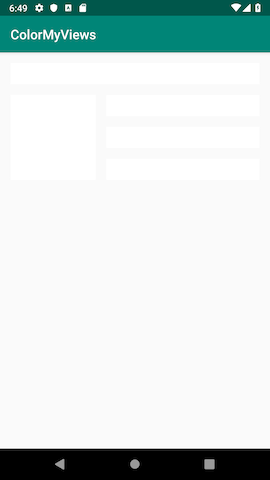


## Coding challenge (this is important)

Use images instead of colors and text as backgrounds for all the views. The app should reveal the images when the user taps the text views.

**Hint**: Add images to the app as drawable resources. Use the `setBackgroundResource()` function to set an image as a view's background.

Example:

`R.id.box_two_text -> view.setBackgroundResource(R.drawable.image_two)`

## Task: Add a baseline constraint

### Baseline constraint

The baseline constraint aligns the baseline of a view's text with the baseline of another view's text. Aligning views that contain text can be a challenge, especially if the fonts are differently sized. Baseline constraint does the alignment work for you.

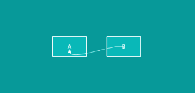

You can create baseline constraints in the Layout Editor by using the **Edit Baseline**  icon, which is displayed below the view when you hold the pointer over it. The equivalent XML code for the baseline constraint has the constraint layout attribute, `layout_constraintBaseline_toBaselineOf`.

Sample XML code for the baseline constraint:

```
<Button
   android:id="@+id/buttonB"
   ...
   android:text="B"
   app:layout_constraintBaseline_toBaselineOf="@+id/buttonA" />
```

In this task, you add instructions that tell the user how to use the app. You create two `TextView` views, one for a label and one for the instructions information. The text views have different font sizes, and you align their baselines.

### Step 1: Add a text view for the label

1 - Open `activity_main.xml` in Design tab and drag a text view from the Palette pane into the design editor. Put the text view below Box Two. This text view will hold the text that labels the instructions.

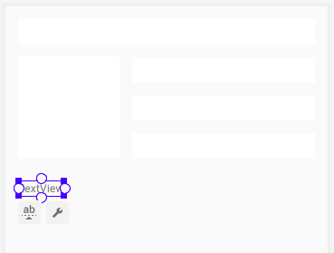

2 - In `strings.xml`, create a string resource for the label `TextView` view.

`<string name="how_to_play">How to play:</string>`

3 - Use the Attributes pane to set the following attributes to the newly added label `TextView`:

| Attribute  | Value               |
| ---------- | ------------------- |
| ID         | label_text          |
| fontFamily | roboto              |
| text       | @string/how_to_play |
| textSize   | 24sp                |
| textStyle  | B (bold)            |

Use the **Default Margins** 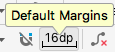 icon in the toolbar to set the default margins to `16dp`.

5 - Constrain the `label_text` view's left side to the layout's parent element.

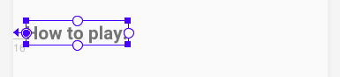

6 - In the `activity_main.xml` file, the Layout Editor adds the `layout_marginStart` attribute with a hard-coded value of `16dp`. Replace `16dp` with `@dimen/margin_wide`. The XML code now looks similar to this:

```
<TextView
   android:id="@+id/label_text"
   android:layout_width="wrap_content"
   android:layout_height="wrap_content"
   android:layout_marginStart="@dimen/margin_wide"
   android:fontFamily="@font/roboto"
   android:text="@string/how_to_play"
   android:textSize="24sp"
   android:textStyle="bold"
   app:layout_constraintStart_toStartOf="parent"
   tools:layout_editor_absoluteY="287dp"/> <!--Designtime attribute-->
```

#### Design-time attributes

Design-time attributes are used and applied only during the layout design, not at runtime. When you run the app, the design-time attributes are ignored.

Design-time attributes are prefixed with the `tools` namespace, for example, `tools:layout_editor_absoluteY` in the generated code snippet shown above. This line of code is added because you haven't yet added a vertical constraint.

All views in a `ConstraintLayout` need to be constrained horizontally and vertically, or else the views jump to an edge of the parent when you run the app. This is why the `Layout Editor` adds `tools:layout_editor_absoluteX` if the view is not horizontally constrained. Layout Editor gives the design-time attribute the value of the view's current position in the layout, to keep the views in place during design. You can safely ignore these `tools` attributes, because Android Studio removes them after you create the constraints.

Using design-time attributes, you can also add sample preview data to a text view or image view from within the Layout Editor.

Try experimenting with sample data:

1 - Add a new text view to your layout.

2 - In the design editor, hold the pointer over the new view. The `constraint_layout` icon 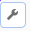 appears below the view. Click the icon to display the **Design-time View Attributes** drop-down menu, as shown below:

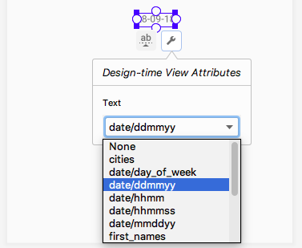

3 - Select a type of the sample data from the drop-down list. For example, if you set text sample data to **date/mmddyy**, today's date is displayed in the design.

4 - Delete the text view that you just created.

### Step 2: Add a text view for the info text

1 - Drag another text view from the **Palette** pane into the design editor. Place the view next to and below the `label_text` text view, as shown below. This new text view is for the help info that the user will see. Make sure that the new view is vertically offset from the `label_text` view, so that you can see what happens when you create the baseline constraint.

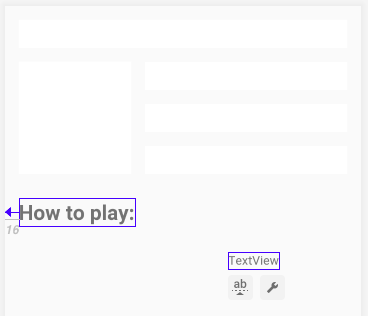

2 - In `strings.xml`, create a string resource for the new text view.

`<string name="tap_the_boxes_and_buttons">Tap the screen and buttons.</string>`

Use the Attributes pane to set the following attributes to the new text view:

| Attribute    | Value                                         |
| ------------ | --------------------------------------------- |
| ID           | info_text                                     |
| layout_width | 0dp (which is equivalent to match_constraint) |
| fontFamily   | roboto                                        |
| text         | @string/tap_the_boxes_and_button              |

4 - Constrain the right side of the `info_text` to the right edge of the parent element. Constrain the left side of the `info_text` to the right (end) of the `label_text`.

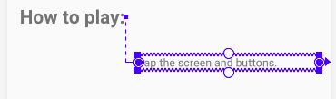

### Step 3: Align the baselines of the two text views

1 - Click the `label_text`. The Edit Baseline icon 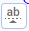 appears below the view. Click the  icon. (The view might jump to a new location in your layout.)

2 - Hold the pointer over the label text view until the green baseline blinks, as shown below.


3 - Click the green baseline and drag it. Connect the baseline to the bottom of the green blinking baseline on the info text view.


**Tip**

To delete all the constraints that are set on a view:

1 - In the Design tab, click on the view.

2 - Click the Delete Constraints icon that appears below the view.

To delete a particular constraint:

1 - Hold the pointer over the constraint handle for the constraint you want to delete. The constraint handle (the dot) turns red.


2 - Click the red constraint handle.

### Step 4: Add vertical constraints to the two text views

Without vertical constraints, views go to the top of the screen (vertical 0) at runtime. Adding vertical constraints will keep the two text views in place when you run the app.

1 - Constrain the bottom of the `info_text` to the bottom of the layout.

2 - Attach the top of the `info_text` to the bottom of the `box_two_text`.


Try moving the `info_text` view up or down. Notice that the `label_text` view follows, and stays aligned at the baseline.

3 - In the view inspector, change the vertical bias of the `info_text` view to `0`. This keeps the text views closer to the top constrained view, Box Two. (If the view inspector isn't visible in the Attributes pane when you click on the view in the design editor, close and reopen Android Studio.)

4 - The generated XML code should look similar to this:

```
<TextView
   android:id="@+id/label_text"
   android:layout_width="wrap_content"
   android:layout_height="wrap_content"
   android:layout_marginStart="@dimen/margin_wide"
   android:text="@string/how_to_play"
   android:textSize="24sp"
   android:textStyle="bold"
   app:layout_constraintBaseline_toBaselineOf="@+id/info_text"
   app:layout_constraintStart_toStartOf="parent" />

<TextView
   android:id="@+id/info_text"
   android:layout_width="0dp"
   android:layout_height="wrap_content"
   android:layout_marginStart="@dimen/margin_wide"
   android:layout_marginTop="@dimen/margin_wide"
   android:layout_marginEnd="@dimen/margin_wide"
   android:layout_marginBottom="@dimen/margin_wide"
   android:text="@string/tap_the_boxes_and_buttons"
   app:layout_constraintBottom_toBottomOf="parent"
   app:layout_constraintEnd_toEndOf="parent"
   app:layout_constraintHorizontal_bias="0.0"
   app:layout_constraintStart_toEndOf="@+id/label_text"
   app:layout_constraintTop_toBottomOf="@+id/box_two_text"
   app:layout_constraintVertical_bias="0.0" />
```

5 - Run your app. Your screen should look similar to the screenshot below.


## Task: Add a chain of buttons

In this task, you add three Button views and chain them together.

### Step 1: Add three buttons

1 - Open the `activity_main.xml` file in the Design tab. Drag three buttons from the Palette pane onto the bottom of the layout.


2 - In the `strings.xml` file, add the following string resources for the `Button` views:

```
<string name="button_red">RED</string>
<string name="button_yellow">YELLOW</string>
<string name="button_green">GREEN</string>
```

3 - Set the following attributes to the button views:

| Attribute | Left button        | Middle button         | Right button         |
| --------- | ------------------ | --------------------- | -------------------- |
| ID        | red_button         | yellow_button         | green_button         |
| text      | @string/button_red | @string/button_yellow | @string/button_green |

4 - Align the button labels vertically with each other. To do this, constrain the baselines of `red_button` and `green_button` to the baseline of the `yellow_button`. (To add a baseline constraint to a view, click on the view and use the **Edit Baseline** icon  that appears below the view.)


`Tip: Baseline constraint and the bottom constraint are mutually exclusive, so you can't create both for the same view. If you add a bottom constraint and then a baseline constraint, the Layout Editor removes the bottom constraint.`

### Step 2: Create a horizontal chain and constrain it

1 - In the design editor or in the Component Tree pane select all three button views and right-click. Select Chains > Create Horizontal chain.


2 - Use the view inspector to set right and left margins of `16dp` for the `yellow_button`, if these margins aren't already set.


3 - Using the view inspector, set the left margin of the `red_button` to `16dp`. Set the right margin of the `green_button` to `16dp`.

4 - Constrain the top of the `yellow_button` to the bottom of the `info_text`.

5 - Constrain the bottom of the `yellow_button` to the bottom of the layout.


6 - Change the vertical bias of the `yellow_button` to `100` (1.0 in the XML), to drop down the buttons to the bottom of the layout.

7 - Test your layout for different devices and orientations. The layout may not work for all devices and orientations, but should work for most of them.

The generated XML code for the `Button` views will be similar to the following:

```
<Button
   android:id="@+id/red_button"
   android:layout_width="wrap_content"
   android:layout_height="wrap_content"
   android:layout_marginStart="@dimen/margin_wide"
   android:text="@string/button_red"
   android:visibility="visible"
   app:layout_constraintBaseline_toBaselineOf="@+id/yellow_button"
   app:layout_constraintEnd_toStartOf="@+id/yellow_button"
   app:layout_constraintHorizontal_bias="0.5"
   app:layout_constraintStart_toStartOf="parent" />

<Button
   android:id="@+id/yellow_button"
   android:layout_width="wrap_content"
   android:layout_height="wrap_content"
   android:layout_marginStart="@dimen/margin_wide"
   android:layout_marginTop="@dimen/margin_wide"
   android:layout_marginBottom="@dimen/margin_wide"
   android:text="@string/button_yellow"
   android:visibility="visible"
   app:layout_constraintBottom_toBottomOf="parent"
   app:layout_constraintEnd_toStartOf="@+id/green_button"
   app:layout_constraintHorizontal_bias="0.5"
   app:layout_constraintStart_toEndOf="@+id/red_button"
   app:layout_constraintTop_toBottomOf="@+id/info_text"
   app:layout_constraintVertical_bias="1.0" />

<Button
   android:id="@+id/green_button"
   android:layout_width="wrap_content"
   android:layout_height="wrap_content"
   android:layout_marginEnd="16dp"
   android:text="@string/button_green"
   app:layout_constraintBaseline_toBaselineOf="@+id/yellow_button"
   app:layout_constraintEnd_toEndOf="parent"
   app:layout_constraintHorizontal_bias="0.5"
   app:layout_constraintStart_toEndOf="@+id/yellow_button" />
```

### Task: Add click handlers to the buttons

In this task, you add a click handler to each Button view. The click handler changes the color of the TextView views.

1 - Add the following colors to the `res/values/colors.xml` file:

```
<color name="my_green">#12C700</color>
<color name="my_red">#E54304</color>
<color name="my_yellow">#FFC107</color>
```

2 - In `MainActivity.kt`, use `findViewById` to get references for the `button` views. To do this, put the following code inside the `setListeners()` click-handler function, above the `clickableViews` declaration:

```
val redButton = findViewById<TextView>(R.id.red_button)
val greenButton = findViewById<TextView>(R.id.green_button)
val yellowButton = findViewById<TextView>(R.id.yellow_button)
```

3 - Inside `setListeners()`, add the references of the `Button` views to the list of clickable views.

```
private fun setListeners() {
   ...
   val clickableViews: List<View> =
       listOf(boxOneText, boxTwoText, boxThreeText,
boxFourText, boxFiveText, rootConstraintLayout,
redButton, greenButton, yellowButton
)
   ...
}
```

4 - Inside the `makeColored()` function, add code to change the text views' colors when the user taps the buttons. Add the new code above the `else` statement, as shown:

```
private fun makeColored(view: View) {
   when (view.id) {

      ...

       // Boxes using custom colors for background
       R.id.red_button -> box_three_text.setBackgroundResource(R.color.my_red)
       R.id.yellow_button -> box_four_text.setBackgroundResource(R.color.my_yellow)
       R.id.green_button -> box_five_text.setBackgroundResource(R.color.my_green)

       else -> view.setBackgroundColor(Color.LTGRAY)
   }
}
```

5 - Run your final app. Click on the text views and the buttons. Your screen will look something like this.


## Coding challenge (Important)

Create a new View and then do what you did with text and buttons from your app and fill the entire layout with color boxes (`TextView` views).

Your app should toggle or change the colors when the user taps on the screen.