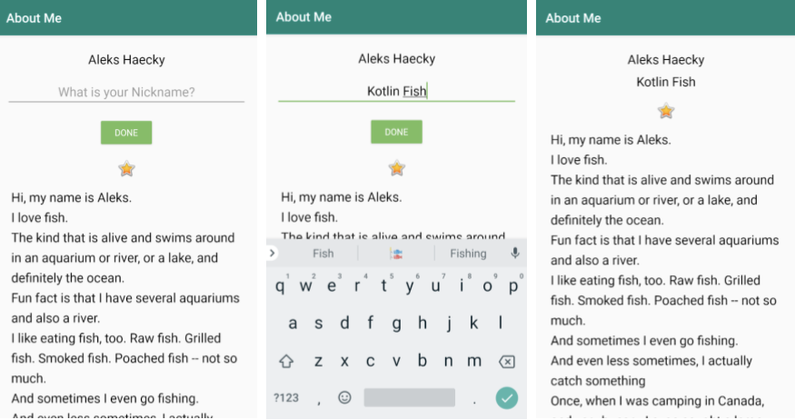
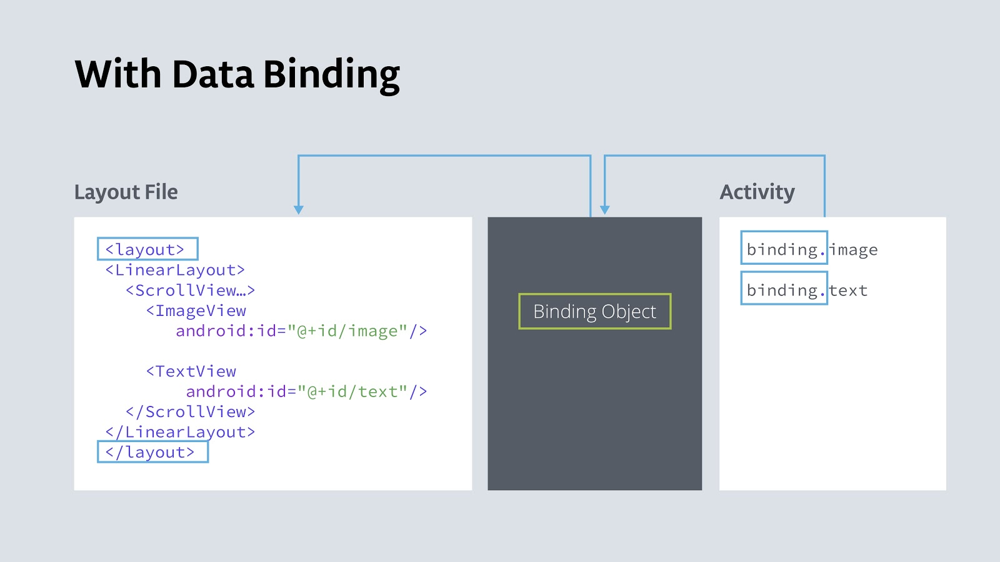

## App overview

In this project, you start with the AboutMe app and change the app to use data binding. The app will look exactly the same when you are done!

##### Here's what the AboutMe app does:

- When the user opens the app, the app shows a name, a field to enter a nickname, a Done button, a star image, and scrollable text.

- The user can enter a nickname and tap the Done button. The editable field and button are replaced by a text view that shows the entered nickname.

**Please use a clone of your app, submit it under this project repo and do not alter the code of the AboutMe project.**



### Task: Use data binding to eliminate findViewById()

The code you wrote in previous project uses the `findViewById()` function to obtain references to views.

Every time you use `findViewById()` to search for a view after the view is created or recreated, the Android system traverses the view hierarchy at runtime to find it. When your app has only a handful of views, this is not a problem. However, production apps may have dozens of views in a layout, and even with the best design, there will be nested views.

Think of a linear layout that contains a scroll view that contains a text view. For a large or deep view hierarchy, finding a view can take enough time that it can noticeably slow down the app for the user. Caching views in variables can help, but you still have to initialize a variable for each view, in each namespace. With lots of views and multiple activities, this adds up, too.

One solution is to create an object that contains a reference to each view. This object, called a `Binding` object, can be used by your whole app. This technique is called data _binding_. Once a binding object has been created for your app, you can access the views, and other data, through the binding object, without having to traverse the view hierarchy or search for the data.



Data binding has the following benefits:

- Code is shorter, easier to read, and easier to maintain than code that uses `findByView()`.

- Data and views are clearly separated. This benefit of data binding becomes increasingly important later in this course.

- The Android system only traverses the view hierarchy once to get each view, and it happens during app startup, not at runtime when the user is interacting with the app.

- You get **type safety** for accessing views. (Type safety means that the compiler validates types while compiling, and it throws an error if you try to assign the wrong type to a variable.)

In this task, you set up data binding, and you use data binding to replace calls to `findViewById()` with calls to the binding object.

1 - Clone / Fork (copy) your previous about me project and opened it in Android Studio.

2 - Open the `build.gradle (Module: app)` file.

3 - Inside the `android` section, before the closing brace, add a `dataBinding` section and set `enabled` to `true`.

```
dataBinding {
    enabled = true
}
```

4 - When prompted, Sync the project. If you're not prompted, select File > Sync Project with Gradle Files.

5 - You can run the app, but you won't see any changes.

### Step 2: Change layout file to be usable with data binding

To work with data binding, you need to wrap your XML layout with a `<layout>` tag. This is so that the root class is no longer a view group, but is instead a layout that contains view groups and views. The binding object can then know about the layout and the views in it.

1 - Open the `activity_main.xml` file.

2 - Switch to the Text tab.

3 - Add `<layout></layout>` as the outermost tag around the `<LinearLayout>`.

```
<layout>
   <LinearLayout ... >
   ...
   </LinearLayout>
</layout>
```

4 - Choose Code > Reformat code to fix the code indentation.

The namespace declarations for a layout must be in the outermost tag.

5 - Cut the namespace declarations from the `<LinearLayout>` and paste them into the `<layout>` tag. Your opening `<layout>` tag should look as shown below, and the `<LinearLayout>` tag should only contain view properties.

```
<layout xmlns:android="http://schemas.android.com/apk/res/android"
   xmlns:app="http://schemas.android.com/apk/res-auto">
```

6 - Build and run your app to verify that you did this correctly.

### Step 3: Create a binding object in the main activity

Add a reference to the binding object to the main activity, so that you can use it to access views:

1 - Open the `MainActivity.kt` file.

2 - Before `onCreate()`, at the top level, create a variable for the binding object. This variable is customarily called binding.

The type of `binding`, the `ActivityMainBinding` class, is created by the compiler specifically for this main activity. The name is derived from the name of the layout file, that is, `activity_main + Binding`.

`private lateinit var binding: ActivityMainBinding`

3 - If prompted by Android Studio, import `ActivityMainBinding`. If you aren't prompted, click on `ActivityMainBinding` and press `Alt+Enter` (`Option+Enter` on a Mac) to import this missing class.

The `import` statement should look similar to the one shown below.

`import com.example.android.aboutme.databinding.ActivityMainBinding`

Next, you replace the current `setContentView()` function with an instruction that does the following:

- Creates the binding object.

- Uses the `setContentView()` function from the `DataBindingUtil` class to associate the `activity_main` layout with the `MainActivity`. This `setContentView()` function also takes care of some data binding setup for the views.

4 - In `onCreate()`, replace the `setContentView()` call with the following line of code.

`binding = DataBindingUtil.setContentView(this, R.layout.activity_main)`

5 - Import DataBindingUtil.

`import androidx.databinding.DataBindingUtil`

### Step 4: Use the binding object to replace all calls to findViewById()

You can now replace all calls to `findViewById()` with references to the views that are in the binding object. When the binding object is created, the compiler generates the names of the views in the binding object from the IDs of the views in the layout, converting them to camel case. So, for example,`done_button` is `doneButton` in the binding object, `nickname_edit` becomes becomes `nicknameEdit`, and `nickname_text` becomes `nicknameText`.

1 - In `onCreate()`, replace the code that uses `findViewById()` to find the `done_button` with code that references the button in the binding object.

Replace this code: `findViewById<Button>`(`R.id.done_button`)
with: `binding.doneButton`

Your finished code to set the click listener in onCreate() should look like this.

```
binding.doneButton.setOnClickListener {
   addNickname(it)
}
```

2 - Do the same for all calls to `findViewById()` in the `addNickname()` function.

Replace all occurrences of `findViewById<View>(R.id.id_view)` with binding.idView. Do this in the following way:

- Delete the definitions for the `editText` and `nicknameTextView` variables along with their calls to `findViewById()`. This will give you errors.

- Fix the errors by getting the `nicknameText`, `nicknameEdit`, and `doneButton` views from the binding object instead of the (deleted) variables.

- Replace `view.visibility` with `binding.doneButton.visibility.` Using `binding.doneButton` instead of the passed-in view makes the code more consistent.

The result is the following code:

```
binding.nicknameText.text = binding.nicknameEdit.text
binding.nicknameEdit.visibility = View.GONE
binding.doneButton.visibility = View.GONE
binding.nicknameText.visibility = View.VISIBLE
```

- here is no change in functionality. Optionally, you can now eliminate the `view` parameter and update all uses of `view` to use `binding.doneButton` inside this function.

3 - The `nicknameText` requires a `String`, and `nicknameEdit.text` is an `Editable`. When using data binding, it is necessary to explicitly convert the `Editable` to a `String`.

`binding.nicknameText.text = binding.nicknameEdit.text.toString()`

4 - You can delete the grayed out imports.

5 - Kotlinize (;-) the function by using `apply{}`.

```
binding.apply {
   nicknameText.text = nicknameEdit.text.toString()
   nicknameEdit.visibility = View.GONE
   doneButton.visibility = View.GONE
   nicknameText.visibility = View.VISIBLE
}
```

6 - Build and run your app...and it should look and work exactly the same as before.

**Tip: If you see compiler errors after you make changes, select Build > Clean Project followed by Build > Rebuild Project. Doing this usually updates the generated files. Otherwise, select File > Invalidate Caches/Restart to do a more thorough cleanup.**

**Tip: You previously learned about the Resources object that holds references to all resources in the app. You can think of the Binding object in a similar fashion when referencing views; however, the Binding object is a lot more sophisticated.**

## Task: Use data binding to display data

You can take advantage of data binding to make a data class directly available to a view. This technique simplifies the code, and is extremely valuable for handling more complex cases.

For this example, instead of setting the name and nickname using string resources, you create a data class for the name and nickname. You make the data class available to the view using data binding.

### Step 1: Create the MyName data class

1 - In Android Studio in the `java` directory, open the `MyName.kt` file. If you don't have this file, create a new Kotlin file and call it `MyName.kt`.

2 - Define a data class for the name and nickname. Use empty strings as the default values.

`data class MyName(var name: String = "", var nickname: String = "")`

### Step 2: Add data to the layout

In the `activity_main.xml` file, the name is currently set in a `TextView` from a string resource. You need to replace the reference to the name with a reference to data in the data class.

1 - Open `activity_main.xml` in the Text tab.

2 - At the top of the layout, between the `<layout>` and `<LinearLayout>` tags, insert a `<data></data>` tag. This is where you will connect the view with the data.

```
<data>

</data>
```

Inside the data tags, you can declare named variables that hold a reference to a class.

3 - Inside the `<data>` tag, add a `<variable>` tag.

4 - Add a name parameter to give the variable a name of `"myName"`. Add a type parameter and set the type to a fully qualified name of the `MyName` data class (package name + variable name).

```
<variable
       name="myName"
       type="com.example.android.aboutme.MyName" />
```

Now, instead of using the string resource for the name, you can reference the `myName` variable.

5 - Replace `android:text="@string/name"` with the code below.

`@={}` is a directive to get the data that is referenced inside the curly braces.

`myName` references the myName variable that you previously defined, which points to the `myName` data class and fetches the `name` property from the class.

`android:text="@={myName.name}"`

### Step 3: Create the data

You now have a reference to the data in your layout file. Next, you create the actual data.

3 - Open the `MainActivity.kt` file.

2 - Above `onCreate()`, create a private variable, also called `myName` by convention. Assign the variable an instance of the `MyName` data class, passing in the name.

`private val myName: MyName = MyName("Aleks Haecky")`

3 - In `onCreate()`, set the value of the `myName` variable in the layout file to the value of the `myName` variable that you just declared. You can't access the variable in the XML directly. You need to access it through the binding object.

`binding.myName = myName`

4 - This may show an error, because you need to refresh the binding object after making changes. Build your app, and the error should go away.

### Step 4: Use the data class for the nickname in the TextView

The final step is to also use the data class for the nickname in the `TextView`.

1 - Open `activity_main.xml`.

2 - In the `nickname_text` text view, add a text property. Reference the nickname in the data class, as shown below.

`android:text="@={myName.nickname}"`

In `ActivityMain`, replace

`nicknameText.text = nicknameEdit.text.toString()`

with code to set the nickname in the myName variable.

`myName?.nickname = nicknameEdit.text.toString()`

After the nickname is set, you want your code to refresh the UI with the new data. To do this, you must invalidate all binding expressions so that they are recreated with the correct data.

4 - Add `invalidateAll()` after setting the nickname so that the UI is refreshed with the value in the updated binding object.

```
binding.apply {
   myName?.nickname = nicknameEdit.text.toString()
   invalidateAll()
   ...
}
```

5 - Build and run your app, and it should work exactly the same as before.