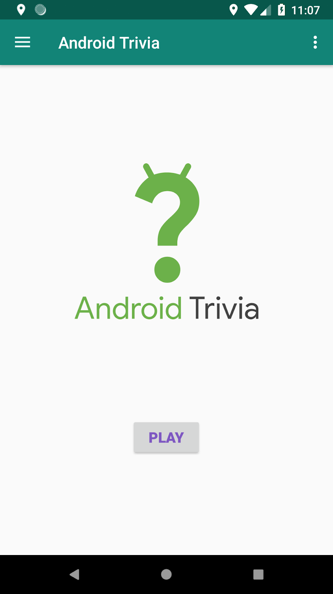
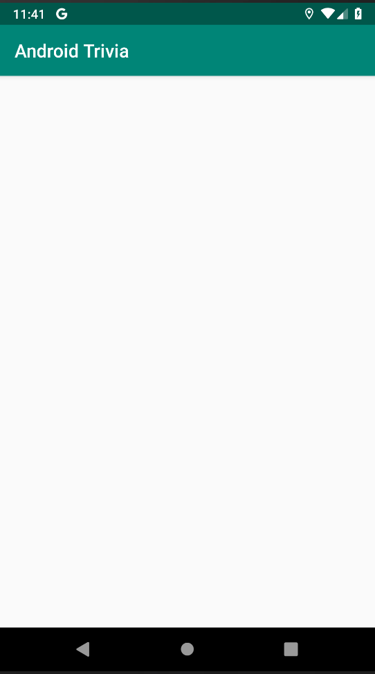
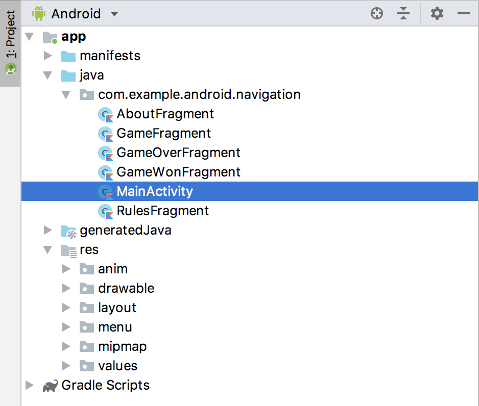
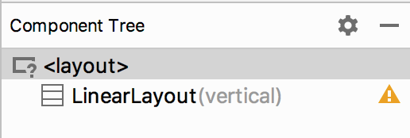
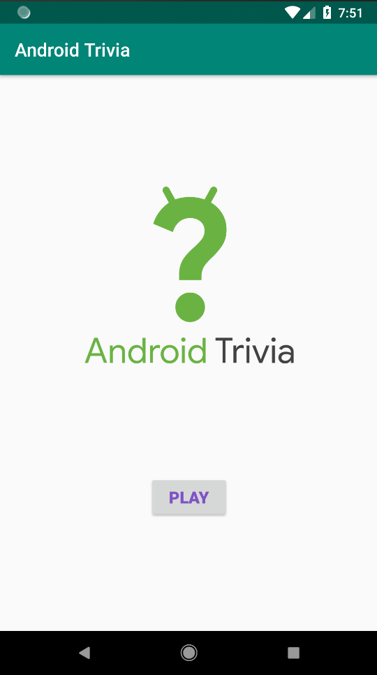

## App overview
In the three projects that make up this lesson, you work on an app called AndroidTrivia. The completed app is a game in which the user answers three trivia questions about Android coding. If the user answers all three questions correctly, they win the game and can share their results.



he AndroidTrivia app illustrates navigation patterns and controls. The app has several components:

- In the title screen, shown on the left in the screenshot above, the user starts the game.
- In the game screen with questions, shown in the middle above, the user plays the game and submits their answers.
- The navigation drawer, shown on the right above, slides out from the side of the app and contains a menu with a header. The drawer icon  opens the navigation drawer. The navigation-drawer menu contains a link to the About page and a link to the rules of the game.

The top of the app displays a colored view called the app bar, which is also known as the action bar.

### Task: Explore the starter app project

In this project, you work from a starter app that provides template code and fragment classes that you need as you complete the Trivia app.

1 - Download the [AndroidTrivia-Starter](https://drive.google.com/drive/folders/1uPbefsr1NZ2deUPRLQLxMzz5k6OceTMU?usp=sharing) Android Studio project.

2 - Open the project in Android Studio and run the app. When the app opens, it doesn't do anything other than display the app name and a blank screen.



3 - In the Android Studio Project pane, open the Project: Android view to explore the project files. Open the app > java folder to see the MainActivity class and fragment classes.



4 - Open the `res > layout` folder and double-click on `activity_main.xml`. The `activity_main.xml` file appears in the Layout Editor.

5 - Click the Design tab. The Component Tree for the `activity_main.xml` file shows the root layout as vertical `LinearLayout`.



In a vertical linear layout, all the child views in the layout are aligned vertically.

### Task: Add a fragment

A fragment represents a behavior or a portion of user interface (UI) in an activity. You can combine multiple fragments in a single activity to build a multi-pane UI, and you can reuse a fragment in multiple activities.

Think of a fragment as a modular section of an activity, something like a "sub activity" that you can also use in other activities:

- A fragment has its own lifecycle and receives its own input events.
- You can add or remove a fragment while the activity is running.
- A fragment is defined in a Kotlin class.
- A fragment's UI is defined in an XML layout file.
- The AndroidTrivia app has a main activity and several fragments. Most of the fragments and their layout files have been defined for you. In this task, you create a fragment and add the fragment to the app's main activity.

#### Step 1: Add a fragment class

In this step, you create a blank `TitleFragment` class. Start by creating a Kotlin class for a new fragment:

1 - In Android Studio, click anywhere inside the Project pane to bring the focus back to the project files. For example, click the com.example.android.navigation folder.

2 - Select File > New > Fragment > Fragment (Blank).

3 - For the fragment name, use TitleFragment. Clear all the checkboxes, including create Layout XML, include fragment factory methods, and include interface callbacks.

4 - Click Finish.

5 - Open the TitleFragment.kt fragment file, if it is not already open. It contains the onCreateView() method, which is one of the methods that's called during a fragment's lifecycle.

6 - In `onCreateView()`, remove the return `TextView(activity)`.apply section, including the line that starts with `setText`. The `onCreateView()` function is left with only the following code:

##### Create a binding object

The fragment won't compile now. To make the fragment compile, you need to create a binding object and inflate the fragment's view (which is equivalent to using s`etContentView()` for an activity).

1 - In the `onCreateView()` method in `TitleFragment.kt`, create a `binding` variable (`val binding`).

2 - To inflate the fragment's view, call the `DataBindingUtil.inflate()` method on the fragment's `Binding` object, which is `FragmentTitleBinding `.

Pass four parameters into the method:

- `inflater`, which is the `LayoutInflater` used to inflate the binding layout.

- The XML layout resource of the layout to inflate. Use one of the layouts that is already defined for you, `R.layout.fragment_title`.

- `container` for the parent `ViewGroup`. (This parameter is optional.)

- `false` for the `attachToParent` value.

- Assign the binding that `DataBindingUtil.inflate` returns to the `binding` variable.

- Return `binding.root` from the method, which contains the inflated view. Your `onCreateView()` method now looks like the following code:

```
override fun onCreateView(inflater: LayoutInflater, container: ViewGroup?,
                         savedInstanceState: Bundle?): View? {
   val binding = DataBindingUtil.inflate<FragmentTitleBinding>(inflater,
           R.layout.fragment_title,container,false)
   return binding.root
   }
```
### Step 2: Add the new fragment to the main layout file

In this step, you add the `TitleFragment` to the app's `activity_main.xml` layout file.

1 - Open `res > layout > activity_main.xml` and click the Text tab to view the layout XML code.

2 - Inside the existing `LinearLayout` element, add a fragment element.

3 - Set the fragment's ID to `titleFragment`.

4 - Set the fragment's name to the full path of the fragment class, which in this case is `com.example.android.navigation.TitleFragment`.

5 - Set the layout width and height to `match_parent`.

```
<layout xmlns:android="http://schemas.android.com/apk/res/android"
    xmlns:app="http://schemas.android.com/apk/res-auto">

        <LinearLayout
            android:layout_width="match_parent"
            android:layout_height="match_parent"
            android:orientation="vertical">
            <fragment
                android:id="@+id/titleFragment"
                android:name="com.example.android.navigation.TitleFragment"
                android:layout_width="match_parent"
                android:layout_height="match_parent"
                />
        </LinearLayout>

</layout>
```
6 - Run the app. The fragment has been added to your main screen.



#### Summary
In this project, you added a fragment to the AndroidTrivia app, which you will keep working on in the next two project in this lesson.

- A fragment is a modular section of an activity.

- A fragment has its own lifecycle and receives its own input events.

- Use the `<fragment>` tag to define the layout for the fragment in the XML layout file.

- Inflate the layout for a fragment in `onCreateView()`.

- You can add or remove a fragment while the activity is running.