## App overview

The AndroidTrivia app, which you started working on in the previous project, is a game in which users answer questions about Android development. If the user answers three questions correctly, they win the game.

Use that code as the starter code for this project.

In this project, you update the AndroidTrivia app in the following ways:

- You create a navigation graph for the app.

- You add navigation for a title screen and a game screen.

- You connect the screens with an action, and you give the user a way to navigate to the game screen by tapping Play.

- You add an Up button, which is shown as the left-arrow at the top of some screens.

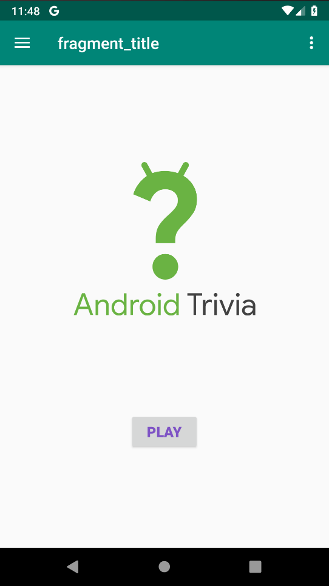

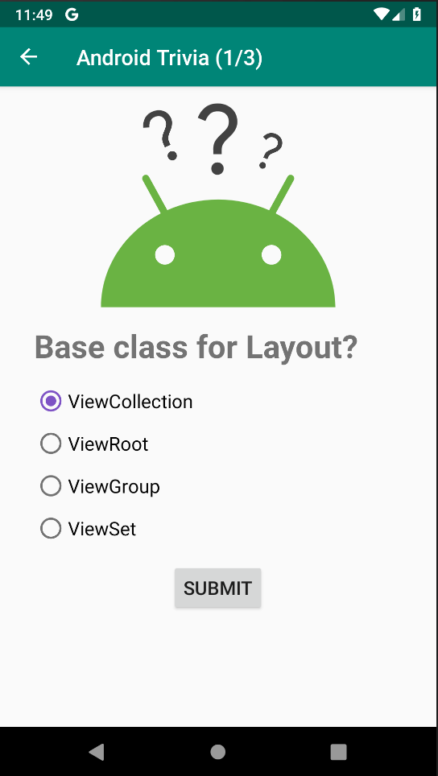


### Task: Add navigation components to the project

### Step 1: Add navigation dependencies

To use the navigation library, you need to add the navigation dependencies to your Gradle files.

1 - Open the AndroidTrivia app in Android Studio.

2 - In the Project: Android pane, open the Gradle Scripts folder. Double-click on the project-level build.gradle file to open the file.

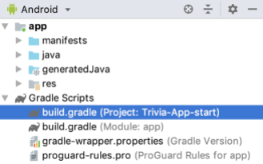

3 - At the top of the project-level `build.gradle` file, along with the other ext variables, add a variable for the `navigationVersion`. To find the latest navigation version number, see [Declaring dependencies](https://developer.android.com/jetpack/androidx/releases/navigation#declaring_dependencies) in the Android developer documentation.

```
ext {
        ...
        navigationVersion = '1.0.0-rc02'
        ...
    }
```

4 - In the Gradle Scripts folder, open the module-level `build.gradle` file. Add the dependencies for `navigation-fragment-ktx` and `navigation-ui-ktx`, as shown below:

```
dependencies {
  ...
  implementation"android.arch.navigation:navigation-fragment-ktx:$navigationVersion"
  implementation "android.arch.navigation:navigation-ui-ktx:$navigationVersion"
  ...
}
```

5 - Rebuild the project.

### Step 2: Add a navigation graph to the project

1 - In the Project: Android pane, right-click on the res folder and select New > Android Resource File.

2 - In the New Resource File dialog, select Navigation as the Resource type.

3 - In the File name field, name the file navigation.

4 - Make sure the Chosen qualifiers box is empty, and click OK. A new file, navigation.xml, appears in the res > navigation folder.

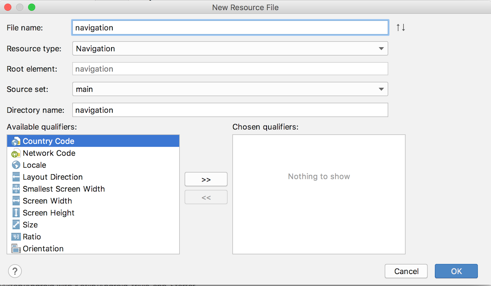

5 - Open the res > navigation > `navigation.xml` file and click the Design tab to open the Navigation Editor. Notice the No NavHostFragments found message in the layout editor. You fix this problem in the next task.

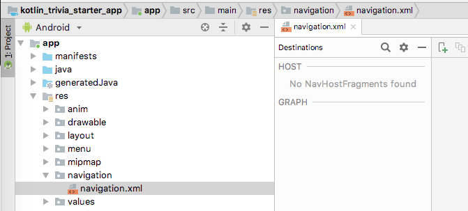

### Task: Create the NavHostFragment

A navigation host fragment acts as a host for the fragments in a navigation graph. The navigation host fragment is usually named `NavHostFragment`.

As the user moves between destinations defined in the navigation graph, the navigation host fragment swaps fragments in and out as necessary. The fragment also creates and manages the appropriate fragment back stack.

In this task, you modify your code to replace the `TitleFragment` with the `NavHostFragment`.

1 - Open res > layout > `activity_main.xml` and click the Text tab.

2 - In the `activity_main.xml` file, change the name of the existing title fragment to `androidx.navigation.fragment.NavHostFragment`.

3 - Change the ID to `myNavHostFragment`.

4 - The navigation host fragment needs to know which navigation graph resource to use. Add the `app:navGraph` attribute and set it to the navigation graph resource, which is `@navigation/navigation`.

5 - Add the `app:defaultNavHos`t attribute and set it to `"true"`. Now this navigation host is the default host and will intercept the system Back button.

Inside the `activity_main.xml` layout file, your `fragment` now looks like the following:

```
<!-- The NavHostFragment within the activity_main layout -->
            <fragment
                android:id="@+id/myNavHostFragment"
                android:name="androidx.navigation.fragment.NavHostFragment"
                android:layout_width="match_parent"
                android:layout_height="match_parent"
                app:navGraph="@navigation/navigation"
                app:defaultNavHost="true" />
```

### Task: Add fragments to the navigation graph

In this task, you add the title fragment and the game fragment to the app's navigation graph. You connect the fragments to each other. Then you add a click handler to the Play button so that the user can navigate from the title screen to the game screen.

#### Step 1: Add two fragments to the navigation graph and connect them with an action

1 - Open `navigation.xml` from the navigation resource folder. In the Navigation Editor, click the New Destination button . A list of fragments and activities appears.

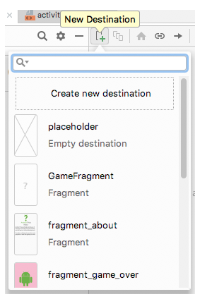

2 - Select `fragment_title`. You add fragment_title first because the `TitleFragment` fragment is where app users start when they first open the app.

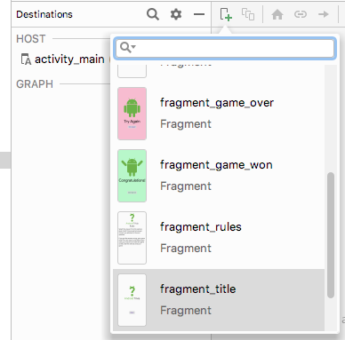

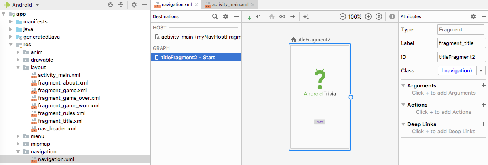

3 - Use the New Destination button to add the GameFragment.

If the preview shows a "Preview Unavailable" message, click the Text tab to open the navigation XML. Make sure that the `fragment` element for the gameFragment includes `tools:layout="@layout/fragment_game"`, as shown below.

```
<!-- The game fragment within the navigation XML, complete with tools:layout. -->
<fragment
   android:id="@+id/gameFragment"
   android:name="com.example.android.navigation.GameFragment"
   android:label="GameFragment"
   tools:layout="@layout/fragment_game" />
```

4 - In the layout editor, drag the game fragment to the right so it doesn't overlap with the title fragment.

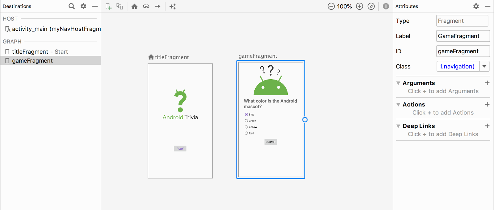

### Step 2: Add a click handler to the Play button

The title fragment is connected to the game fragment by an action. Now you want the Play button on the title screen to navigate the user to the game screen.

1 - In Android Studio, open the `TitleFragment.kt file`. Inside the `onCreateView()` method, add the following code before the return statement:

``binding.playButton.setOnClickListener{}``

2 - Inside `setOnClickListener`, add code to access the Play button through the binding class and navigate to the game fragment:

```
//The complete onClickListener with Navigation
binding.playButton.setOnClickListener { view : View ->
       view.findNavController().navigate(R.id.action_titleFragment_to_gameFragment)
}
```

3 - Build the app and make sure that it has all the imports it needs. For example, you might need to add the following line to the `TitleFragment.kt` file:

`import androidx.navigation.findNavController`

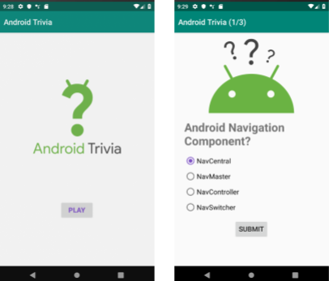

### Task: Add conditional navigation

In this step, you add conditional navigation, which is navigation that's only available to the user in certain contexts. A common use case for conditional navigation is when an app has a different flow, depending on whether the user is logged in.

Your app is a different case: Your app will navigate to a different fragment, based on whether the user answers all the questions correctly.

The starter code contains two fragments for you to use in your conditional navigation:

- The `GameWonFragment` takes the user to a screen that shows a "Congratulations!" message.

- The `GameOverFragment` takes the user to a screen that shows a "Try Again" message.

### Step 1: Add GameWonFragment and GameOverFragment to the navigation graph

1 - Open the `navigation.xml file`, which is in the `navigation` folder.

2 - To add the game-over fragment to the navigation graph, click the New Destination button  in the Navigation Editor and select fragment_game_over.

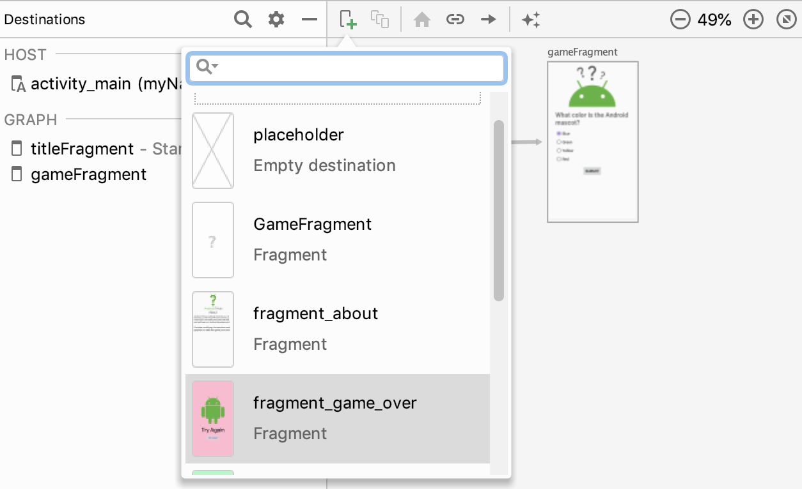

3 - In the preview area of the layout editor, drag the game-over fragment to the right of the game fragment so the two don't overlap. Make sure to change the ID attribute of the game-over fragment, to gameOverFragment.

4 - To add the game-won fragment to the navigation graph, click the New Destination button  and select fragment_game_won.

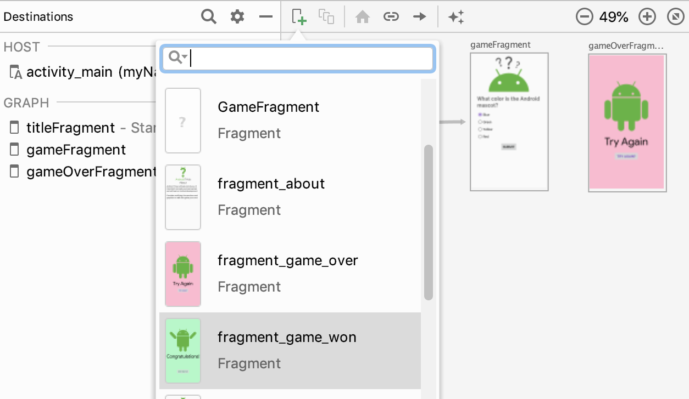


5 - Drag the game-won fragment below the game-over fragment so the two don't overlap. Make sure to name ID attribute of the game-won fragment as `gameWonFragment`.

The Layout Editor now looks something like the following screenshot:

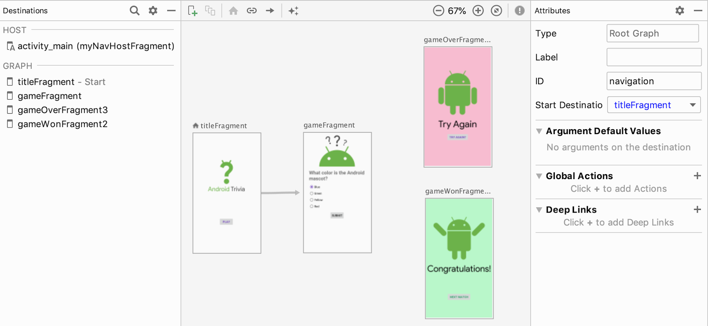

#### Step 2: Connect the game fragment to the game-result fragment

In this step, you connect the game fragment to both the game-won fragment and the game-over fragment.

1 - In the preview area of the Layout Editor, hold the pointer over the game fragment until the circular connection point appears.

2 - Click the connection point and drag it to the game-over fragment. A blue connection line appears, representing an action that now connects the game fragment to the game-over fragment.

3 - In the same way, create an action that connects the game fragment to the game-won fragment. The Layout Editor now looks something like the following screenshot:

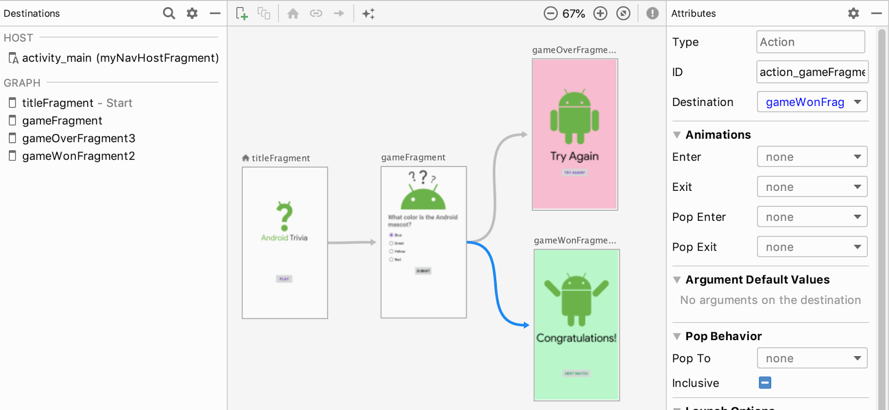

4 - In the preview, hold the pointer over the line that connects the game fragment to the game-won fragment. Notice that the ID for the action has been assigned automatically.

### Step 3: Add code to navigate from one fragment to the next

`GameFragment` is a fragment class that contains questions and answers for the game. The class also includes logic that determines whether the user wins or loses the game. You need to add conditional navigation in the `GameFragment` class, depending on whether the player wins or loses.

1 - Open the `GameFragment.kt` file. The `onCreateView()` method defines an `if / else` condition that determines whether the player has won or lost:

```
binding.submitButton.setOnClickListener @Suppress("UNUSED_ANONYMOUS_PARAMETER")
        { 
              ...
                // answer matches, we have the correct answer.
                if (answers[answerIndex] == currentQuestion.answers[0]) {
                    questionIndex++
                    // Advance to the next question
                    if (questionIndex < numQuestions) {
                        currentQuestion = questions[questionIndex]
                        setQuestion()
                        binding.invalidateAll()
                    } else {
                        // We've won!  Navigate to the gameWonFragment.
                    }
                } else {
                    // Game over! A wrong answer sends us to the gameOverFragment.
                }
            }
        }
```

2 - Inside the else condition for winning the game, add the following code, which navigates to the `gameWonFragment`. Make sure that the action name (`action_gameFragment_to_gameWonFragment` in this example) exactly matches what's set in the `navigation.xml` file.

```
// We've won!  Navigate to the gameWonFragment.
view.findNavController()
   .navigate(R.id.action_gameFragment_to_gameWonFragment)
```
3 - Inside the else condition for losing the game, add the following code, which navigates to the `gameOverFragment:`

```
// Game over! A wrong answer sends us to the gameOverFragment.
view.findNavController().
   navigate(R.id.action_gameFragment_to_gameOverFragment)
```

4 - Run the app and play the game by answering the questions. If you answer all three questions correctly, the app navigates to the `GameWonFragment`.

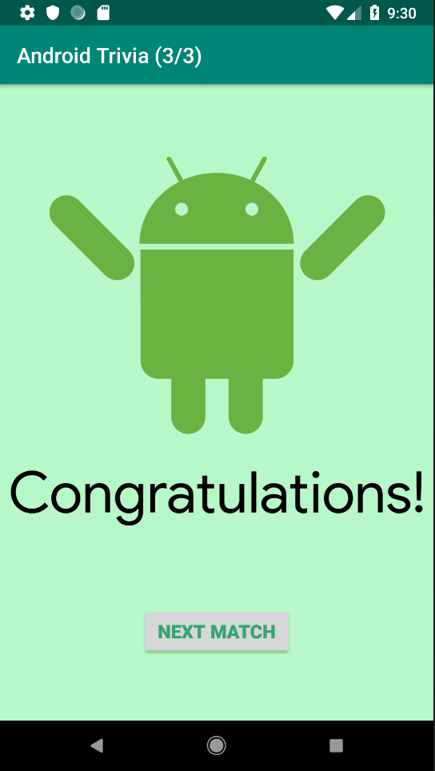

If you get any question wrong, the app immediately navigates to the `GameOverFragment`.

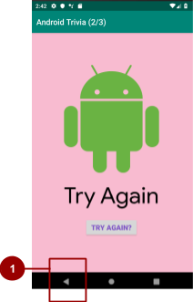

The Android system's Back button is shown as 1 in the screenshot above. If the user presses the Back button in the game-won fragment or the game-over fragment, the app navigates to the question screen. Ideally, the Back button should navigate back to the app's title screen. You change the destination for the Back button in the next task.

### Task: Change the Back button's destination

The Android system keeps track of where users navigate on an Android-powered device. Each time the user goes to a new destination on the device, Android adds that destination to the back stack.

When the user presses the Back button, the app goes to the destination that's at the top of the back stack. By default, the top of the back stack is the screen that the user last viewed. The Back button is typically the left-most button at the bottom of the screen, as shown below. (The Back button's exact appearance is different on different devices.)


Until now, you've let the navigation controller handle the back stack for you. When the user navigates to a destination in your app, Android adds this destination to the back stack.

In the AndroidTrivia app, when the user presses the Back button from the `GameOverFragment` or `GameWonFragment` screen, they end up back in the `GameFragment`. But you don't want to send the user to the `GameFragment`, because the game is over. The user could restart the game, but a better experience would be to find themselves back at the title screen.

A navigation action can modify the back stack. In this task, you change the action that navigates from the game fragment so that the action removes the `GameFragment` from the back stack. When the user wins or loses the game, if they press the Back button, the app skips the `GameFragment` and goes back to the `TitleFragment`.

### Step 1: Set the pop behavior for the navigation actions

In this step, you manage the back stack so that when the user is at the `GameWon` or `GameOver` screen, pressing the Back button returns them to the title screen. You manage the back stack by setting the "pop" behavior for the actions that connect the fragments:

- The `popUpTo` attribute of an action "pops up" the back stack to a given destination before navigating. (Destinations are removed from the back stack.)

- If the `popUpToInclusive` attribute is `false `or is not set, `popUpTo` removes destinations up to the specified destination, but leaves the specified destination in the back stack.

- If `popUpToInclusive` is set to `true`, the `popUpTo` attribute removes all destinations up to and including the given destination from the back stack.

- If `popUpToInclusive` is true and `popUpTo` is set to the app's starting location, the action removes all app destinations from the back stack. The Back button takes the user all the way out of the app.

In this step, you set the popUpTo attribute for the two actions that you created in the previous task. You do this using the Pop To field in the Attributes pane of the Layout Editor.

1 - Open `navigation.xml` in the res > navigation folder. If the navigation graph does not appear in the layout editor, click the Design tab.

2 - Select the action for navigating from the `gameFragment` to the `gameOverFragment`. (In the preview area, the action is represented by a blue line that connects the two fragments.)

3 - In the Attributes pane, set Pop To to `gameFragment`. Select the Inclusive checkbox.

This sets the popUpTo and p`opUpToInclusive` attributes in the XML. The attributes tell the navigation component to remove fragments from the back stack up to and including `GameFragment`. (This has the same effect as setting the Pop To field to titleFragment and clearing the Inclusive checkbox.)

4 - Select the action for navigating from the `gameFragment` to the `gameWonFragment`. Again, set Pop To to `gameFragment` in the Attributes pane and select the Inclusive checkbox.

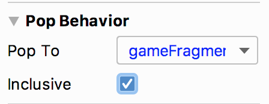

5 - Run the app and play the game, then press the Back button. Whether you win or lose, the Back button takes you back to the `TitleFragment`.

### Step 2: Add more navigation actions and add onClick handlers
Y
our app currently has the following user flow:

- The user plays the game and wins or loses, and the app navigates to the GameWon or GameOver screen.

- If the user presses the system Back button at this point, the app navigates to the TitleFragment. (You implemented this behavior in Step 1 of this task, above.)

In this step you implement two more steps of user flow:

- If the user taps the Next Match or Try Again button, the app navigates to the `GameFragment` screen.

- If the user presses the system Back button at this point, the app navigates to the `TitleFragment` screen (instead of back to the `GameWon` or `GameOver` screen).

To create this user flow, use the `PopUpTo` attribute to manage the back stack:

1 - Inside the `navigation.xml` file, add a navigation action connecting gameOverFragment to gameFragment. Make sure that the fragment names in the action's ID match the fragment names that are in the XML. For example, the action ID might be `action_gameOverFragment_to_gameFragment`.

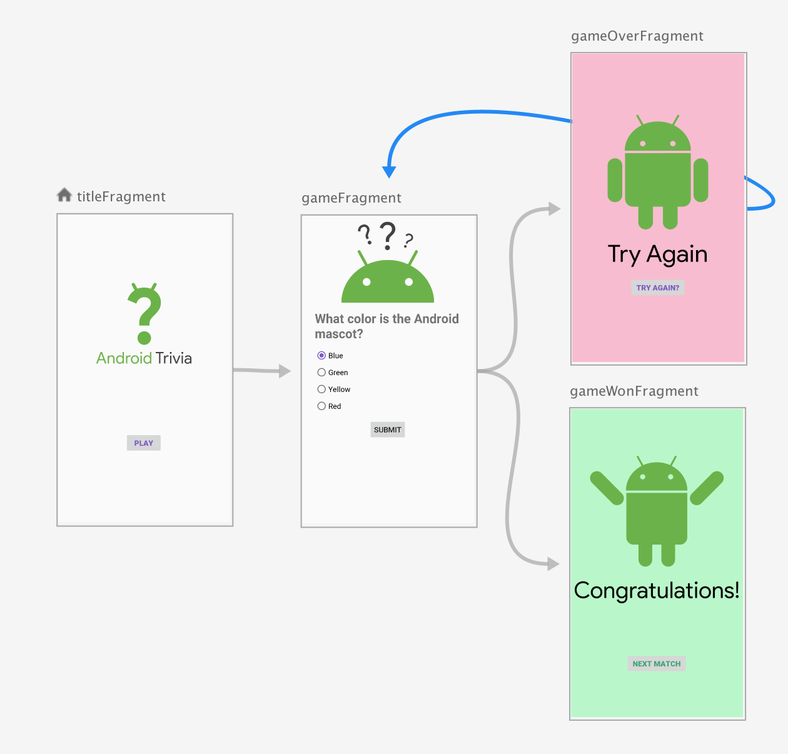

2 - In the Attributes pane, set the action's Pop To attribute to `titleFragment`.

3 - Clear the Inclusive checkbox, because you do not want the `titleFragment` to be included in the destinations that are removed from the back stack. Instead, you want everything up to the `TitleFragment` (but not including it) to be removed from the back stack.

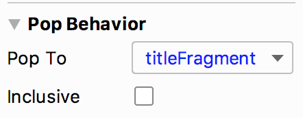

4 - Inside the `navigation.xml` file, add a navigation action connecting `gameWonFragment` to `gameFragment`.

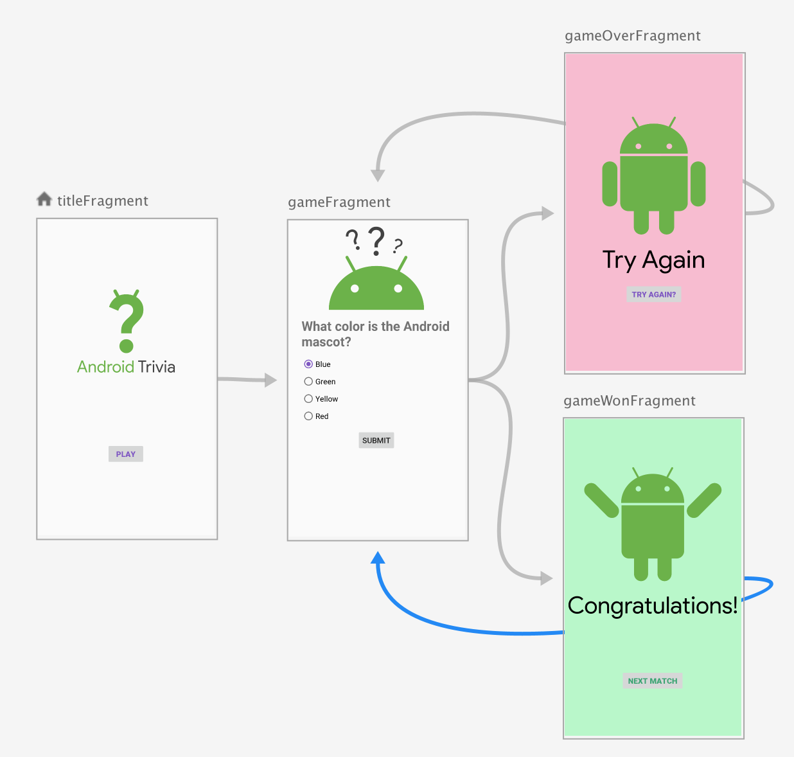

5 - For the action you just created, set the Pop To attribute to `titleFragment` and clear the Inclusive checkbox.

Now add functionality to the Try Again and Next Match buttons. When the user taps either button, you want the app to navigate to the `GameFragment` screen so that the user can try the game again.

1 - Open the `GameOverFragment.kt` Kotlin file. At the end of the onCreateView() method, before the return statement, add the following code. The code adds a click listener to the Try Again button. When the user taps the button, the app navigates to the game fragment.

```
// Add OnClick Handler for Try Again button
        binding.tryAgainButton.setOnClickListener{view: View->
        view.findNavController()
                .navigate(R.id.action_gameOverFragment_to_gameFragment)}
```

2 - Open the `GameWonFragment.kt` Kotlin file. At the end of the `onCreateView()` method, before the return statement, add the following code:

```
// Add OnClick Handler for Next Match button
        binding.nextMatchButton.setOnClickListener{view: View->
            view.findNavController()
                    .navigate(R.id.action_gameWonFragment_to_gameFragment)}
```

3 - Run your app, play the game, and test the Next Match and Try Again buttons. Both buttons should take you back to the game screen so that you can try the game again.

4 - After you win or lose the game, tap Next Match or Try Again. Now press the system Back button. The app should navigate to the title screen, instead of going back to the screen that you just came from.

### Task: Add an Up button in the app bar

#### The app bar

The app bar, sometimes called the action bar, is a dedicated space for app branding and identity. For example, you can set the app bar's color. The app bar gives the user access to familiar navigation features such as an options menu. To access the options menu from the app bar, the user taps the icon with the three vertical dots .

The app bar displays a title string that can change with each screen. For the title screen of the AndroidTrivia app, the app bar displays "Android Trivia." On the question screen, the title string also shows which question the user is on ("1/3," "2/3," or "3/3.")

#### The Up button

Currently in your app, the user uses the system Back button to navigate to previous screens. However, Android apps can also have an on-screen Up button that appears at the top left of the app bar.

In the AndroidTrivia app, you want the Up button to appear on every screen except the title screen. The Up button should disappear when the user reaches the title screen, because the title screen is at the top of the app's screen hierarchy.

Up button versus Back button:

- The Up button, shown as 1 in the screenshot below, appears in the app bar.
- The Up button navigates within the app, based on the hierarchical relationships between screens. The Up button never navigates the user out of the app.
- The Back button, shown as 2 in the screenshot below, appears in the system navigation bar or as a mechanical button on the device itself, no matter what app is open.
- The Back button navigates backward through screens that the user has recently worked with (the back stack).

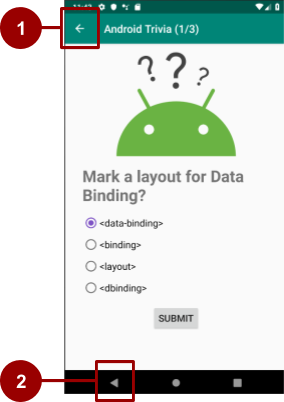

### Add support for an Up button
The navigation components includes a UI library called NavigationUI. The navigation controller integrates with the app bar to implement the behavior of the Up button, so you don't have to do it yourself.

In the following steps, you use the navigation controller to add an Up button to your app:

1 - Open the `MainActivity.kt` kotlin file. Inside the `onCreate()` method, add code to find the navigation controller object:

`val navController = this.findNavController(R.id.myNavHostFragment)`

2 - Also inside the `onCreate()` method, add code to link the navigation controller to the app bar:

`NavigationUI.setupActionBarWithNavController(this,navController)`

3 - After the `onCreate()` method, override the `onSupportNavigateUp()` method to call `navigateUp()` in the navigation controller:

```
override fun onSupportNavigateUp(): Boolean {
        val navController = this.findNavController(R.id.myNavHostFragment)
        return navController.navigateUp()
    }

```

4 - Run the app. The Up button appears in the app bar on every screen except the title screen. No matter where you are in the app, tapping the Up button takes you to the title screen.
 
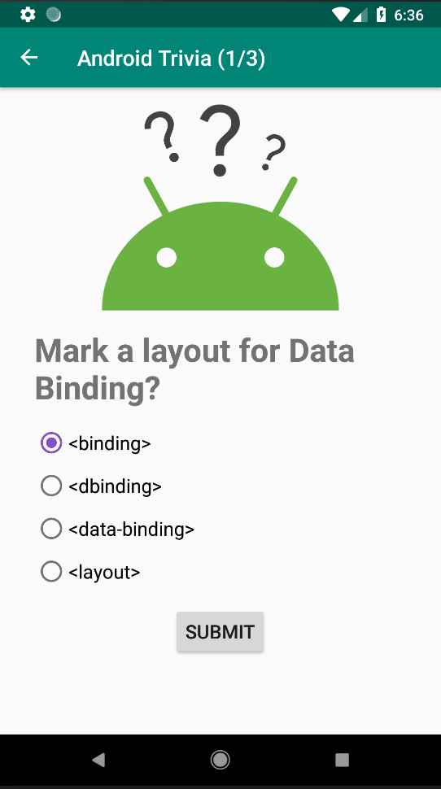

### Task: Add an options menu

Android has different types of menus, including the options menu. On modern Android devices, the user accesses the options menu by tapping three vertical dots  that appear in the app bar.

In this task, you add an About menu item to the options menu. When the user taps the About menu item, the app navigates to the `AboutFragment`, and the user sees information about how to use the app.

### Step 1: Add the AboutFragment to the navigation graph

Open the `navigation.xml` file and click the Design tab to see the navigation graph.

Click the New Destination button and select `fragment_about`.

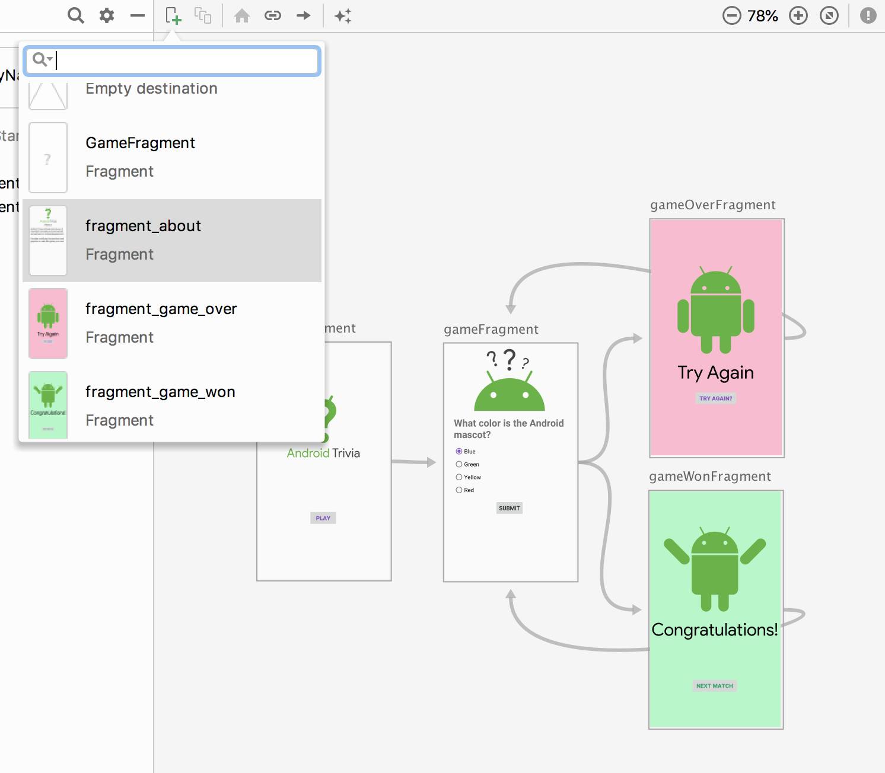

3 - In the layout editor, drag the "about" fragment to the left so it doesn't overlap with the other fragments. Make sure the fragment's `ID` is` aboutFragment`.

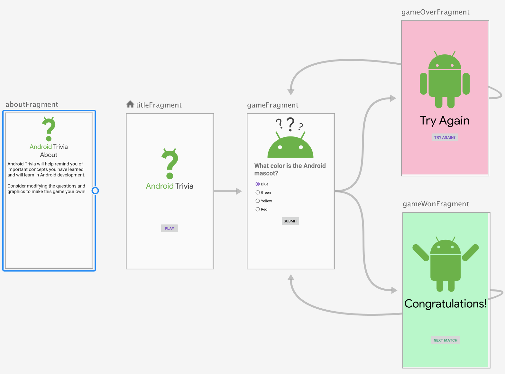

### Step 2: Add the options-menu resource

1 - In the Android Studio Project pane, right-click on the res folder and select New > Android Resource File.

2 - In the New Resource File dialog, name the file options_menu.

3 - Select Menu as the Resource type and click OK.

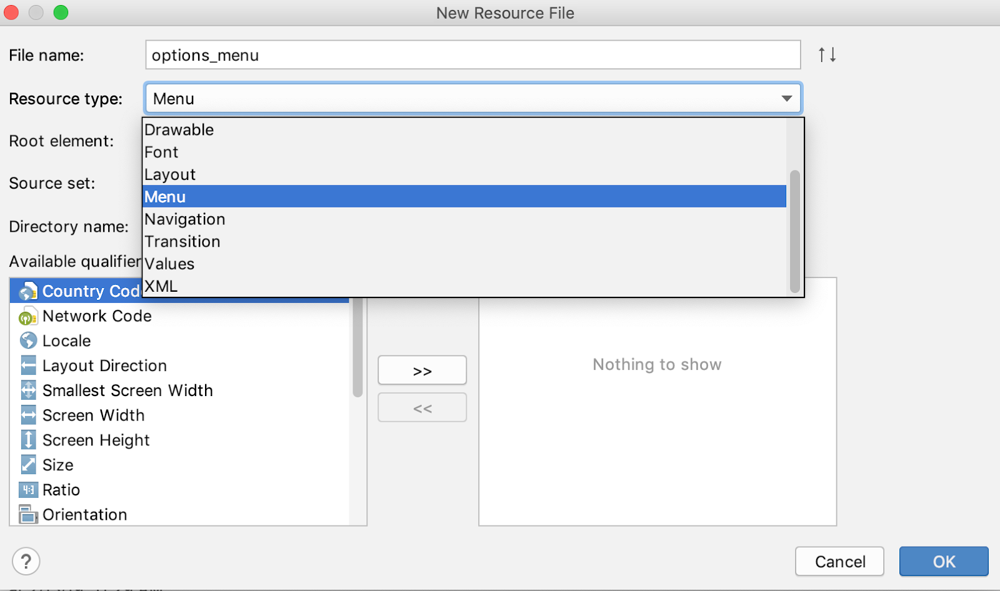

4 - Open the options_menu.xml file from the res > menu folder and click the Design tab to see the Layout Editor.

5 - From the Palette pane, drag a Menu Item (shown as 1 in the screenshot below) and drop it anywhere in the design editor pane (2). A menu item appears in the preview (3) and in the Component Tree (4).

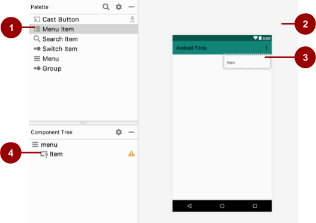

5 - In the preview or in the Component Tree, click the menu item to show its attributes in the Attributes pane.
    
6 - Set the menu item's ID to aboutFragment. Set the title to @string/about.
    
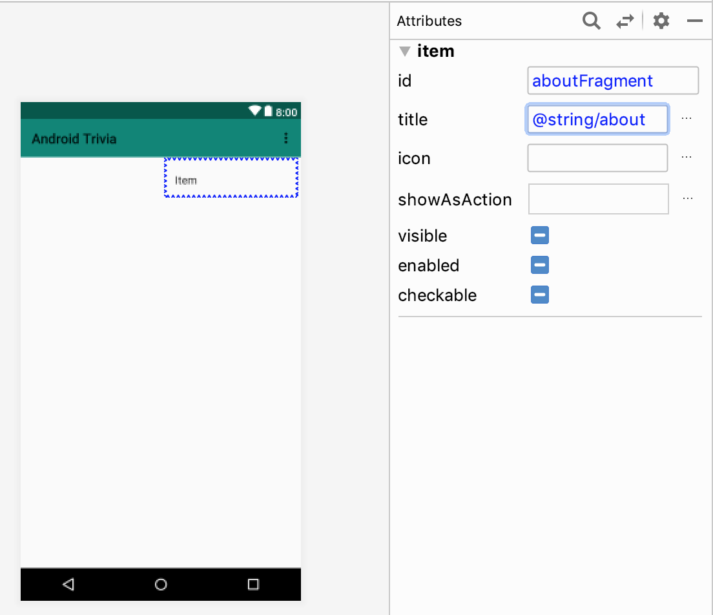

`Tip: Make sure that the ID of the menu item that you just added is exactly the same as the ID of the AboutFragment that you added in the navigation graph. This will make the code for the onClick handler much simpler.`

### Step 3: Add an onClick handler

In this step, you add code to implement behavior when the user taps the About menu item.

1 - Open the `TitleFragment.kt` Kotlin file. Inside the `onCreateView()` method, before the return, call the `setHasOptionsMenu()` method and pass in `true`.

```
override fun onCreateView(inflater: LayoutInflater, container: ViewGroup?,
                         savedInstanceState: Bundle?): View? {
   ...
   setHasOptionsMenu(true)
   return binding.root
}
```

2 - After the `onCreateView()` method, override the `onCreateOptionsMenu()` method. In the method, add the options menu and inflate the menu resource file.

```
override fun onCreateOptionsMenu(menu: Menu?, inflater: MenuInflater?) {
   super.onCreateOptionsMenu(menu, inflater)
   inflater?.inflate(R.menu.options_menu, menu)
}

```

3 - Override the `onOptionsItemSelected()` method to take the appropriate action when the menu item is tapped. In this case, the action is to navigate to the fragment that has the same id as the selected menu item.

```
override fun onOptionsItemSelected(item: MenuItem?): Boolean {
   return NavigationUI.onNavDestinationSelected(item!!,
           view!!.findNavController())
           || super.onOptionsItemSelected(item)
}
```


4 - If the app doesn't build, check to see whether you need to import packages to fix unresolved references in the code. For example, you can add `import android.view`.* to resolve several references (and replace more specific imports such as import `android.view.ViewGroup`).

5 - Run the app and test the About menu item that's in the options menu. When you tap the menu item, the app should navigate to the "about" screen.

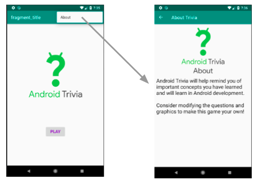

### Task: Add the navigation drawer

In this task, you add a navigation drawer to the AndroidTrivia app. The navigation drawer is a panel that slides out from the edge of the screen. The drawer typically contains a header and a menu.

On phone-sized devices, the navigation drawer is hidden when not in use. Two types of user actions can make the navigation drawer appear:

- The drawer appears when the user swipes from the starting edge of the screen toward the ending edge of the screen. In the AndroidTrivia app, the navigation drawer will appear when the user swipes from left to right.

- The drawer appears when the user is at the start destination of the app and taps the drawer icon in the app bar. (The drawer icon is sometimes called the nav drawer button or hamburger icon .)

The screenshot below shows an open navigation drawer.

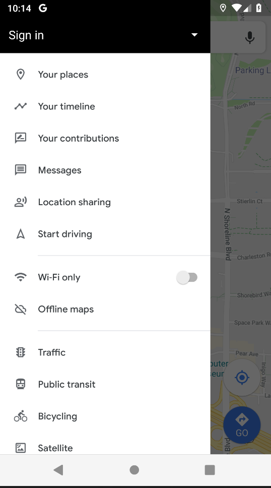

he navigation drawer is part of the Material Components for Android library, or Material library. You use the Material library to implement patterns that are part of Google's Material Design guidelines.

In your AndroidTrivia app, the navigation drawer will contain two menu items. The first item points to the existing "about" fragment, and the second item will point to a new "rules" fragment.

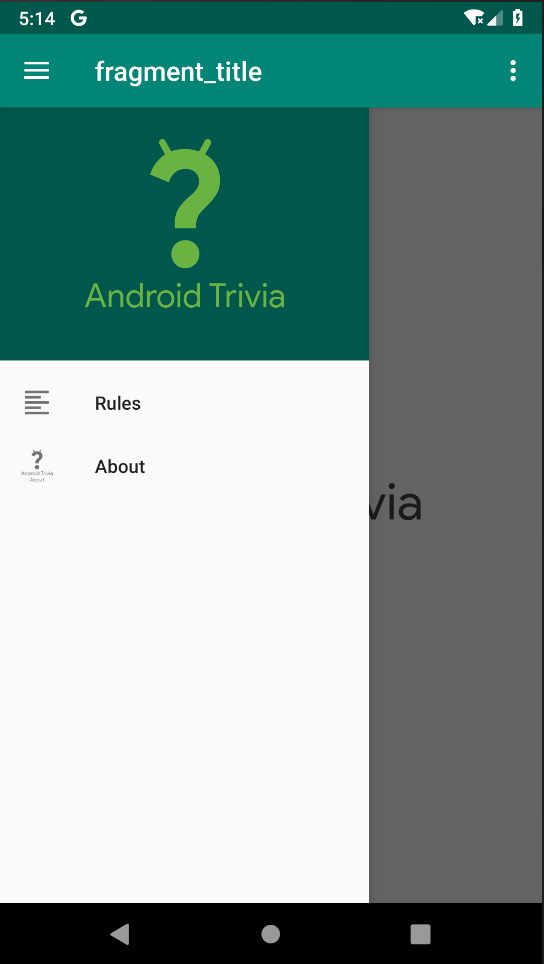

### Step 1: Add the Material library to your project

1 - In the app-level Gradle build file, add the dependency for the Material library:

```
dependencies {
    ...
    implementation "com.google.android.material:material:$supportlibVersion"
    ...
}
```

2 - Sync your project.

### Step 2: Make sure the destination fragments have IDs

The navigation drawer will have two menu items, each representing a fragment that can be reached from the navigation drawer. Both destinations must have an ID in the navigation graph.

The `AboutFragment` already has an `ID` in the navigation graph, but the `RulesFragment` does not, so add it now:

1 - Open the `fragment_rules.xml` layout file to see what it looks like. Click the Design tab to look at the preview in the design editor.

2 - Open the `navigation.xml` file in the Navigation Editor. Click the New Destination button and add the rules fragment. Set its `ID` to `rulesFragment`.


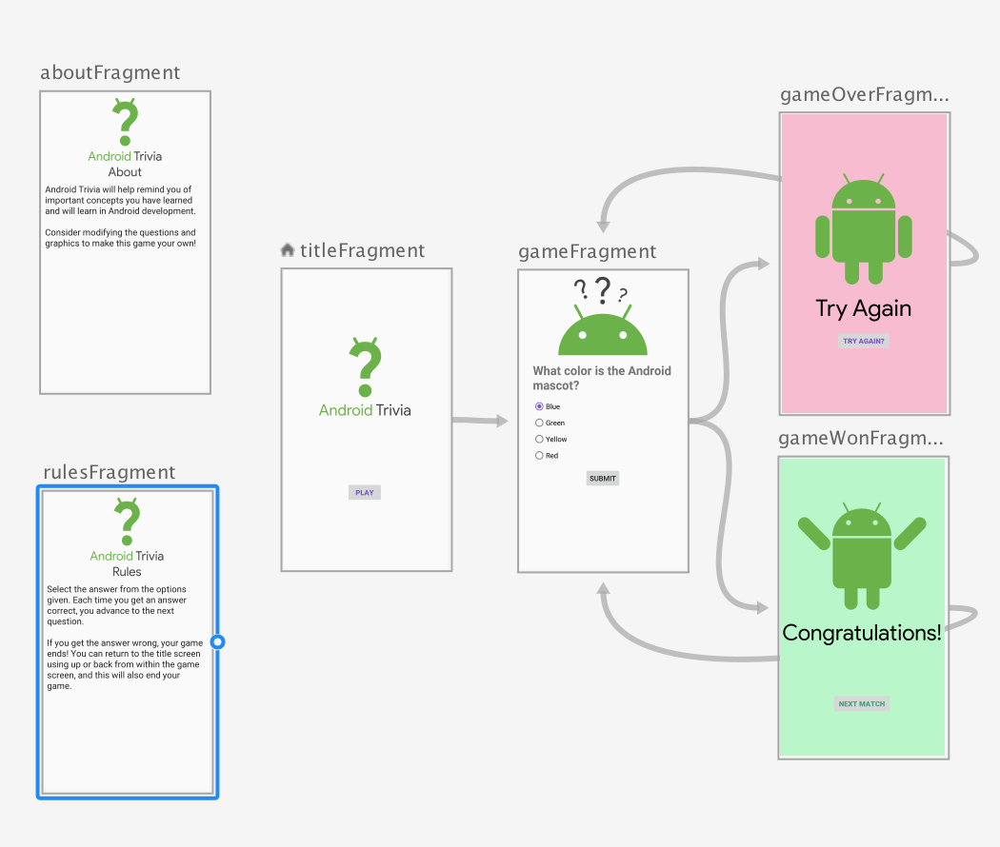

### Step 3: Create the drawer menu and the drawer layout

To create a navigation drawer, you create the navigation menu. You also need to put your views inside a `DrawerLayout` in the layout file.

1 - Create the menu for the drawer. In the Project pane, right-click on the res folder and select New Resource File. Name the file `navdrawer_menu`, set the resource type to Menu, and click OK.

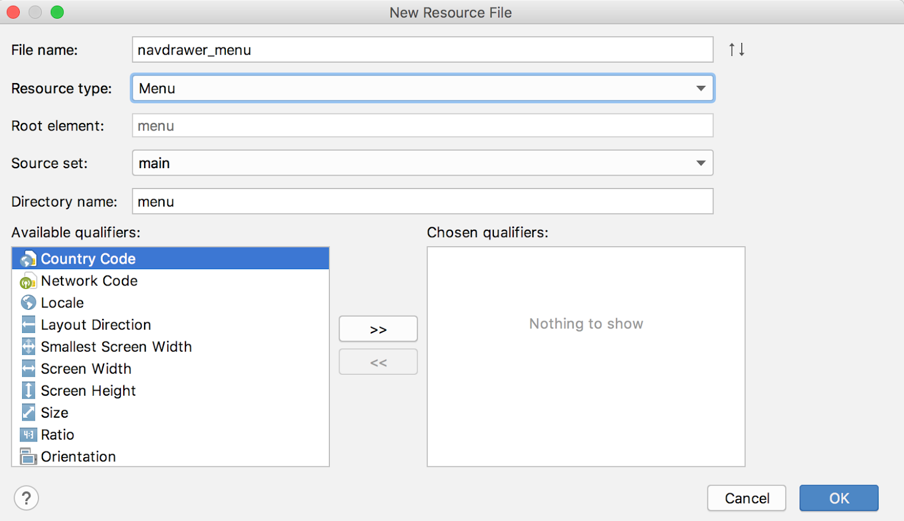

2 - Open navdrawer_menu.xml from the res > menu folder, then click the Design tab. Add two menu items by dragging menu items from the Palette pane into the Component Tree pane.

3 - For the first menu item, set the id to rulesFragment. (The ID for a menu item should be the same as the ID for the fragment.) Set the title to @string/rules and the icon to @drawable/rules.


4 - For the second menu item, set the id to aboutFragment, the title string to `@string/about`, and the icon to `@drawable/about_android_trivia`.

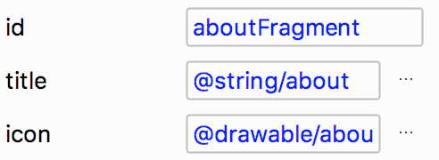

`Note: If you use the same ID for the menu item as for the destination fragment, you don't need to write any code at all to implement the onClick listener!`

5 - Open the `activity_main.xmllayout` file. To get all the drawer functionality for free, put your views inside a `DrawerLayout`. Wrap the entire `<LinearLayout>` inside a `<DrawerLayout>`. (In other words, add a DrawerLayout as the root view.)

```
<layout xmlns:android="http://schemas.android.com/apk/res/android"
   xmlns:app="http://schemas.android.com/apk/res-auto">
   <androidx.drawerlayout.widget.DrawerLayout
       android:id="@+id/drawerLayout"
       android:layout_width="match_parent"
       android:layout_height="match_parent">

   <LinearLayout
       . . . 
       </LinearLayout>
   </androidx.drawerlayout.widget.DrawerLayout>
</layout>
```

6 - Now add the drawer, which is a NavigationView that uses the navdrawer_menu that you just defined. Add the following code in the DrawerLayout, after the `</LinearLayout>` element:

```
<com.google.android.material.navigation.NavigationView
   android:id="@+id/navView"
   android:layout_width="wrap_content"
   android:layout_height="match_parent"
   android:layout_gravity="start"
   app:headerLayout="@layout/nav_header"
   app:menu="@menu/navdrawer_menu" />
```

### Step 4: Display the navigation drawer

You created the menu items for the navigation drawer and the navigation drawer layout. Now you need to connect the navigation drawer to the navigation controller so that when users select items in the navigation drawer, the app navigates to the appropriate fragment.

1 - Open the `Mainactivity.kt` Kotlin file. In `onCreate()`, add the code that allows the user to display the navigation drawer. Do this by calling `setupWithNavController()`. Add the following code at the bottom of `onCreate()`:

`NavigationUI.setupWithNavController(binding.navView, navController)`

2 - Run your app. Swipe from the left edge to display the navigation drawer, and make sure each of the menu items in the drawer goes to the right place.

Although the navigation drawer works, you need to fix one more thing. Typically apps also allow users to display the navigation drawer by tapping the drawer button (three lines)  in the app bar on the home screen. Your app does not yet display the drawer button on the home screen.

### Step 5: Display the navigation drawer from the drawer button

The final step is to enable the user to access the navigation drawer from the drawer button at the top left of the app bar.

In the `Mainactivity.kt` Kotlin file, add the `lateinit` drawerLayout member variable to represent the drawer layout:
    
    `private lateinit var drawerLayout: DrawerLayout`

```
Note: Kotlin is a "null safety" language. One of the ways it offers null safety is through the lateinit modifier, which lets you delay the initialization of the variable without any danger of returning a null reference.

In this case, drawerLayout is declared with lateinit to avoid the need to make it nullable. It will be initialized in onCreate().
```
2 - Inside the `onCreate()` method, initialize drawerLayout, after the binding variable has been initialized.

```
val binding = DataBindingUtil.setContentView<ActivityMainBinding>(this,
                R.layout.activity_main)

drawerLayout = binding.drawerLayout
```

3 - Add the `drawerLayout` as the third parameter to the `setupActionBarWithNavController()` method:

```
NavigationUI.setupActionBarWithNavController(this, navController, drawerLayout)
```

4 - Edit the `onSupportNavigateUp()` method to return `NavigationUI.navigateUp` instead of returning `navController.navigateUp`. Pass the navigation controller and the drawer layout to `navigateUp()`. The method will look like as follows:

```
override fun onSupportNavigateUp(): Boolean {
   val navController = this.findNavController(R.id.myNavHostFragment)
   return NavigationUI.navigateUp(navController, drawerLayout)
}
```

5 - You might need to add another import to the file so all the references resolve, for example:

`import androidx.drawerlayout.widget.DrawerLayout`

6 - Run your app. Swipe from the left edge to display the navigation drawer, and make sure each of the menu items in the drawer goes to the right place.

7 - Go to the home screen and tap the nav drawer button  to make sure the navigation drawer appears. Make sure that clicking the Rules or About options in the navigation drawer takes you to the right place.

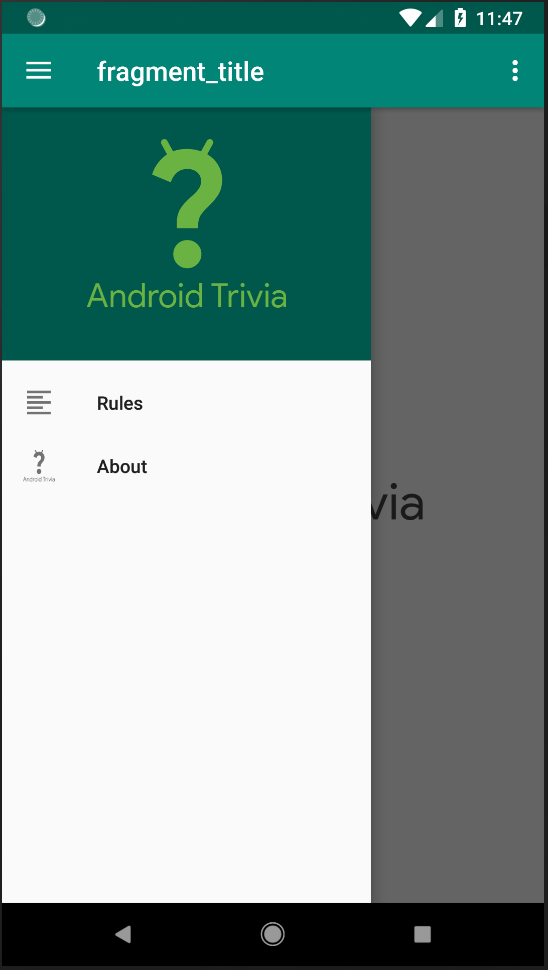

### Congratulations!

You have now added several different navigation options to your app.

The user can now progress through the app by playing the game. They can get back to the home screen at any time by using the Up button. They can get to the About screen either from the Options menu or from the navigation drawer. Pressing the Back button takes them back through previous screens in a way that makes sense for the app. The user can open the navigation drawer by swiping in from the left on any screen, or by tapping the drawer button in the app bar on the home screen.

Your app includes robust, logical navigation paths that are intuitive for your user to use. Congratulations!