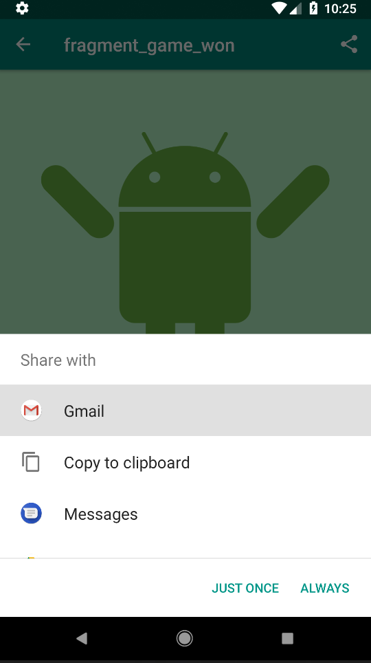
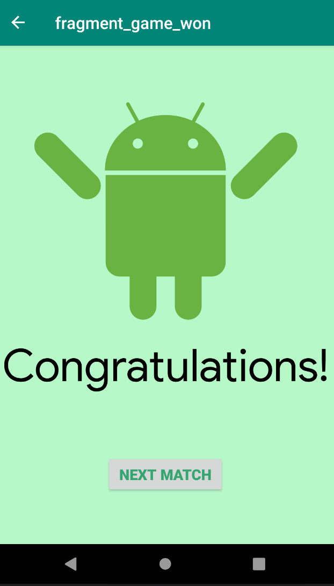
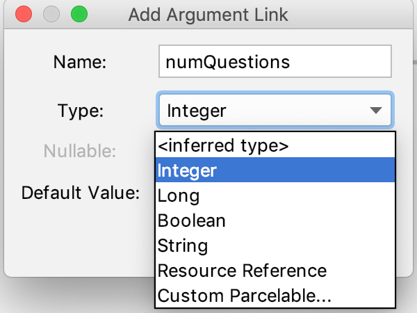
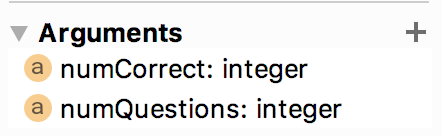
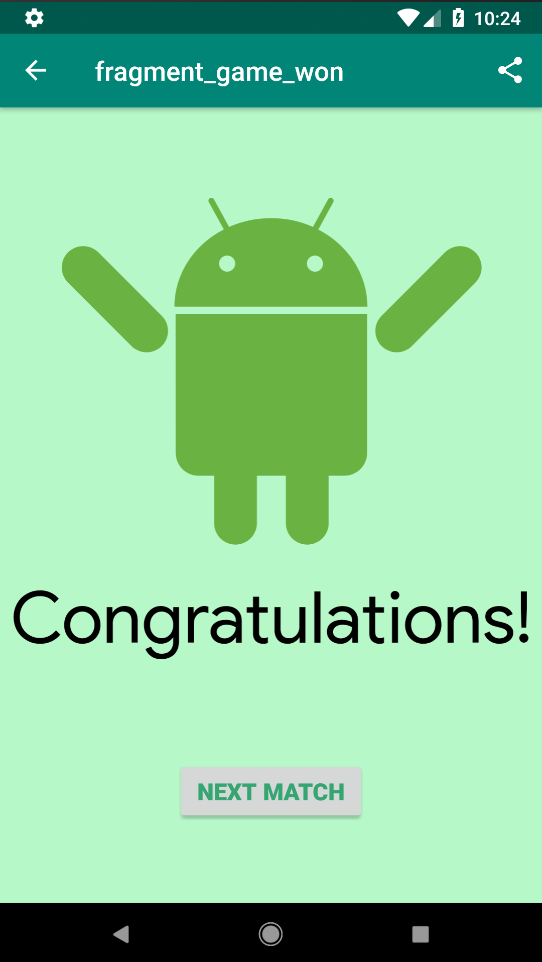

## App overview
   
The AndroidTrivia app, which you worked on in the previous two project, is a game in which users answer questions about Android development. If the user answers three questions correctly, they win the game.
  
  
Use the previous project code as the starter code.
   
In this project, you update the AndroidTrivia app so that users can send their game results to other apps and share their results with friends.



### Task: Set up and use the Safe Args plugin

Before users can share their game results from within the AndroidTrivia app, your code needs to pass parameters from one fragment to another. To prevent bugs in these transactions and make them type-safe, you use a Gradle plugin called Safe Args. The plugin generates `NavDirection` classes, and you add these classes to your code.

In later tasks in this project, you use the generated NavDirection classes to pass arguments between fragments.

### Why you need the Safe Args plugin

Often your app will need to pass data between fragments. One way to pass data from one fragment to another is to use an instance of the `Bundle` class. An Android `Bundle` is a key-value store.

A key-value store, also known as a dictionary or associative array, is a data structure where you use a unique key (a string) to fetch the value associated with that key. For example:

|Key | Value|
|---|---|
|"name"|"Anika"|
|"favorite_weather"|"sunny"|
|"favorite_color"|"blue"|

Your app could use a `Bundle` to pass data from fragment A to fragment B. For example, fragment A creates a `bundle` and saves the information as key-value pairs, then passes the `Bundle` to fragment B. Then fragment B uses a key to fetch a key-value pair from the `Bundle`. This technique works, but it can result in code that compiles but then has the potential to cause errors when the app runs.

The kinds of errors that can occur are:

- Type mis-match errors. For example, if Fragment A sends a string but Fragment B requests an integer from the bundle, the request returns the default value of zero. Since zero is a valid value, this kind of type mis-match problem does not throw an error when the app is compiled. However, when the user runs the app, the error might make the app misbehave or crash.

- Missing key errors. If fragment B requests an argument that isn't set in the bundle, the operation returns `null`. Again, this doesn't throw an error when the app is compiled but could cause severe problems when the user runs the app.

You want to catch these errors when you compile the app in Android Studio, so that you catch these errors before deploying the app into production. In other words, you want to catch the errors during app development so that your users don't encounter them.

To help with these problems, Android's Navigation Architecture Component includes a feature called Safe Args. Safe Args is a Gradle plugin that generates code and classes that help detect errors at compile-time that might not otherwise be surfaced until the app runs.

### Step 1: Open the starter app and run it

Use the AndroidTrivia starter app for this :

1 - Open the app in Android Studio.

2 - Run the app on an Android-powered device or on an emulator. The app is a trivia game with a navigation drawer, an options menu on the title screen, and an Up button at the top of most of the screens.

3 - Explore the app and play the game. When you win the game by answering three questions correctly, you see the Congratulations screen.



In this project, you add a share icon to the top of the Congratulations screen. The share icon lets the user share their results in an email or text.

### Step 2: Add Safe Args to the project

1 - In Android Studio, open the project-level `build.gradle` file.

2 - Add the `navigation-safe-args-gradle-plugin` dependency, as shown below:

```
// Adding the safe-args dependency to the project Gradle file
dependencies {
   ...
classpath "android.arch.navigation:navigation-safe-args-gradle-plugin:$navigationVersion"

}
```

3 - Open the app-level `build.gradle` file.

4 - At the top of the file, after all the other plugins, add the apply plugin statement with the androidx.navigation.safeargs plugin:

```
// Adding the apply plugin statement for safeargs
apply plugin: 'androidx.navigation.safeargs'
```
5 - Re-build the project. If you are prompted to install additional build tools, install them.

The app project now includes generated `NavDirection` classes.

The Safe Args plugin generates a `NavDirection` class for each fragment. The classes represent navigation from all the app's actions.

For example, `GameFragment` now has a generated `GameFragmentDirections` class. You can use the `GameFragmentDirections` class to pass type-safe arguments between the game fragment and other fragments in the app.

To see the generated files, explore the generatedJava folder in the Project > Android pane.

`Caution: Do not edit the NavDirection classes. These classes are regenerated whenever the project is compiled, and your edits will be lost.`

### Step 3: Add a NavDirection class to the game fragment
I
n this step, you add the `GameFragmentDirections` class to the game fragment. You'll use this code later to pass arguments between the `GameFragment` and the `game-state` fragments (`GameWonFragment` and `GameOverFragment`).

1 - Open the `GameFragment.kt` Kotlin file that's in the java folder.

2 - Inside the `onCreateView()` method, locate the game-won conditional statement ("We've won!"). Change the parameter that's passed into the `NavController.navigate()` method: Replace the action ID for the game-won state with an ID that uses the `actionGameFragmentToGameWonFragment()` method from the `GameFragmentDirections`` class.

The conditional statement now looks like the following code. You'll add parameters to the `actionGameFragmentToGameWonFragment()` method in the next task.

```
// Using directions to navigate to the GameWonFragment
view.findNavController()
        .navigate(GameFragmentDirections.actionGameFragmentToGameWonFragment())
```

3 - Likewise, locate the game-over conditional statement ("Game over!"). Replace the action ID for the game-over state with an ID that uses the game-over method from the `GameFragmentDirections` class:

```
// Using directions to navigate to the GameOverFragment
view.findNavController()
        .navigate(GameFragmentDirections.actionGameFragmentToGameOverFragment())
```

### Task: Add and pass arguments

In this task, you add typed arguments to the `gameWonFragment` and pass the arguments into a `GameFragmentDirections` method. Then you replace the other fragment classes with their equivalent `NavDirection` classes.

### Step 1: Add arguments to the game-won fragment

1 - Open the `navigation.xml` file, which is in the `res > navigation folder`. Click the Design tab to open the navigation graph, which is where you'll set the arguments in the fragments.

2 - In the preview, select the `gameWonFragment`.

3 - In the Attributes pane, expand the Arguments section.

4 - Click the + icon to add an argument. Name the argument numQuestions and set the type to Integer, then click Add. This argument represents the number of questions the user answered.



5 - Still with the gameWonFragment selected, add a second argument. Name this argument numCorrect and set its type to Integer. This argument represents the number of questions the user answered correctly.



If you try to build the app now, you will likely get two compile errors.

```
No value passed for parameter 'numQuestions'
No value passed for parameter 'numCorrect'
```

You fix this error in the coming steps.

`Note: If you're using Android Studio 3.2 or lower, you might have to change app:type = "integer" to app:argType = "integer" in the navigation.xml file.`

### Step 2: Pass the arguments

In this step, you pass the numQuestions and questionIndex arguments into the `actionGameFragmentToGameWonFragment()` method from the `GameFragmentDirections` class.

1 - Open the `GameFragment.kt` Kotlin file and locate the game-won conditional statement:

```
else {
 // We've won!  Navigate to the gameWonFragment.
 view.findNavController()
      .navigate(GameFragmentDirections
            .actionGameFragmentToGameWonFragment())
}
```

2 - Pass the numQuestions and questionIndex parameters to the actionGameFragmentToGameWonFragment() method:

```
// Adding the parameters to the Action
view.findNavController()
      .navigate(GameFragmentDirections
            .actionGameFragmentToGameWonFragment(numQuestions, questionIndex))

```

You pass the total number of questions as numQuestions and the current question being attempted as questionIndex. The app is designed in such a way that the user can only share their data if they answer all the questions correctly—the number of correct questions always equals the number of questions answered. (You can change this game logic later, if you want.)

3 - In GameWonFragment.kt, extract the arguments from the bundle, then use a Toast to display the arguments. Put the following code in the onCreateView() method, before the return statement:

```
val args = GameWonFragmentArgs.fromBundle(arguments!!)
Toast.makeText(context, "NumCorrect: ${args.numCorrect}, NumQuestions: ${args.numQuestions}", Toast.LENGTH_LONG).show()
```

4 - Run the app and play the game to make sure that the arguments are passed successfully to the `GameWonFragment`. The toast message appears on the Congratulations screen, saying "NumCorrect: 3, NumQuestions: 3".

You do have to win the trivia game first, though. To make the game easier, you can change it to a single-question game by setting the value of `numQuestions` to `1` in the `GameFragment.kt` Kotlin file.

### Step 3: Replace fragment classes with NavDirection classes

When you use "safe arguments," you can replace fragment classes that are used in navigation code with `NavDirection` classes. You do this so that you can use type-safe arguments with other fragments in the app.

In `TitleFragment`, `GameOverFragment`, and `GameWonFragment`, change the action ID that's passed into the `navigate()` method. Replace the action ID with the equivalent method from the appropriate NavDirection class:

1 - Open the `TitleFragment.kt` Kotlin file. In `onCreateView()`, locate the `navigate()` method in the Play button's click handler. Pass `TitleFragmentDirections.actionTitleFragmentToGameFragment()` as the method's argument:

```
binding.playButton.setOnClickListener { view: View ->
    view.findNavController()
            .navigate(TitleFragmentDirections.actionTitleFragmentToGameFragment())
}
```

2 - In the `GameOverFragment.kt` file, in the Try Again button's click handler, pass `GameOverFragmentDirections.actionGameOverFragmentToGameFragment()` as the `navigate()` method's argument:

```
binding.tryAgainButton.setOnClickListener { view: View ->
    view.findNavController()
            .navigate(GameOverFragmentDirections.actionGameOverFragmentToGameFragment())
}
```

3 - In the `GameWonFragment.kt file`, in the Next Match button's click handler, pass `GameWonFragmentDirections.actionGameWonFragmentToGameFragment()` as the `navigate()` method's argument:

```
binding.nextMatchButton.setOnClickListener { view: View ->
    view.findNavController()
            .navigate(GameWonFragmentDirections.actionGameWonFragmentToGameFragment())
}
```

4 - Run the app.

You won't find any changes to the app's output, but now the app is set up so that you can easily pass arguments using `NavDirection` classes whenever needed.

### Task: Add an implicit intent and a "share" menu item

In this task, you use an implicit intent to add a sharing feature to the app so that the user can share their game results. You implement the sharing feature as an options menu inside the `GameWonFragment class.` In the app's UI, the menu item will appear as a share icon at the top of the Congratulations screen.

#### Implicit intents

Up until now, you've used navigation components to navigate among fragments within your activity. Android also allows you to use intents to navigate to activities that other apps provide. You use this functionality in the AndroidTrivia app to let the user share their game-play results.

An Intent is a simple message object that's used to communicate between Android components. With an implicit intent, you initiate an activity without knowing which app or activity will handle the task. For example, if you want your app to take a photo, you typically don't care which app or activity performs the task. When multiple Android apps can handle the same implicit intent, Android shows the user a chooser, so that the user can select an app to handle the request.

Each implicit intent must have an ACTION that describes the type of thing that is to be done. Common actions, such as `ACTION_VIEW`, `ACTION_EDIT`, and `ACTION_DIAL`, are defined in the Intent class.

`Terminology alert! Intent actions are unrelated to actions shown in the app's navigation graph.`

For more about implicit intents, see [Sending](https://developer.android.com/training/basics/intents/sending) the User to Another App

### Step 1: Add an options menu to the Congratulations screen

Open the `GameWonFragment.kt` Kotlin file.

Inside the `onCreateView() `method, before the return, call the `setHasOptionsMenu()` method and pass in true:
 
  `setHasOptionsMenu(true)`

### Step 2: Build and call an implicit intent

Modify your code to build and call an Intent that sends the message about the user's game data. Because several different apps can handle an `ACTION_SEND` intent, the user will see a chooser that lets them select how they want to send their information.

1 - Inside the GameWonFragment class, after the `onCreateView()` method, create a private method called `getShareIntent()`, as shown below. The line of code that sets a value for args is identical to the line of code used in the class's onCreateView().

In the rest of the method's code, you build an `ACTION_SEND` intent to deliver the message that the user wants to share. The data's `MIME` type is specified by the `setType()` method. The actual data to be delivered is specified in the `EXTRA_TEXT`. (The `share_success_text` string is defined in the `strings.xml` resource file.)

```
// Creating our Share Intent
private fun getShareIntent() : Intent {
   val args = GameWonFragmentArgs.fromBundle(arguments!!)
   val shareIntent = Intent(Intent.ACTION_SEND)
        shareIntent.setType("text/plain")
            .putExtra(Intent.EXTRA_TEXT, getString(R.string.share_success_text, args.numCorrect, args.numQuestions))
   return shareIntent
}
```


2 - Below the `getShareIntent()` method, create a `shareSuccess()` method. This method gets the Intent from `getShareIntent()` and calls `startActivity()` to begin sharing.

```
// Starting an Activity with our new Intent
private fun shareSuccess() {
   startActivity(getShareIntent())
}
```

3 - The starter code already contains a `winner_menu.xml` menu file. Override `onCreateOptionsMenu()` to inflate `winner_menu`.

Use `getShareIntent()` to get the `shareIntent`. To make sure the `shareIntent` resolves to an Activity, check with the Android package manager `(PackageManager)`, which keeps track of the apps and activities installed on the device. Use the activity's `packageManager` property to gain access to the package manager, and call `resolveActivity()`. If the result equals null, which means that the `shareIntent` doesn't resolve, find the sharing menu item from the inflated menu and make the menu item invisible.

```
// Showing the Share Menu Item Dynamically
override fun onCreateOptionsMenu(menu: Menu?, inflater: MenuInflater?) {
   super.onCreateOptionsMenu(menu, inflater)
   inflater?.inflate(R.menu.winner_menu, menu)
   // check if the activity resolves
   if (null == getShareIntent().resolveActivity(activity!!.packageManager)) {
       // hide the menu item if it doesn't resolve
       menu?.findItem(R.id.share)?.setVisible(false)
   }
}
```

4 - To handle the menu item, override `onOptionsItemSelected()`. Call the `shareSuccess()` method when the menu item is clicked:

```
// Sharing from the Menu
override fun onOptionsItemSelected(item: MenuItem?): Boolean {
   when (item!!.itemId) {
       R.id.share -> shareSuccess()
   }
   return super.onOptionsItemSelected(item)
}
```

5 - Now run your app. (You might need to import some packages into GameWonFragment.kt before the code will run.) After you win the game, notice the share icon that appears at the top right of the app bar. Click the share icon to share a message about your victory.

