##  App overview

In this project, you work with a starter app called DessertClicker. In this app, each time the user taps a dessert on the screen, the app "purchases" the dessert for the user. The app updates values in the layout for the number of desserts that were purchased, and for the total amount the user spent.

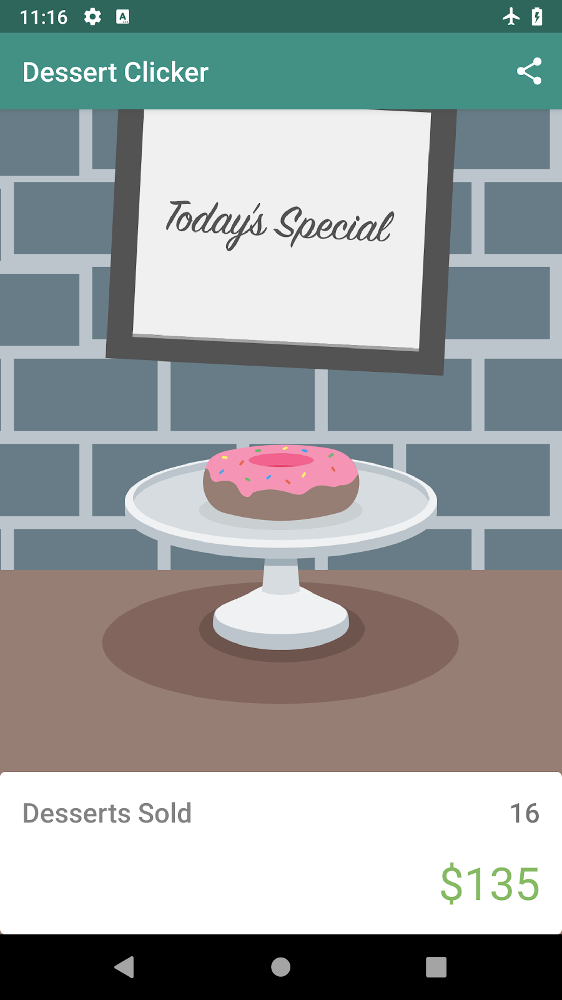

This app contains several bugs related to the Android lifecycle: For example, in certain circumstances, the app resets the dessert values to 0, and the app continues using system resources even when the app is in the background. Understanding the Android lifecycle will help you understand why these problems happen, and how to fix them.

### Task: Explore the lifecycle methods and add basic logging

Every activity and every fragment has what is known as a lifecycle. This is an allusion to animal lifecycles, like the lifecycle of this butterfly—the different states of the butterfly show its growth from birth to fully formed adulthood to death.

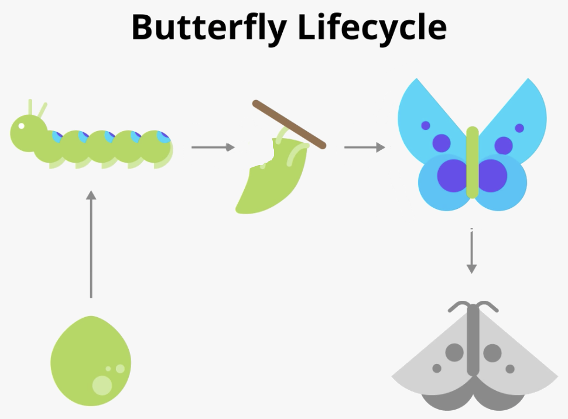

Similarly, the activity lifecycle is made up of the different states that an activity can go through, from when the activity is first initialized to when it is finally destroyed and its memory reclaimed by the system. As the user starts your app, navigates between activities, navigates inside and outside of your app, and leaves your app, the activity changes state. The diagram below shows all the activity lifecycle states. As their names indicate, these states represent the status of the activity.

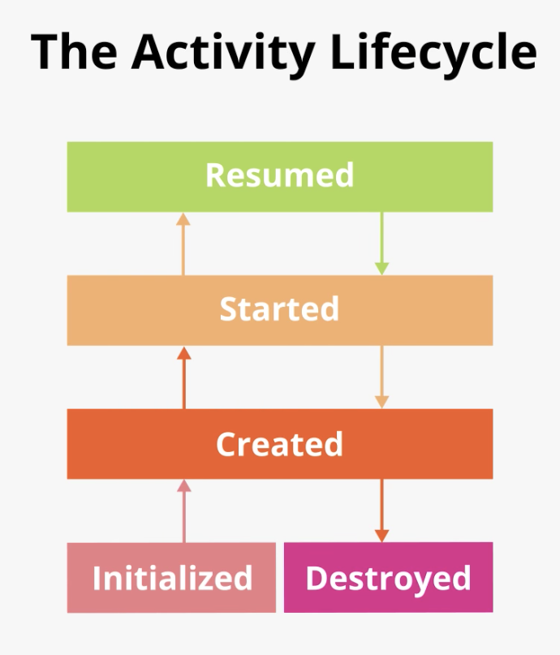

Often, you want to change some behavior, or run some code when the activity lifecycle state changes. Therefore the `Activity` class itself, and any subclasses of `Activity` such as `AppCompatActivity`, implement a set of lifecycle callback methods. Android invokes these callbacks when the activity moves from one state to another, and you can override those methods in your own activities to perform tasks in response to those lifecycle state changes. The

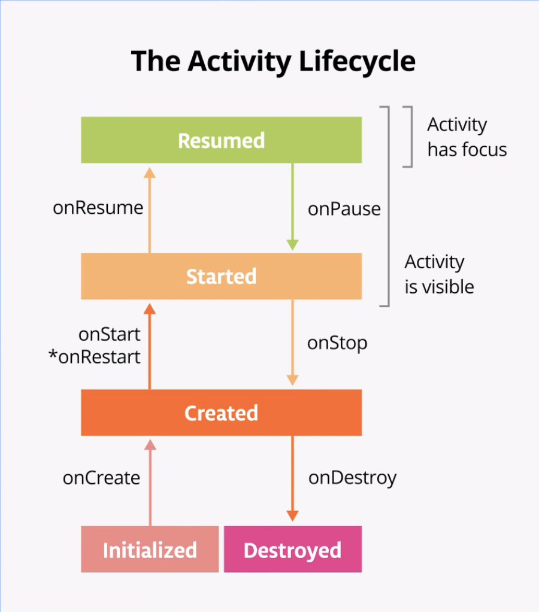

A fragment also has a lifecycle. A fragment's lifecycle is similar to an activity's lifecycle, so a lot of what you learn applies to both. In this project, you focus on the activity lifecycle because it's a fundamental part of Android and the easiest to observe in a simple app. Here is the corresponding diagram for the fragment lifecycle:

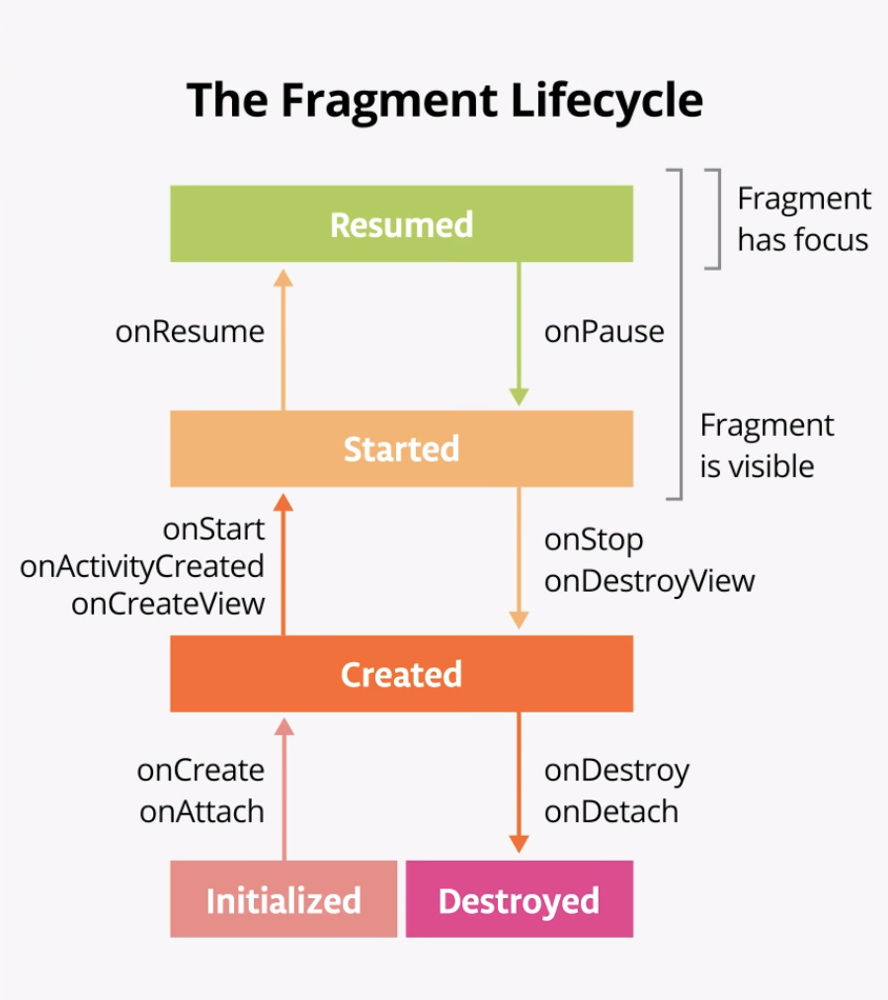

It's important to know when these callbacks are invoked and what to do in each callback method. But both of these diagrams are complex and can be confusing. In this project, instead of just reading what each state and callback means, you're going to do some detective work and build your understanding of what's going on.

### Step 1: Examine the onCreate() method and add logging

To figure out what's going on with the Android lifecycle, it's helpful to know when the various lifecycle methods are called. This will help you hunt down where things are going wrong in DessertClicker.

A simple way to do that is to use the Android logging API. Logging enables you to write short messages to a console while the app runs, and you can use it to show you when different callbacks are triggered.

1 - Download the DessertClicker starter app and open it in Android Studio.

2 - Compile and run the app, and tap several times on the picture of the dessert. Note how the value for Desserts Sold and the total dollar amount changes.

3 - Open `MainActivity.kt` and examine the `onCreate()` method for this activity

```
override fun onCreate(savedInstanceState: Bundle?) {
...
}
```

In the activity lifecycle diagram, you may have recognized the `onCreate()` method, because you've used this callback before. It's the one method every activity must implement. The `onCreate()` method is where you should do any one-time initializations for your activity. For example, in `onCreate()` you inflate the layout, define click listeners, or set up data binding.

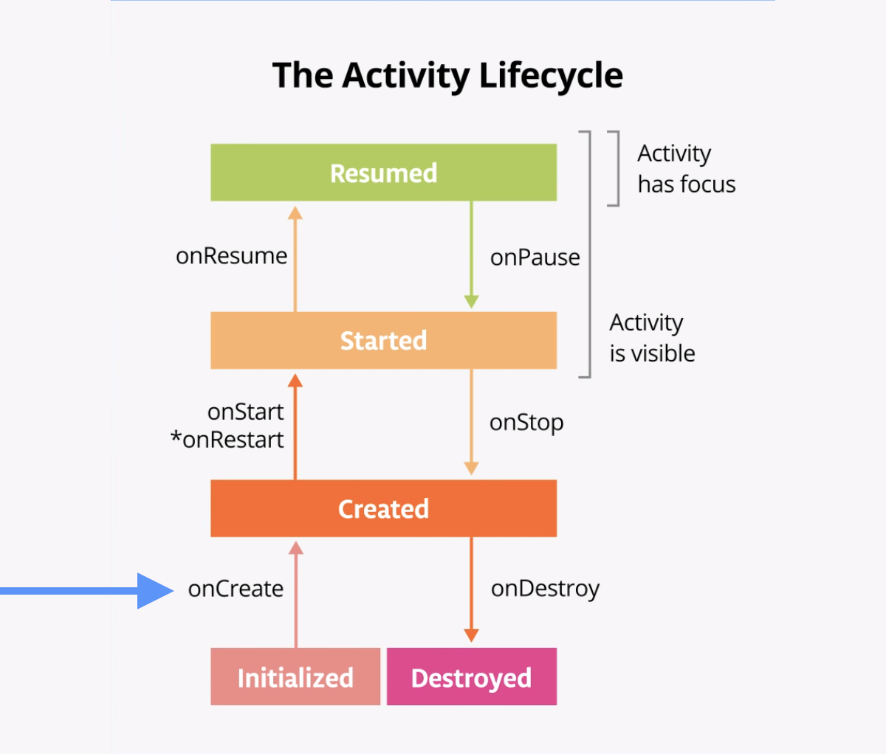

The `onCreate()` lifecycle method is called once, just after the activity is initialized (when the new Activity object is created in memory). After `onCreate()` executes, the activity is considered created.

```
Note: The `onCreate()` method is an override, so within it, you must immediately call `super.onCreate()`. The same is true for other lifecycle methods.
```

In the `onCreate()` method, just after the call to `super.onCreate()`, add the following line. Import the Log class if necessary. (Press Alt+Enter, or Option+Enter on a Mac, and select Import.)

`Log.i("MainActivity", "onCreate Called")`

The Log class writes messages to the Logcat. There are three parts to this command:

- The severity of the log message, that is, how important the message is. In this case, the `Log.i()` method writes an informational message. Other methods in the Log class include `Log.e()` for errors, or `Log.w()` for warnings.

- The log tag, in this case `"MainActivity"`. The tag is a string that lets you more easily find your log messages in the Logcat. The tag is typically the name of the class.

- The actual log message, a short string, which in this case is `"onCreate called"`.

5 - Compile and run the DessertClicker app. You don't see any behavior differences in the app when you tap the dessert. In Android Studio, at the bottom of the screen, click the Logcat tab.

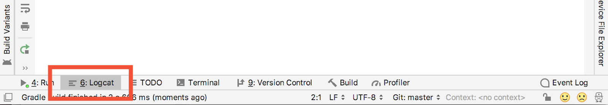

The Logcat is the console for logging messages. Messages from Android about your app appear here, including the messages you explicitly send to the log with the Log.i() method or other Log class methods.

6 - In the Logcat pane, type `I/MainActivity` into the search field.

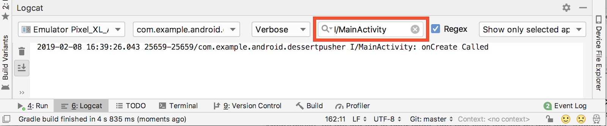

The Logcat can contain many messages, most of which aren't useful to you. You can filter the Logcat entries in many ways, but searching is the easiest. Because you used `MainActivity` as the log tag in your code, you can use that tag to filter the log. Adding `I/` at the start means that this is an informational message, created by `Log.i()`.

Your log message includes the date and time, the name of the package `(com.example.android.dessertclicker)`, your log tag (with `I/` at the start), and the actual message. Because this message appears in the log, you know that `onCreate()` has been executed.

### Step 2: Implement the onStart() method

The `onStart()` lifecycle method is called just after `onCreate()`. After `onStart()` runs, your activity is visible on the screen. Unlike onCreate(), which is called only once to initialize your activity, `onStart()` can be called many times in the lifecycle of your activity.

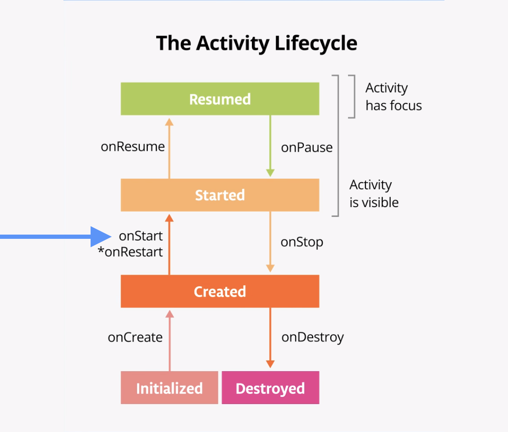

Note that `onStart()` is paired with a corresponding `onStop()` lifecycle method. If the user starts your app and then returns to the device's home screen, the activity is stopped and is no longer visible on screen.

In Android Studio, with `MainActivity.kt` open, select Code > Override Methods or press `Control+o`. A dialog appears with huge list of all the methods you can override in this class.

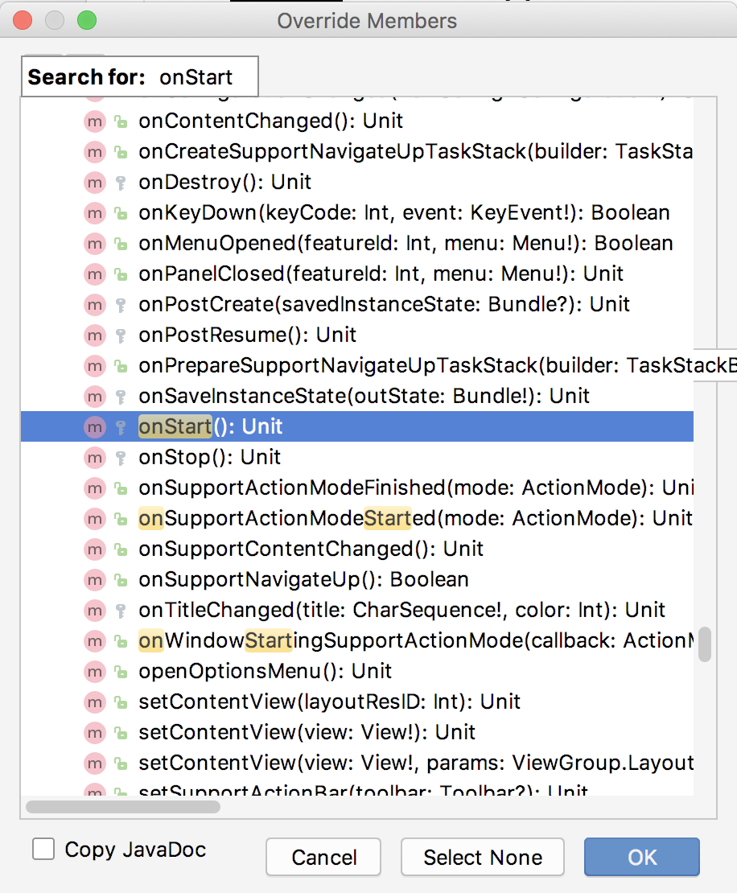

2 - Start entering onStart to search for the right method. To scroll to the next matching item, use the down arrow. Choose onStart() from the list, and click OK to insert the boilerplate override code. The code looks like this:

```
override fun onStart() {
   super.onStart()
```

```
Tip: Android Studio inserts your overridden method code in the next available appropriate place in the class. If you'd like to put your lifecycle overrides in a specific place (like at the end of the class), set the insertion point before you use Override Methods.
```

3 - Inside the `onStart()` method, add a log message:

```
override fun onStart() {
   super.onStart()

   Log.i("MainActivity", "onStart Called")
}
```

4 - Compile and run the DessertClicker app, and open the Logcat pane. Type `I/MainActivity` into the search field to filter the log. Notice that both the `onCreate()` and `onStart()` methods were called one after the other, and that your activity is visible on screen.

5 - Press the Home button on the device, and then use the recents screen to return to the activity. Notice that the activity resumes where it left off, with all the same values, and that `onStart()` is logged a second time to Logcat. Notice also that the `onCreate()` method is usually not called again.

```
Note: As you experiment with your device and observe the lifecycle callbacks, you might notice unusual behavior when you rotate your device. You'll learn about that behavior in the next project.
```

### Task: Use Timber for logging

In this task, you modify your app to use a popular logging library called `Timber`. `Timber` has several advantages over the built-in Android `Log` class. In particular, the `Timber` library:

- Generates the log tag for you based on the class name.

- Helps you avoid showing logs in a release version of your Android app.

- Allows for integration with crash-reporting libraries.

You'll see the first benefit immediately; the others you'll appreciate as you make and ship bigger apps.

### Step 1: Add Timber to Gradle

1 - Visit this link to the Timber project on GitHub, and copy the line of code under the Download heading that starts with the word implementation. The line of code will look something like this, although the version number may be different.

`implementation 'com.jakewharton.timber:timber:4.7.1'`

2 - In Android Studio, in the Project: Android view, expand Gradle Scripts and open the build.gradle (Module: app) file.
    
3 - Inside the dependencies section, paste the line of code that you copied.
    
 ```
    dependencies {
       ...
       implementation 'com.jakewharton.timber:timber:4.7.1'
    }
```

4 - Click the Sync Now link in the top right of Android Studio to rebuild Gradle. The build should execute without errors.

### Step 2: Create an Application class and initialize Timber

In this step, you create an `Application` class. `Application` is a base class that contains global application state for your entire app. It's also the main object that the operating system uses to interact with your app. There is a default Application class that Android uses if you don't specify one, so there's always an Application object created for your app, without you needing to do anything special to create it.

Timber uses the `Application` class because the whole app will be using this logging library, and the library needs to be initialized once, before everything else is set up. In cases like this, you can subclass the Application class and override the defaults with your own custom implementation.

```
Warning: It might be tempting to add your own code to the Application class, because the class is created before all of your activities and can hold global state. But just as it's error-prone to make readable and writable static variables that are globally available, it's easy to abuse the Application class. Avoid putting any activity code in the Application class unless the code is really needed.
```

After you create your Application class, you need to specify the class in the Android manifest.

1 - In the `dessertclicker` package, create a new Kotlin class called `ClickerApplication`. To do this, expand app > java and right-click on `com.example.android.dessertclicker`. Select New > Kotlin File/Class.

2 - Name the class ClickerApplication and set the Kind to Class. Click OK.

Android Studio creates a new `ClickerApplication` class, and opens it in the code editor. The code looks like this:

```
package com.example.android.dessertclicker

class ClickerApplication {
}
```

3 - Change the class definition to be a subclass of `Application` and import the `Application` class if necessary.

`class ClickerApplication : Application() {`

4 - To override the `onCreate()` method, select Code > Override Methods or press `Control+o`.

```
class ClickerApplication : Application() {
   override fun onCreate() {
       super.onCreate()
   }
}
```

5 - Inside that `onCreate()` method, initialize the `Timber` library:

```
override fun onCreate() {
    super.onCreate()

    Timber.plant(Timber.DebugTree())
}
```

This line of code initializes the `Timber` library for your app so that you can use the library in your activities.

6 - Open `AndroidManifest.xml`.

```
At the top of the <application> element, add a new attribute for the ClickerApplication class, so that Android knows to use your Application class instead of the default one.
<application
   android:name=".ClickerApplication"
...
```

`Note: If you don't add your custom Application class to the Android manifest, your app will run without errors. However, the app won't use your class, and you'll never see any logging information from Timber.`

### Step 3: Add Timber log statements

In this step, you change your `Log.i()` calls to use `Timber`, then you implement logging for all the other lifecycle methods.

1 - Open `MainActivity` and scroll to `onCreate()`. Replace `Log.i()` with `Timber.i()` and remove the log tag.

`Timber.i("onCreate called")`

Like the `Log` class, Timber also uses the `i()` method for informational messages. Notice that with `Timber` you don't need to add a log tag; `Timber` automatically uses the name of the class as the log tag.

2 - Similarly, change the `Log` call in `onStart()`:

```
override fun onStart() {
   super.onStart()

   Timber.i("onStart Called")
}
```

3 - Compile and run the DessertClicker app, and open Logcat. Notice that you still see the same log messages for `onCreate()` and `onStart()`, only now it's `Timber` generating those messages, not the Log class.

4 - Override the remainder of the lifecycle methods in your `MainActivity`, and add `Timber` log statements for each one. Here's the code:

```
override fun onResume() {
   super.onResume()
   Timber.i("onResume Called")
}

override fun onPause() {
   super.onPause()
   Timber.i("onPause Called")
}

override fun onStop() {
   super.onStop()
   Timber.i("onStop Called")
}

override fun onDestroy() {
   super.onDestroy()
   Timber.i("onDestroy Called")
}

override fun onRestart() {
   super.onRestart()
   Timber.i("onRestart Called")
}
```

5 - Compile and run DessertClicker again and examine Logcat. This time notice that in addition to `onCreate()` and `onStart()`, there's a log message for the `onResume()` lifecycle callback.

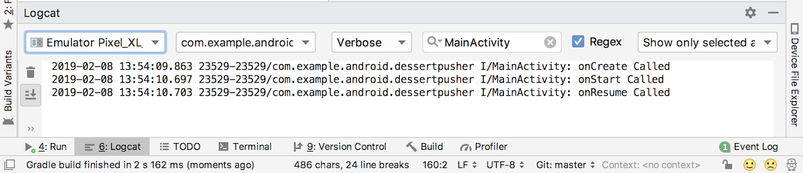

When an activity starts from scratch, you see all three of these lifecycle callbacks called in order:

- `onCreate()` to create the app.

- `onStart()` to start it and make it visible on the screen.

- `onResume()` to give the activity focus and make it ready for the user to interact with it.

Despite the name, the `onResume()` method is called at startup, even if there is nothing to resume.

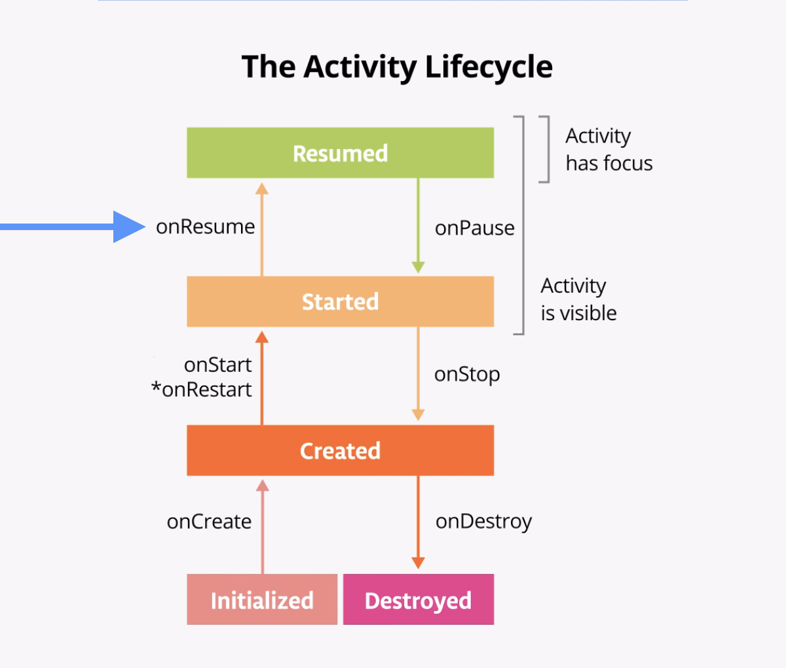

### Task: Explore lifecycle use cases

Now that the DessertClicker app is set up for logging, you're ready to start using the app in various ways, and ready to explore how the lifecycle callbacks are triggered in response to those uses.

### Use case 1: Opening and closing the activity

You start with the most basic use case, which is to start your app for the first time, then close the app down completely.

1 - Compile and run the DessertClicker app, if it is not already running. As you've seen, the `onCreate()`, `onStart()`, and `onResume()` callbacks are called when the activity starts for the first time.


2 - Tap the cupcake a few times.

3 - Tap the Back button on the device. Notice in Logcat that `onPause()`, `onStop()`, and `onDestroy()` are called, in that order.

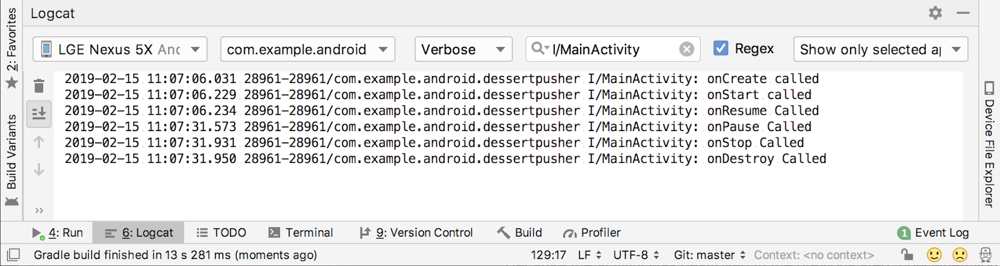

In this case, using the Back button causes the activity (and the app) to be entirely closed. The execution of the `onDestroy()` method means that the activity was fully shut down and can be garbage-collected. Garbage collection refers to the automatic cleanup of objects that you'll no longer use. After `onDestroy()` is called, the OS knows that those resources are discardable, and it starts cleaning up that memory.

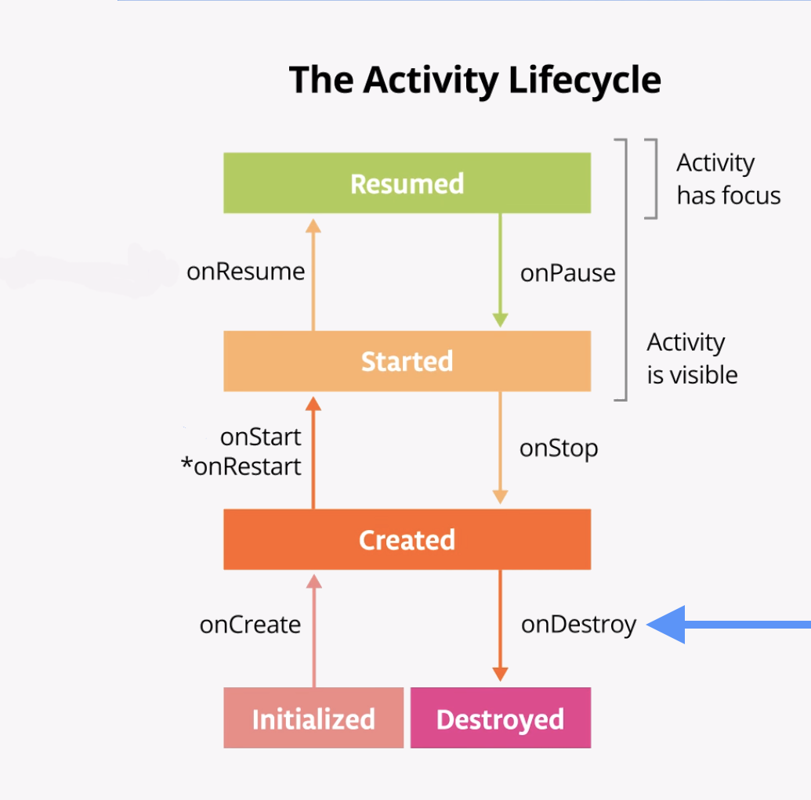

Your activity may also be completely shut down if your code manually calls the activity's `finish()` method, or if the user force-quits the app. (For example, the user can force-quit the app in the recents screen by clicking the X in the corner of the window.) The Android system may also shut down your activity on its own if your app has not been on-screen for a long time. Android does this to preserve battery, and to allow your app's resources to be used by other apps.

4 - Use the recents screen to return to the app. Here's the Logcat:


The activity was destroyed in the previous step, so when you return to the app, Android starts up a new activity and calls the onCreate(), onStart(), and onResume() methods. Notice that none of the DessertClicker statistics from the previous activity has been retained.

The key point here is that 'onCreate()' and 'onDestroy()' are only called once during the lifetime of a single activity instance: 'onCreate()' to initialize the app for the very first time, and 'onDestroy()' to clean up the resources used by your app.

The 'onCreate()' method is an important step; this is where all your first-time initialization goes, where you set up the layout for the first time by inflating it, and where you initialize your variables.

### Use case 2: Navigating away from and back to the activity

Now that you've started the app and completely closed it, you've seen most of the lifecycle states for when the activity gets created for the first time. You've also seen all the lifecycle states that the activity goes through when it gets completely shut down and destroyed. But as users interact with their Android-powered devices, they switch between apps, return home, start new apps, and handle interruptions by other activities such as phone calls.

Your activity does not close down entirely every time the user navigates away from that activity:

- When your activity is no longer visible on screen, this is known as putting the activity into the background. (The opposite of this is when the activity is in the foreground, or on screen.)

 -When the user returns to your app, that same activity is restarted and becomes visible again. This part of the lifecycle is called the app's visible lifecycle.

When your app is in the background, it should not be actively running, to preserve system resources and battery life. You use the `Activity` lifecycle and its callbacks to know when your app is moving to the background so that you can pause any ongoing operations. Then you restart the operations when your app comes into the foreground.

For example, consider an app that runs a physics simulation. It takes many calculations, crunched on your device's CPU, to decide where all the objects in your simulation should be, and to display them. If a phone call interrupts the simulation, the user might be confused or even upset to come back to the app and see that the simulation is finished.

There's also a performance reason for this. Let's say the user has opened 20 apps that use CPU-intensive physics simulations. If those apps' activities are not on-screen but they're still doing heavy rendering calculations in the background, that will slow down the performance of the whole phone.

In this step, you look at the activity lifecycle when the app goes into the background and returns again to the foreground.

1 - With the DessertClicker app running, click the cupcake a few times.

2 - Press the Home button on your device and observe the Logcat in Android Studio. Returning to the home screen puts your app into the background rather than shutting down the app altogether. Notice that the `onPause()` method and `onStop()` methods are called, but `onDestroy()` is not.

When `onPause()` is called, the app no longer has focus. After `onStop()`, the app is no longer visible on screen. Although the activity has been stopped, the `Activity` object is still in memory, in the background. The activity has not been destroyed. The user might return to the app, so Android keeps your activity resources around.

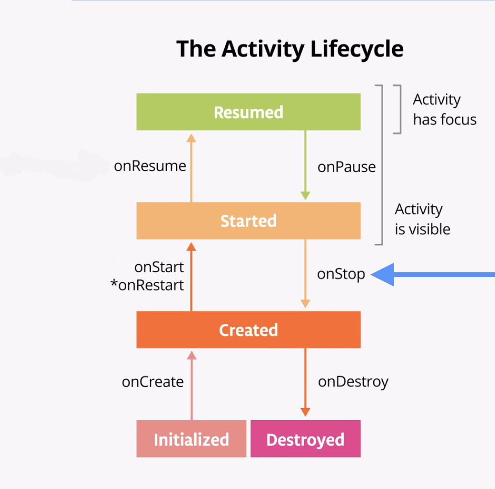

Use the recents screen to return to the app. Notice in Logcat that the activity is restarted with `onRestart()` and `onStart()`, then resumed with `onResume()`.

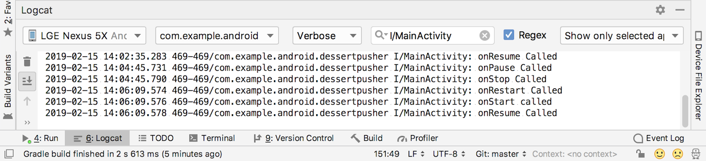

When the activity returns to the foreground, the `onCreate()` method is not called again. The activity object was not destroyed, so it doesn't need to be created again. Instead of `onCreate()`, the `onRestart()` method is called. Notice that this time when the activity returns to the foreground, the Desserts Sold number is retained.

4 - Start at least one app other than DessertClicker so that the device has a few apps in its recents screen.
    
5 - Bring up the recents screen and open another recent activity. Then go back to recent apps and bring DessertClicker back to the foreground.

Notice that you see the same callbacks in Logcat here as when you pressed the Home button. `onPause()` and `onStop()` are called when the app goes into the background, and then `onRestart()`, `onStart()`, and `onResume()` when it comes back.

The important point here is that `onStart()` and `onStop()` are called multiple times as the user navigates to and from the activity. You should override these methods to stop the app when it moves into the background, or start it up again when it returns to the foreground.

So what about `onRestart()`? The `onRestart()` method is much like `onCreate()`. Either `onCreate()` or `onRestart()` is called before the activity becomes visible. The `onCreate()` method is called only the first time, and `onRestart()` is called after that. The `onRestart()` method is a place to put code that you only want to call if your activity is not being started for the first time.

### Use case 3: Partially hide the activity

You've learned that when an app is started and `onStart()` is called, the app becomes visible on the screen. When the app is resumed and `onResume()` is called, the app gains the user focus. The part of the lifecycle in which the app is fully on-screen and has user focus is called the interactive lifecycle.

When the app goes into the background, the focus is lost after `onPause()`, and the app is no longer visible after `onStop()`.

The difference between focus and visibility is important because it is possible for an activity to be partially visible on the screen, but not have the user focus. In this step, you look at one case where an activity is partially visible, but doesn't have user focus.

1 - With the DessertClicker app running, click the Share button in the top right of the screen.

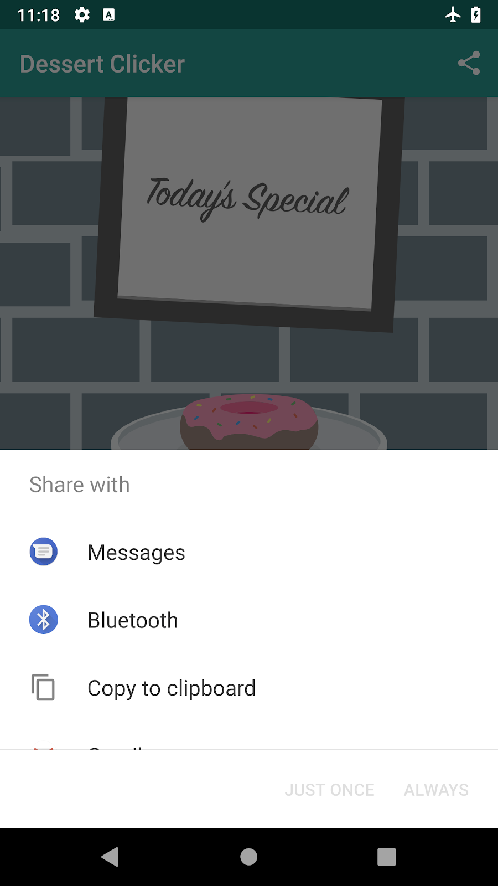

The sharing activity appears in the lower half of the screen, but the activity is still visible in the top half.

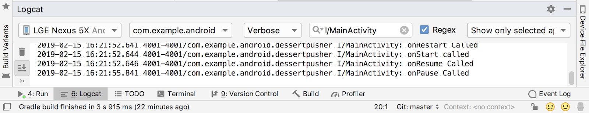

In this use case, onStop() is not called, because the activity is still partially visible. But the activity does not have user focus, and the user can't interact with it. The "share" activity that's in the foreground has the user focus.

Why is this difference important? Consider the physics app. You might want the simulation to stop when the app is in the background and keep running when the app is partially obscured. In this case you would stop the simulation in onStop(). If you wanted the simulation to stop when the activity is partially obscured, you would put the code to stop the simulation in onPause().

Whatever code runs in onPause() blocks other things from displaying, so keep the code in onPause() lightweight. For example, if a phone call comes in, the code in onPause() may delay the incoming-call notification.

3 - Click outside the share dialog to return to the app, and notice that onResume() is called.

Both onResume() and onPause() have to do with focus. The onResume() method is called when the activity has focus, and onPause() is called when the activity loses focus.

### Task: Explore the fragment lifecycle
    
The Android fragment lifecycle is similar to the activity lifecycle, plus several fragment-specific methods.


In this task, you look at the AndroidTrivia app that you built in previous project, and you add some logging to explore the fragment lifecycle. The AndroidTrivia app lets you answer questions about Android development; if you answer three in a row correctly you win the game.

Each screen in the AndroidTrivia app is a `Fragment`.

To keep things simple, you use the Android logging API in this task, rather than the Timber library.

1 - Open the AndroidTrivia app from the last codelab, or download the AndroidTrivia solution code from GitHub.

2 - Open the `TitleFragment.kt` file. Note that Android Studio may show binding errors and unresolved-reference errors until you rebuild the app.

3 - Scroll down to the `onCreateView()` method. Notice that here is where the fragment's layout is inflated and data binding occurs.

4 - Add a logging statement to the `onCreateView()` method, in between the line to `setHasOptionsMenu()` and the final call to return:

```
setHasOptionsMenu(true)

Log.i("TitleFragment", "onCreateView called")

return binding.root
```

Just below the `onCreateView()` method, add logging statements for each of the remaining fragment lifecycle methods. Here is the code:

```
override fun onAttach(context: Context?) {
   super.onAttach(context)
   Log.i("TitleFragment", "onAttach called")
}
override fun onCreate(savedInstanceState: Bundle?) {
   super.onCreate(savedInstanceState)
   Log.i("TitleFragment", "onCreate called")
}
override fun onActivityCreated(savedInstanceState: Bundle?) {
   super.onActivityCreated(savedInstanceState)
   Log.i("TitleFragment", "onActivityCreated called")
}
override fun onStart() {
   super.onStart()
   Log.i("TitleFragment", "onStart called")
}
override fun onResume() {
   super.onResume()
   Log.i("TitleFragment", "onResume called")
}
override fun onPause() {
   super.onPause()
   Log.i("TitleFragment", "onPause called")
}
override fun onStop() {
   super.onStop()
   Log.i("TitleFragment", "onStop called")
}
override fun onDestroyView() {
   super.onDestroyView()
   Log.i("TitleFragment", "onDestroyView called")
}
override fun onDetach() {
   super.onDetach()
   Log.i("TitleFragment", "onDetach called")
}
```

6 - Compile and run the app, and open Logcat.

7 - Type `I/TitleFragment` in the search field to filter the log. When the app starts, the Logcat will look something like the following screenshot:

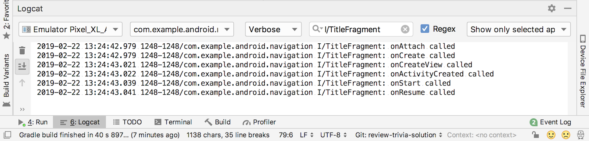

Here you can see the entire startup lifecycle of the fragment, including these callbacks:

- onAttach(): Called when the fragment is associated with its owner activity.

- onCreate(): Similarly to onCreate() for the activity, onCreate() for the fragment is called to do initial fragment creation (other than layout).

- onCreateView(): Called to inflate the fragment's layout.

- onActivityCreated(): Called when the owner activity's onCreate() is complete. Your fragment will not be able to access the activity until this method is called.

- onStart(): Called when the fragment becomes visible; parallel to the activity's onStart().

- onResume(): Called when the fragment gains the user focus; parallel to the activity's onResume().

- Tap the Play button to proceed to the trivia game, and notice the Logcat now.

8 - Tap the Play button to proceed to the trivia game, and notice the Logcat now.

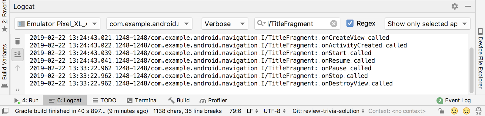

Opening the next fragment causes the title fragment to close and these lifecycle methods to be called:

- onPause(): Called when the fragment loses the user focus; parallel to the activity's onPause().

- onStop(): Called when the fragment is no longer visible on screen; parallel to the activity's onStop().

- onDestroyView(): Called when the fragment's view is no longer needed, to clean up the resources associated with that view.

9 - In the app, tap the Up button (the arrow in the top-left corner of the screen) to return to the title fragment.

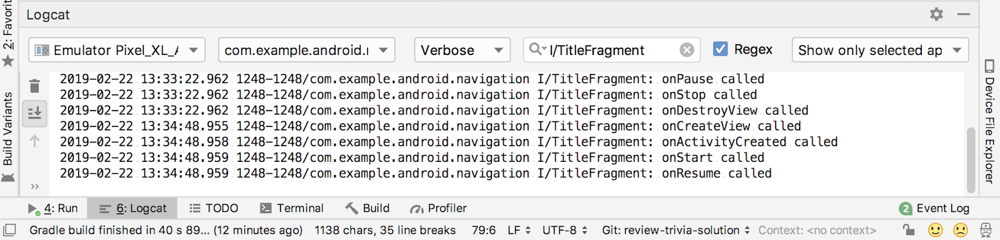

This time, `onAttach()` and `onCreate()` are probably not called to start the fragment. The fragment object still exists and is still attached to its owner activity, so the lifecycle starts again with `onCreateView()`.

10 - Press the device's Home button. Notice in the Logcat that only `onPause()` and `onStop()` are called. This is the same behavior as for the activity: returning home puts the activity and the fragment into the background.

11 - Use the recents screen to return to the app. Just as happened for the activity, the `onStart()` and `onResume()` methods are called to return the fragment to the foreground.