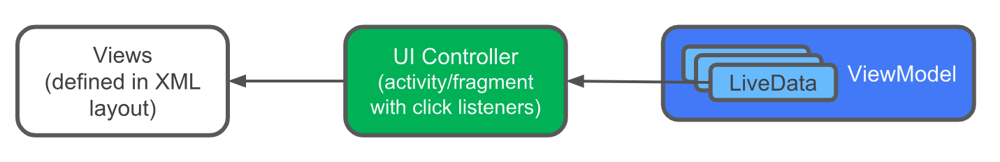
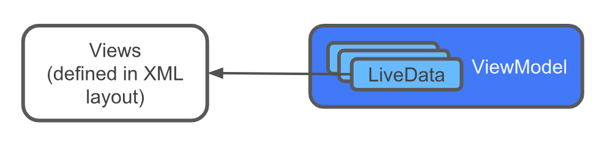
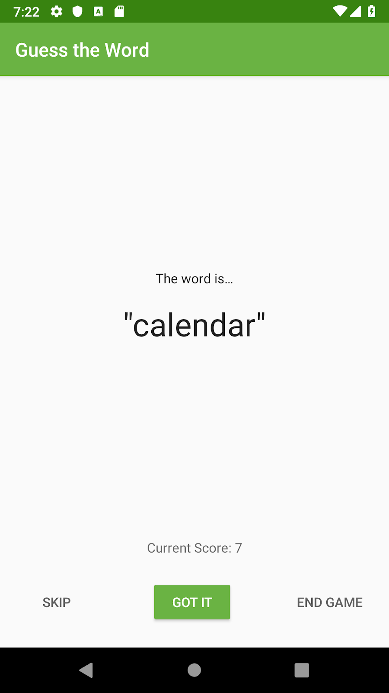

### App Intro


In this project, you improve the GuessTheWord app by integrating data binding with LiveData in ViewModel objects. This automates the communication between the views in the layout and the ViewModel objects, and it lets you simplify your code by using LiveData.


### Task: Get started

In this task, you locate and run your starter code for the previous project. You can use the GuessTheWord app that you built in previous project as your starter code, or you can download a starter app.

- Run the app and play the game.
- Notice that the Got It button shows the next word and increases the score by one while the Skip button displays the next word and decreases the score by one. The End Game button ends the game.
- Cycle through all the words, and notice that the app navigates automatically to the score screen.

### Task: Add ViewModel data binding

In a previous project, you used data binding as a type-safe way to access the views in the GuessTheWord app. But the real power of data binding is in doing what the name suggests: binding data directly to the view objects in your app.

Current app architecture

In your app, the views are defined in the XML layout, and the data for those views is held in ViewModel objects. Between each view and its corresponding ViewModel is a UI controller, which acts as a relay between them.



For example:

- The Got It button is defined as a Button view in the `game_fragment.xml` layout file.
- When the user taps the Got It button, a click listener in the GameFragment fragment calls the corresponding click listener in GameViewModel.
- The score is updated in the GameViewModel.

The Button view and the GameViewModel don't communicate directly—they need the click listener that's in the GameFragment.

#### ViewModel passed into the data binding

It would be simpler if the views in the layout communicated directly with the data in the ViewModel objects, without relying on UI controllers as intermediaries.



ViewModel objects hold all the UI data in the GuessTheWord app. By passing ViewModel objects into the data binding, you can automate some of the communication between the views and the ViewModel objects.

In this task, you associate the GameViewModel and ScoreViewModel classes with their corresponding XML layouts. You also set up listener bindings to handle click events.

#### Step 1: Add data binding for the GameViewModel

In this step, you associate GameViewModel with the corresponding layout file, game_fragment.xml.

- In the game_fragment.xml file, add a data-binding variable of the type GameViewModel. If you have errors in Android Studio, clean and rebuild the project.

```
<layout ...>

   <data>

       <variable
           name="gameViewModel"
           type="com.example.android.guesstheword.screens.game.GameViewModel" />
   </data>
  
   <androidx.constraintlayout...
```

- In the GameFragment file, pass the GameViewModel into the data binding.

To do this, assign viewModel to the binding.gameViewModel variable, which you declared in the previous step. Put this code inside onCreateView(), after the viewModel is initialized. If you have errors in Android Studio, clean and rebuild the project.

```
// Set the viewmodel for databinding - this allows the bound layout access 
// to all the data in the ViewModel
binding.gameViewModel = viewModel
```

#### Step 2: Use listener bindings for event handling

[Listener bindings](https://developer.android.com/topic/libraries/data-binding/expressions#listener_bindings) are binding expressions that run when events such as onClick(), onZoomIn(), or onZoomOut() are triggered. Listener bindings are written as lambda expressions.

Data binding creates a listener and sets the listener on the view. When the listened-for event happens, the listener evaluates the lambda expression. Listener bindings work with the Android Gradle Plugin version 2.0 or higher. To learn more, read Layouts and [binding expressions](https://developer.android.com/topic/libraries/data-binding/expressions#listener_bindings).

In this step, you replace the click listeners in the GameFragment with listener bindings in the game_fragment.xml file.

- In game_fragment.xml, add the onClick attribute to the skip_button. Define a binding expression and call the onSkip() method in the GameViewModel. This binding expression is called a listener binding.

```
<Button
   android:id="@+id/skip_button"
   ...
   android:onClick="@{() -> gameViewModel.onSkip()}"
   ... />
Similarly, bind the click event of the correct_button to the onCorrect() method in the GameViewModel.
<Button
   android:id="@+id/correct_button"
   ...
   android:onClick="@{() -> gameViewModel.onCorrect()}"
   ... />
```

- Bind the click event of the end_game_button to the onGameFinish() method in the GameViewModel.

```
<Button
   android:id="@+id/end_game_button"
   ...
   android:onClick="@{() -> gameViewModel.onGameFinish()}"
   ... />
```

- In GameFragment, remove the statements that set the click listeners, and remove the functions that the click listeners call. You no longer need them.

Code to remove:

```
binding.correctButton.setOnClickListener { onCorrect() }
binding.skipButton.setOnClickListener { onSkip() }
binding.endGameButton.setOnClickListener { onEndGame() }

/** Methods for buttons presses **/
private fun onSkip() {
   viewModel.onSkip()
}
private fun onCorrect() {
   viewModel.onCorrect()
}
private fun onEndGame() {
   gameFinished()
}
```

#### Step 3: Add data binding for the ScoreViewModel

In this step, you associate ScoreViewModel with the corresponding layout file, score_fragment.xml.

- In the score_fragment.xml file, add a binding variable of the type ScoreViewModel. This step is similar to what you did for GameViewModel above.

```
<layout ...>
   <data>
       <variable
           name="scoreViewModel"
           type="com.example.android.guesstheword.screens.score.ScoreViewModel" />
   </data>
   <androidx.constraintlayout.widget.ConstraintLayout
```

- In score_fragment.xml, add the onClick attribute to the play_again_button. Define a listener binding and call the onPlayAgain() method in the ScoreViewModel.

```
<Button
   android:id="@+id/play_again_button"
   ...
   android:onClick="@{() -> scoreViewModel.onPlayAgain()}"
   ... />
```

- In ScoreFragment, inside onCreateView(), initialize the viewModel. Then initialize the binding.scoreViewModel binding variable.

```
viewModel = ...
binding.scoreViewModel = viewModel
```

- In ScoreFragment, remove the code that sets the click listener for the playAgainButton. If Android Studio shows an error, clean and rebuild the project.

Code to remove:

```
binding.playAgainButton.setOnClickListener {  viewModel.onPlayAgain()  }
```

Run your app. The app should work as before, but now the button views communicate directly with the ViewModel objects. The views no longer communicate via the button click handlers in ScoreFragment.

### Troubleshooting data-binding error messages

When an app uses data binding, the compilation process generates intermediate classes that are used for the data binding. An app can have errors that Android Studio doesn't detect until you try to compile the app, so you don't see warnings or red code while you're writing the code. But at compile time, you get cryptic errors that come from the generated intermediate classes.

If you get a cryptic error message:

Look carefully at the message in the Android Studio Build pane. If you see a location that ends in databinding, there's an error with data binding.

In the layout XML file, check for errors in onClick attributes that use data binding. Look for the function that the lambda expression calls, and make sure that it exists.

In the <data> section of the XML, check the spelling of the data-binding variable.

For example, note the misspelling of the function name onCorrect() in the following attribute value:

```
android:onClick="@{() -> gameViewModel.onCorrectx()}"
```

Also note the misspelling of gameViewModel in the <data> section of the XML file:

```
<data>
   <variable
       name="gameViewModelx"
       type="com.example.android.guesstheword.screens.game.GameViewModel" />
</data>
```

Android Studio doesn't detect errors like these until you compile the app, and then the compiler shows an error message such as the following:

`error: cannot find symbol`

```
import com.example.android.guesstheword.databinding.GameFragmentBindingImpl"
symbol:   class GameFragmentBindingImpl

location: package com.example.android.guesstheword.databinding
```

### Task: Add LiveData to data binding

Data binding works well with LiveData that's used with ViewModel objects. Now that you've added data binding to the ViewModel objects, you're ready to incorporate LiveData.

In this task, you change the GuessTheWord app to use LiveData as the data-binding source to notify the UI about changes in the data, without using the LiveData observer methods.

#### Step 1: Add word LiveData to the game_fragment.xml file

- In this step, you bind the current word text view directly to the LiveData object in the ViewModel.

- In game_fragment.xml, add android:text attribute to the word_text text view.

- Set it to the LiveData object, word from the GameViewModel, using the binding variable, gameViewModel.

```
<TextView
   android:id="@+id/word_text"
   ...
   android:text="@{gameViewModel.word}"
   ... />
```

Notice that you don't have to use word.value. Instead, you can use the actual LiveData object. The LiveData object displays the current value of the word. If the value of word is null, the LiveData object displays an empty string.

- In the GameFragment, in onCreateView(), after initializing the gameViewModel, set the fragment view as the lifecycle owner of the binding variable. This defines the scope of the LiveData object above, allowing the object to automatically update the views in the layout, game_fragment.xml.

```
binding.gameViewModel = ...
// Specify the fragment view as the lifecycle owner of the binding.
// This is used so that the binding can observe LiveData updates
binding.lifecycleOwner = viewLifecycleOwner
```

- In GameFragment, remove the observer for the LiveData word.

Code to remove:

```
/** Setting up LiveData observation relationship **/
viewModel.word.observe(viewLifecycleOwner, Observer { newWord ->
   binding.wordText.text = newWord
})
```

- Run your app and play the game. Now the current word is being updated without an observer method in the UI controller.

#### Step 2: Add score LiveData to the score_fragment.xml file

In this step, you bind the LiveData score to the score text view in the score fragment.

- In score_fragment.xml, add the android:text attribute to the score text view. Assign scoreViewModel.score to the text attribute. Because the score is an integer, convert it to a string using String.valueOf().

```
<TextView
   android:id="@+id/score_text"
   ...
   android:text="@{String.valueOf(scoreViewModel.score)}"
   ... />
```

In ScoreFragment, after initializing the scoreViewModel, set the current activity as the lifecycle owner of the binding variable.

```
binding.scoreViewModel = ...
// Specify the fragment view as the lifecycle owner of the binding.
// This is used so that the binding can observe LiveData updates
binding.lifecycleOwner = viewLifecycleOwner
```
- In ScoreFragment, remove the observer for the score object.

Code to remove:

```
// Add observer for score
viewModel.score.observe(viewLifecycleOwner, Observer { newScore ->
   binding.scoreText.text = newScore.toString()
})
```

- Run your app and play the game. Notice that the score in the score fragment is displayed correctly, without an observer in the score fragment.

#### Step 3: Add string formatting with data binding

- In the layout, you can add string formatting along with data binding. In this task, you format the current word to add quotes around it. You also format the score string to prefix Current Score to it, as shown in the following image.



- In string.xml, add the following strings, which you will use to format the word and score text views. The %s and %d are the placeholders for the current word and current score.

```
<string name="quote_format">\"%s\"</string>
<string name="score_format">Current Score: %d</string>
```
- In game_fragment.xml, update the text attribute of the word_text text view to use the quote_format string resource. Pass in gameViewModel.word. This passes the current word as an argument to the formatting string.

```
<TextView
   android:id="@+id/word_text"
   ...
   android:text="@{@string/quote_format(gameViewModel.word)}"
   ... />
```

- Format the score text view similar to the word_text. In the game_fragment.xml, add the text attribute to the score_text text view. Use the string resource score_format, which takes one numerical argument, represented by the %d placeholder. Pass in the LiveData object, score, as an argument to this formatting string.

```
<TextView
   android:id="@+id/score_text"
   ...
   android:text="@{@string/score_format(gameViewModel.score)}"
   ... />
```

- In GameFragment class, inside the onCreateView() method, remove the score observer code.

Code to remove:

```
viewModel.score.observe(viewLifecycleOwner, Observer { newScore ->
   binding.scoreText.text = newScore.toString()
})
```

- Clean, rebuild, and run your app, then play the game. Notice that the current word and the score are formatted in the game screen.