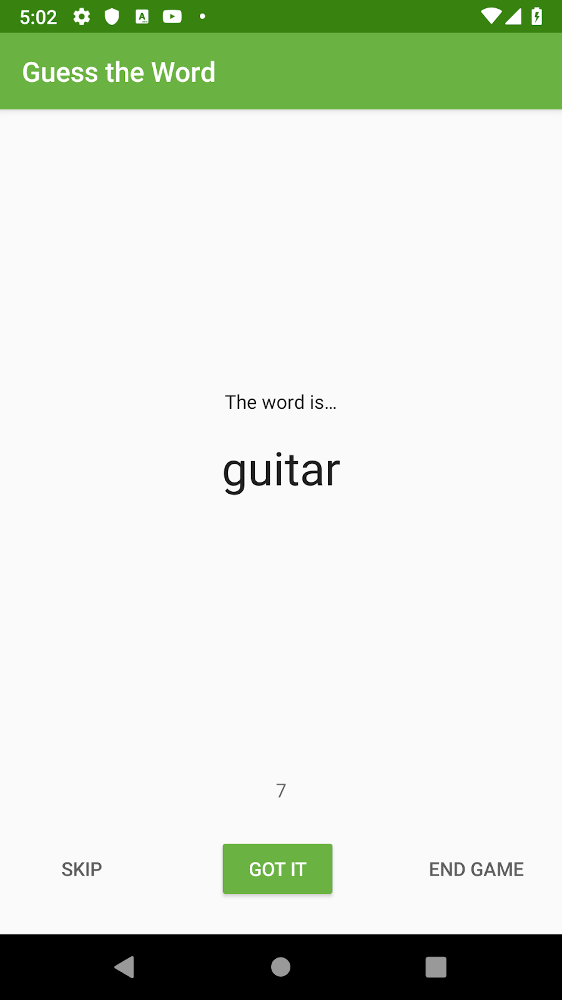
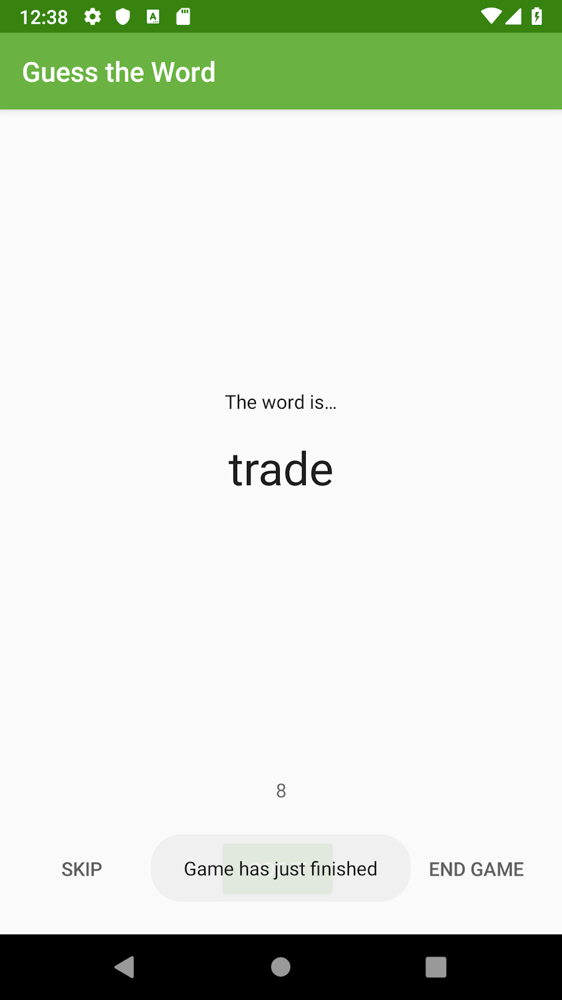
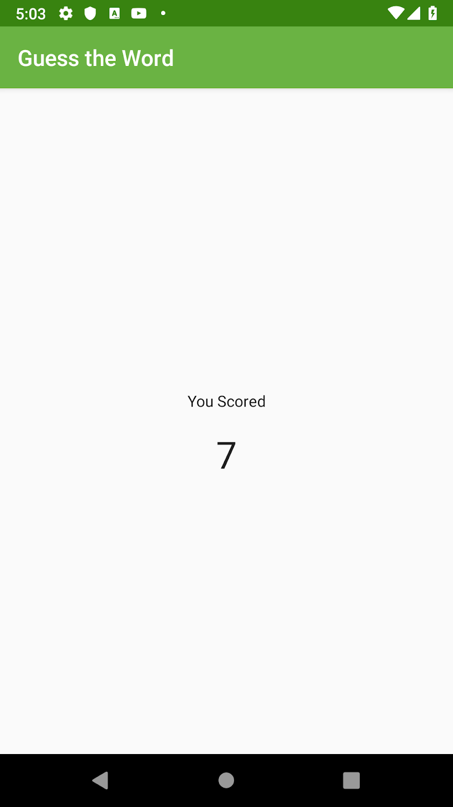

### App Intro 


In this project, you improve the GuessTheWord app by adding an event to end the game when the user cycles through all the words in the app. You also add a Play Again button in the score fragment, so the user can play the game again.

,


### Task

In this task, you locate and run your starter code for this project. You can use the GuessTheWord app that you built in previous project as your starter code, or you can download a starter app.
- (Optional) If you're not using your code from the previous project, [download](https://drive.google.com/drive/folders/1Lrek_RHa4i8sXpCH-6QcspSLRNULVlFY?usp=sharing) the starter code for this project. Unzip the code, and open the project in Android Studio.
- Run the app and play the game.
- Notice that the Skip button displays the next word and decreases the score by one, and the Got It button shows the next word and increases the score by one. The End Game button ends the game.

###Task: Add LiveData to the GameViewModel

LiveData is an observable data holder class that is lifecycle-aware. For example, you can wrap a LiveData around the current score in the GuessTheWord app. In this project, you learn about several characteristics of LiveData:

- LiveData is observable, which means that an observer is notified when the data held by the LiveData object changes.
- LiveData holds data; LiveData is a wrapper that can be used with any data
- LiveData is lifecycle-aware. When you attach an observer to the LiveData, the observer is associated with a LifecycleOwner (usually an Activity or Fragment). The LiveData only updates observers that are in an active lifecycle state such as STARTED or RESUMED. You can read more about LiveData and observation [here](https://developer.android.com/topic/libraries/architecture/livedata.html#work_livedata).

In this task, you learn how to wrap any data type into LiveData objects by converting the current score and current word data in the GameViewModel to LiveData. In a later task, you add an observer to these LiveData objects and learn how to observe the LiveData.

#### Step 1: Change the score and word to use LiveData

- Under the `screens/game` package, open the `GameViewModel` file.
- Change the type of the variables `score` and `word` to `MutableLiveData`.

MutableLiveData is a LiveData whose value can be changed. MutableLiveData is a generic class, so you need to specify the type of data that it holds.

```
// The current word
val word = MutableLiveData<String>()
// The current score
val score = MutableLiveData<Int>()
```

- In `GameViewModel`, inside the `init` block, initialize `score` and `word`. To change the value of a `LiveData` variable, you use the `setValue()` method on the variable. In Kotlin, you can call `setValue()` using the `value` property.

```
init {

   word.value = ""
   score.value = 0
  ...
}
```
#### Step 2: Update the LiveData object reference

The score and word variables are now of the type LiveData. In this step, you change the references to these variables, using the value property.

- In GameViewModel, in the `onSkip()` method, change score to score.value. Notice the error about score possibly being null. You fix this error next.
- To resolve the error, add a null check to score.value in `onSkip()`. Then call the `minus()` function on score, which performs the subtraction with null-safety.

```
fun onSkip() {
   score.value = (score.value)?.minus(1)
   nextWord()
}
```
Update the `onCorrect()` method in the same way: add a null check to the score variable and use the `plus()` function.

```
fun onCorrect() {
   score.value = (score.value)?.plus(1)
   nextWord()
}
```

In GameViewModel, inside the `nextWord()` method, change the word reference to word.value.

```
private fun nextWord() {
   if (!wordList.isEmpty()) {
       //Select and remove a word from the list
       word.value = wordList.removeAt(0)
   }
}
```

In GameFragment, inside the `updateWordText()` method, change the reference to `viewModel.word` to `viewModel.word.value`.

```
/** Methods for updating the UI **/
private fun updateWordText() {
   binding.wordText.text = viewModel.word.value
}
```

In GameFragment, inside `updateScoreText()` method, change the reference to the `viewModel.score` to `viewModel.score.value`.

```
private fun updateScoreText() {
   binding.scoreText.text = viewModel.score.value.toString()
}
```

In GameFragment, inside the `gameFinished(`) method, change the reference to `viewModel.score` to `viewModel.score.value`. Add the required null-safety check.

```
private fun gameFinished() {
   Toast.makeText(activity, "Game has just finished", Toast.LENGTH_SHORT).show()
   val action = GameFragmentDirections.actionGameToScore()
   action.score = viewModel.score.value?:0
   NavHostFragment.findNavController(this).navigate(action)
}
```

Make sure there are no errors in your code. Compile and run your app. The app's functionality should be the same as it was before.

### Task: Attach observers to the LiveData objects

This task is closely related to the previous task, where you converted the score and word data into LiveData objects. In this task, you attach Observer objects to those LiveData objects. You'll use the fragment view `(viewLifecycleOwner) `as the `LifecycleOwner`.

Why use viewLifecycleOwner?

Fragment views get destroyed when a user navigates away from a fragment, even though the fragment itself is not destroyed. This essentially creates two lifecycles, the lifecycle of the fragment, and the lifecycle of the fragment's view. Referring to the fragment's lifecycle instead of the fragment view's lifecycle can cause subtle bugs when updating the fragment's view. Therefore, when setting up observers that affect the fragment's view you should:

1. Set up the observers in onCreateView()

2. Pass in viewLifecycleOwner to observers

In GameFragment, inside the `onCreateView()` method, attach an Observer object to the LiveData object for the current score, viewModel.score. Use the `observe()` method, and put the code after the initialization of the viewModel. Use a lambda expression to simplify the code. (A lambda expression is an anonymous function that isn't declared, but is passed immediately as an expression.)

```
viewModel.score.observe(viewLifecycleOwner, Observer { newScore ->
})
```

Resolve the reference to Observer. To do this, click on Observer, press Alt+Enter (Option+Enter on a Mac), and import `androidx.lifecycle.Observer`.

- The observer that you just created receives an event when the data held by the observed LiveData object changes. Inside the observer, update the score TextView with the new score.

```
/** Setting up LiveData observation relationship **/
viewModel.score.observe(viewLifecycleOwner, Observer { newScore ->
   binding.scoreText.text = newScore.toString()
})
```

- Attach an Observer object to the current word LiveData object. Do it the same way you attached an Observer object to the current score.

```
/** Setting up LiveData observation relationship **/
viewModel.word.observe(viewLifecycleOwner, Observer { newWord ->
   binding.wordText.text = newWord
})
```

When the value of score or the word changes, the score or word displayed on the screen now updates automatically.

- In GameFragment, delete the methods `updateWordText()` and `updateScoreText()`, and all references to them. You don't need them anymore, because the text views are updated by the LiveData observer methods.

- Run your app. Your game app should work exactly as before, but now it uses LiveData and LiveData observers.

### Task: Encapsulate the LiveData

Encapsulation is a way to restrict direct access to some of an object's fields. When you encapsulate an object, you expose a set of public methods that modify the private internal fields. Using encapsulation, you control how other classes manipulate these internal fields.

In your current code, any external class can modify the score and word variables using the value property, for example using viewModel.score.value. It might not matter in the app you're developing in this project, but in a production app, you want control over the data in the ViewModel objects.

Only the ViewModel should edit the data in your app. But UI controllers need to read the data, so the data fields can't be completely private. To encapsulate your app's data, you use both MutableLiveData and LiveData objects.

MutableLiveData vs. LiveData:

- Data in a MutableLiveData object can be changed, as the name implies. Inside the ViewModel, the data should be editable, so it uses MutableLiveData.
- Data in a LiveData object can be read, but not changed. From outside the ViewModel, data should be readable, but not editable, so the data should be exposed as LiveData.

To carry out this strategy, you use a Kotlin backing property. A backing property allows you to return something from a getter other than the exact object. In this task, you implement a backing property for the score and word objects in the GuessTheWord app.

##### Add a backing property to score and word
- In GameViewModel, make the current score object private.
- To follow the naming convention used in backing properties, change `score` to `_score`. The `_score property` is now the mutable version of the game score, to be used internally.
- Create a public version of the LiveData type, called score.

```
// The current score
private val _score = MutableLiveData<Int>()
val
score: LiveData<Int> 
```

- You see an initialization error. This error happens because inside the GameFragment, the score is a LiveData reference, and score can no longer access its setter. To learn more about getters and setters in Kotlin, see [Getters and Setters](https://kotlinlang.org/docs/reference/properties.html#getters-and-setters).

To resolve the error, override the get() method for the score object in GameViewModel and return the backing property, _score.

```
val score: LiveData<Int>
   get() = _score
In the GameViewModel, change the references of score to its internal mutable version, _score.
init {
   ...
   _score.value = 0
   ...
}

...
fun onSkip() {
   _score.value = (score.value)?.minus(1)
  ...
}

fun onCorrect() {
   _score.value = (score.value)?.plus(1)
   ...
}
```

- Rename the word object to _word and add a backing property for it, as you did for the score object.

```
// The current word
private val _word = MutableLiveData<String>()
val word: LiveData<String>
   get() = _word
...
init {
   _word.value = ""
   ...
}
...
private fun nextWord() {
   if (!wordList.isEmpty()) {
       //Select and remove a word from the list
       _word.value = wordList.removeAt(0)
   }
}
```

Great job, you've encapsulated the LiveData objects word and score.

### Task: Add a game-finished event
Your current app navigates to the score screen when the user taps the `End Game` button. You also want the app to navigate to the score screen when the players have cycled through all the words. After the players finish with the last word, you want the game to end automatically so the user doesn't have to tap the button.

To implement this functionality, you need an event to be triggered and communicated to the fragment from the ViewModel when all the words have been shown. To do this, you use the LiveData observer pattern to model a game-finished event.

#### The observer pattern

The observer pattern is a software design pattern. It specifies communication between objects: an observable (the "subject" of observation) and observers. An observable is an object that notifies observers about the changes in its state.

[](b608df5e5e5fa4f8.png)

In the case of LiveData in this app, the observable (subject) is the LiveData object, and the observers are the methods in the UI controllers, such as fragments. A state change happens whenever the data wrapped inside LiveData changes. The LiveData classes are crucial in communicating from the ViewModel to the fragment.

#### Step 1: Use LiveData to detect a game-finished event

In this task, you use the LiveData observer pattern to model a game-finished event.

- In GameViewModel, create a Boolean MutableLiveData object called _eventGameFinish. This object will hold the game-finished event.

- After initializing the _eventGameFinish object, create and initialize a backing property called eventGameFinish.

```
// Event which triggers the end of the game
private val _eventGameFinish = MutableLiveData<Boolean>()
val eventGameFinish: LiveData<Boolean>
   get() = _eventGameFinish
```

- In GameViewModel, add an onGameFinish() method. In the method, set the game-finished event, eventGameFinish, to true.

```
/** Method for the game completed event **/
fun onGameFinish() {
   _eventGameFinish.value = true
}
```

- In GameViewModel, inside the nextWord() method, end the game if the word list is empty.

```
private fun nextWord() {
   if (wordList.isEmpty()) {
       onGameFinish()
   } else {
       //Select and remove a _word from the list
       _word.value = wordList.removeAt(0)
   }
}
```

- In GameFragment, inside onCreateView(), after initializing the viewModel, attach an observer to eventGameFinish. Use the observe() method. Inside the lambda function, call the gameFinished() method.

```
// Observer for the Game finished event
viewModel.eventGameFinish.observe(viewLifecycleOwner, Observer<Boolean> { hasFinished ->
   if (hasFinished) gameFinished()
})
```

- Run your app, play the game, and go through all the words. The app navigates to the score screen automatically, instead of staying in the game fragment until you tap End Game.

After the word list is empty, eventGameFinish is set, the associated observer method in the game fragment is called, and the app navigates to the screen fragment.

- The code you added has introduced a lifecycle issue. To understand the issue, in the GameFragment class, comment out the navigation code in the gameFinished() method. Make sure to keep the Toast message in the method.

```
private fun gameFinished() {
       Toast.makeText(activity, "Game has just finished", Toast.LENGTH_SHORT).show()
//        val action = GameFragmentDirections.actionGameToScore()
//        action.score = viewModel.score.value?:0
//        NavHostFragment.findNavController(this).navigate(action)
   }
```

- Run your app, play the game, and go through all the words. A toast message that says "Game has just finished" appears briefly at the bottom of the game screen, which is the expected behavior.

- Now rotate the device or emulator. The toast displays again! Rotate the device a few more times, and you will probably see the toast every time. This is a bug, because the toast should only display once, when the game is finished. The toast shouldn't display every time the fragment is re-created. You resolve this issue in the next task.




### Step 2: Reset the game-finished event

Usually, LiveData delivers updates to the observers only when data changes. An exception to this behavior is that observers also receive updates when the observer changes from an inactive to an active state.

This is why the game-finished toast is triggered repeatedly in your app. When the game fragment is re-created after a screen rotation, it moves from an inactive to an active state. The observer in the fragment is re-connected to the existing ViewModel and receives the current data. The gameFinished() method is re-triggered, and the toast displays.

In this task, you fix this issue and display the toast only once, by resetting the eventGameFinish flag in the GameViewModel.

- In GameViewModel, add an onGameFinishComplete() method to reset the game finished event, _eventGameFinish.

```
/** Method for the game completed event **/

fun onGameFinishComplete() {
   _eventGameFinish.value = false
}
```

In GameFragment, at the end of gameFinished(), call onGameFinishComplete() on the viewModel object. (Leave the navigation code in gameFinished() commented out for now.)

```
private fun gameFinished() {
   ...
   viewModel.onGameFinishComplete()
}
```

- Run the app and play the game. Go through all the words, then change the screen orientation of the device. The toast is displayed only once.

- In GameFragment, inside the gameFinished() method, uncomment the navigation code.

To uncomment in Android Studio, select the lines that are commented out and press Control+/ (Command+/ on a Mac).

```
private fun gameFinished() {
   Toast.makeText(activity, "Game has just finished", Toast.LENGTH_SHORT).show()
   val action = GameFragmentDirections.actionGameToScore()
   action.score = viewModel.score.value?:0
   findNavController(this).navigate(action)
   viewModel.onGameFinishComplete()
}
```

If prompted by Android Studio, `import androidx.navigation.fragment.NavHostFragment.findNavController`.

- Run the app and play the game. Make sure that the app navigates automatically to the final score screen after you go through all the words.




Great Job! Your app uses LiveData to trigger a game-finished event to communicate from the GameViewModel to the game fragment that the word list is empty. The game fragment then navigates to the score fragment.


### Task: Add LiveData to the ScoreViewModel

In this task, you change the score to a LiveData object in the ScoreViewModel and attach an observer to it. This task is similar to what you did when you added LiveData to the GameViewModel.

You make these changes to ScoreViewModel for completeness, so that all the data in your app uses LiveData.

- In ScoreViewModel, change the score variable type to MutableLiveData. Rename it by convention to _score and add a backing property.

```
private val _score = MutableLiveData<Int>()
val score: LiveData<Int>
   get() = _score
```

In ScoreViewModel, inside the init block, initialize _score. You can remove or leave the log in the init block as you like.

```
init {
   _score.value = finalScore
}
```

- In ScoreFragment, inside onCreateView(), after initializing the viewModel, attach an observer for the score LiveData object. Inside the lambda expression, set the score value to the score text view. Remove the code that directly assigns the text view with the score value from the ViewModel.

Code to add:

```
// Add observer for score
viewModel.score.observe(viewLifecycleOwner, Observer { newScore ->
   binding.scoreText.text = newScore.toString()
})
```

Code to remove:

```
binding.scoreText.text = viewModel.score.toString()
```

When prompted by Android Studio, import androidx.lifecycle.Observer.

- Run your app and play the game. The app should work as before, but now it uses LiveData and an observer to update the score.

### Task: Add the Play Again button

In this task, you add a Play Again button to the score screen and implement its click listener using a LiveData event. The button triggers an event to navigate from the score screen to the game screen.

The starter code for the app includes the Play Again button, but the button is hidden.

In `res/layout/score_fragment.xml`, for the `play_again_button` button, change the visibility attribute's value to visible.

```
<Button
   android:id="@+id/play_again_button"
...
   android:visibility="visible"
 />
```

- In ScoreViewModel, add a LiveData object to hold a Boolean called _eventPlayAgain. This object is used to save the LiveData event to navigate from the score screen to the game screen.

```
private val _eventPlayAgain = MutableLiveData<Boolean>()
val eventPlayAgain: LiveData<Boolean>
   get() = _eventPlayAgain
```

- In ScoreViewModel, define methods to set and reset the event, _eventPlayAgain.

```
fun onPlayAgain() {
   _eventPlayAgain.value = true
}
fun onPlayAgainComplete() {
   _eventPlayAgain.value = false
}
```

- In ScoreFragment, add an observer for eventPlayAgain. Put the code at the end of onCreateView(), before the return statement. Inside the lambda expression, navigate back to the game screen and reset eventPlayAgain.

```
// Navigates back to game when button is pressed
viewModel.eventPlayAgain.observe(viewLifecycleOwner, Observer { playAgain ->
   if (playAgain) {
      findNavController().navigate(ScoreFragmentDirections.actionRestart())
       viewModel.onPlayAgainComplete()
   }
})
```

- Import `androidx.navigation.fragment.findNavControlle`r, when prompted by Android Studio.

In ScoreFragment, inside onCreateView(), add a click listener to the PlayAgain button and call viewModel.onPlayAgain().

```
binding.playAgainButton.setOnClickListener {  viewModel.onPlayAgain()  }
```

- Run your app and play the game. When the game is finished, the score screen shows the final score and the Play Again button. Tap the PlayAgain button, and the app navigates to the game screen so that you can play the game again.

