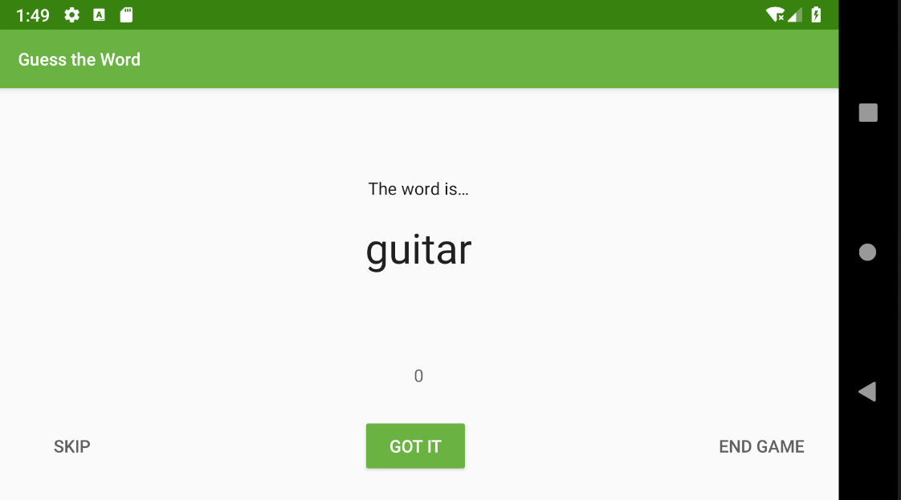
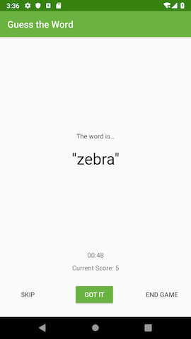

### App Intro




In this project, you improve the GuessTheWord app by adding a one-minute countdown timer that appears above the score. The timer ends the game when the countdown reaches 0.

You also use a transformation to format the elapsed time LiveData object into a timer string LiveData object. The transformed LiveData is the data binding source for the timer's text view.

The first player acts out the word, being careful not to actually say the word itself.

- When the second player guesses the word correctly, the first player presses the Got It button, which increases the count by one and shows the next word.

- If the second player can't guess the word, the first player presses the Skip button, which decreases the count by one and skips to the next word.

- To end the game, press the End Game button. (This functionality isn't in the starter code for the first project in the series.)

### Task: Get started

In this task, you locate and run your starter code for this project. You can use the GuessTheWord app that you built in previous codelab as your starter code, or you can download a starter app.

- Use your code from the previous project, download the starter code for this project.
- Run the app and play the game.
- Notice that the Skip button displays the next word and decreases the score by one, and the Got It button shows the next word and increases the score by one. The End Game button ends the game.
- Cycle through all the words, and notice that the app navigates automatically to the score screen.

### Task: Add a timer

In this task, you add a countdown timer to the app. Instead of the game ending when the word list is empty, the game ends when the timer finishes. Android provides a utility class called CountDownTimer that you use to implement the timer.

Add the logic for the timer in the GameViewModel so that the timer does not get destroyed during configuration changes. The fragment contains the code to update the timer text view as the timer ticks.

Implement the following steps in the GameViewModel class:

- Create a companion object to hold the timer constants.

```
companion object {

   // Time when the game is over
   private const val DONE = 0L

   // Countdown time interval
   private const val ONE_SECOND = 1000L

   // Total time for the game
   private const val COUNTDOWN_TIME = 60000L

}
```

- To store the countdown time of the timer, add a MutableLiveData member variable called _currentTime and a backing property, currentTime.

```
// Countdown time
private val _currentTime = MutableLiveData<Long>()
val currentTime: LiveData<Long>
   get() = _currentTime
```

Add a private member variable called timer of the type CountDownTimer. You resolve the initialization error in the next step.

```
private val timer: CountDownTimer
```

- Inside the init block, initialize and start the timer. Pass in the total time, COUNTDOWN_TIME. For the time interval, use ONE_SECOND. Override the callback methods onTick() and onFinish() and start the timer.

```
// Creates a timer which triggers the end of the game when it finishes
timer = object : CountDownTimer(COUNTDOWN_TIME, ONE_SECOND) {

   override fun onTick(millisUntilFinished: Long) {
       
   }

   override fun onFinish() {
       
   }
}

timer.start()
```

- Implement the onTick() callback method, which is called on every interval or on every tick. Update the _currentTime, using the passed-in parameter millisUntilFinished. The millisUntilFinished is the amount of time until the timer is finished in milliseconds. Convert millisUntilFinished to seconds and assign it to _currentTime.

```
override fun onTick(millisUntilFinished: Long)
{
   _currentTime.value = millisUntilFinished/ONE_SECOND
}
```

- The onFinish() callback method is called when the timer is finished. Implement onFinish() to update the _currentTime and trigger the game finish event.

```
override fun onFinish() {
   _currentTime.value = DONE
   onGameFinish()
}
```

- Update the nextWord() method to reset the word list when the list is empty, instead of finishing the game.

```
private fun nextWord() {
   // Shuffle the word list, if the list is empty 
   if (wordList.isEmpty()) {
       resetList()
   } else {
   // Remove a word from the list
   _word.value = wordList.removeAt(0)
}
```

- Inside the onCleared() method, cancel the timer to avoid memory leaks. You can remove the log statement, because it's no longer needed. The onCleared() method is called before the ViewModel is destroyed.

```
override fun onCleared() {
   super.onCleared()
   // Cancel the timer
   timer.cancel()
}
```

- Run your app and play the game. Wait 60 seconds, and the game finishes automatically. However, the timer text is not displayed on the screen. You fix that next.

### Task: Add transformation for the LiveData

The Transformations.map() method provides a way to perform data manipulations on the source LiveData and return a result LiveData object. These transformations aren't calculated unless an observer is observing the returned LiveData object.

This method takes the source LiveData and a function as parameters. The function manipulates the source LiveData.

Note: The lambda function passed to Transformation.map() is executed on the main thread, so do not include long-running tasks.

In this task, you format the elapsed time LiveData object into a new string LiveData object in "MM:SS" format. You also display the formatted elapsed time on the screen.

The game_fragment.xml layout file already includes the timer text view. So far, the text view has had no text to display, so the timer text has not been visible.

- In the GameViewModel class, after instantiating the currentTime, create a new LiveData object named currentTimeString. This object is for the formatted string version of the currentTime.
- Use Transformations.map() to define currentTimeString. Pass in the currentTime and a lambda function to format the time. You can implement the lambda function using the DateUtils.formatElapsedTime() utility method, which takes a long number of milliseconds and formats it to "MM:SS" string format.

```
// The String version of the current time
val currentTimeString = Transformations.map(currentTime) { time ->
   DateUtils.formatElapsedTime(time)
}
```

- In the game_fragment.xml file, in the timer text view, bind the text attribute to the currentTimeString of the gameViewModel.

```
<TextView
   android:id="@+id/timer_text"
   ...
   android:text="@{gameViewModel.currentTimeString}"
   ... />
```

- Run your app and play the game. The timer text updates once a second. Notice that the game does not finish when you have cycled through all the words. The game now finishes when the timer is up.

