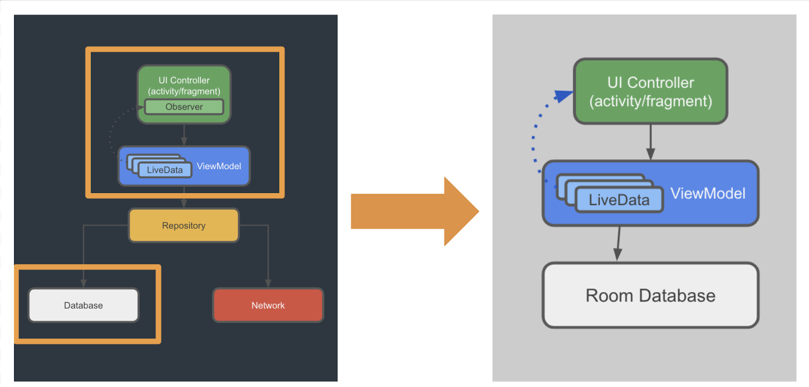
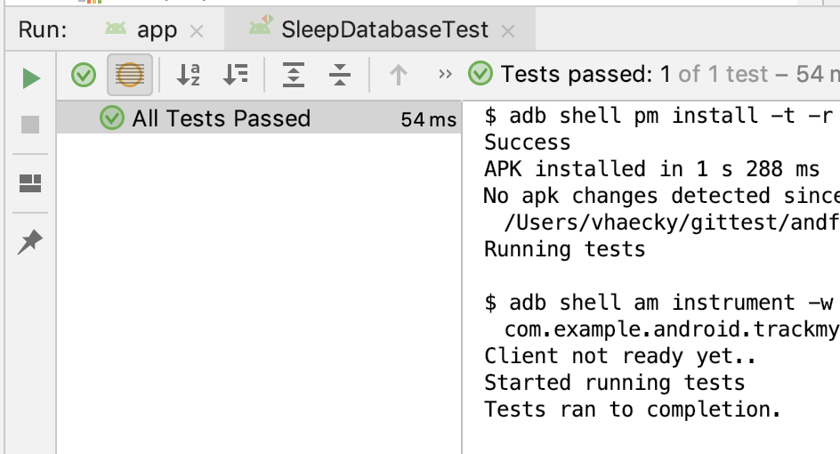

### App overview

In this project, you build the database portion of an app that tracks sleep quality. The app uses a database to store sleep data over time.

The app has two screens, represented by fragments, as shown in the figure below.


The first screen, shown on the left, has buttons to start and stop tracking. The screen shows all the user's sleep data. The Clear button permanently deletes all the data that the app has collected for the user.

The second screen, shown on the right, is for selecting a sleep-quality rating. In the app, the rating is represented numerically. For development purposes, the app shows both the face icons and their numerical equivalents.

The user's flow is as follows:

- User opens the app and is presented with the sleep-tracking screen.
- User taps the Start button. This records the starting time and displays it. The Start button is disabled, and the Stop button is enabled.
- User taps the Stop button. This records the ending time and opens the sleep-quality screen.
- User selects a sleep-quality icon. The screen closes, and the tracking screen displays the sleep-ending time and sleep quality. The Stop button is disabled and the Start button is enabled. The app is ready for another night.
- The Clear button is enabled whenever there is data in the database. When the user taps the Clear button, all their data is erased without recourse—there is no "Are you sure?" message.

This app uses a simplified architecture, as shown below in the context of the full architecture. The app uses only the following components:

- UI controller
- View model and LiveData
- A Room database



### Task: Download and inspect the starter app

#### Step 1: Download and run the starter app

- Download the [TrackMySleepQuality-Starter](https://drive.google.com/drive/folders/1o_rpnpCH-FB_wYl8dvq4QE4959vaUZKS?usp=sharing) app.
- Build and run the app. The app shows the UI for the SleepTrackerFragment fragment, but no data. The buttons do not respond to taps.

#### Step 2: Inspect the starter app

***Tip: Being familiar with your starter app will make it easier to identify and fix problems, should you run into any.***

##### Take a look at the Gradle files:

- The project Gradle file
- In the project-level build.gradle file, notice the variables that specify library versions. The versions used in the starter app work well together, and work well with this app. By the time you finish this project, Android Studio might prompt you to update some of the versions. It's up to you whether you want to update or stay with the versions that are in the app.
- The module Gradle file. Notice the provided dependencies for all the Android Jetpack libraries, including Room, and the dependencies for coroutines.
- Take a look at the packages and UI. The app is structured by functionality. The package contains placeholder files where you will add code throughout this series of projects.
- The database package, for all code relating to the Room database.
- The sleepquality and sleeptracker packages contain the fragment, view model, and view model factory for each screen.
- Take a look at the Util.kt file, which contains functions to help display sleep-quality data. Some code is commented out because it references a view model that you create later.
- Take a look at the androidTest folder (SleepDatabaseTest.kt). You will use this test to verify that the database works as intended.

### Task: Create the SleepNight entity

In Android, data is represented in data classes, and the data is accessed and modified using function calls. However, in the database world, you need entities and queries.

- An entity represents an object or concept, and its properties, to store in the database. An entity class defines a table, and each instance of that class represents a row in the table. Each property defines a column. In your app, the entity is going to hold information about a night of sleep.

- A query is a request for data or information from a database table or combination of tables, or a request to perform an action on the data. Common queries are for getting, inserting, and updating entities. For example, you could query for all the sleep nights on record, sorted by start time.

Room does all the hard work for you to get from Kotlin data classes to entities that can be stored in SQLite tables, and from function declarations to SQL queries.

You must define each entity as an annotated data class, and the interactions as an annotated interface, a data access object (DAO). Room uses these annotated classes to create tables in the database, and queries that act on the database.


#### Step 1: Create the SleepNight entity

In this task, you define one night of sleep as an annotated data class.

For one night of sleep, you need to record the start time, end time, and a quality rating.

And you need an ID to uniquely identify the night.

- In the database package, find and open the SleepNight.kt file.
- Create the SleepNight data class with parameters for an ID, a start time (in milliseconds), an end time (in milliseconds), and a numerical sleep-quality rating.
- You have to initialize the sleepQuality, so set it to -1, indicating that no quality data has been collected.
- You also have to initialize the end time. Set it to the start time to signal that no end time has been recorded yet.

```
data class SleepNight(
       var nightId: Long = 0L,
       val startTimeMilli: Long = System.currentTimeMillis(),
       var endTimeMilli: Long = startTimeMilli,
       var sleepQuality: Int = -1
)
```

- Before the class declaration, annotate the data class with @Entity. Name the table daily_sleep_quality_table. The argument for the tableName is optional, but recommended. You can look up other arguments in the documentation.

If prompted, import Entity and all other annotations from the androidx library.

```
@Entity(tableName = "daily_sleep_quality_table")
data class SleepNight(...)
```
- To identify the nightId as the primary key, annotate the nightId property with @PrimaryKey. Set the parameter autoGenerate to true so that Room generates the ID for each entity. This guarantees that the ID for each night is unique.

```
@PrimaryKey(autoGenerate = true)
var nightId: Long = 0L,...
```

- Annotate the remaining properties with @ColumnInfo. Customize the property names using parameters as shown below.

```
import androidx.room.ColumnInfo
import androidx.room.Entity
import androidx.room.PrimaryKey

@Entity(tableName = "daily_sleep_quality_table")
data class SleepNight(
       @PrimaryKey(autoGenerate = true)
       var nightId: Long = 0L,

       @ColumnInfo(name = "start_time_milli")
       val startTimeMilli: Long = System.currentTimeMillis(),

       @ColumnInfo(name = "end_time_milli")
       var endTimeMilli: Long = startTimeMilli,

       @ColumnInfo(name = "quality_rating")
       var sleepQuality: Int = -1
)
```

Build and run your code to make sure it has no errors.

#### Task: Create the DAO

In this task, you define a data access object (DAO). On Android, the DAO provides convenience methods for inserting, deleting, and updating the database.

When you use a Room database, you query the database by defining and calling Kotlin functions in your code. These Kotlin functions map to SQL queries. You define those mappings in a DAO using annotations, and Room creates the necessary code.

Think of a DAO as defining a custom interface for accessing your database.

For common database operations, the Room library provides convenience annotations, such as @Insert, @Delete, and @Update. For everything else, there is the @Query annotation. You can write any query that's supported by SQLite.

As an added bonus, as you create your queries in Android Studio, the compiler checks your SQL queries for syntax errors.

For the sleep-tracker database of sleep nights, you need to be able to do the following:

- Insert new nights.
- Update an existing night to update an end time and a quality rating.
- Get a specific night based on its key.
- Get all nights, so you can display them.
- Get the most recent night.
- Delete all entries in the database.

#### Step 1: Create the SleepDatabase DAO

- In the database package, open SleepDatabaseDao.kt.

- Notice that interface SleepDatabaseDao is annotated with @Dao. All DAOs need to be annotated with the @Dao keyword.

```
@Dao
interface SleepDatabaseDao {}
```

- Inside the body of the interface, add an @Insert annotation. Below the @Insert, add an insert() function that takes an instance of the Entity class SleepNight as its argument.

That's it. Room will generate all the necessary code to insert the SleepNight into the database. When you call insert() from your Kotlin code, Room executes a SQL query to insert the entity into the database. (Note: You can call the function anything you want.)

```
@Insert
fun insert(night: SleepNight)
```

Add an @Update annotation with an update() function for one SleepNight. The entity that's updated is the entity that has the same key as the one that's passed in. You can update some or all of the entity's other properties.

```
@Update
fun update(night: SleepNight)
```

There is no convenience annotation for the remaining functionality, so you have to use the @Query annotation and supply SQLite queries.

- Add a @Query annotation with a get() function that takes a Long key argument and returns a nullable SleepNight. You'll see an error for a missing parameter.

```
@Query
fun get(key: Long): SleepNight?
```

The query is supplied as a string parameter to the annotation. Add a parameter to @Query. Make it a String that is a SQLite query.


- Select all columns from the daily_sleep_quality_table
- WHERE the nightId matches the :key argument.

Notice the :key. You use the colon notation in the query to reference arguments in the function.

```
("SELECT * from daily_sleep_quality_table WHERE nightId = :key")
```

- Add another @Query with a clear() function and a SQLite query to DELETE everything from the daily_sleep_quality_table. This query does not delete the table itself.

The @Delete annotation deletes one item, and you could use @Delete and supply a list of nights to delete. The drawback is that you need to fetch or know what's in the table. The @Delete annotation is great for deleting specific entries, but not efficient for clearing all entries from a table.

```
@Query("DELETE FROM daily_sleep_quality_table")
fun clear()
```

- Add a @Query with a getTonight() function. Make the SleepNight returned by getTonight() nullable, so that the function can handle the case where the table is empty. (The table is empty at the beginning, and after the data is cleared.)

To get "tonight" from the database, write a SQLite query that returns the first element of a list of results ordered by nightId in descending order. Use LIMIT 1 to return only one element.

```
@Query("SELECT * FROM daily_sleep_quality_table ORDER BY nightId DESC LIMIT 1")
fun getTonight(): SleepNight?
```

- Add a @Query with a getAllNights() function:
- Have the SQLite query return all columns from the daily_sleep_quality_table, ordered in descending order.
- Have getAllNights() return a list of SleepNight entities as LiveData. Room keeps this LiveData updated for you, which means you only need to explicitly get the data once.
- You may need to import LiveData from androidx.lifecycle.LiveData.

```
@Query("SELECT * FROM daily_sleep_quality_table ORDER BY nightId DESC")
fun getAllNights(): LiveData<List<SleepNight>>
```

- Though you won't see any visible changes, run your app to make sure it has no errors.

### Task: Create and test a Room database

In this task, you create a Room database that uses the Entity and DAO that you created in the previous task.

You need to create an abstract database holder class, annotated with @Database. This class has one method that either creates an instance of the database if the database doesn't exist, or returns a reference to an existing database.

Getting a Room database is a bit involved, so here's the general process before you start with the code:

- Create a public abstract class that extends RoomDatabase. This class is to act as a database holder. The class is abstract, because Room creates the implementation for you.
- Annotate the class with @Database. In the arguments, declare the entities for the database and set the version number.
- Inside a companion object, define an abstract method or property that returns a SleepDatabaseDao. Room will generate the body for you.
- You only need one instance of the Room database for the whole app, so make the RoomDatabase a singleton.
- Use Room's database builder to create the database only if the database doesn't exist. Otherwise, return the existing database.

***Tip: The code will be much the same for any Room database, so you can use this code as a template.***

#### Step 1: Create the database

- In the database package, open SleepDatabase.kt.

- In the file, create an abstract class called SleepDatabase that extends RoomDatabase.

Annotate the class with @Database.

```
@Database()
abstract class SleepDatabase : RoomDatabase() {}
```

- You'll see an error for missing entities and version parameters. The @Database annotation requires several arguments, so that Room can build the database.
- Supply the SleepNight as the only item with the list of entities.
- Set the version as 1. Whenever you change the schema, you'll have to increase the version number.
- Set exportSchema to false, so as not to keep schema version history backups.

```
entities = [SleepNight::class], version = 1, exportSchema = false
```

- The database needs to know about the DAO. Inside the body of the class, declare an abstract value that returns the SleepDatabaseDao. You can have multiple DAOs.

```
abstract val sleepDatabaseDao: SleepDatabaseDao
```

- Below that, define a companion object. The companion object allows clients to access the methods for creating or getting the database without instantiating the class. Since the only purpose of this class is to provide a database, there is no reason to ever instantiate it.
```
 companion object {}
```

- Inside the companion object, declare a private nullable variable INSTANCE for the database and initialize it to null. The INSTANCE variable will keep a reference to the database, once one has been created. This helps you avoid repeatedly opening connections to the database, which is expensive.

Annotate INSTANCE with @Volatile. The value of a volatile variable will never be cached, and all writes and reads will be done to and from the main memory. This helps make sure the value of INSTANCE is always up-to-date and the same to all execution threads. It means that changes made by one thread to INSTANCE are visible to all other threads immediately, and you don't get a situation where, say, two threads each update the same entity in a cache, which would create a problem.

```
@Volatile
private var INSTANCE: SleepDatabase? = null
```

- Below INSTANCE, still inside the companion object, define a getInstance()method with a Context parameter that the database builder will need. Return a type SleepDatabase. You'll see an error because getInstance() isn't returning anything yet.

```
fun getInstance(context: Context): SleepDatabase {}
```

- Inside getInstance(), add a synchronized{} block. Pass in this so that you can access the context.

Multiple threads can potentially ask for a database instance at the same time, resulting in two databases instead of one. This problem is not likely to happen in this sample app, but it's possible for a more complex app. Wrapping the code to get the database into synchronized means that only one thread of execution at a time can enter this block of code, which makes sure the database only gets initialized once.

```
synchronized(this) {}
```

- Inside the synchronized block, copy the current value of INSTANCE to a local variable instance. This is to take advantage of smart cast, which is only available to local variables.

```
var instance = INSTANCE
```

- Inside the synchronized block, return instance at the end of the synchronized block. Ignore the return type mismatch error; you won't ever return null once you are done.

```
return instance
```

- Above the return statement, add an if statement to check whether instance is null, that is, there is no database yet.

```
if (instance == null) {}
```

- If instance is null, use the database builder to get a database. In the body of the if statement, invoke Room.databaseBuilder and supply the context that you passed in, the database class, and a name for the database, sleep_history_database. To remove the error, you'll have to add a migration strategy and build() in the following steps.

```
instance = Room.databaseBuilder(
                           context.applicationContext,
                           SleepDatabase::class.java,
                           "sleep_history_database")
```

- Add the required migration strategy to the builder. Use .fallbackToDestructiveMigration().

Normally, you would have to provide a migration object with a migration strategy for when the schema changes. A migration object is an object that defines how you take all rows with the old schema and convert them to rows in the new schema, so that no data is lost. Migration is beyond the scope of this project. A simple solution is to destroy and rebuild the database, which means that the data is lost.

```
.fallbackToDestructiveMigration()
```
- Finally, call .build().

```
.build()
```

- Assign INSTANCE = instance as the final step inside the if statement.

```
INSTANCE = instance
```

- Your final code should look like this:

```
@Database(entities = [SleepNight::class], version = 1, exportSchema = false)
abstract class SleepDatabase : RoomDatabase() {

   abstract val sleepDatabaseDao: SleepDatabaseDao

   companion object {

       @Volatile
       private var INSTANCE: SleepDatabase? = null

       fun getInstance(context: Context): SleepDatabase {
           synchronized(this) {
               var instance = INSTANCE

               if (instance == null) {
                   instance = Room.databaseBuilder(
                           context.applicationContext,
                           SleepDatabase::class.java,
                           "sleep_history_database"
                   )
                           .fallbackToDestructiveMigration()
                           .build()
                   INSTANCE = instance
               }
               return instance
           }
       }
   }
}
```
- Build and run your code.

You now have all the building blocks for working with your Room database. This code compiles and runs, but you have no way of telling if it actually works. So, this is a good time to add some basic tests.

#### Step 2: Test the SleepDatabase

In this step, you run provided tests to verify that your database works. This helps ensure that the database works before you build onto it. The provided tests are basic. For a production app, you would exercise all of the functions and queries in all the DAOs.

The starter app contains an androidTest folder. This androidTest folder contains unit tests that involve Android instrumentation, which is a fancy way of saying that the tests need the Android framework, so you need to run the tests on a physical or virtual device. Of course, you can also create and run pure unit tests that do not involve the Android framework.

- In Android Studio, in the androidTest folder, open the SleepDatabaseTest file.
- To uncomment the code, select all the commented code and press the Cmd+/ or Control+/ keyboard shortcut.
- Take a look at the file.

Here's a quick run-through of the testing code, because it's another piece of code that you can reuse:

- SleepDabaseTest is a test class.
- The @RunWith annotation identifies the test runner, which is the program that sets up and executes the tests.
- During setup, the function annotated with @Before is executed, and it creates an in-memory SleepDatabase with the SleepDatabaseDao. "In-memory" means that this database is not saved on the file system and will be deleted after the tests run.
- Also when building the in-memory database, the code calls another test-specific method, allowMainThreadQueries. By default, you get an error if you try to run queries on the main thread. This method allows you to run tests on the main thread, which you should only do during testing.
- In a test method annotated with @Test, you create, insert, and retrieve a SleepNight, and assert that they are the same. If anything goes wrong, throw an exception. In a real test, you would have multiple @Test methods.
- When testing is done, the function annotated with @After executes to close the database.

- Right-click on the test file in the Project pane and select Run 'SleepDatabaseTest'.
- After the tests run, verify in the SleepDatabaseTest pane that all the tests have passed.



Because all the tests passed, you now know several things:

- The database gets created correctly.
- You can insert a SleepNight into the database.
- You can get back the SleepNight.
- The SleepNight has the correct value for the quality.