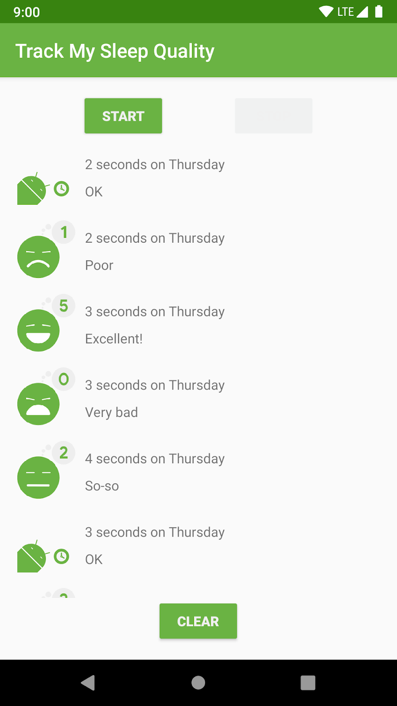
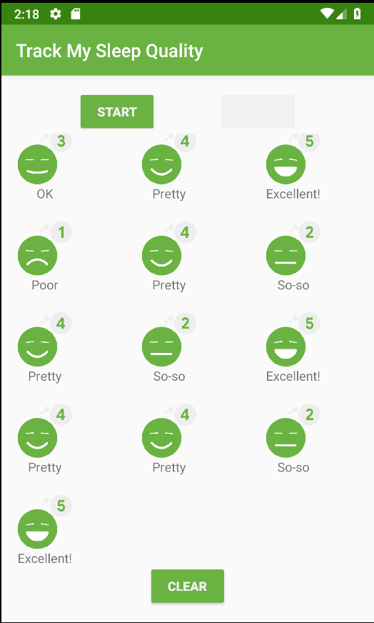
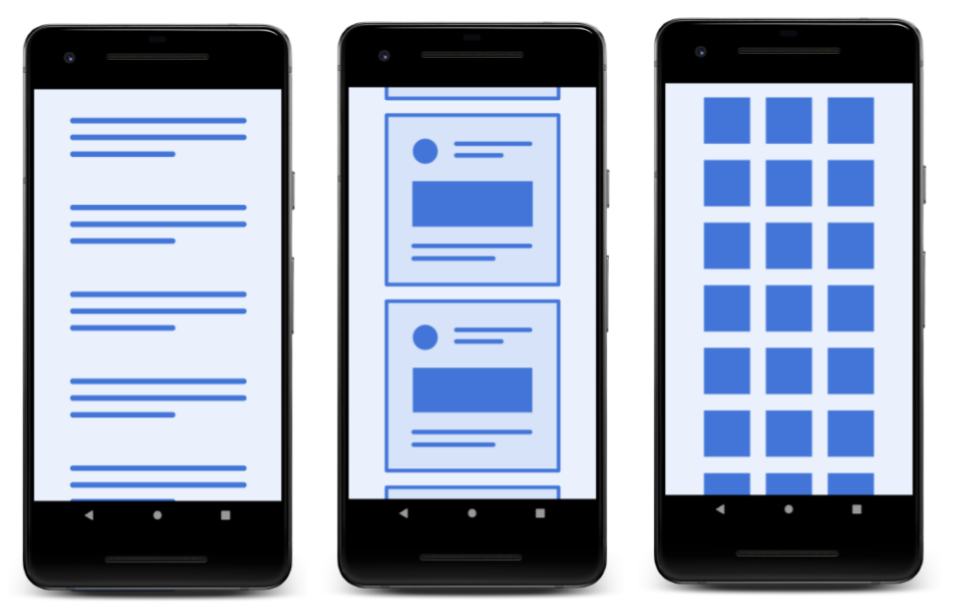

### App overview

The sleep-tracker app has two screens, represented by fragments, as shown in the figure below.





The first screen, shown on the left, has buttons for starting and stopping tracking. The screen shows some of the user's sleep data. The Clear button permanently deletes all the data that the app has collected for the user. The second screen, shown on the right, is for selecting a sleep-quality rating.

This app uses a simplified architecture with a UI controller, view model and LiveData, and a Room database to persist sleep data.


The sleep data is displayed in a RecyclerView. In this project, you change the app to use a GridLayout. The final screen will look like the screenshot below.



### Concept: Layouts and LayoutManagers

In a previous project, when you added the RecyclerView to fragment_sleep_tracker.xml, you added a LinearLayoutManager without any customizations. This code displays the data as a vertical list.

```
app:layoutManager="androidx.recyclerview.widget.LinearLayoutManager"
```

- LinearLayoutManager is the most common and straightforward layout manager for RecyclerView, and it supports both horizontal and vertical placement of child views. For example, you could use LinearLayoutManager to create a carousel of images that the user scrolls horizontally.

### GridLayout

Another common use case is needing to show a lot of data to the user, which you can do using GridLayout. The GridLayoutManager for RecyclerView lays out the data as a scrollable grid, as shown below.



From a design perspective, GridLayout is best for lists that can be represented as icons or images, such as lists within a photo browsing app. In the sleep-tracker app, you could show each night of sleep as a grid of large icons. This design would give the user an overview of their sleep quality at a glance.

### How GridLayout lays out items

GridLayout arranges items in a grid of rows and columns. Assuming vertical scrolling, by default, each item in a row takes up one "span." (In this case, one span is equivalent to the width of one column.)

In the first two examples shown below, each row is made up of three spans. By default, the GridLayoutManager lays out each item in one span until the span count, which you specify. When it reaches the span count, it wraps to the next line.

By default, each item takes up one span, but you can make an item wider by specifying how many spans it is to occupy. For example, the top item in the rightmost screen (shown below) takes up three spans.


Tip: Span can mean either "row" or "column." With GridLayoutManager, you use spanCount to indicate how many columns or rows a grid has, and also how much grid space an item takes up horizontally or vertically.

When you create a GridLayoutManager, you specify the orientation separately from the number of spans, and "span" is "direction-agnostic." In a (default) vertical configuration, "span" and "column" are equivalent.

### Task: Implement GridLayout

In this task, you take the RecyclerView that you finished in the last exercise and update it to display data using a GridLayoutManager. You can continue using the sleep-tracker app from the previous project, or you can download the RecyclerViewGridLayout-Starter app from GitHub.

### Step 1: Change the LayoutManager
- If needed, download the RecyclerViewGridLayout-Starter app for this project from GitHub and open the project in Android Studio.
- Open the fragment_sleep_tracker.xml layout file.
- Remove the layout manager from the sleep_list RecyclerView definition.

Code to delete:

```
app:layoutManager="androidx.recyclerview.widget.LinearLayoutManager
```

- Open SleepTrackerFragment.kt.

- In OnCreateView(), just before the return statement, create a new vertical, top-to-bottom GridLayoutManager with 3 spans.

The GridLayoutManager constructor takes up to four arguments: a context, which is the activity, the number spans (columns, in the default vertical layout), an orientation (default is vertical), and whether it's a reverse layout (default is false).

```
val manager = GridLayoutManager(activity, 3)
```

- Below that line, tell the RecyclerView to use this GridLayoutManager. The RecyclerView is in the binding object and is called sleepList. (See fragment_sleep_tracker.xml.)

```
binding.sleepList.layoutManager = manager
```

### Step 2: Change the layout

The current layout in list_item_sleep_night.xml displays the data by using a whole row per night. In this step, you define a more compact square item layout for the grid.

***Tip: If you don't want to lose your current layout, make a copy of the file first and name it list_item_sleep_night_linear.xml, or comment out the code instead of removing it.***

- Open list_item_sleep_night.xml.
- Delete the sleep_length TextView, because the new design doesn't need it.
- Move the quality_string TextView so that it displays beneath the ImageView. To do that, you have to update quite a few things. Here is the final layout for the quality_string TextView:

```
<TextView
   android:id="@+id/quality_string"
   android:layout_width="0dp"
   android:layout_height="20dp"
   android:textAlignment="center"
   app:layout_constraintBottom_toBottomOf="parent"
   app:layout_constraintEnd_toEndOf="@+id/quality_image"
   app:layout_constraintHorizontal_bias="0.0"
   app:layout_constraintStart_toStartOf="@+id/quality_image"
   app:layout_constraintTop_toBottomOf="@+id/quality_image"
   tools:text="Excellent!!!"
   app:sleepQualityString="@{sleep}" />
```

Verify in the Design view that the quality_string TextView is positioned below the ImageView.


Because you used data binding, you don't need to change anything in the Adapter. The code should just work, and your list should display as a grid.

- Run the app and observe how the sleep data is displayed in a grid.

Note that the ConstraintLayout still takes the entire width. The GridLayoutManager gives your view a fixed width, based on its span. GridLayoutManager does its best to meet all constraints when laying out the grid, adding whitespace or clipping items.

- In SleepTrackerFragment, in the code that creates the GridLayoutManager, change the number of spans for GridLayoutManger to 1. Run the app, and you get a list.

```
val manager = GridLayoutManager(activity, 1)
```

- Change the number of spans for GridLayoutManager to 10 and run the app. Notice that the GridLayoutManager will fit 10 items in a row, but the items are now clipped.

- Change the span count to 5 and the direction to GridLayoutManager.VERTICAL. Run the app and notice how you can scroll horizontally. You would need a different layout to make this look good.

```
val manager = GridLayoutManager(activity, 5, GridLayoutManager.HORIZONTAL, false)
```

- Don't forget to set the span count back to 3 and the orientation to vertical!