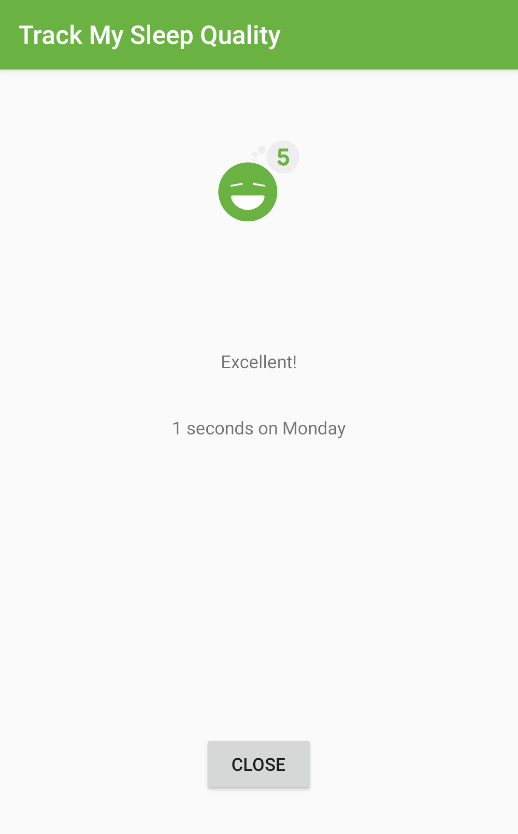
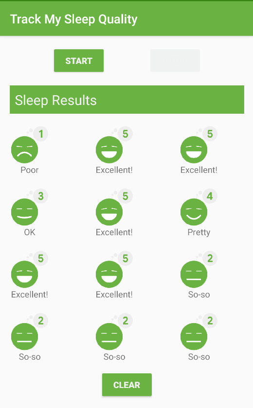
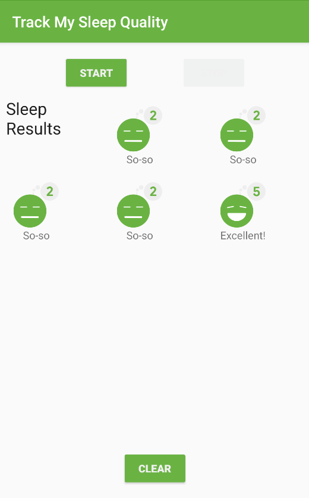

## App overview

The sleep-tracker app you start with has three screens, represented by fragments, as shown in the figure below.




The first screen, shown on the left, has buttons for starting and stopping tracking. The screen shows some of the user's sleep data. The Clear button permanently deletes all the data that the app has collected for the user. The second screen, shown in the middle, is for selecting a sleep-quality rating. The third screen is a detail view that opens when the user taps an item in the grid.

This app uses a simplified architecture with a UI controller, view model and LiveData, and a Room database to persist sleep data.


In this project, you add a header to the grid of items displayed. Your final main screen will look like this:




### Concept: Headers in RecyclerView

This project teaches the general principle of including items that use different layouts in a RecyclerView. One common example is having headers in your list or grid. A list can have a single header to describe the item content. A list can also have multiple headers to group and separate items in a single list.

RecyclerView doesn't know anything about your data or what type of layout each item has. The LayoutManager arranges the items on the screen, but the adapter adapts the data to be displayed and passes view holders to the RecyclerView. So you will add the code to create headers in the adapter.

#### Two ways of adding headers

In RecyclerView, every item in the list corresponds to an index number starting from 0. For example:

[Actual Data] -> [Adapter Views]

[0: SleepNight] -> [0: SleepNight]

[1: SleepNight] -> [1: SleepNight]

[2: SleepNight] -> [2: SleepNight]

One way to add headers to a list is to modify your adapter to use a different ViewHolder by checking indexes where your header needs to be shown. The Adapter will be responsible for keeping track of the header. For example, to show a header at the top of the table, you need to return a different ViewHolder for the header while laying out the zero-indexed item. Then all the other items would be mapped with the header offset, as shown below.

[Actual Data] -> [Adapter Views]

[0: Header]

[0: SleepNight] -> [1: SleepNight]

[1: SleepNight] -> [2: SleepNight]

[2: SleepNight] -> [3: SleepNight.

Another way to add headers is to modify the backing dataset for your data grid. Since all the data that needs to be displayed is stored in a list, you can modify the list to include items to represent a header. This is a bit simpler to understand, but it requires you to think about how you design your objects, so you can combine the different item types into a single list. Implemented this way, the adapter will display the items passed to it. So the item at position 0 is a header, and the item at position 1 is a SleepNight, which maps directly to what's on the screen.

[Actual Data] -> [Adapter Views]

[0: Header] -> [0: Header]

[1: SleepNight] -> [1: SleepNight]

[2: SleepNight] -> [2: SleepNight]

[3: SleepNight] -> [3: SleepNight]

Each methodology has benefits and drawbacks. Changing the dataset doesn't introduce much change to the rest of the adapter code, and you can add header logic by manipulating the list of data. On the other hand, using a different ViewHolder by checking indexes for headers gives more freedom on the layout of the header. It also lets the adapter handle how data is adapted to the view without modifying the backing data.

In this project, you update your RecyclerView to display a header at the start of the list. In this case, your app will use a different ViewHolder for the header than for data items. The app will check the index of the list to determine which ViewHolder to use.

### Task: Add a header to your RecyclerView

#### Step 1: Create a DataItem class

To abstract the type of item and let the adapter just deal with "items", you can create a data holder class that represents either a SleepNight or a Header. Your dataset will then be a list of data holder items.

Using the SleepTracker app you built in the previous project.

- Open SleepNightAdapter.kt.
- Below the SleepNightListener class, at the top level, define a sealed class called DataItem that represents an item of data.

A sealed class defines a closed type, which means that all subclasses of DataItem must be defined in this file. As a result, the number of subclasses is known to the compiler. It's not possible for another part of your code to define a new type of DataItem that could break your adapter.

```
sealed class DataItem {

 }
```

- Inside the body of the DataItem class, define two classes that represent the different types of data items. The first is a SleepNightItem, which is a wrapper around a SleepNight, so it takes a single value called sleepNight. To make it part of the sealed class, have it extend DataItem.

```
data class SleepNightItem(val sleepNight: SleepNight): DataItem()
```

- The second class is Header, to represent a header. Since a header has no actual data, you can declare it as an object. That means there will only ever be one instance of Header. Again, have it extend DataItem.

```
object Header: DataItem()
```

- Inside DataItem, at the class level, define an abstract Long property named id. When the adapter uses DiffUtil to determine whether and how an item has changed, the DiffItemCallback needs to know the id of each item. You will see an error, because SleepNightItem and Header need to override the abstract property id.

```
abstract val id: Long
```

- In SleepNightItem, override id to return the nightId.

```
override val id = sleepNight.nightId
```

- In Header, override id to return Long.MIN_VALUE, which is a very, very small number (literally, -2 to the power of 63). So, this will never conflict with any nightId in existence.

```
override val id = Long.MIN_VALUE
```

Your finished code should look like this, and your app should build without errors.

```
sealed class DataItem {
    abstract val id: Long
    data class SleepNightItem(val sleepNight: SleepNight): DataItem()      {
        override val id = sleepNight.nightId
    }

    object Header: DataItem() {
        override val id = Long.MIN_VALUE
    }
}
```

### Step 2: Create a ViewHolder for the Header

- Create the layout for the header in a new layout resource file called header.xml that displays a TextView. There is nothing exciting about this, so here is the code.

```
<?xml version="1.0" encoding="utf-8"?>
<TextView xmlns:android="http://schemas.android.com/apk/res/android"
    android:id="@+id/text"
    android:layout_width="match_parent"
    android:layout_height="wrap_content"
    android:textAppearance="?android:attr/textAppearanceLarge"
    android:text="Sleep Results"
    android:padding="8dp" />
```

- Extract "Sleep Results" into a string resource and call it header_text.

```
<string name="header_text">Sleep Results</string>
In SleepNightAdapter.kt, inside SleepNightAdapter, above the ViewHolder class, create a new TextViewHolder class. This class inflates the textview.xml layout, and returns a TextViewHolder instance. Since you've done this before, here is the code, and you'll have to import View and R:
    class TextViewHolder(view: View): RecyclerView.ViewHolder(view) {
        companion object {
            fun from(parent: ViewGroup): TextViewHolder {
                val layoutInflater = LayoutInflater.from(parent.context)
                val view = layoutInflater.inflate(R.layout.header, parent, false)
                return TextViewHolder(view)
            }
        }
    }
```

#### Step 3: Update SleepNightAdapter

- Next you need to update the declaration of SleepNightAdapter. Instead of only supporting one type of ViewHolder, it needs to be able to use any type of view holder.

#### Define the types of items

- In SleepNightAdapter.kt, at the top level, below the import statements and above SleepNightAdapter, define two constants for the view types.

The RecyclerView will need to distinguish each item's view type, so that it can correctly assign a view holder to it.

```
    private val ITEM_VIEW_TYPE_HEADER = 0
    private val ITEM_VIEW_TYPE_ITEM = 1
```

- Inside the SleepNightAdapter, create a function to override getItemViewType() to return the right header or item constant depending on the type of the current item.

```
override fun getItemViewType(position: Int): Int {
        return when (getItem(position)) {
            is DataItem.Header -> ITEM_VIEW_TYPE_HEADER
            is DataItem.SleepNightItem -> ITEM_VIEW_TYPE_ITEM
        }
    }
```

##### Update the SleepNightAdapter definition

- In the definition of SleepNightAdapter, update the first argument for the ListAdapter from SleepNight to DataItem.
- In the definition of SleepNightAdapter, change the second generic argument for the ListAdapter from SleepNightAdapter.ViewHolder to RecyclerView.ViewHolder. You will see some errors for necessary updates, and your class header should look like shown below.

```
class SleepNightAdapter(val clickListener: SleepNightListener):
       ListAdapter<DataItem, RecyclerView.ViewHolder>(SleepNightDiffCallback()) {
Update onCreateViewHolder()
```

- Change the signature of onCreateViewHolder() to return a RecyclerView.ViewHolder.

```
override fun onCreateViewHolder(parent: ViewGroup, viewType: Int): RecyclerView.ViewHolder
```

- Expand the implementation of the onCreateViewHolder() method to test for and return the appropriate view holder for each item type. Your updated method should look like the code below.

```
override fun onCreateViewHolder(parent: ViewGroup, viewType: Int): RecyclerView.ViewHolder {
        return when (viewType) {
            ITEM_VIEW_TYPE_HEADER -> TextViewHolder.from(parent)
            ITEM_VIEW_TYPE_ITEM -> ViewHolder.from(parent)
            else -> throw ClassCastException("Unknown viewType ${viewType}")
        }
    }
```

#### Update onBindViewHolder()

- Change the parameter type of onBindViewHolder() from ViewHolder to RecyclerView.ViewHolder.

```
override fun onBindViewHolder(holder: RecyclerView.ViewHolder, position: Int)
```

- Add a condition to only assign data to the view holder if the holder is a ViewHolder.

```
        when (holder) {
            is ViewHolder -> {...}
```

- Cast the object type returned by getItem() to DataItem.SleepNightItem. Your finished onBindViewHolder() function should look like this.

```
  override fun onBindViewHolder(holder: RecyclerView.ViewHolder, position: Int) {
        when (holder) {
            is ViewHolder -> {
                val nightItem = getItem(position) as DataItem.SleepNightItem
                holder.bind(nightItem.sleepNight, clickListener)
            }
        }
    }
```

#### Update the diffUtil callbacks

- Change the methods in SleepNightDiffCallback to use your new DataItem class instead of the SleepNight. Suppress the lint warning as shown in the code below.

```
class SleepNightDiffCallback : DiffUtil.ItemCallback<DataItem>() {
    override fun areItemsTheSame(oldItem: DataItem, newItem: DataItem): Boolean {
        return oldItem.id == newItem.id
    }
    @SuppressLint("DiffUtilEquals")
    override fun areContentsTheSame(oldItem: DataItem, newItem: DataItem): Boolean {
        return oldItem == newItem
    }
}
```

#### Add and submit the header

- Inside the SleepNightAdapter, below onCreateViewHolder(), define a function addHeaderAndSubmitList() as shown below. This function takes a list of SleepNight. Instead of using submitList(), provided by the ListAdapter, to submit your list, you will use this function to add a header and then submit the list.

```
fun addHeaderAndSubmitList(list: List<SleepNight>?) {}
```

- Inside addHeaderAndSubmitList(), if the passed in list is null, return just a header, otherwise, attach the header to the head of the list, and then submit the list.

```
val items = when (list) {
                null -> listOf(DataItem.Header)
                else -> listOf(DataItem.Header) + list.map { DataItem.SleepNightItem(it) }
            }
submitList(items)
```

- Open SleepTrackerFragment.kt and change the call to submitList() to addHeaderAndSubmitList().

- Run your app and observe how your header is displayed as the first item in the list of sleep items.



### Task: Use coroutines for list manipulations

There are two things that need to be fixed for this app. One is visible, and one is not.

The header shows up in the top-left corner, and is not easily distinguishable.

It doesn't matter much for a short list with one header, but you should not do list manipulation in addHeaderAndSubmitList() on the UI thread. Imagine a list with hundreds of items, multiple headers, and logic to decide where items need to be inserted. This work belongs in a coroutine.

Change addHeaderAndSubmitList() to use coroutines:

- At the top level inside the SleepNightAdapter class, define a CoroutineScope with Dispatchers.Default.

```
private val adapterScope = CoroutineScope(Dispatchers.Default)
```

- In addHeaderAndSubmitList(), launch a coroutine in the adapterScope to manipulate the list. Then switch to the Dispatchers.Main context to submit the list, as shown in the code below.

```
 fun addHeaderAndSubmitList(list: List<SleepNight>?) {
        adapterScope.launch {
            val items = when (list) {
                null -> listOf(DataItem.Header)
                else -> listOf(DataItem.Header) + list.map { DataItem.SleepNightItem(it) }
            }
            withContext(Dispatchers.Main) {
                submitList(items)
            }
        }
    }
```

- Your code should build and run, and you won't see any difference.

### Task: Extend the header to span across the screen

Currently, the header is the same width as the other items on the grid, taking up one span horizontally and vertically. The whole grid fits three items of one span width horizontally, so the header should use three spans horizontally.

To fix the header width, you need to tell the GridLayoutManager when to span the data across all the columns. You can do this by configuring the SpanSizeLookup on a GridLayoutManager. This is a configuration object that the GridLayoutManager uses to determine how many spans to use for each item in the list.

- Open SleepTrackerFragment.kt.
- Find the code where you define manager, towards the end of onCreateView().

```
val manager = GridLayoutManager(activity, 3)
```

- Below manager, define manager.spanSizeLookup, as shown. You need to make an object because setSpanSizeLookup doesn't take a lambda. To make an object in Kotlin, type object : classname, in this case GridLayoutManager.SpanSizeLookup.

```
manager.spanSizeLookup = object : GridLayoutManager.SpanSizeLookup() {
}
```

- You might get a compiler error to call the constructor. If you do, open the intention menu with Option+Enter (Mac) or Alt+Enter (Windows) to apply the constructor call.
- Then you'll get an error on object saying you need to override methods. Put the cursor on object, press Option+Enter (Mac) or Alt+Enter (Windows) to open the intentions menu, then override the method getSpanSize().
- In the body of getSpanSize(), return the right span size for each position. Position 0 has a span size of 3, and the other positions have a span size of 1. Your completed code should look like the code below:

```
    manager.spanSizeLookup = object : GridLayoutManager.SpanSizeLookup() {
            override fun getSpanSize(position: Int) =  when (position) {
                0 -> 3
                else -> 1
            }
        }
```

- To improve how your header looks, open header.xml and add this code to the layout file header.xml.

```
android:textColor="@color/white_text_color"
android:layout_marginStart="16dp"
android:layout_marginTop="16dp"
android:layout_marginEnd="16dp"
android:background="@color/colorAccent"
```

Run your app. It should look like the screenshot below.


Congratulations! You are done.