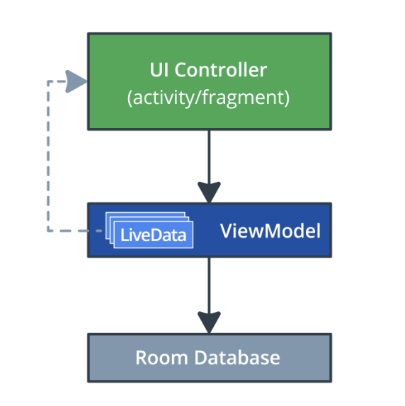
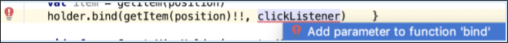

### App overview

The starting sleep-tracker app has two screens, represented by fragments, as shown in the figure below.


The first screen, shown on the left, has buttons for starting and stopping tracking. The screen shows some of the user's sleep data. The Clear button permanently deletes all the data that the app has collected for the user. The second screen, shown on the right, is for selecting a sleep-quality rating.

This app uses a simplified architecture with a UI controller, view model and LiveData, and a Room database to persist sleep data.



In this project, you add the ability to respond when a user taps an item in the grid, which brings up a detail screen like the one below. The code for this screen (fragment, view model, and navigation) is provided with the starter app, and you will implement the click-handling mechanism.


### Task: Get the starter code and inspect the changes to the app

***Important: The starter app for this project provides additional layouts, resources, and utilities that are not part of the final TrackMySleepQuality app from the previous project. We recommend that you use the provided starter code to work through this project.***

#### Step 1: Get the starter app

- Download the RecyclerViewClickHandler-Starter code from GitHub and open the project in Android Studio.

- Build and run the starter sleep-tracker app.

### Update your app if you want to use the app from the previous project

For using your own sleep-tracker app that you built in the previous project, follow the instructions below to update your existing app so that it has the code for the details-screen fragment.

***Tip: To copy files from the file system to Android Studio, you can copy and paste them, or drag and drop them.***

- Copy all the files in the [sleepdetail](https://drive.google.com/drive/folders/1o_rpnpCH-FB_wYl8dvq4QE4959vaUZKS?usp=sharing) package.
- In the [layout folder](https://drive.google.com/drive/folders/1WOhD8CBREJXw0IynP9FKWKLVj6Rf55K5?usp=sharing), copy the file fragment_sleep_detail.xml.
- Copy the updated contents of [navigation.xml](https://drive.google.com/drive/folders/1WOhD8CBREJXw0IynP9FKWKLVj6Rf55K5?usp=sharing), which adds the navigation for the sleep_detail_fragment.
- In the database package, in the [SleepDatabaseDao](https://drive.google.com/drive/folders/1hJaNcxIx1sjIXybrCzEkSC-oLF0LhDBf?usp=sharing), add the new getNightWithId() method:

```
/**
 * Selects and returns the night with given nightId.
*/
@Query("SELECT * from daily_sleep_quality_table WHERE nightId = :key")
fun getNightWithId(key: Long): LiveData<SleepNight>

```

- In res/values/strings add the following string resource:

```
<string name="close">Close</string>
```

- Clean and rebuild your app to update data binding.

- Step 2: Inspect the code for the sleep details screen

In this project, you implement a click handler that navigates to a fragment that shows details about the clicked sleep night. Your starter code already contains the fragment and navigation graph for this SleepDetailFragment, because it's quite a bit of code, and fragments and navigation are not part of this project. Familiarize yourself with the following code:

- In your app, find the sleepdetail package. This package contains the fragment, view model, and view model factory for a fragment that displays details for one night of sleep.

- In the sleepdetail package, open and inspect the code for the SleepDetailViewModel. This view model takes the key for a SleepNight and a DAO in the constructor.

The body of the class has code to get the SleepNight for the given key, and the navigateToSleepTracker variable to control navigation back to the SleepTrackerFragment when the Close button is pressed.

The getNightWithId() function returns a LiveData<SleepNight> and is defined in the SleepDatabaseDao (in the database package).

- In the sleepdetail package, open and inspect the code for the SleepDetailFragment. Notice the setup for data binding, the view model, and the observer for navigation.

- In the sleepdetail package, open and inspect the code for the SleepDetailViewModelFactory.

- In the layout folder, inspect fragment_sleep_detail.xml. Notice the sleepDetailViewModel variable defined in the <data> tag to get the data to display in each view from the view model.

The layout contains a ConstraintLayout that contains an ImageView for the sleep quality, a TextView for a quality rating, a TextView for the sleep length, and a Button to close the detail fragment.

- Open the navigation.xml file. For the sleep_tracker_fragment, notice the new action for the sleep_detail_fragment.

The new action, action_sleep_tracker_fragment_to_sleepDetailFragment, is the navigation from the sleep tracker fragment to the details screen.


### Task: Make items clickable

In this task, you update the RecyclerView to respond to user taps by showing a details screen for the tapped item.

Receiving clicks and handling them is a two-part task: First, you need to listen to and receive the click and determine which item has been clicked. Then, you need to respond to the click with an action.

So, what is the best place for adding a click listener for this app?

- The SleepTrackerFragment hosts many views, and so listening to click events at the fragment level won't tell you which item was clicked. It won't even tell you whether it was an item that was clicked or one of the other UI elements.
- Listening at the RecyclerView level, it's hard to figure out exactly what item in the list the user clicked on.
- The best pace to get information about one clicked item is in the ViewHolder object, since it represents one list item.

While the ViewHolder is a great place to listen for clicks, it's not usually the right place to handle them. So, what is the best place for handling the clicks?

- The Adapter displays data items in views, so you could handle clicks in the adapter. However, the adapter's job is to adapt data for display, not deal with app logic.
- You should usually handle clicks in the ViewModel, because the ViewModel has access to the data and logic for determining what needs to happen in response to the click.

***Tip: There are other patterns for implementing click listeners in RecyclerViews, but the one you work with in this project is easier to explain and more straightforward to implement. As you work on Android apps, you'll encounter different patterns for using click listeners in RecyclerViews. All the patterns have their advantages.***

### Step 1: Create a click listener and trigger it from the item layout

- In the sleeptracker folder, open SleepNightAdapter.kt.
- At the end of the file, at the top level, create a new listener class, SleepNightListener.

```
class SleepNightListener() {
    
}
```

- Inside the SleepNightListener class, add an onClick() function. When the view that displays a list item is clicked, the view calls this onClick() function. (You will set the android:onClick property of the view later to this function.)

```
class SleepNightListener() {
    fun onClick() = 
}
```

- Add a function argument night of type SleepNight to onClick(). The view knows what item it is displaying, and that information needs to be passed on for handling the click.

```
class SleepNightListener() {
    fun onClick(night: SleepNight) = 
}
```

- To define what onClick() does, provide a clickListener callback in the constructor of SleepNightListener and assign it to onClick().

Giving the lambda that handles the click a name, clickListener , helps keep track of it as it is passed between classes. The clickListener callback only needs the night.nightId to access data from the database. Your finished SleepNightListener class should look like the code below.

```
class SleepNightListener(val clickListener: (sleepId: Long) -> Unit) {
   fun onClick(night: SleepNight) = clickListener(night.nightId)
}
```
- Open list_item_sleep_night.xml.

- Inside the data block, add a new variable to make the SleepNightListener class available through data binding. Give the new <variable> a name of clickListener. Set the type to the fully qualified name of the class com.example.android.trackmysleepquality.sleeptracker.SleepNightListener, as shown below. You can now access the onClick() function in SleepNightListener from this layout.

```
<variable
            name="clickListener"
            type="com.example.android.trackmysleepquality.sleeptracker.SleepNightListener" />
```

- To listen for clicks on any part of this list item, add the android:onClick attribute to the ConstraintLayout.

Set the attribute to clickListener:onClick(sleep) using a data binding lambda, as shown below:

```
android:onClick="@{() -> clickListener.onClick(sleep)}"
```

#### Step 2: Pass the click listener to the view holder and the binding object

- Open SleepNightAdapter.kt.
- Modify the constructor of the SleepNightAdapter class to receive a val clickListener: SleepNightListener. When the adapter binds the ViewHolder, it will need to provide it with this click listener.

```
class SleepNightAdapter(val clickListener: SleepNightListener):
       ListAdapter<SleepNight, SleepNightAdapter.ViewHolder>(SleepNightDiffCallback()) {
```

- In onBindViewHolder(), update the call to holder.bind() to also pass the click listener to the ViewHolder. You will get a compiler error because you added a parameter to the function call.

```
holder.bind(getItem(position)!!, clickListener)
```

- Add the clickListener parameter to bind(). To do this, put the cursor on the error, and press Alt+Enter (Windows) or Option+Enter (Mac) on the error to , as shown in the screenshot below.



- Inside the ViewHolder class, inside the bind() function, assign the click listener to the binding object. You see an error because you need to update the binding object.

```
binding.clickListener = clickListener
```

- To update data binding, Clean and Rebuild your project. (You may need to invalidate caches as well.) So, you have taken a click listener from the adapter constructor, and passed it all the way to the view holder and into the binding object.

#### Step 3: Display a toast when an item is tapped

You now have the code in place to capture a click, but you haven't implemented what happens when a list item is tapped. The simplest response is to display a toast showing the nightId when an item is clicked. This verifies that when a list item is clicked, the correct nightId is captured and passed on.

- Open SleepTrackerFragment.kt.
- In onCreateView(), find the adapter variable. Notice that it shows an error, because it now expects a click listener parameter.
- Define a click listener by passing in a lambda to the SleepNightAdapter. This simple lambda just displays a toast showing the nightId, as shown below. You'll have to import Toast. Below is the complete updated definition.

```
val adapter = SleepNightAdapter(SleepNightListener { nightId ->
   Toast.makeText(context, "${nightId}", Toast.LENGTH_LONG).show()
})
```

- Run the app, tap items, and verify that they display a toast with the correct nightId. Because items have increasing nightId values, and the app displays the most recent night first, the item with the lowest nightId is at the bottom of the list.

### Task: Handle item clicks

In this task, you change the behavior when an item in the RecyclerView is clicked, so that instead of showing a toast, the app will navigate to a detail fragment that shows more information about the clicked night.

#### Step 1: Navigate on click

In this step, instead of just displaying a toast, you change the click listener lambda in onCreateView() of the SleepTrackerFragment to pass the nightId to the SleepTrackerViewModel and trigger navigation to the SleepDetailFragment.

### Define the click handler function:

- Open SleepTrackerViewModel.kt.
- Inside SleepTrackerViewModel, towards the end, define the onSleepNightClicked()click handler function.

```
fun onSleepNightClicked(id: Long) {

}
```

- Inside the onSleepNightClicked(), trigger navigation by setting _navigateToSleepDetail to the passed in id of the clicked sleep night.

```
fun onSleepNightClicked(id: Long) {
   _navigateToSleepDetail.value = id
}
```

- Implement _navigateToSleepDetail. As you've done before, define a private MutableLiveData for the navigation state. And a public gettable val to go with it.

```
private val _navigateToSleepDetail = MutableLiveData<Long>()
val navigateToSleepDetail
   get() = _navigateToSleepDetail
Define the method to call after the app has finished navigating. Call it onSleepDetailNavigated() and set its value to null.
fun onSleepDetailNavigated() {
    _navigateToSleepDetail.value = null
}
```

- Add the code to call the click handler:

- Open SleepTrackerFragment.kt and scroll down to the code that creates the adapter and defines SleepNightListener to show a toast.

```
val adapter = SleepNightAdapter(SleepNightListener { nightId ->
   Toast.makeText(context, "${nightId}", Toast.LENGTH_LONG).show()
})
```

- Add the following code below the toast to call a click handler, onSleepNighClicked(), in the sleepTrackerViewModel when an item is tapped. Pass in the nightId, so the view model knows which sleep night to get. This leaves you with an error, because you haven't defined onSleepNightClicked() yet. You can keep, comment out, or delete the toast, as you wish.

```
sleepTrackerViewModel.onSleepNightClicked(nightId)
```

- Add the code to observe clicks:

- Open SleepTrackerFragment.kt.

- In onCreateView(), right above the declaration of manager, add code to observe the new navigateToSleepDetail LiveData. When navigateToSleepDetail changes, navigate to the SleepDetailFragment, passing in the night, then call onSleepDetailNavigated() afterwards. Since you 've done this before in a previous project, here is the code:

```
sleepTrackerViewModel.navigateToSleepDetail.observe(this, Observer { night ->
            night?.let {
              this.findNavController().navigate(
                        SleepTrackerFragmentDirections
                                .actionSleepTrackerFragmentToSleepDetailFragment(night))
               sleepTrackerViewModel.onSleepDetailNavigated()
            }
        })
```

- Run your code, click on an item, and ... the app crashes.
- Handle null values in the binding adapters:
- Run the app again, in debug mode. Tap an item, and filter the logs to show Errors. It will show a stack trace including something like what's below.

```
Caused by: java.lang.IllegalArgumentException: Parameter specified as non-null is null: method kotlin.jvm.internal.Intrinsics.checkParameterIsNotNull, parameter item
```

Unfortunately, the stack trace does not make it obvious where this error is triggered. One disadvantage of data binding is that it can make it harder to debug your code. The app crashes when you click an item, and the only new code is for handling the click.

However, it turns out that with this new click-handling mechanism, it is now possible for the binding adapters to get called with a null value for item. In particular, when the app starts, the LiveData starts as null, so you need to add null checks to each of the adapters.

- In BindingUtils.kt, for each of the binding adapters, change the type of the item argument to nullable, and wrap the body with item?.let{...}. For example, your adapter for sleepQualityString will look like this. Change the other adapters likewise.

```
@BindingAdapter("sleepQualityString")
fun TextView.setSleepQualityString(item: SleepNight?) {
   item?.let {
       text = convertNumericQualityToString(item.sleepQuality, context.resources)
   }
}
```

- Run your app. Tap on an item, and a detail view opens.