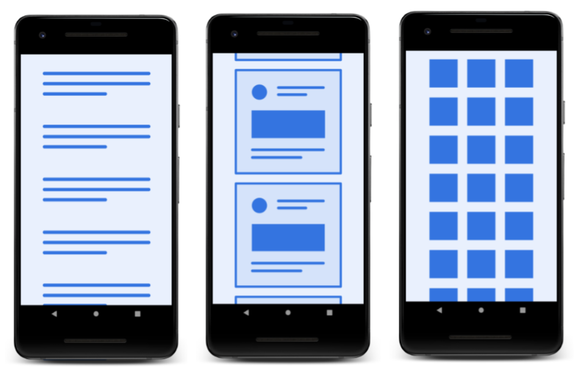
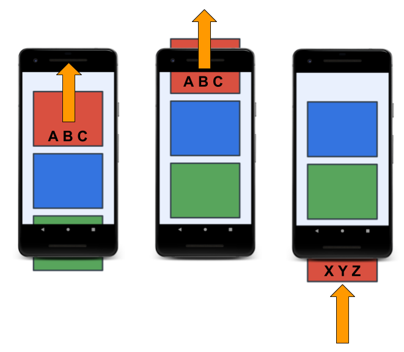
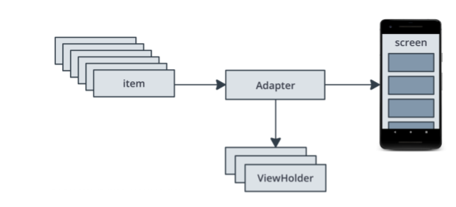
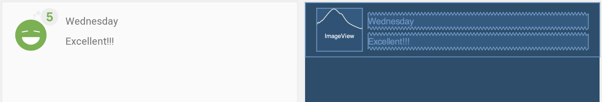
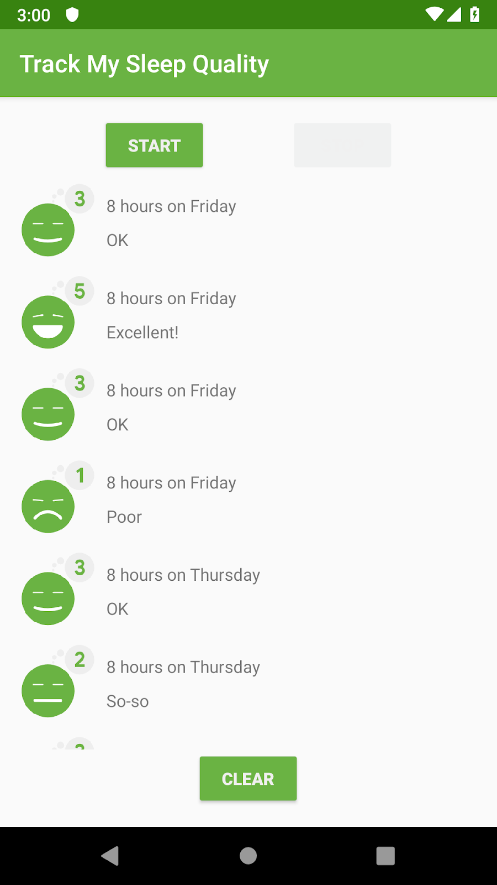

### App overview

If you worked through the previous project, you'll find the starter app for this project very familiar. The starter app displays sleep-night data in a scrolling text view like the app you built in the previous project. However, the starter app for this project includes additional assets and utilities to save you a lot of work not directly relevant for implementing a recycler view. Make sure you download and use the starter app for this lesson.

In this project, you build the RecyclerView portion of an app that tracks sleep quality. The app uses a Room database to store sleep data over time.

The starter sleep-tracker app has two screens, represented by fragments, as shown in the figure below.


The first screen, shown on the left, has buttons to start and stop tracking. This screen also shows all the user's sleep data. The Clear button permanently deletes all the data that the app has collected for the user. The second screen, shown on the right, is for selecting a sleep-quality rating.

This app uses a simplified architecture with a UI controller, ViewModel, and LiveData. The app also uses a Room database to make sleep data persistent.


The list of sleep nights displayed in the first screen is functional, but not pretty. The app uses a complex formatter to create text strings for the text view and numbers for the quality. Also, this design does not scale. After you fix all these problems in this project, the final app has the same functionality, and the main screen looks like this:


### Concept: RecyclerView

Displaying a list or grid of data is one of the most common UI tasks in Android. Lists vary from simple to very complex. A list of text views might show simple data, such as a shopping list. A complex list, such as an annotated list of vacation destinations, might show the user many details inside a scrolling grid with headers.

To support all these use cases, Android provides the RecyclerView widget.



The greatest benefit of RecyclerView is that it is very efficient for large lists:

- By default, RecyclerView only does work to process or draw items that are currently visible on the screen. For example, if your list has a thousand elements but only 10 elements are visible, RecyclerView does only enough work to draw 10 items on the screen. When the user scrolls, RecyclerView figures out what new items should be on the screen and does just enough work to display those items.
- When an item scrolls off the screen, the item's views are recycled. That means the item is filled with new content that scrolls onto the screen. This RecyclerView behavior saves a lot of processing time and helps lists scroll fluidly.
- When an item changes, instead of redrawing the entire list, RecyclerView can update that one item. This is a huge efficiency gain when displaying lists of complex items!

In the sequence shown below, you can see that one view has been filled with data, ABC. After that view scrolls off the screen, RecyclerView reuses the view for new data, XYZ.



### The adapter pattern
If you ever travel between countries that use different electric sockets, you probably know how you can plug your devices into outlets by using an adapter. The adapter lets you convert one type of plug to another, which is really converting one interface into another.

The adapter pattern in software engineering helps an object to work with another API. RecyclerView uses an adapter to transform app data into something the RecyclerView can display, without changing how the app stores and processes the data. For the sleep-tracker app, you build an adapter that adapts data from the Room database into something that RecyclerView knows how to display, without changing the ViewModel.

### Implementing a RecyclerView



To display your data in a RecyclerView, you need the following parts:

- Data to display.

- A RecyclerView instance defined in your layout file, to act as the container for the views.

- A layout for one item of data.
If all the list items look the same, you can use the same layout for all of them, but that is not mandatory. The item layout has to be created separately from the fragment's layout, so that one item view at a time can be created and filled with data.

- A layout manager.
The layout manager handles the organization (the layout) of UI components in a view.

-A view holder.
The view holder extends the ViewHolder class. It contains the view information for displaying one item from the item's layout. View holders also add information that RecyclerView uses to efficiently move views around the screen.

- An adapter.
The adapter connects your data to the RecyclerView. It adapts the data so that it can be displayed in a ViewHolder. A RecyclerView uses the adapter to figure out how to display the data on the screen.

### Task: Create a ViewHolder for all the sleep data

In this task, you replace the simple view holder with one that can display more data for a sleep night.

The simple ViewHolder that you added to Util.kt just wraps a TextView in a TextItemViewHolder.

```
class TextItemViewHolder(val textView: TextView): RecyclerView.ViewHolder(textView)
```

So why does RecyclerView not just use a TextView directly? This one line of code provides a lot of functionality. A ViewHolder describes an item view and metadata about its place within the RecyclerView. RecyclerView relies on this functionality to correctly position the view as the list scrolls, and to do interesting things like animate views when items are added or removed in the Adapter.

If RecyclerView does need to access the views stored in the ViewHolder, it can do so using the view holder's itemView property. RecyclerView uses itemView when it's binding an item to display on the screen, when drawing decorations around a view like a border, and for implementing accessibility.

#### Step 1: Create the item layout
In this step, you create the layout file for one item. The layout consists of a ConstraintLayout with an ImageView for the sleep quality, a TextView for the sleep length, and a TextView for the quality as text. Because you've done layouts before, copy and paste the provided XML code.

- Create a new layout resource file and name it list_item_sleep_night.
- Replace all the code in the file with the code below. Then familiarize yourself with the layout you just created.

```
<?xml version="1.0" encoding="utf-8"?>
<androidx.constraintlayout.widget.ConstraintLayout xmlns:android="http://schemas.android.com/apk/res/android"
   xmlns:app="http://schemas.android.com/apk/res-auto"
   xmlns:tools="http://schemas.android.com/tools"
   android:layout_width="match_parent"
   android:layout_height="wrap_content">

   <ImageView
       android:id="@+id/quality_image"
       android:layout_width="@dimen/icon_size"
       android:layout_height="60dp"
       android:layout_marginStart="16dp"
       android:layout_marginTop="8dp"
       android:layout_marginBottom="8dp"
       app:layout_constraintBottom_toBottomOf="parent"
       app:layout_constraintStart_toStartOf="parent"
       app:layout_constraintTop_toTopOf="parent"
       tools:srcCompat="@drawable/ic_sleep_5" />

   <TextView
       android:id="@+id/sleep_length"
       android:layout_width="0dp"
       android:layout_height="20dp"
       android:layout_marginStart="8dp"
       android:layout_marginTop="8dp"
       android:layout_marginEnd="16dp"
       app:layout_constraintEnd_toEndOf="parent"
       app:layout_constraintStart_toEndOf="@+id/quality_image"
       app:layout_constraintTop_toTopOf="@+id/quality_image"
       tools:text="Wednesday" />

   <TextView
       android:id="@+id/quality_string"
       android:layout_width="0dp"
       android:layout_height="20dp"
       android:layout_marginTop="8dp"
       app:layout_constraintEnd_toEndOf="@+id/sleep_length"
       app:layout_constraintHorizontal_bias="0.0"
       app:layout_constraintStart_toStartOf="@+id/sleep_length"
       app:layout_constraintTop_toBottomOf="@+id/sleep_length"
       tools:text="Excellent!!!" />
</androidx.constraintlayout.widget.ConstraintLayout>
```

Switch to the Design tab in Android Studio. In design view, your layout looks like the screenshot on the left below. In blueprint view, it looks like the screenshot on the right.



#### Step 2: Create ViewHolder

- Open SleepNightAdapter.kt.
- Make a class inside the SleepNightAdapter called ViewHolder and make it extend RecyclerView.ViewHolder.

```
class ViewHolder(itemView: View) : RecyclerView.ViewHolder(itemView){}
```

Inside ViewHolder, get references to the views. You need a reference to the views that this ViewHolder will update. Every time you bind this ViewHolder, you need to access the image and both text views. (You convert this code to use data binding later.)

```
val sleepLength: TextView = itemView.findViewById(R.id.sleep_length)
val quality: TextView = itemView.findViewById(R.id.quality_string)
val qualityImage: ImageView = itemView.findViewById(R.id.quality_image)
```

#### Step 3: Use the ViewHolder in SleepNightAdapter

- In the SleepNightAdapter definition, instead of TextItemViewHolder, use the SleepNightAdapter.ViewHolder that you just created.

```
class SleepNightAdapter: RecyclerView.Adapter<SleepNightAdapter.ViewHolder>() {
```

Update onCreateViewHolder():

- Change the signature of onCreateViewHolder() to return the ViewHolder.
- Change the layout inflator to use the correct layout resource, list_item_sleep_night.
- Remove the cast to TextView.
- Instead of returning a TextItemViewHolder, return a ViewHolder.

Here is the finished updated onCreateViewHolder() function:

```
    override fun onCreateViewHolder(
            parent: ViewGroup, viewType: Int): ViewHolder {
        val layoutInflater = 
            LayoutInflater.from(parent.context)
        val view = layoutInflater
                .inflate(R.layout.list_item_sleep_night, 
                         parent, false)
        return ViewHolder(view)
    }
```

Update onBindViewHolder():

- Change the signature of onBindViewHolder() so that the holder parameter is a ViewHolder instead of a TextItemViewHolder.

- Inside onBindViewHolder(), delete all the code, except for the definition of item.

- Define a val res that holds a reference to the resources for this view.

```
val res = holder.itemView.context.resources
```

- Set the text of the sleepLength text view to the duration. Copy the code below, which calls a formatting function that's provided with the starter code.

```
holder.sleepLength.text = convertDurationToFormatted(item.startTimeMilli, item.endTimeMilli, res)
```

- This gives an error, because convertDurationToFormatted() needs to be defined. Open Util.kt and uncomment the code and associated imports for it. (Select Code > Comment with Line comments.)

- Back in onBindViewHolder(), use convertNumericQualityToString() to set the quality.

```
holder.quality.text= convertNumericQualityToString(item.sleepQuality, res)
```

- You may need to manually import these functions.

```
import com.example.android.trackmysleepquality.convertDurationToFormatted
import com.example.android.trackmysleepquality.convertNumericQualityToString
```

- Set the correct icon for the quality. The new ic_sleep_active icon is provided for you in the starter code.

```
holder.qualityImage.setImageResource(when (item.sleepQuality) {
   0 -> R.drawable.ic_sleep_0
   1 -> R.drawable.ic_sleep_1
   2 -> R.drawable.ic_sleep_2
   3 -> R.drawable.ic_sleep_3
   4 -> R.drawable.ic_sleep_4
   5 -> R.drawable.ic_sleep_5
   else -> R.drawable.ic_sleep_active
})
```

Here is the finished updated onBindViewHolder() function, setting all the data for the ViewHolder:

```
   override fun onBindViewHolder(holder: ViewHolder, position: Int) {
        val item = data[position]
        val res = holder.itemView.context.resources
        holder.sleepLength.text = convertDurationToFormatted(item.startTimeMilli, item.endTimeMilli, res)
        holder.quality.text= convertNumericQualityToString(item.sleepQuality, res)
        holder.qualityImage.setImageResource(when (item.sleepQuality) {
            0 -> R.drawable.ic_sleep_0
            1 -> R.drawable.ic_sleep_1
            2 -> R.drawable.ic_sleep_2
            3 -> R.drawable.ic_sleep_3
            4 -> R.drawable.ic_sleep_4
            5 -> R.drawable.ic_sleep_5
            else -> R.drawable.ic_sleep_active
        })
    }
```

- Run your app. Your display should look like the screenshot below, showing the sleep-quality icon, along with text for the sleep duration and the sleep quality.




### Task: Improve your code

Your RecyclerView is now complete! You learned how to implement an Adapter and a ViewHolder, and you put them together to display a list with a RecyclerView Adapter.

Your code so far shows the process of creating an adapter and view holder. However, you can improve this code. The code to display and the code to manage view holders is mixed up, and onBindViewHolder() knows details about how to update the ViewHolder.

In a production app, you might have multiple view holders, more complex adapters, and multiple developers making changes. You should structure your code so that everything related to a view holder is only in the view holder.

#### Step 1: Refactor onBindViewHolder()

In this step, you refactor the code and move all the view holder functionality into the ViewHolder. The purpose of this refactoring is not to change how the app looks to the user, but make it easier and safer for developers to work on the code. Fortunately, Android Studio has tools to help.

- In SleepNightAdapter, in onBindViewHolder(), select everything except the statement to declare the variable item.
- Right-click, then select Refactor > Extract > Function.
- Name the function bind and accept the suggested parameters. Click OK.

The bind() function is placed below onBindViewHolder().

```
    private fun bind(holder: ViewHolder, item: SleepNight) {
        val res = holder.itemView.context.resources
        holder.sleepLength.text = convertDurationToFormatted(item.startTimeMilli, item.endTimeMilli, res)
        holder.quality.text = convertNumericQualityToString(item.sleepQuality, res)
        holder.qualityImage.setImageResource(when (item.sleepQuality) {
            0 -> R.drawable.ic_sleep_0
            1 -> R.drawable.ic_sleep_1
            2 -> R.drawable.ic_sleep_2
            3 -> R.drawable.ic_sleep_3
            4 -> R.drawable.ic_sleep_4
            5 -> R.drawable.ic_sleep_5
            else -> R.drawable.ic_sleep_active
        })
    }
```

- Put the cursor on the word holder of the holder parameter of bind(). Press Alt+Enter (Option+Enter on a Mac) to open the intention menu. Select Convert parameter to receiver to convert this to an extension function that has the following signature:

```
private fun ViewHolder.bind(item: SleepNight) {...}
```

- Cut and paste the bind() function into the ViewHolder.
- Make bind() public.
- Import bind() into the adapter, if necessary.
- Because it's now in the ViewHolder, you can remove the ViewHolder part of the signature. Here is the final code for the bind() function in the ViewHolder class.

```
fun bind(item: SleepNight) {
   val res = itemView.context.resources
   sleepLength.text = convertDurationToFormatted(
           item.startTimeMilli, item.endTimeMilli, res)
   quality.text = convertNumericQualityToString(
           item.sleepQuality, res)
   qualityImage.setImageResource(when (item.sleepQuality) {
       0 -> R.drawable.ic_sleep_0
       1 -> R.drawable.ic_sleep_1
       2 -> R.drawable.ic_sleep_2
       3 -> R.drawable.ic_sleep_3
       4 -> R.drawable.ic_sleep_4
       5 -> R.drawable.ic_sleep_5
       else -> R.drawable.ic_sleep_active
   })
}
```

#### Step 2: Refactor onCreateViewHolder

The onCreateViewHolder() method in the adapter currently inflates the view from the layout resource for the ViewHolder. However, inflation has nothing to do with the adapter, and everything to do with the ViewHolder. Inflation should happen in the ViewHolder.

- In onCreateViewHolder(), select all the code in the body of the function.
- Right-click, then select Refactor > Extract > Function.
- Name the function from and accept the suggested parameters. Click OK.
- Put the cursor on the function name from. Press Alt+Enter (Option+Enter on a Mac) to open the intention menu.
- Select Move to companion object. The from() function needs to be in a companion object so it can be called on the ViewHolder class, not called on a ViewHolder instance.
- Move the companion object into the ViewHolder class.
- Make from() public.
- In onCreateViewHolder(), change the return statement to return the result of calling from() in the ViewHolder class.

Your completed onCreateViewHolder() and from() methods should look like the code below, and your code should build and run without errors.

```
    override fun onCreateViewHolder(parent: ViewGroup, viewType: 
Int): ViewHolder {
        return ViewHolder.from(parent)
    }
companion object {
   fun from(parent: ViewGroup): ViewHolder {
       val layoutInflater = LayoutInflater.from(parent.context)
       val view = layoutInflater
               .inflate(R.layout.list_item_sleep_night, parent, false)
       return ViewHolder(view)
   }
}
```

- Change the signature of the ViewHolder class so that the constructor is private. Because from() is now a method that returns a new ViewHolder instance, there's no reason for anyone to call the constructor of ViewHolder anymore.

```
class ViewHolder private constructor(itemView: View) : RecyclerView.ViewHolder(itemView){
```

Run the app. Your app should build and run the same as before, which is the desired result after refactoring.