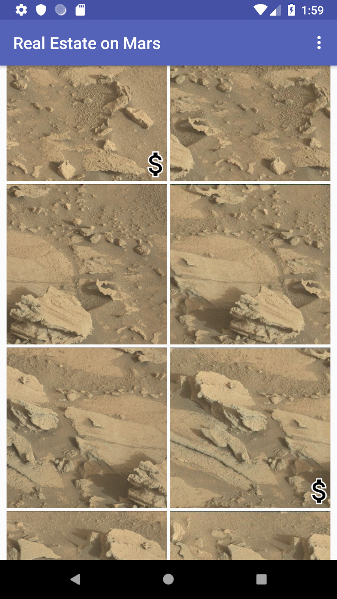
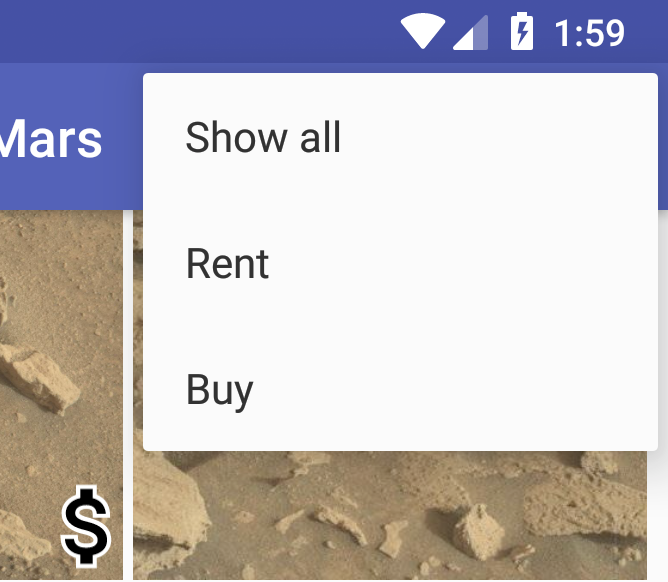
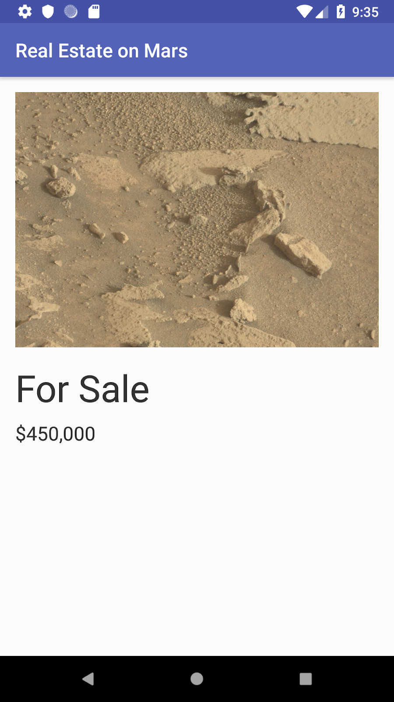
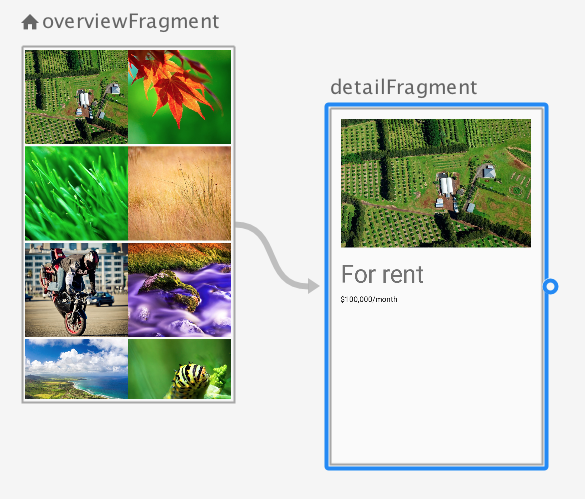

### App overview
In this project (and related project) you work with an app called MarsRealEstate, which shows properties for sale on Mars. This app connects to an internet server to retrieve and display property data, including details such as the price and whether the property is available for sale or rent. The images representing each property are real-life photos from Mars captured from NASA's Mars rovers. In previous project, you created a RecyclerView with a grid layout for all the property photos:


In this version of the app, you work with the type of the property (rent versus buy) and add an icon to the grid layout to mark properties that are for sale:



You modify the app's option menu to filter the grid to show only those properties that are for rent or for sale:



And finally, you create a detail view for an individual property, and you connect the icons on the overview grid to that detail fragment with navigation:



###Task: Add "for sale" images to the overview

Up until now, the only part of the Mars property data you've used is the URL for the property image. But the property data—which you defined in the MarsProperty class—also includes an ID, a price, and a type (rental or for sale). To refresh your memory, here's a snippet of the JSON data you get from the web service:

```
{
   "price":8000000,
   "id":"424908",
   "type":"rent",
   "img_src": "http://mars.jpl.nasa.gov/msl-raw-images/msss/01000/mcam/1000ML0044631290305226E03_DXXX.jpg"
},
```

In this task, you start working with the Mars property type to add a dollar-sign image to the properties on the overview page that are for sale.

#### Step 1: Update MarsProperty to include the type

The MarsProperty class defines the data structure for each property provided by the web service. In a previous project, you used the Moshi library to parse the raw JSON response from the Mars web service into individual MarsProperty data objects.

In this step, you add some logic to the MarsProperty class to indicate whether a property is for rent or not (that is, whether the type is the string "rent" or "buy"). You'll use this logic in more than one place, so it's better to have it here in the data class than to replicate it.

Open the MarsRealEstate app from the last project.

- Open network/MarsProperty.kt. Add a body to the MarsProperty class definition, and add a custom getter for isRental that returns true if the object is of type "rent".

```
data class MarsProperty(
       val id: String,
       @Json(name = "img_src") val imgSrcUrl: String,
       val type: String,
       val price: Double)  {
   val isRental
       get() = type == "rent"
}
```

#### Step 2: Update the grid item layout

Now you update the item layout for the grid of images to show a dollar-sign drawable only on those property images that are for sale:


With data binding expressions you can do this test entirely in the XML layout for the grid items.

- Open res/layout/grid_view_item.xml. This is the layout file for each individual cell in the grid layout for the RecyclerView. Currently the file contains only the <ImageView> element for the property image.

- Inside the <data> element, add an <import> element for the View class. You use imports when you want to use components of a class inside a data binding expression in a layout file. In this case, you are going to use the View.GONE and View.VISIBLE constants, so you need access to the View class.

```
<import type="android.view.View"/>
```

- Surround the entire image view with a FrameLayout, to allow the dollar-sign drawable to be stacked on top of the property image.

```
<FrameLayout
   android:layout_width="match_parent"
   android:layout_height="170dp">
             <ImageView 
                    android:id="@+id/mars_image"
            ...
</FrameLayout>
```

- For the ImageView, change the android:layout_height attribute to match_parent, to fill the new parent FrameLayout.

```
android:layout_height="match_parent"
```

- Add a second <ImageView> element just below the first one, inside the FrameLayout. Use the definition shown below. This image appears in the lower right corner of the grid item, on top of the Mars image, and uses the drawable defined in res/drawable/ic_for_sale_outline.xml for the dollar-sign icon.

```
<ImageView
   android:id="@+id/mars_property_type"
   android:layout_width="wrap_content"
   android:layout_height="45dp"
   android:layout_gravity="bottom|end"
   android:adjustViewBounds="true"
   android:padding="5dp"
   android:scaleType="fitCenter"
   android:src="@drawable/ic_for_sale_outline"
   tools:src="@drawable/ic_for_sale_outline"/>
```

- Add the android:visibility attribute to the mars_property_type image view. Use a binding expression to test for the property type, and assign the visibility either to View.GONE (for a rental) or View.VISIBLE (for a purchase).

`android:visibility="@{property.rental ? View.GONE : View.VISIBLE}"`

Until now you have only seen binding expressions in layouts that use individual variables defined in the <data> element. Binding expressions are extremely powerful and enable you to do operations such as tests and math calculations entirely within your XML layout. In this case, you use the ternary operator (?:) to perform a test (is this object a rental?). You provide one result for true (hide the dollar-sign icon with View.GONE) and another for false (show that icon with View.VISIBLE).

The new complete grid_view_item.xml file is shown below:

```
<layout xmlns:android="http://schemas.android.com/apk/res/android"
       xmlns:app="http://schemas.android.com/apk/res-auto"
       xmlns:tools="http://schemas.android.com/tools">
   <data>
       <import type="android.view.View"/>
       <variable
           name="property"
           type="com.example.android.marsrealestate.network.MarsProperty" />
   </data>
   <FrameLayout
       android:layout_width="match_parent"
       android:layout_height="170dp">

       <ImageView
           android:id="@+id/mars_image"
           android:layout_width="match_parent"
           android:layout_height="match_parent"
           android:scaleType="centerCrop"
           android:adjustViewBounds="true"
           android:padding="2dp"
           app:imageUrl="@{property.imgSrcUrl}"
           tools:src="@tools:sample/backgrounds/scenic"/>

       <ImageView
           android:id="@+id/mars_property_type"
           android:layout_width="wrap_content"
           android:layout_height="45dp"
           android:layout_gravity="bottom|end"
           android:adjustViewBounds="true"
           android:padding="5dp"
           android:scaleType="fitCenter"
           android:src="@drawable/ic_for_sale_outline"
           android:visibility="@{property.rental ? View.GONE : View.VISIBLE}"
           tools:src="@drawable/ic_for_sale_outline"/>
   </FrameLayout>
</layout>
```

- Compile and run the app, and note that properties that are not rentals have the dollar-sign icon.

#### Task: Filter the results

Currently your app displays all the Mars properties in the overview grid. If a user were shopping for a rental property on Mars, having the icons to indicate which of the available properties are for sale would be useful, but there are still a lot of properties to scroll through on the page. In this task, you add an options menu to the overview fragment that enables the user to show only rentals, only for-sale properties, or show all.


One way you could accomplish this task is to test the type for each MarsProperty in the overview grid and only display the matching properties. The actual Mars web service, however, has a query parameter or option (called filter) that enables you to get only properties of either type rent or type buy. You could use this filter query with the realestate web service URL in a browser like this:

`https://android-kotlin-fun-mars-server.appspot.com/realestate?filter=buy`

In this task, you modify the MarsApiService class to add a query option to the web service request with Retrofit. Then you hook up the options menu to re-download all the Mars property data using that query option. Because the response you get from the web service only contains the properties you're interested in, you don't need to change the view display logic for the overview grid at all.

#### Step 1: Update the Mars API service

To change the request, you need to revisit the MarsApiService class that you implemented in the first project in this series. You modify the class to provide a filtering API.

- Open network/MarsApiService.kt. Just below the imports, create an enum called MarsApiFilter to define constants that match the query values the web service expects.

```
enum class MarsApiFilter(val value: String) {
   SHOW_RENT("rent"),
   SHOW_BUY("buy"),
   SHOW_ALL("all") }
```

Modify the getProperties() method to take string input for the filter query, and annotate that input with @Query("filter"), as shown below.

- Import retrofit2.http.Query when prompted.

- The @Query annotation tells the getProperties() method (and thus Retrofit) to make the web service request with the filter option. Each time getProperties() is called, the request URL includes the ?filter=type portion, which directs the web service to respond with results that match that query.

`suspend fun getProperties(@Query("filter") type: String): List<MarsProperty>`  

#### Step 2: Update the overview view model

You request data from the MarsApiService in the getMarsRealEstateProperties() method in OverviewViewModel. Now you need to update that request to take the filter argument.

`Open overview/OverviewViewModel.kt. You will see errors in Android Studio due to the changes you made in the previous step. Add MarsApiFilter (the enum of possible filter values) as a parameter to the getMarsRealEstateProperties() call.`

- Import com.example.android.marsrealestate.network.MarsApiFilter when requested.

```
private fun getMarsRealEstateProperties(filter: MarsApiFilter) {
```

- Modify the call to getProperties() in the Retrofit service to pass along that filter query as a string.

`_properties.value = MarsApi.retrofitService.getProperties(filter.value)`

- In the init {} block, pass MarsApiFilter.SHOW_ALL as an argument to getMarsRealEstateProperties(), to show all properties when the app first loads.

```
init {
   getMarsRealEstateProperties(MarsApiFilter.SHOW_ALL)
}
```

- At the end of the class, add an updateFilter() method that takes a MarsApiFilter argument and calls getMarsRealEstateProperties() with that argument.

```
fun updateFilter(filter: MarsApiFilter) {
   getMarsRealEstateProperties(filter)
}
```

#### Step 3: Connect the fragment to the options menu

The last step is to hook up the overflow menu to the fragment to call updateFilter() on the view model when the user picks a menu option.

- Open res/menu/overflow_menu.xml. The MarsRealEstate app has an existing overflow menu that provides the three available options: showing all properties, showing just rentals, and showing just for-sale properties.

```
<menu xmlns:android="http://schemas.android.com/apk/res/android">
   <item
       android:id="@+id/show_all_menu"
       android:title="@string/show_all" />
   <item
       android:id="@+id/show_rent_menu"
       android:title="@string/show_rent" />
   <item
       android:id="@+id/show_buy_menu"
       android:title="@string/show_buy" />
</menu>
```

- Open overview/OverviewFragment.kt. At the end of the class, implement the onOptionsItemSelected() method to handle menu item selections.

```
override fun onOptionsItemSelected(item: MenuItem): Boolean {
} 
```

- In onOptionsItemSelected(), call the updateFilter() method on the view model with the appropriate filter. Use a Kotlin when {} block to switch between the options. Use MarsApiFilter.SHOW_ALL for the default filter value. Return true, because you've handled the menu item. Import MarsApiFilter (com.example.android.marsrealestate.network.MarsApiFilter) when requested. The complete onOptionsItemSelected() method is shown below.

```
override fun onOptionsItemSelected(item: MenuItem): Boolean {
   viewModel.updateFilter(
           when (item.itemId) {
               R.id.show_rent_menu -> MarsApiFilter.SHOW_RENT
               R.id.show_buy_menu -> MarsApiFilter.SHOW_BUY
               else -> MarsApiFilter.SHOW_ALL
           }
   )
   return true
}
```

- Compile and run the app. The app launches the first overview grid with all property types and the for-sale properties marked with the dollar icon.

- Choose Rent from the options menu. The properties reload and none of them appear with the dollar icon. (Only rental properties are shown.) You might have to wait a few moments for the display to refresh to show only the filtered properties.

- Choose Buy from the options menu. The properties reload again, and all of them appear with the dollar icon. (Only for-sale properties are shown.)

#### Task: Create a detail page and set up navigation

Now you have a scrolling grid of icons for Mars properties, but it's time to get more detail. In this task, you add a detail fragment to display the details of a specific property. The detail fragment will show a larger image, the price, and the property type—whether it's a rental or for sale.


This fragment is launched when the user taps an image in the overview grid. To accomplish this, you need to add an onClick listener to the RecyclerView grid items, and then navigate to the new fragment. You navigate by triggering a LiveData change in the ViewModel, as you've done throughout these lessons. You also use the Navigation component's Safe Args plugin to pass the selected MarsProperty information from the overview fragment to the detail fragment.

#### Step 1: Create the detail view model and update detail layout

Similar to the process you used for the overview view model and fragments, you now need to implement the view model and layout files for the detail fragment.

- Open detail/DetailViewModel.kt. Just as network-related Kotlin files are contained in the network folder and overview files in overview, the detail folder contains the files associated with the detail view. Notice that DetailViewModel class (empty right now) takes a marsProperty as a parameter in the constructor.

```
class DetailViewModel( marsProperty: MarsProperty,
                     app: Application) : AndroidViewModel(app) {
}
```

Inside the class definition, add LiveData for the selected Mars property, to expose that information to the detail view. Follow the usual pattern of creating a MutableLiveData to hold the MarsProperty itself, and then expose an immutable public LiveData property.

- Import androidx.lifecycle.LiveData and import androidx.lifecycle.MutableLiveData when requested.

```
private val _selectedProperty = MutableLiveData<MarsProperty>()
val selectedProperty: LiveData<MarsProperty>
   get() = _selectedProperty
Create an init {} block and set the value of the selected Mars property with the MarsProperty object from the constructor.
    init {
        _selectedProperty.value = marsProperty
    }
```

- Open res/layout/fragment_detail.xml and look at it in the design view.

This is the layout file for the detail fragment. It contains an ImageView for the large photo, a TextView for the property type (rental or sale) and a TextView for the price. Notice that the constraint layout is wrapped with a ScrollView so it will automatically scroll if the view gets too large for the display, for example when the user views it in landscape mode.

- Go to the Text tab for the layout. At the top of the layout, just before the <ScrollView> element, add a <data> element to associate the detail view model with the layout.

```
<data>
   <variable
       name="viewModel"
       type="com.example.android.marsrealestate.detail.DetailViewModel" />
</data>
```

- Add the app:imageUrl attribute to the ImageView element. Set it to the imgSrcUrl from the view model's selected property.

- The binding adapter that loads an image using Glide will automatically be used here as well, because that adapter watches all app:imageUrl attributes.
`app:imageUrl="@{viewModel.selectedProperty.imgSrcUrl}"`

#### Step 2: Define navigation in the overview view model

When the user taps a photo in the overview model, it should trigger navigation to a fragment that shows details about the clicked item.

- Open overview/OverviewViewModel.kt. Add a _navigateToSelectedProperty MutableLiveData property and expose it with an immutable LiveData.

- When this LiveData changes to non-null, the navigation is triggered. (Soon you'll add the code to observe this variable and trigger the navigation.)

```
private val _navigateToSelectedProperty = MutableLiveData<MarsProperty>()
val navigateToSelectedProperty: LiveData<MarsProperty>
   get() = _navigateToSelectedProperty
At the end of the class, add a displayPropertyDetails() method that sets _navigateToSelectedProperty to the selected Mars property.
fun displayPropertyDetails(marsProperty: MarsProperty) {
   _navigateToSelectedProperty.value = marsProperty
}
```

- Add a displayPropertyDetailsComplete() method that nulls the value of _navigateToSelectedProperty. You need this to mark the navigation state to complete, and to avoid the navigation being triggered again when the user returns from the detail view.

```
fun displayPropertyDetailsComplete() {
   _navigateToSelectedProperty.value = null
}
```

### Step 3: Set up the click listeners in the grid adapter and fragment

- Open overview/PhotoGridAdapter.kt. At the end of the class, create a custom OnClickListener class that takes a lambda with a marsProperty parameter. Inside the class, define an onClick() function that is set to the lambda parameter.

```
class OnClickListener(val clickListener: (marsProperty:MarsProperty) -> Unit) {
     fun onClick(marsProperty:MarsProperty) = clickListener(marsProperty)
}
```

- Scroll up to the class definition for the PhotoGridAdapter, and add a private OnClickListener property to the constructor.

```
class PhotoGridAdapter( private val onClickListener: OnClickListener ) :
       ListAdapter<MarsProperty,              
           PhotoGridAdapter.MarsPropertyViewHolder>(DiffCallback) {
```

- Make a photo clickable by adding the onClickListener to the grid item in the onBindviewHolder() method. Define the click listener in between the calls to getItem() and bind().

```
override fun onBindViewHolder(holder: MarsPropertyViewHolder, position: Int) {
   val marsProperty = getItem(position)
   holder.itemView.setOnClickListener {
       onClickListener.onClick(marsProperty)
   }
   holder.bind(marsProperty)
}
```

- Open overview/OverviewFragment.kt. In the onCreateView() method, replace the line that initializes the binding.photosGrid.adapter property with the line shown below.

This code adds the PhotoGridAdapter.onClickListener object to the PhotoGridAdapter constructor, and calls viewModel.displayPropertyDetails() with the passed-in MarsProperty object. This triggers the LiveData in the view model for the navigation.

```
binding.photosGrid.adapter = PhotoGridAdapter(PhotoGridAdapter.OnClickListener {
   viewModel.displayPropertyDetails(it)
})
```

#### Step 4: Modify the navigation graph and make MarsProperty parcelable

When a user taps a photo in the overview grid, the app should navigate to the detail fragment and pass through the details of the selected Mars property so the detail view can display that information.



Right now you have a click listener from PhotoGridAdapter to handle the tap, and a way to trigger the navigation from the view model. But you don't yet have a MarsProperty object being passed to the detail fragment. For that you use Safe Args from the navigation component.

- Open res/navigation/nav_graph.xml. Click the Text tab to view the XML code for the navigation graph.

Inside the <fragment> element for the detail fragment, add the <argument> element shown below. This argument, called selectedProperty, has the type MarsProperty.

```
<argument
   android:name="selectedProperty"
   app:argType="com.example.android.marsrealestate.network.MarsProperty"
   />
```

- Compile the app. Navigation gives you an error because the MarsProperty isn't parcelable. The Parcelable interface enables objects to be serialized, so that the objects' data can be passed around between fragments or activities. In this case, for the data inside the MarsProperty object to be passed to the detail fragment via Safe Args, MarsProperty must implement the Parcelable interface. The good news is that Kotlin provides an easy shortcut for implementing that interface.

- Open network/MarsProperty.kt. Add the @Parcelize annotation to the class definition.

```
Import kotlinx.android.parcel.Parcelize when requested.
```
- The @Parcelize annotation uses the Kotlin Android extensions to automatically implement the methods in the Parcelable interface for this class. You don't have to do anything else!

```
@Parcelize
data class MarsProperty (
```

- Change the class definition of MarsProperty to extend Parcelable.

`Import android.os.Parcelable when requested.`

- The MarsProperty class definition now looks like this:

```
@Parcelize
data class MarsProperty (
       val id: String,
       @Json(name = "img_src") val imgSrcUrl: String,
       val type: String,
       val price: Double) : Parcelable {
```

#### Step 5: Connect the fragments

You're still not navigating—the actual navigation happens in the fragments. In this step, you add the last bits for implementing navigation between the overview and detail fragments.

- Open overview/OverviewFragment.kt. In onCreateView(), below the lines that initialize the photo grid adapter, add the lines shown below to observe the navigatedToSelectedProperty from the overview view model.

- Import androidx.lifecycle.Observer and import androidx.navigation.fragment.findNavController when requested.

- The observer tests whether MarsProperty—the it in the lambda—is not null, and if so, it gets the navigation controller from the fragment with findNavController(). Call displayPropertyDetailsComplete() to tell the view model to reset the LiveData to the null state, so you won't accidentally trigger navigation again when the app returns back to the OverviewFragment.

```
viewModel.navigateToSelectedProperty.observe(this, Observer {
   if ( null != it ) {   
      this.findNavController().navigate(
              OverviewFragmentDirections.actionShowDetail(it))             
      viewModel.displayPropertyDetailsComplete()
   }
})
```
- Open detail/DetailFragment.kt. Add this line just below setting the property binding.lifecycleOwner in the onCreateView() method. This line gets the selected MarsProperty object from the Safe Args.

***Notice the use of Kotlin's not-null assertion operator (!!). If the selectedProperty isn't there, something terrible has happened and you actually want the code to throw a null pointer. (In production code, you should handle that error in some way.)***

` val marsProperty = DetailFragmentArgs.fromBundle(arguments!!).selectedProperty`

- Add this line next, to get a new DetailViewModelFactory. You'll use the DetailViewModelFactory to get an instance of the DetailViewModel. The starter app includes an implementation of DetailViewModelFactory, so all you have to do here is initialize it.

`val viewModelFactory = DetailViewModelFactory(marsProperty, application)`

- Finally, add this line to get a DetailViewModel from the factory and to connect all the parts.

```
      binding.viewModel = ViewModelProvider(
                this, viewModelFactory).get(DetailViewModel::class.java)
```

- Compile and run the app, and tap on any Mars property photo. The detail fragment appears for that property's details. Tap the Back button to return to the overview page, and notice that the detail screen is still kind of sparse. You finish adding the property data to that detail page in the next task.

#### Task: Create a more useful detail page

Right now the detail page shows only the same Mars photo you're used to seeing on the overview page. The MarsProperty class also has a property type (rent or buy) and a property price. The detail screen should include both these values, and it would be helpful if the rental properties indicated that the price was a per-month value. You use LiveData transformations in the view model to implement both those things.

- Open res/values/strings.xml. The starter code includes string resources, shown below, to help you build the strings for the detail view. For the price, you'll use either the display_price_monthly_rental resource or the display_price resource, depending on the property type.

```
<string name="type_rent">Rent</string>
<string name="type_sale">Sale</string>
<string name="display_type">For %s</string>
<string name="display_price_monthly_rental">$%,.0f/month</string>
<string name="display_price">$%,.0f</string>
```

- Open detail/DetailViewModel.kt. At the bottom of the class, add the code shown below.

`Import androidx.lifecycle.Transformations if requested.`

- This transformation tests whether the selected property is a rental, using the same test from the first task. If the property is a rental, the transformation chooses the appropriate string from the resources with a Kotlin when {} switch. Both of these strings need a number at the end, so you concatenate the property.price afterwards.

```
val displayPropertyPrice = Transformations.map(selectedProperty) {
   app.applicationContext.getString(
           when (it.isRental) {
               true -> R.string.display_price_monthly_rental
               false -> R.string.display_price
           }, it.price)
}
```

- Import the generated R class to gain access to the string resources in the project.

- import com.example.android.marsrealestate.R

- After the displayPropertyPrice transformation, add the code shown below. This transformation concatenates multiple string resources, based on whether the property type is a rental.

```
val displayPropertyType = Transformations.map(selectedProperty) {
   app.applicationContext.getString(R.string.display_type,
           app.applicationContext.getString(
                   when (it.isRental) {
                       true -> R.string.type_rent
                       false -> R.string.type_sale
                   }))
}
```

- Open res/layout/fragment_detail.xml. There's just one more thing to do, and that is to bind the new strings (which you created with the LiveData transformations) to the detail view. To do that, you set the value of the text field for the property type text to viewModel.displayPropertyType, and the text field for the price value text to viewModel.displayPropertyPrice.

```
<TextView
   android:id="@+id/property_type_text"
...
android:text="@{viewModel.displayPropertyType}"
...
   tools:text="To Rent" />

<TextView
   android:id="@+id/price_value_text"
...
android:text="@{viewModel.displayPropertyPrice}"
...
   tools:text="$100,000" />
```

- Compile and run the app. Now all the property data appears on the detail page, nicely formatted.