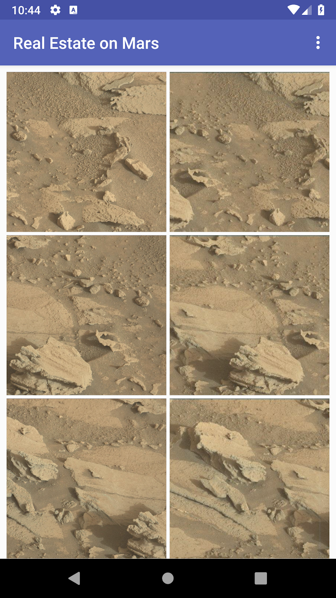
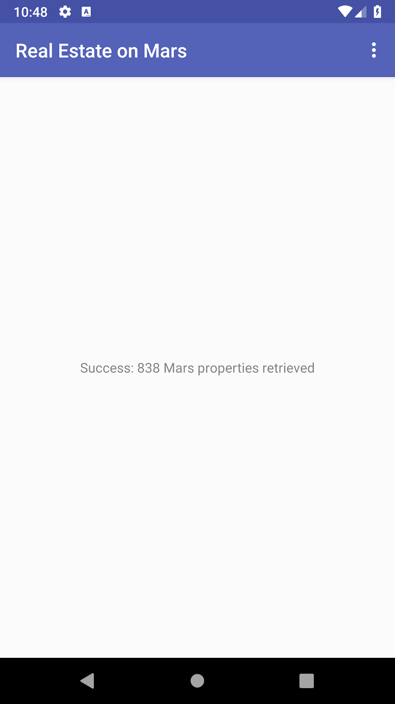
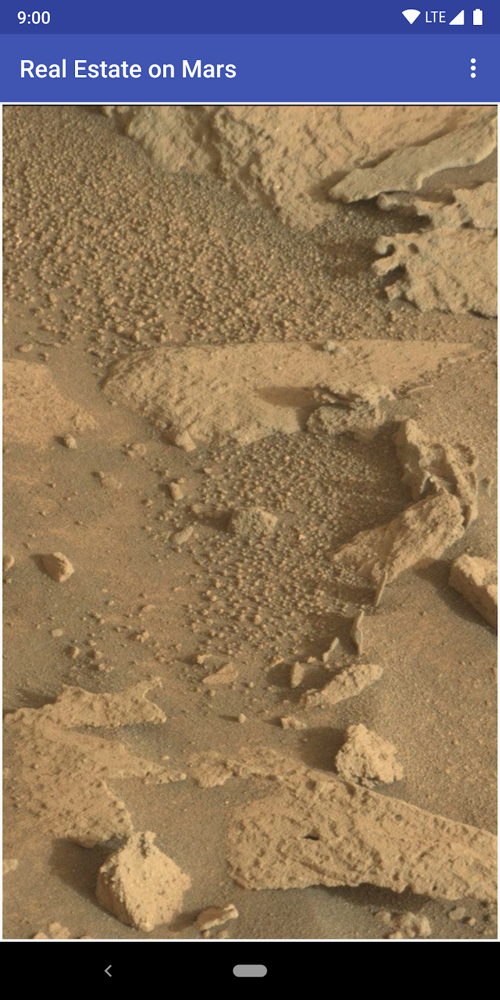
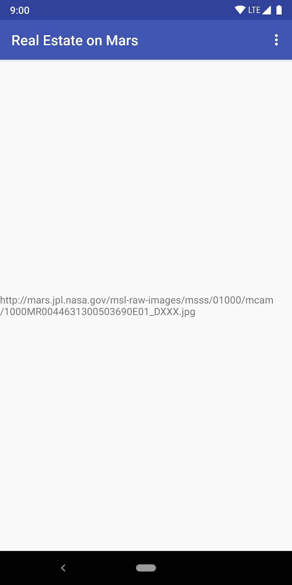
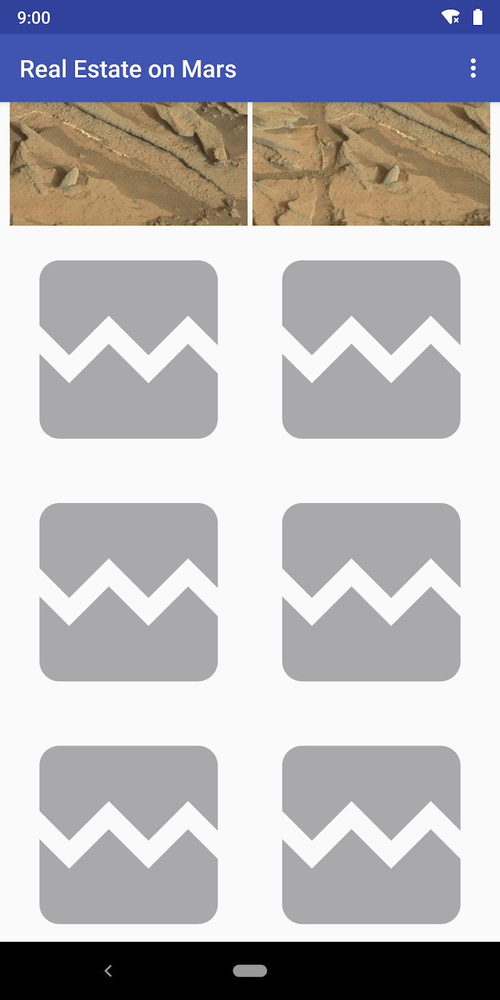
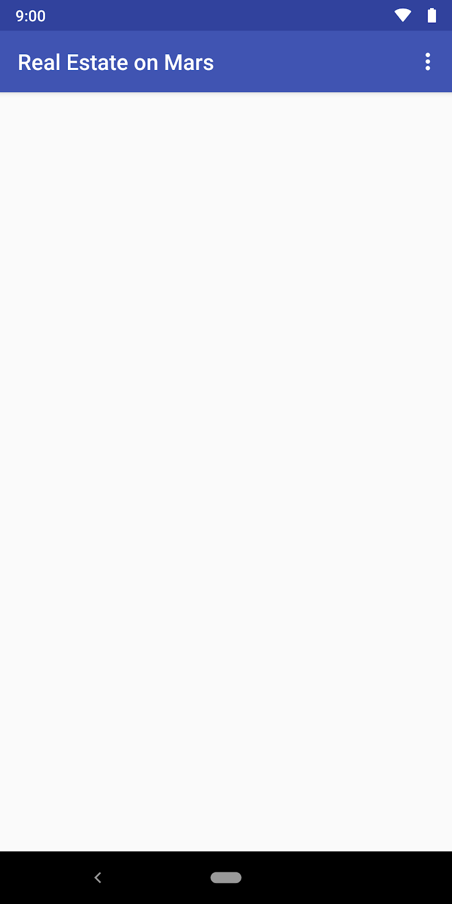
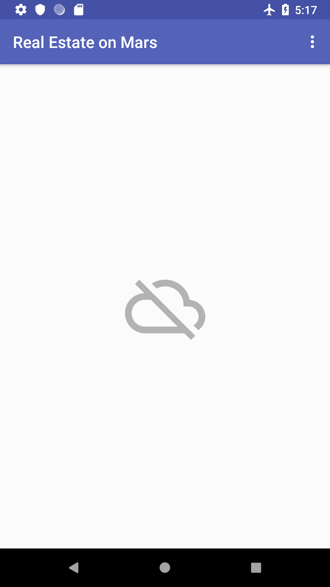

### App overview
In this project (and related projects), you work with an app called MarsRealEstate, which shows properties for sale on Mars. The app connects to an internet server to retrieve and display property data, including details such as the price and whether the property is available for sale or rent. The images representing each property are real-life photos from Mars captured from NASA's Mars rovers.



The version of the app you build in this project fills in the overview page, which displays a grid of images. The images are part of the property data that your app gets from the Mars real estate web service. Your app will use the Glide library to load and display the images, and a RecyclerView to create the grid layout for the images. Your app will also handle network errors gracefully.

### Task: Display an internet image

Displaying a photo from a web URL might sound straightforward, but there is quite a bit of engineering to make it work well. The image has to be downloaded, buffered, and decoded from its compressed format to an image that Android can use. The image should be cached to an in-memory cache, a storage-based cache, or both. All this has to happen in low-priority background threads so the UI remains responsive. Also, for best network and CPU performance, you might want to fetch and decode more than one image at once. Learning how to effectively load images from the network could be a projects in itself.

Fortunately, you can use a community-developed library called Glide to download, buffer, decode, and cache your images. Glide leaves you with a lot less work than if you had to do all of this from scratch.

Glide basically needs two things:

- The URL of the image you want to load and show.

- An ImageView object to display that image.

In this task, you learn how to use Glide to display a single image from the real estate web service. You display the image that represents the first Mars property in the list of properties that the web service returns. Here are the before and after screenshots:





###Step 1: Add Glide dependency

Open the MarsRealEstate app from the last project .

- Run the app to see what it does. (It displays text details of a property that is hypothetically available on Mars.)

- Open build.gradle (Module: app).

- In the dependencies section, add this line for the Glide library:

- implementation "com.github.bumptech.glide:glide:$version_glide"

***Notice that the version number is already defined separately in the project Gradle file.***

- Click Sync Now to rebuild the project with the new dependency.

#### Step 2: Update the view model

Next you update the OverviewViewModel class to include live data for a single Mars property.

- Open overview/OverviewViewModel.kt. Just below the LiveData for the _response, add both internal (mutable) and external (immutable) live data for a single MarsProperty object.

- Import the MarsProperty class (com.example.android.marsrealestate.network.MarsProperty) when requested.

```
private val _property = MutableLiveData<MarsProperty>()

val property: LiveData<MarsProperty>
   get() = _property
```

- In the getMarsRealEstateProperties() method, find the line inside the try/catch {} block that sets _response.value to the number of properties. Add the test shown below. If MarsProperty objects are available, this test sets the value of the _property LiveData to the first property in the listResult.

```
if (listResult.size > 0) {   
    _property.value = listResult[0]
}
```

- The complete try/catch {} block now looks like this:

```
try {
   val listResult = MarsApi.retrofitService.getProperties()
   _response.value = "Success: ${listResult.size} Mars properties retrieved"
   if (listResult.size > 0) {      
       _property.value = listResult[0]
   }
 } catch (e: Exception) {
    _response.value = "Failure: ${e.message}"
 }
```

- Open the res/layout/fragment_overview.xml file. In the <TextView> element, change android:text to bind to the imgSrcUrl component of the property LiveData:
```
android:text="@{viewModel.property.imgSrcUrl}"
```

- Run the app. The TextView displays only the URL of the image in the first Mars property. All you've done so far is set up the view model and the live data for that URL.



#### Step 3: Create a binding adapter and call Glide


Now you have the URL of an image to display, and it's time to start working with Glide to load that image. In this step, you use a binding adapter to take the URL from an XML attribute associated with an ImageView, and you use Glide to load the image. Binding adapters are extension methods that sit between a view and bound data to provide custom behavior when the data changes. In this case, the custom behavior is to call Glide to load an image from a URL into an ImageView.

- Open BindingAdapters.kt. This file will hold the binding adapters that you use throughout the app.

```
Create a bindImage() function that takes an ImageView and a String as parameters. Annotate the function with @BindingAdapter. The @BindingAdapter annotation tells data binding that you want this binding adapter executed when an XML item has the imageUrl attribute.

Import androidx.databinding.BindingAdapter and android.widget.ImageView when requested.
@BindingAdapter("imageUrl")
fun bindImage(imgView: ImageView, imgUrl: String?) {

}
```

- Inside the bindImage() function, add a let {} block for the imgUrl argument:

```
imgUrl?.let { 
}
```

- Inside the let {} block, add the line shown below to convert the URL string (from the XML) to a Uri object. Import androidx.core.net.toUri when requested.

- You want the final Uri object to use the HTTPS scheme, because the server you pull the images from requires that scheme. To use the HTTPS scheme, append buildUpon.scheme("https") to the toUri builder. The toUri() method is a Kotlin extension function from the Android KTX core library, so it just looks like it's part of the String class.

```
val imgUri = imgUrl.toUri().buildUpon().scheme("https").build()
```

- Still inside let {}, call Glide.with() to load the image from the Uri object into the ImageView. Import com.bumptech.glide.Glide when requested.

```
Glide.with(imgView.context)
       .load(imgUri)
       .into(imgView)
```

#### Step 4: Update the layout and fragments

Although Glide has loaded the image, there's nothing to see yet. The next step is to update the layout and the fragments with an ImageView to display the image.
 
- Open res/layout/gridview_item.xml. This is the layout resource file you'll use for each item in the RecyclerView later in the projects. You use it temporarily here to show just the single image.

- Above the <ImageView> element, add a <data> element for the data binding, and bind to the OverviewViewModel class:

```
<data>
   <variable
       name="viewModel"
       type="com.example.android.marsrealestate.overview.OverviewViewModel" />
</data>
```

- Add an app:imageUrl attribute to the ImageView element to use the new image loading binding adapter:

```
app:imageUrl="@{viewModel.property.imgSrcUrl}"
```

- Open overview/OverviewFragment.kt. In the onCreateView() method, comment out the line that inflates the FragmentOverviewBinding class and assigns it to the binding variable. This is only temporary; you'll go back to it later.

```
//val binding = FragmentOverviewBinding.inflate(inflater)
```

- Add a line to inflate the GridViewItemBinding class instead. Import com.example.android.marsrealestate. databinding.GridViewItemBinding when requested.

***Note: This change may result in data-binding errors in Android Studio. To resolve those errors, you may need to clean and rebuild the app.***

```
val binding = GridViewItemBinding.inflate(inflater)
```

- Run the app. Now you should see a photo of the image from the first MarsProperty in the result list.


#### Step 5: Add simple loading and error images

Glide can improve the user experience by showing a placeholder image while loading the image and an error image if the loading fails, for example if the image is missing or corrupt. In this step, you add that functionality to the binding adapter and to the layout.

- Open res/drawable/ic_broken_image.xml, and click the Preview tab on the right. For the error image, you're using the broken-image icon that's available in the built-in icon library. This vector drawable uses the android:tint attribute to color the icon gray.


- Open res/drawable/loading_animation.xml. This drawable is an animation that's defined with the <animate-rotate> tag. The animation rotates an image drawable, loading_img.xml, around the center point. (You don't see the animation in the preview.)


- Return to the BindingAdapters.kt file. In the bindImage() method, update the call to Glide.with() to call the apply() function between load() and into(). Import com.bumptech.glide.request.RequestOptions when requested.

- This code sets the placeholder loading image to use while loading (the loading_animation drawable). The code also sets an image to use if image loading fails (the broken_image drawable). The complete bindImage() method now looks like this:

```
@BindingAdapter("imageUrl")
fun bindImage(imgView: ImageView, imgUrl: String?) {
    imgUrl?.let {
        val imgUri = 
           imgUrl.toUri().buildUpon().scheme("https").build()
        Glide.with(imgView.context)
                .load(imgUri)
                .apply(RequestOptions()
                        .placeholder(R.drawable.loading_animation)
                        .error(R.drawable.ic_broken_image))
                .into(imgView)
    }
}
```

- Run the app. Depending on the speed of your network connection, you might briefly see the loading image as Glide downloads and displays the property image. But you won't see the broken-image icon yet, even if you turn off your network—you fix that in the last part of the projects.

#### Task: Display a grid of images with a RecyclerView

Your app now loads property information from the internet. Using data from the first MarsProperty list item, you've created a LiveData property in the view model, and you've used the image URL from that property data to populate an ImageView. But the goal is for your app to display a grid of images, so you want to use a RecyclerView with a GridLayoutManager.

#### Step 1: Update the view model

Right now the view model has a _property LiveData that holds one MarsProperty object—the first one in the response list from the web service. In this step, you change that LiveData to hold the entire list of MarsProperty objects.

- Open overview/OverviewViewModel.kt.

- Change the private _property variable to _properties. Change the type to be a list of MarsProperty objects.

```
private val _properties = MutableLiveData<List<MarsProperty>>()
```

- Replace the external property live data with properties. Add the list to the LiveData type here as well:

```
 val properties: LiveData<List<MarsProperty>>
        get() = _properties
```

- Scroll down to the getMarsRealEstateProperties() method. Inside the try {} block, replace the entire test that you added in the previous task with the line shown below. Because the MarsApi.retrofitService.getProperties()

- returns a list of MarsProperty objects, you can just assign it to _properties.value instead of testing for a successful response.

```
_properties.value = MarsApi.retrofitService.getProperties()
```

- The entire try/catch block now looks like this:

```
try {
    _properties.value = MarsApi.retrofitService.getProperties()   
    _response.value = "Success: Mars properties retrieved"
} catch (e: Exception) {
   _response.value = "Failure: ${e.message}"
}
```

#### Step 2: Update the layouts and fragments

The next step is to change the app's layout and fragments to use a recycler view and a grid layout, rather than the single image view.

- Open res/layout/gridview_item.xml. Change the data binding from the OverviewViewModel to MarsProperty, and rename the variable to "property".

```
<variable
   name="property"
   type="com.example.android.marsrealestate.network.MarsProperty" />
```
- In the <ImageView>, change the app:imageUrl attribute to refer to the image URL in the MarsProperty object:

```
app:imageUrl="@{property.imgSrcUrl}"
```

- Open overview/OverviewFragment.kt. In onCreateview(), uncomment the line that inflates FragmentOverviewBinding. Delete or comment out the line that inflates GridViewBinding. These changes undo the temporary changes you made in the last task.

```
val binding = FragmentOverviewBinding.inflate(inflater)
 // val binding = GridViewItemBinding.inflate(inflater)
```

- Open res/layout/fragment_overview.xml. Delete the entire <TextView> element.

- Add this <RecyclerView> element instead, which uses a GridLayoutManager and the grid_view_item layout for a single item:

```
<androidx.recyclerview.widget.RecyclerView
            android:id="@+id/photos_grid"
            android:layout_width="0dp"
            android:layout_height="0dp"
            android:padding="6dp"
            android:clipToPadding="false"
            app:layoutManager=
               "androidx.recyclerview.widget.GridLayoutManager"
            app:layout_constraintBottom_toBottomOf="parent"
            app:layout_constraintLeft_toLeftOf="parent"
            app:layout_constraintRight_toRightOf="parent"
            app:layout_constraintTop_toTopOf="parent"
            app:spanCount="2"
            tools:itemCount="16"
            tools:listitem="@layout/grid_view_item" />
```

#### Step 3: Add the photo grid adapter

Now the fragment_overview layout has a RecyclerView while the grid_view_item layout has a single ImageView. In this step, you bind the data to the RecyclerView through a RecyclerView adapter.

***Note: This might be a good time to review the RecyclerView projects!***

- Open overview/PhotoGridAdapter.kt.

- Create the PhotoGridAdapter class, with the constructor parameters shown below. The PhotoGridAdapter class extends ListAdapter, whose constructor needs the list item type, the view holder, and a DiffUtil.ItemCallback implementation.

- Import the androidx.recyclerview.widget.ListAdapter and com.example.android.marsrealestate.network.MarsProperty classes when requested. In the following steps, you implement the other missing parts of this constructor that are producing errors.

```
class PhotoGridAdapter : ListAdapter<MarsProperty,
        PhotoGridAdapter.MarsPropertyViewHolder>(DiffCallback) {

}
```

- Click anywhere in the PhotoGridAdapter class and press Control+i to implement the ListAdapter methods, which are onCreateViewHolder() and onBindViewHolder().

```
override fun onCreateViewHolder(parent: ViewGroup, viewType: Int): PhotoGridAdapter.MarsPropertyViewHolder {
   TODO("not implemented") 
}

override fun onBindViewHolder(holder: PhotoGridAdapter.MarsPropertyViewHolder, position: Int) {
   TODO("not implemented") 
}
```

- At the end of the PhotoGridAdapter class definition, after the methods you just added, add a companion object definition for DiffCallback, as shown below.

- Import androidx.recyclerview.widget.DiffUtil when requested.

- The DiffCallback object extends DiffUtil.ItemCallback with the type of object you want to compare—MarsProperty.

```
companion object DiffCallback : DiffUtil.ItemCallback<MarsProperty>() {
}
```

- Press Control+i to implement the comparator methods for this object, which are areItemsTheSame() and areContentsTheSame().

```
override fun areItemsTheSame(oldItem: MarsProperty, newItem: MarsProperty): Boolean {
   TODO("not implemented") 
}

override fun areContentsTheSame(oldItem: MarsProperty, newItem: MarsProperty): Boolean {
   TODO("not implemented") }
```

- For the areItemsTheSame() method, remove the TODO. Use Kotlin's referential equality operator (===), which returns true if the object references for oldItem and newItem are the same.

```
override fun areItemsTheSame(oldItem: MarsProperty, 
                  newItem: MarsProperty): Boolean {
   return oldItem === newItem
}
```

- For areContentsTheSame(), use the standard equality operator on just the ID of oldItem and newItem.

```
override fun areContentsTheSame(oldItem: MarsProperty, 
                  newItem: MarsProperty): Boolean {
   return oldItem.id == newItem.id
}
```

- Still inside the PhotoGridAdapter class, below the companion object, add an inner class definition for MarsPropertyViewHolder, which extends RecyclerView.ViewHolder.

- Import androidx.recyclerview.widget.RecyclerView and com.example.android.marsrealestate.databinding.GridViewItemBinding when requested.

You need the GridViewItemBinding variable for binding the MarsProperty to the layout, so pass the variable into the MarsPropertyViewHolder. Because the base ViewHolder class requires a view in its constructor, you pass it the binding root view.

```
class MarsPropertyViewHolder(private var binding: 
                   GridViewItemBinding):
       RecyclerView.ViewHolder(binding.root) {
}
```

- In MarsPropertyViewHolder, create a bind() method that takes a MarsProperty object as an argument and sets binding.property to that object. Call executePendingBindings() after setting the property, which causes the update to execute immediately.

```
fun bind(marsProperty: MarsProperty) {
   binding.property = marsProperty
   binding.executePendingBindings()
}
```

***Note: This change may result in data-binding errors in Android Studio. To resolve those errors, you may need to clean and rebuild the app.***

- In onCreateViewHolder(), remove the TODO and add the line shown below. Import android.view.LayoutInflater when requested.

- The onCreateViewHolder() method needs to return a new MarsPropertyViewHolder, created by inflating the GridViewItemBinding and using the LayoutInflater from your parent ViewGroup context.

```
   return MarsPropertyViewHolder(GridViewItemBinding.inflate(
      LayoutInflater.from(parent.context)))
```

- In the onBindViewHolder() method, remove the TODO and add the lines shown below. Here you call getItem() to get the MarsProperty object associated with the current RecyclerView position, and then pass that property to the bind() method in the MarsPropertyViewHolder.

```
val marsProperty = getItem(position)
holder.bind(marsProperty)
```

#### Step 4: Add the binding adapter and connect the parts

- Finally, use a BindingAdapter to initialize the PhotoGridAdapter with the list of MarsProperty objects. Using a BindingAdapter to set the RecyclerView data causes data binding to automatically observe the LiveData for the list of MarsProperty objects. Then the binding adapter is called automatically when the MarsProperty list changes.

- Open BindingAdapters.kt.

- At the end of the file, add a bindRecyclerView() method that takes a RecyclerView and a list of MarsProperty objects as arguments. Annotate that method with a @BindingAdapter.

- Import androidx.recyclerview.widget.RecyclerView and com.example.android.marsrealestate.network.MarsProperty when requested.

```
@BindingAdapter("listData")
fun bindRecyclerView(recyclerView: RecyclerView, 
    data: List<MarsProperty>?) {
}
```

- Inside the bindRecyclerView() function, cast recyclerView.adapter to PhotoGridAdapter, and call adapter.submitList() with the data. This tells the RecyclerView when a new list is available.

- Import com.example.android.marsrealestate.overview.PhotoGridAdapter when requested.

```
val adapter = recyclerView.adapter as PhotoGridAdapter
adapter.submitList(data)
```

- Open res/layout/fragment_overview.xml. Add the app:listData attribute to the RecyclerView element and set it to viewmodel.properties using data binding.

```
app:listData="@{viewModel.properties}"
```
- Open overview/OverviewFragment.kt. In onCreateView(), just before the call to setHasOptionsMenu(), initialize the RecyclerView adapter in binding.photosGrid to a new PhotoGridAdapter object.

```
binding.photosGrid.adapter = PhotoGridAdapter()
```

- Run the app. You should see a grid of MarsProperty images. As you scroll to see new images, the app shows the loading-progress icon before displaying the image itself. If you turn on airplane mode, images that have not yet loaded appear as broken-image icons.



### Task: Add error handling in RecyclerView

The MarsRealEstate app displays the broken-image icon when an image cannot be fetched. But when there's no network, the app shows a blank screen.



This isn't a great user experience. In this task, you add basic error handling, to give the user a better idea of what's happening. If the internet isn't available, the app will show the connection-error icon. While the app is fetching the MarsProperty list, the app will show the loading animation.

#### Step 1: Add status to the view model

To start, you create a LiveData in the view model to represent the status of the web request. There are three states to consider—loading, success, and failure. The loading state happens while you're waiting for data in the call to await().

- Open overview/OverviewViewModel.kt. At the top of the file (after the imports, before the class definition), add an enum to represent all the available statuses:

`enum class MarsApiStatus { LOADING, ERROR, DONE }`

- Rename both the internal and external _response live data definitions throughout the OverviewViewModel class to _status. Because you added support for the _properties LiveData earlier in this projects, the complete web service response has been unused. You need a LiveData here to keep track of the current status, so you can just rename the existing variables.

- Also, change the types from String to MarsApiStatus.

```
private val _status = MutableLiveData<MarsApiStatus>()

val status: LiveData<MarsApiStatus>
   get() = _status
```

- Scroll down to the getMarsRealEstateProperties() method and update _response to _status here as well. Change the "Success" string to the MarsApiStatus.DONE state, and the "Failure" string to MarsApiStatus.ERROR.

- Set the status to MarsApiStatus.LOADING before the try {} block. This is the initial status while the coroutine is running and you're waiting for data. The complete try/catch {} block now looks like this:

```
_status.value = MarsApiStatus.LOADING
try {
   _properties.value = MarsApi.retrofitService.getProperties()
   _status.value = MarsApiStatus.DONE
} catch (e: Exception) {
   _status.value = MarsApiStatus.ERROR
}
```

- After the error state in the catch {} block, set the _properties LiveData to an empty list. This clears the RecyclerView.

```
} catch (e: Exception) {
   _status.value = MarsApiStatus.ERROR
   _properties.value = ArrayList()
}
```

#### Step 2: Add a binding adapter for the status ImageView

Now you have a status in the view model, but it's just a set of states. How do you make it appear in the app itself? In this step, you use an ImageView, connected to data binding, to display icons for the loading and error states. When the app is in the loading state or the error state, the ImageView should be visible. When the app is done loading, the ImageView should be invisible.

- Open BindingAdapters.kt. Add a new binding adapter called bindStatus() that takes an ImageView and a MarsApiStatus value as arguments. Import com.example.android.marsrealestate.overview.MarsApiStatus when requested.

```
@BindingAdapter("marsApiStatus")
fun bindStatus(statusImageView: ImageView, 
          status: MarsApiStatus?) {
}
```

- Add a when {} inside the bindStatus() method to switch between the different statuses.

```
when (status) {

}
Inside the when {}, add a case for the loading state (MarsApiStatus.LOADING). For this state, set the ImageView to visible, and assign it the loading animation. This is the same animation drawable you used for Glide in the previous task. Import android.view.View when requested.
when (status) {
   MarsApiStatus.LOADING -> {
      statusImageView.visibility = View.VISIBLE
      statusImageView.setImageResource(R.drawable.loading_animation)
   }
}
```

- Add a case for the error state, which is MarsApiStatus.ERROR. Similarly to what you did for the LOADING state, set the status ImageView to visible and reuse the connection-error drawable.

```
MarsApiStatus.ERROR -> {
   statusImageView.visibility = View.VISIBLE
   statusImageView.setImageResource(R.drawable.ic_connection_error)
}
```

- Add a case for the done state, which is MarsApiStatus.DONE. Here you have a successful response, so turn off the visibility of the status ImageView to hide it.

```
MarsApiStatus.DONE -> {
   statusImageView.visibility = View.GONE
}
```

#### Step 3: Add the status ImageView to the layout

- Open res/layout/fragment_overview.xml. Below the RecyclerView element, inside the ConstraintLayout, add the ImageView shown below.

This ImageView has the same constraints as the RecyclerView. However, the width and height use wrap_content to center the image rather than stretch the image to fill the view. Also notice the app:marsApiStatus attribute, which has the view call your BindingAdapter when the status property in the view model changes.

```
<ImageView
   android:id="@+id/status_image"
    android:layout_width="wrap_content"
    android:layout_height="wrap_content"
    app:layout_constraintBottom_toBottomOf="parent"
    app:layout_constraintLeft_toLeftOf="parent"
    app:layout_constraintRight_toRightOf="parent"
    app:layout_constraintTop_toTopOf="parent"
    app:marsApiStatus="@{viewModel.status}" />

```

- Turn on airplane mode in your emulator or device to simulate a missing network connection. Compile and run the app, and notice that the error image appears:



- Tap the Back button to close the app, and turn off airplane mode. Use the recents screen to return the app. Depending on the speed of your network connection, you may see an extremely brief loading spinner when the app queries the web service before the images begin to load.