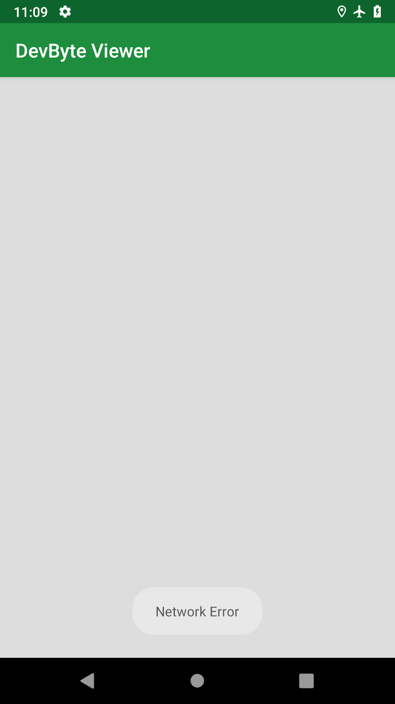
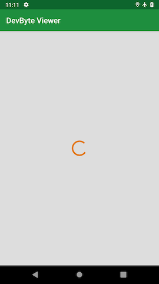
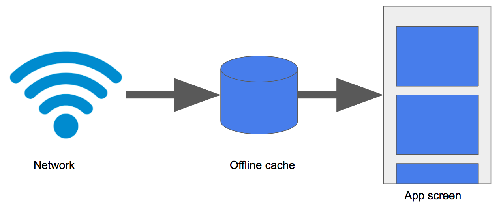
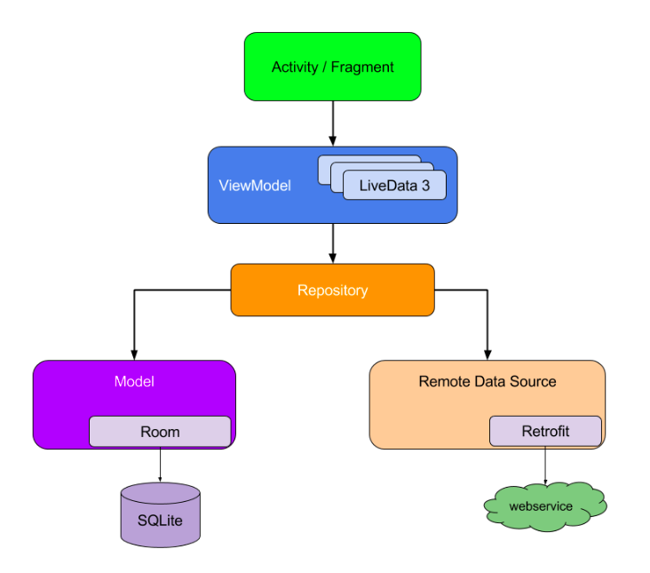

### App overview

The DevBytes app displays a list of DevByte videos, which are short tutorials made by the Google Android developer relations team. The videos introduce developer features and best practices for Android development.

The DevBytes starter app fetches a list of video URLs from the network using the Retrofit library and displays the list using a RecyclerView. The app uses ViewModel and LiveData to hold the data and update the UI. The app's architecture is similar to apps you developed previously in this course.


The starter app is online-only, so the user needs a network connection to use it. In this projects, you implement offline caching to display results from the local database, instead of from the network. Your users will be able to use the app while their device is offline, or if they have a slow network connection.

To implement the offline cache, you use a Room database to make fetched data persistent in the device's local storage. You access and manage the Room database using a repository pattern, which is a design pattern that isolates data sources from the rest of the app. This technique provides a clean API for the rest of the app to use for accessing the data.

### Task: Setup and starter code walkthrough

In this task, you download and inspect the starter code for the DevBytes app.

#### Step 1: Download and run the starter app

- Download the DevBytes starter code from GitHub..

- Unzip the code and open the project in Android Studio.

- Connect your test device or emulator to the internet, if it is not already connected. Build and run the app. The app fetches a list of DevByte videos from the network and displays them.

- In the app, click any video to open it in the YouTube app.

- Enable airplane mode on your device or emulator.

- Run the app again, and notice the network-error toast message.



When airplane mode is off, you might see a spinning progress bar if your internet connection is slow, because this is an online-only app. If you don't see the spinning progress bar, implement the next step to add network delay programmatically. This will help you see what the app experience is like for users with slow connections, and why offline caching is important for this app.

#### Step 2: (Optional) Simulate network delay

If the internet connection for your emulator or device is good and you don't notice the spinning progress bar, simulate the delay in network response using the function delay(). To learn more about the delay() function, see Your first coroutine with Kotlin.

- Make sure airplane mode is off in your device or emulator.

- In DevByteViewModel, inside refreshDataFromNetwork(), at the beginning of the catch block, add a 2-second delay. This delay will suspend the coroutine that fetches data from the network.

```
private fun refreshDataFromNetwork() = viewModelScope.launch {

   try {
        ...
   } catch (networkError: IOException) {
       delay(2000)
       // Show a Toast error message and hide the progress bar.
       _eventNetworkError.value = true
   }
}
```

- Run the app again. Now you see a loading spinner and the network-error toast message. The loading spinner is what your users might see if they have slow network connections. After you implement offline caching, this user experience will improve.



- Remove the delay statement, delay(2000), which you added in a previous step.

#### Step 3: Explore the code

This starter app comes with a lot of code, in particular all the networking and user interface modules, so that you can focus on the repository module of the app.

- In Android Studio, expand all the packages.

- Explore the domain package. This package contains data classes for representing the app's data. For example, the DevByteVideo data class in domain/Models.kt class represents a single DevByte video.

- Explore the network package.

The network/DataTransferObjects.kt class contains the data class for a data transfer object called NetworkVideo. The data transfer object is used to parse the network result. This file also contains a convenience method, asDomainModel(), to convert network results to a list of domain objects. The data transfer objects are different from the domain objects, because they contain extra logic for parsing network results.

***Tip: It's a best practice to separate the network, domain, and database objects. This strategy follows the separation of concerns principle. If the network response or the database schema changes, you want to be able to change and manage app components without updating the entire app's code.***

- Try exploring the rest of starter code on your own.

The rest of the apps' architecture is similar to the other apps used in the previous projects:

- The Retrofit service, network/Service.kt, fetches the devbytes playlist from the network.

- The DevByteViewModel holds the app data as LiveData objects.

- The UI controller, DevByteFragment, contains a RecyclerView to display the video list and the observers for the LiveData objects.

- Concept: Caching

After an app fetches data from the network, the app can cache the data by storing the data in a device's storage. You cache data so that you can access it later when the device is offline, or if you want to access the same data again.

The following table shows several ways to implement network caching in Android. In this projects, you use Room, because it's the recommended way to store structured data on a device file system.

| Caching technique | Uses |

|   Caching technique	|   Uses	|
|---	|---	|
| Retrofit is a networking library used to implement a type-safe REST client for Android. You can configure Retrofit to store a copy of every network result locally. | Good solution for simple requests and responses, infrequent network calls, or small datasets.| 
| You can use SharedPreferences to store key-value pairs. | Good solution for a small number of keys and simple values. You can't use this technique to store large amounts of structured data. |
| You can access the app's internal storage directory and save data files in it. Your app's package name specifies the app's internal storage directory, which is in a special location in the Android file system. This directory is private to your app, and it is cleared when your app is uninstalled.| Good solution if you have specific needs that a file system can solve—for example, if you need to save media files or data files and you have to manage the files yourself. You can't use this technique to store complex and structured data. |
| You can cache data using Room, which is an SQLite object-mapping library that provides an abstraction layer over SQLite.  | Recommended solution for complex and structured data, because the best way to store structured data on a device's file system is in a local SQLite database.  |

#### Task: Add an offline cache

In this task, you add a Room database to your app to use as an offline cache.

Key concept: Don't retrieve data from the network every time the app is launched. Instead, display data that you fetch from the database. This technique decreases app-loading time.



When the app fetches data from the network, store the data in the database instead of displaying the data immediately.

When a new network result is received, update the local database and display the new content on the screen from the local database. This technique ensures that the offline cache is always up-to-date. Also, if the device is offline, your app can still load locally cached data.

#### Step 1: Add the Room dependency

- Open the build.gradle (Module:app) file and add the Room dependency to the project.

```
// Room dependency
def room_version = "2.1.0-alpha06"
implementation "androidx.room:room-runtime:$room_version"
kapt "androidx.room:room-compiler:$room_version"
```

#### Step 2: Add database object

In this step, you create a database entity named DatabaseVideo to represent database objects. You also implement convenience methods to convert DatabaseVideo objects into domain objects, and to convert network objects into DatabaseVideo objects.

- Open database/DatabaseEntities.kt and create a Room entity called DatabaseVideo. Set url as the primary key. The DevBytes server design ensures that the video URL is always unique.

```
/**
* DatabaseVideo represents a video entity in the database.
*/
@Entity
data class DatabaseVideo constructor(
       @PrimaryKey
       val url: String,
       val updated: String,
       val title: String,
       val description: String,
       val thumbnail: String)
```

- In database/DatabaseEntities.kt, create an extension function called asDomainModel(). Use the function to convert DatabaseVideo database objects into domain objects.

```
/**
* Map DatabaseVideos to domain entities
*/
fun List<DatabaseVideo>.asDomainModel(): List<DevByteVideo> {
   return map {
       DevByteVideo(
               url = it.url,
               title = it.title,
               description = it.description,
               updated = it.updated,
               thumbnail = it.thumbnail)
   }
}
```

In this sample app, the conversion is simple, and some of this code isn't necessary. But in a real-world app, the structure of the domain, database, and network objects will be different. You'll need conversion logic, which can get complicated.

- Open network/DataTransferObjects.kt and create an extension function called asDatabaseModel(). Use the function to convert network objects into DatabaseVideo database objects.

```
/**
* Convert Network results to database objects
*/
fun NetworkVideoContainer.asDatabaseModel(): List<DatabaseVideo> {
   return videos.map {
       DatabaseVideo(
               title = it.title,
               description = it.description,
               url = it.url,
               updated = it.updated,
               thumbnail = it.thumbnail)
   }
}
```

#### Step 3: Add VideoDao

In this step, you implement VideoDao and define two helper methods to access the database. One helper method gets videos from the database, and the other method inserts videos into the database.

- In database/Room.kt, define a VideoDao interface and annotate is with @Dao.

```
@Dao
interface VideoDao { 
}
```

- Inside the VideoDao interface, create a method called getVideos() to fetch all the videos from the database. Change the return type of this method to LiveData, so that the data displayed in the UI is refreshed whenever the data in the database is changed.

```
   @Query("select * from databasevideo")
   fun getVideos(): LiveData<List<DatabaseVideo>>
```

If an Unresolved reference error appears in Android Studio, import androidx.room.Query.

- Inside the VideoDao interface, define another insertAll() method to insert a list of videos fetched from the network into the database. For simplicity, overwrite the database entry if the video entry is already present in the database. To do this, use the onConflict argument to set the conflict strategy to REPLACE.

```
@Insert(onConflict = OnConflictStrategy.REPLACE)
fun insertAll( videos: List<DatabaseVideo>)
```

#### Step 4: Implement RoomDatabase

In this step, you add the database for your offline cache by implementing RoomDatabase.

- In database/Room.kt, after the VideoDao interface, create an abstract class called VideosDatabase. Extend VideosDatabase from RoomDatabase.

- Use the @Database annotation to mark the VideosDatabase class as a Room database. Declare the DatabaseVideo entity that belongs in this database, and set the version number to 1.

- Inside VideosDatabase, define a variable of the type VideoDao to access the Dao methods.

```
@Database(entities = [DatabaseVideo::class], version = 1)
abstract class VideosDatabase: RoomDatabase() {
   abstract val videoDao: VideoDao
}
```

- Create a private lateinit variable called INSTANCE outside the classes, to hold the singleton object. The VideosDatabase should be singleton to prevent having multiple instances of the database opened at the same time.

- Create and define a getDatabase() method outside the classes. In getDatabase(), initialize and return the INSTANCE variable inside the synchronized block.

```
@Dao
interface VideoDao {
...
}
abstract class VideosDatabase: RoomDatabase() {
...
}

private lateinit var INSTANCE: VideosDatabase

fun getDatabase(context: Context): VideosDatabase {
   synchronized(VideosDatabase::class.java) {
       if (!::INSTANCE.isInitialized) {
           INSTANCE = Room.databaseBuilder(context.applicationContext,
                   VideosDatabase::class.java,
                   "videos").build()
       }
   }
   return INSTANCE
}
```

***Tip: The .isInitialized Kotlin property returns true if the lateinit property (INSTANCE in this example) has been assigned a value, and false otherwise.***

Now you've implemented the database using Room. In the next task, you learn how to use this database using a repository pattern.

### Concept: Repositories

The repository pattern

The repository pattern is a design pattern that isolates data sources from the rest of the app.

A repository mediates between data sources (such as persistent models, web services, and caches) and the rest of the app. The diagram below shows how app components such as activities that use LiveData might interact with data sources by way of a repository.



To implement a repository, you use a repository class, such as the VideosRepository class that you create in the next task. The repository class isolates the data sources from the rest of the app and provides a clean API for data access to the rest of the app. Using a repository class is a recommended best practice for code separation and architecture.

#### Advantages of using a repository
A repository module handles data operations and allows you to use multiple backends. In a typical real-world app, the repository implements the logic for deciding whether to fetch data from a network or use results that are cached in a local database. This helps make your code modular and testable. You can easily mock up the repository and test the rest of the code.

#### Task: Create a repository

In this task, you create a repository to manage the offline cache, which you implemented in the previous task. Your Room database doesn't have logic for managing the offline cache, it only has methods to insert and retrieve the data. The repository will have the logic to fetch the network results and to keep the database up-to-date.

#### Step 1: Add a repository

- In repository/VideosRepository.kt, create a VideosRepository class. Pass in a VideosDatabase object as the class's constructor parameter to access the Dao methods.

```
/**
* Repository for fetching devbyte videos from the network and storing them on disk
*/
class VideosRepository(private val database: VideosDatabase) {
}
```

- Inside the VideosRepository class, add a refreshVideos() method that has no arguments and returns nothing. This method will be the API used to refresh the offline cache.

- Make refreshVideos() a suspend function. Because refreshVideos() performs a database operation, it must be called from a coroutine.

***Note: Databases on Android are stored on the file system, or disk, and in order to save they must perform a disk I/O. The disk I/O, or reading and writing to disk, is slow and always blocks the current thread until the operation is complete. Because of this, you have to run the disk I/O in the I/O dispatcher. This dispatcher is designed to offload blocking I/O tasks to a shared pool of threads using withContext(Dispatchers.IO) { ... }.***

- Inside the refreshVideos() method, switch the coroutine context to Dispatchers.IO to perform network and database operations.

```
/**
* Refresh the videos stored in the offline cache.
*
* This function uses the IO dispatcher to ensure the database insert database operation
* happens on the IO dispatcher. By switching to the IO dispatcher using `withContext` this
* function is now safe to call from any thread including the Main thread.
*
*/
suspend fun refreshVideos() {
   withContext(Dispatchers.IO) {
   }
}
```

- Inside the withContext block, fetch the DevByte video playlist from the network using the Retrofit service instance, DevByteNetwork.

`val playlist = DevByteNetwork.devbytes.getPlaylist()`
       
- Inside the refreshVideos() method, after fetching the playlist from the network, store the playlist in the Room database.

To store the playlist, use the VideosDatabase object, database. Call the insertAll DAO method, passing in the playlist retrieved from the network. Use the asDatabaseModel() extension function to map the playlist to the database object.
database.videoDao.insertAll(playlist.asDatabaseModel())

Here is the complete refreshVideos method with a log statement for tracking when it gets called:

```
suspend fun refreshVideos() {
   withContext(Dispatchers.IO) {
       Timber.d("refresh videos is called");
       val playlist = DevByteNetwork.devbytes.getPlaylist()
       database.videoDao.insertAll(playlist.asDatabaseModel())
   }
}
```

#### Step 2: Retrieve data from the database

In this step, you create a LiveData object to read the video playlist from the database. This LiveData object is automatically updated when the database is updated. The attached fragment, or the activity, is refreshed with new values.

- In the VideosRepository class, declare a LiveData object called videos to hold a list of DevByteVideo objects.

- Initialize the videos object, using database.videoDao. Call the getVideos() DAO method. Because the getVideos() method returns a list of database objects, not a list of DevByteVideo objects, Android Studio throws a "type mismatch" error.

- val videos: LiveData<List<DevByteVideo>> = database.videoDao.getVideos()

- To fix the error, use Transformations.map to convert the list of database objects to a list of domain objects. Use the asDomainModel() conversion function.

-Refresher: The Transformations.map method uses a conversion function to convert one LiveData object into another LiveData object. The transformations are only calculated when an active activity or a fragment is observing the returned LiveData property.

```
val videos: LiveData<List<DevByteVideo>> = Transformations.map(database.videoDao.getVideos()) {
   it.asDomainModel()
}
```

Now you've implemented a repository for your app. In the next task, you use a simple refresh strategy to keep the local database up-to-date.

#### Task: Integrate the repository using a refresh strategy

In this task, you integrate your repository with the ViewModel using a simple refresh strategy. You display the video playlist from the Room database, not directly fetching from the network.

A database refresh is a process of updating or refreshing the local database to keep it in sync with data from the network. For this sample app, you use a very simple refresh strategy, where the module that requests data from the repository is responsible for refreshing the local data.

In a real-world app, your strategy might be more complex. For example, your code might automatically refresh the data in the background (taking bandwidth into account), or cache the data that the user is most likely to use next.

- In viewmodels/DevByteViewModel.kt, inside DevByteViewModel class, create a private member variable called videosRepository of the type VideosRepository. Instantiate the variable by passing in the singleton VideosDatabase object.

```
/**
* The data source this ViewModel will fetch results from.
*/
private val videosRepository = VideosRepository(getDatabase(application))
```

- In the DevByteViewModel class, replace the refreshDataFromNetwork() method with the refreshDataFromRepository() method.

- The old method, refreshDataFromNetwork(), fetched the video playlist from the network using the Retrofit library. The new method loads the video playlist from the repository.

```
/**
* Refresh data from the repository. Use a coroutine launch to run in a
* background thread.
*/
private fun refreshDataFromRepository() {
   viewModelScope.launch {
       try {
           videosRepository.refreshVideos()
           _eventNetworkError.value = false
           _isNetworkErrorShown.value = false

       } catch (networkError: IOException) {
           // Show a Toast error message and hide the progress bar.
           if(playlist.value.isNullOrEmpty())
               _eventNetworkError.value = true
       }
   }
}
```

- In the DevByteViewModel class, inside the init block, change the function call from refreshDataFromNetwork() to refreshDataFromRepository(). This code fetches the video playlist from the repository, not directly from the network.

```
init {
   refreshDataFromRepository()
}
```

- In the DevByteViewModel class, delete the _playlist property and its backing property, playlist.

Code to delete:

```
private val _playlist = MutableLiveData<List<Video>>()
...
val playlist: LiveData<List<Video>>
   get() = _playlist
```

- In the DevByteViewModel class, after instantiating the videosRepository object, add a new val called playlist for holding a LiveData list of videos from the repository.

```
/**
* A playlist of videos displayed on the screen.
*/
val playlist = videosRepository.videos
```

- Run your app. The app runs as before, but now the DevBytes playlist is fetched from the network and saved in the Room database. The playlist is displayed on the screen from the Room database, not directly from the network.


- To notice the difference, enable airplane mode on the emulator or device.

- Run the app once again. Notice that the "Network Error" toast message is not displayed, instead the playlist is fetched from the offline cache and displayed.

- Turn off airplane mode in the emulator or device.

- Close and re-open the app. The app loads the playlist from the offline cache, while the network request runs in the background.

If new data came in from the network, the screen would automatically update to show the new data. However, the DevBytes server does not refresh its contents, so you do not see the data updating.

***Tip: The easiest way to remove the cache for testing is to uninstall the app.***

Great work! In this project, you implemented an offline cache using Room, attached the cache to a repository, and manipulated LiveData using a transformation. You also integrated the offline cache with the ViewModel to display the playlist from the repository instead of fetching the playlist from the network.