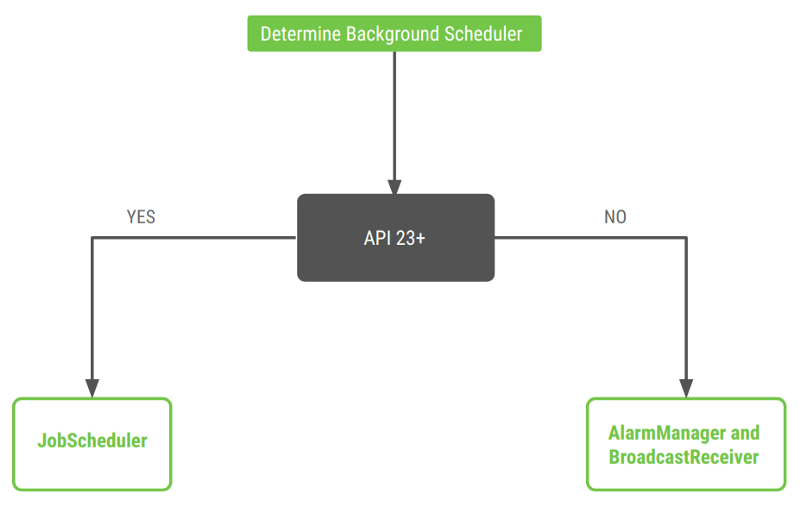

### App overview

In this project, you work on the DevBytes app

The DevBytes app displays a list of DevByte videos, which are short tutorials made by the Google Android developer relations team. The videos introduce developer features and best practices for Android development.

You enhance the user experience in the app by pre-fetching the videos once a day. This ensures that the user gets fresh content as soon as they open the app.


### Task: Setup and starter code walkthrough

In this task, you download and inspect the starter code.

#### Step 1: Download and run the starter app

You can continue working through the DevBytes app. You can download the starter app.

In this task, you download and run the starter app and examine the starter code.

- If you do not already have the DevBytes app, download the [DevBytes](https://drive.google.com/drive/folders/1zKOeFNpe25qR0aeSymnP-_Ca2kEK7i8h?usp=sharing) starter code for this project.
- Unzip the code and open the project in Android Studio.
- Connect your test device or emulator to the internet, if it is not already connected. Build and run the app. The app fetches the list of DevByte videos from the network and displays them.
- In the app, tap any video to open it in the YouTube app.

### Step 2: Explore the code

The starter app comes with a lot of code that was introduced in the previous project. The starter code for this codelab has networking, user interface, offline cache, and repository modules. You can focus on scheduling the background task using WorkManager.

- In Android Studio, expand all the packages.
- Explore the database package. The package contains the database entities and the local database, which is implemented using Room.
- Explore the repository package. The package contains the VideosRepository class that abstracts the data layer from the rest of the app.
- Explore the rest of starter code on your own, and with the help of the previous project.

### Concept: WorkManager
WorkManager is one of the Android Architecture Components and part of Android Jetpack. WorkManager is for background work that's deferrable and requires guaranteed execution:


- Deferrable means that the work is not required to run immediately. For example, sending analytical data to the server or syncing the database in the background is work that can be deferred.
- Guaranteed execution means that the task will run even if the app exits or the device restarts.



While WorkManager runs background work, it takes care of compatibility issues and best practices for battery and system health. WorkManager offers compatibility back to API level 14. WorkManager chooses an appropriate way to schedule a background task, depending on the device API level. It might use JobScheduler (on API 23 and higher) or a combination of AlarmManager and BroadcastReceiver.

WorkManager also lets you set criteria on when the background task runs. For example, you might want the task to run only when the battery status, network status, or charge state meet certain criteria. You learn how to set constraints later in this project.

```
Note:

WorkManager is not intended for in-process background work that can be terminated safely if the app process is killed.
WorkManager is not intended for tasks that require immediate execution.
```

In this project, you schedule a task to pre-fetch the DevBytes video playlist from the network once a day. To schedule this task, you use the WorkManager library.

### Task: Add the WorkManager dependency

- Open the build.gradle (Module:app) file and add the WorkManager dependency to the project.

If you use the latest version of the library, the solution app should compile as expected. If it doesn't, try resolving the issue, or revert to the library version shown below.

```
// WorkManager dependency
def work_version = "1.0.1"
implementation "android.arch.work:work-runtime-ktx:$work_version"
```

- Sync your project and make sure there are no compilation errors.

### Task: Create a background worker

Before you add code to the project, familiarize yourself with the following classes in WorkManager library:

- Worker
This class is where you define the actual work (the task) to run in the background. You extend this class and override the doWork() method. The doWork() method is where you put code to be performed in the background, such as syncing data with the server or processing images. You implement the Worker in this task.

- WorkRequest
This class represents a request to run the worker in background. Use WorkRequest to configure how and when to run the worker task, with the help of Constraints such as device plugged in or Wi-Fi connected. You implement the WorkRequest in a later task.

- WorkManager
This class schedules and runs your WorkRequest. WorkManager schedules work requests in a way that spreads out the load on system resources, while honoring the constraints that you specify. You implement the WorkManager in a later task.

#### Step 1: Create a worker

In this task, you add a Worker to pre-fetch the DevBytes video playlist in the background.

- Inside the devbyteviewer package, create a new package called work.
- Inside the work package, create a new Kotlin class called RefreshDataWorker.
- Extend the RefreshDataWorker class from the CoroutineWorker class. Pass in the context and WorkerParameters as constructor parameters.

```
class RefreshDataWorker(appContext: Context, params: WorkerParameters) :
       CoroutineWorker(appContext, params) {
}
To resolve the abstract class error, override the doWork() method inside the RefreshDataWorker class.
override suspend fun doWork(): Result {
  return Result.success()
}
```

A suspending function is a function that can be paused and resumed later. A suspending function can execute a long running operation and wait for it to complete without blocking the main thread.

### Step 2: Implement doWork()

The doWork() method inside the Worker class is called on a background thread. The method performs work synchronously, and should return a ListenableWorker.Result object. The Android system gives a Worker a maximum of 10 minutes to finish its execution and return a ListenableWorker.Result object. After this time has expired, the system forcefully stops the Worker.

To create a ListenableWorker.Result object, call one of the following static methods to indicate the completion status of the background work:

- Result.success()—work completed successfully.
- Result.failure()—work completed with a permanent failure.
- Result.retry()—work encountered a transient failure and should be retried.

In this task, you implement the doWork() method to fetch the DevBytes video playlist from the network. You can reuse the existing methods in the VideosRepository class to retrieve the data from the network.

- In the RefreshDataWorker class, inside doWork(), create and instantiate a VideosDatabase object and a VideosRepository object.

```
override suspend fun doWork(): Result {
   val database = getDatabase(applicationContext)
   val repository = VideosRepository(database)

   return Result.success()
}
```

- In the RefreshDataWorker class, inside doWork(), above the return statement, call the refreshVideos() method inside a try block. Add a log to track when the worker is run.

```
try {
   repository.refreshVideos( )
   Timber.d("Work request for sync is run")
   } catch (e: HttpException) {
   return Result.retry()
}
```

To resolve the "Unresolved reference" error, import retrofit2.HttpException.

- Here is the complete RefreshDataWorker class for your reference:

```
class RefreshDataWorker(appContext: Context, params: WorkerParameters) :
       CoroutineWorker(appContext, params) {

   override suspend fun doWork(): Result {
       val database = getDatabase(applicationContext)
       val repository = VideosRepository(database)
       try {
           repository.refreshVideos()
       } catch (e: HttpException) {
           return Result.retry()
       }
       return Result.success()
   }
}
```

### Task: Define a periodic WorkRequest

A Worker defines a unit of work, and the WorkRequest defines how and when work should be run. There are two concrete implementations of the WorkRequest class:

- The OneTimeWorkRequest class is for one-off tasks. (A one-off task happens only once.)
- The PeriodicWorkRequest class is for periodic work, work that repeats at intervals.

Tasks can be one-off or periodic, so choose the class accordingly. For more information on scheduling recurring work, see the recurring work documentation.

```
Note: The minimum interval for periodic work is 15 minutes. Periodic work can't have an initial delay as one of its constraints.
```

In this task, you define and schedule a WorkRequest to run the worker that you created in the previous task.

#### Step 1: Set up recurring work

Within an Android app, the Application class is the base class that contains all other components, such as activities and services. When the process for your application or package is created, the Application class (or any subclass of Application) is instantiated before any other class.

In this sample app, the DevByteApplication class is a subclass of the Application class. The DevByteApplication class is a good place to schedule the WorkManager.

- In the DevByteApplication class, create a method called setupRecurringWork() to set up the recurring background work.

```
/**
* Setup WorkManager background job to 'fetch' new network data daily.
*/
private fun setupRecurringWork() {
}
```

- Inside the setupRecurringWork() method, create and initialize a periodic work request to run once a day, using the PeriodicWorkRequestBuilder() method. Pass in the RefreshDataWorker class that you created in the previous task. Pass in a repeat interval of 1 with a time unit of TimeUnit.DAYS.

```
val repeatingRequest = PeriodicWorkRequestBuilder<RefreshDataWorker>(1, TimeUnit.DAYS)
       .build()
```

To resolve the error, import java.util.concurrent.TimeUnit.

#### Step 2: Schedule a WorkRequest with WorkManager

After you define your WorkRequest, you can schedule it with WorkManager, using the enqueueUniquePeriodicWork() method. This method allows you to add a uniquely named PeriodicWorkRequest to the queue, where only one PeriodicWorkRequest of a particular name can be active at a time.

For example, you might only want one sync operation to be active. If one sync operation is pending, you can choose to let it run or replace it with your new work, using an ExistingPeriodicWorkPolicy.

To learn more about ways to schedule a WorkRequest, see the WorkManager documentation.

- In the RefreshDataWorker class, at the beginning of the class, add a companion object. Define a work name to uniquely identify this worker.

```
companion object {
   const val WORK_NAME = "com.example.android.devbyteviewer.work.RefreshDataWorker"
}
```

In the DevByteApplication class, at the end of the setupRecurringWork() method, schedule the work using the enqueueUniquePeriodicWork() method. Pass in the KEEP enum for the ExistingPeriodicWorkPolicy. Pass in repeatingRequest as the PeriodicWorkRequest parameter.

```
WorkManager.getInstance().enqueueUniquePeriodicWork(
       RefreshDataWorker.WORK_NAME,
       ExistingPeriodicWorkPolicy.KEEP,
       repeatingRequest)
```

If pending (uncompleted) work exists with the same name, the ExistingPeriodicWorkPolicy.KEEP parameter makes the WorkManager keep the previous periodic work and discard the new work request.

```
Best Practice: The onCreate() method runs in the main thread. Performing a long-running operation in onCreate() might block the UI thread and cause a delay in loading the app. To avoid this problem, run tasks such as initializing Timber and scheduling WorkManager off the main thread, inside a coroutine.
```

- At the beginning of the DevByteApplication class, create a CoroutineScope object. Pass in Dispatchers.Default as the constructor parameter.

```
private val applicationScope = CoroutineScope(Dispatchers.Default)
In the DevByteApplication class, add a new method called delayedInit() to start a coroutine.
private fun delayedInit() {
   applicationScope.launch {
   }
}
```

- Inside the delayedInit() method, call setupRecurringWork().

- Move the Timber initialization from the onCreate() method to the delayedInit() method.

```
private fun delayedInit() {
   applicationScope.launch {
       Timber.plant(Timber.DebugTree())
       setupRecurringWork()
   }
}
```

- In the DevByteApplication class, at the end of the onCreate() method, add a call to the delayedInit() method.

```
override fun onCreate() {
   super.onCreate()
   delayedInit()
}
```

- Open the Logcat pane at the bottom of the Android Studio window. Filter on RefreshDataWorker.

- Run the app. The WorkManager schedules your recurring work immediately.

In the Logcat pane, notice the log statements that show that the work request is scheduled, then runs successfully.

```
D/RefreshDataWorker: Work request for sync is run
I/WM-WorkerWrapper: Worker result SUCCESS for Work [...]
```

The WM-WorkerWrapper log is displayed from the WorkManager library, so you can't change this log message.

#### Step 3: (Optional) Schedule the WorkRequest for a minimum interval

In this step, you decrease the time interval from 1 day to 15 minutes. You do this so you can see the logs for a periodic work request in action.

- In the DevByteApplication class, inside the setupRecurringWork() method, comment out the current repeatingRequest definition. Add a new work request with a periodic repeat interval of 15 minutes.

```
// val repeatingRequest = PeriodicWorkRequestBuilder<RefreshDataWorker>(1, TimeUnit.DAYS)
//        .build()
val repeatingRequest = PeriodicWorkRequestBuilder<RefreshDataWorker>(15, TimeUnit.MINUTES)
       .build()
```

- Open the Logcat pane in Android Studio and filter on RefreshDataWorker. To clear the previous logs, click the Clear logcat icon .

- Run the app, and the WorkManager schedules your recurring work immediately. In the Logcat pane, notice the logs—the work request is run once every 15 minutes. Wait 15 minutes to see another set of work request logs. You can leave the app running or close it; the work manager should still run.

Notice that the interval is sometimes less than 15 minutes, and sometimes more than 15 minutes. (The exact timing is subject to OS battery optimizations.)

```
12:44:40 D/RefreshDataWorker: Work request for sync is run
12:44:40 I/WM-WorkerWrapper: Worker result SUCCESS for Work 
12:59:24 D/RefreshDataWorker: Work request for sync is run
12:59:24 I/WM-WorkerWrapper: Worker result SUCCESS for Work 
13:15:03 D/RefreshDataWorker: Work request for sync is run
13:15:03 I/WM-WorkerWrapper: Worker result SUCCESS for Work 
13:29:22 D/RefreshDataWorker: Work request for sync is run
13:29:22 I/WM-WorkerWrapper: Worker result SUCCESS for Work 
13:44:26 D/RefreshDataWorker: Work request for sync is run
13:44:26 I/WM-WorkerWrapper: Worker result SUCCESS for Work
```
 
- Congratulations! You created a worker and scheduled the work request with WorkManager. But there's a problem: you did not specify any constraints. WorkManager will schedule the work once a day, even if the device is low on battery, sleeping, or has no network connection. This will affect the device battery and performance and could result in a poor user experience.

- In your next task, you address this issue by adding constraints.

### Task: Add constraints

In the previous task, you used WorkManager to schedule a work request. In this task, you add criteria for when to execute the work.

When defining the WorkRequest, you can specify constraints for when the Worker should run. For example, you might want to specify that the work should only run when the device is idle, or only when the device is plugged in and connected to Wi-Fi. You can also specify a backoff policy for retrying work. The supported constraints are the set methods in Constraints.Builder. To learn more, see Defining your Work Requests.

***PeriodicWorkRequest and constraints***

A WorkRequest for repeating work, for example PeriodicWorkRequest, executes multiple times until it is cancelled. The first execution happens immediately, or as soon as the given constraints are met.

The next execution happens during the next period interval. Note that execution might be delayed, because WorkManager is subject to OS battery optimizations, for example when the device is in Doze mode.

#### Step 1: Add a Constraints object and set one constraint

In this step, you create a Constraints object and set one constraint on the object, a network-type constraint. (It's easier to notice the logs with only one constraint. In a later step, you add other constraints.)

- In the DevByteApplication class, at the beginning of setupRecurringWork(), define a val of the type Constraints. Use the Constraints.Builder() method.

```
val constraints = Constraints.Builder()
```

- To resolve the error, import androidx.work.Constraints.

- Use the setRequiredNetworkType() method to add a network-type constraint to the constraints object. Use the UNMETERED enum so that the work request will only run when the device is on an unmetered network.

```
.setRequiredNetworkType(NetworkType.UNMETERED)
```

- Use the build() method to generate the constraints from the builder.

```
val constraints = Constraints.Builder()
       .setRequiredNetworkType(NetworkType.UNMETERED)
       .build()
```

Now you need to set the newly created Constraints object to the work request.

- In the DevByteApplication class, inside the setupRecurringWork() method, set the Constraints object to the periodic work request, repeatingRequest. To set the constraints, add the setConstraints() method above the build() method call.

```
       val repeatingRequest = PeriodicWorkRequestBuilder<RefreshDataWorker>(15, TimeUnit.MINUTES)
               .setConstraints(constraints)
               .build()
```

#### Step 2: Run the app and notice the logs

In this step, you run the app and notice the constrained work request being run in the background at intervals.

- Uninstall the app from the device or emulator to cancel any previously scheduled tasks.

- Open the Logcat pane in Android Studio. In the Logcat pane, clear the previous logs by clicking the Clear logcat icon on the left. Filter on work.

- Turn off the Wi-Fi in the device or emulator, so you can see how constraints work. The current code sets only one constraint, indicating that the request should only run on an unmetered network. Because Wi-Fi is off, the device isn't connected to the network, metered or unmetered. Therefore, this constraint will not be met.

- Run the app and notice the Logcat pane. The WorkManager schedules the background task immediately. Because the network constraint is not met, the task is not run.

```
11:31:44 D/DevByteApplication: Periodic Work request for sync is scheduled
```

- Turn on the Wi-Fi in the device or emulator and watch the Logcat pane. Now the scheduled background task is run approximately every 15 minutes, as long as the network constraint is met.

```
11:31:44 D/DevByteApplication: Periodic Work request for sync is scheduled
11:31:47 D/RefreshDataWorker: Work request for sync is run
11:31:47 I/WM-WorkerWrapper: Worker result SUCCESS for Work [...]
11:46:45 D/RefreshDataWorker: Work request for sync is run
11:46:45 I/WM-WorkerWrapper: Worker result SUCCESS for Work [...] 
12:03:05 D/RefreshDataWorker: Work request for sync is run
12:03:05 I/WM-WorkerWrapper: Worker result SUCCESS for Work [...] 
12:16:45 D/RefreshDataWorker: Work request for sync is run
12:16:45 I/WM-WorkerWrapper: Worker result SUCCESS for Work [...] 
12:31:45 D/RefreshDataWorker: Work request for sync is run
12:31:45 I/WM-WorkerWrapper: Worker result SUCCESS for Work [...] 
12:47:05 D/RefreshDataWorker: Work request for sync is run
12:47:05 I/WM-WorkerWrapper: Worker result SUCCESS for Work [...] 
13:01:45 D/RefreshDataWorker: Work request for sync is run
13:01:45 I/WM-WorkerWrapper: Worker result SUCCESS for Work [...]
```

#### Step 3: Add more constraints

In this step, you add the following constraints to the PeriodicWorkRequest:

- Battery not low.
- Device charging.
- Device idle; available only in API level 23 (Android M) and higher.

Implement the following in the DevByteApplication class.

- In the DevByteApplication class, inside the setupRecurringWork() method, indicate that the work request should run only if the battery is not low. Add the constraint before the build() method call, and use the setRequiresBatteryNotLow() method.

```
.setRequiresBatteryNotLow(true)
```

- Update the work request so it runs only when the device is charging. Add the constraint before the build() method call, and use the setRequiresCharging() method.

```
.setRequiresCharging(true)
Update the work request so it runs only when the device is idle. Add the constraint before the build() method call, and use setRequiresDeviceIdle() method. This constraint runs the work request only when the user isn't actively using the device. This feature is only available in Android 6.0 (Marshmallow) and higher, so add a condition for SDK version M and higher.
.apply {
   if (Build.VERSION.SDK_INT >= Build.VERSION_CODES.M) {
       setRequiresDeviceIdle(true)
   }
}
```

Here is the complete definition of the constraints object.

```
val constraints = Constraints.Builder()
       .setRequiredNetworkType(NetworkType.UNMETERED)
       .setRequiresBatteryNotLow(true)
       .setRequiresCharging(true)
       .apply {
           if (Build.VERSION.SDK_INT >= Build.VERSION_CODES.M) {
               setRequiresDeviceIdle(true)
           }
       }
       .build()
```

- Inside the setupRecurringWork() method, change the request interval back to once a day.

```
val repeatingRequest = PeriodicWorkRequestBuilder<RefreshDataWorker>(1, TimeUnit.DAYS)
       .setConstraints(constraints)
       .build()
```

- Here is the complete implementation of the setupRecurringWork() method, with a log so you can track when the periodic work request is scheduled.

```
private fun setupRecurringWork() {

       val constraints = Constraints.Builder()
               .setRequiredNetworkType(NetworkType.UNMETERED)
               .setRequiresBatteryNotLow(true)
               .setRequiresCharging(true)
               .apply {
                   if (Build.VERSION.SDK_INT >= Build.VERSION_CODES.M) {
                       setRequiresDeviceIdle(true)
                   }
               }
               .build()
       val repeatingRequest = PeriodicWorkRequestBuilder<RefreshDataWorker>(1, TimeUnit.DAYS)
               .setConstraints(constraints)
               .build()
       
       Timber.d("Periodic Work request for sync is scheduled")
       WorkManager.getInstance().enqueueUniquePeriodicWork(
               RefreshDataWorker.WORK_NAME,
               ExistingPeriodicWorkPolicy.KEEP,
               repeatingRequest)
   }
```

- To remove the previously scheduled work request, uninstall the DevBytes app from your device or emulator.

- Run the app, and the WorkManager immediately schedules the work request. The work request runs once a day, when all the constraints are met.

- This work request will run in the background as long as the app is installed, even if the app is not running. For that reason, you should uninstall the app from the phone.

Great Job! You implemented and scheduled a battery-friendly work request for the daily pre-fetch of videos in the DevBytes app. WorkManager will schedule and run the work, optimizing the system resources. Your users and their batteries will be very happy.