### App Overview 

The GDG-finder starter app builds on everything you've learned so far in this course.

The app uses ConstraintLayout to lay out three screens. Two of the screens are just layout files that you'll use to explore colors and text on Android.

The third screen is a GDG finder. GDGs, or Google Developer Groups, are communities of developers that focus on Google technologies, including Android. GDGs around the world host meetups, conferences, study jams, and other events.

As you develop this app, you work on the real list of GDGs. The finder screen uses the device's location to sort the GDGs by distance.

If you're lucky and there's a GDG in your region, you can check out the website and sign up for their events! GDG events are a great way to meet other Android developers and learn industry best practices that didn't fit in this course.

The screenshots below show how your app will change from the beginning to the end of this project.


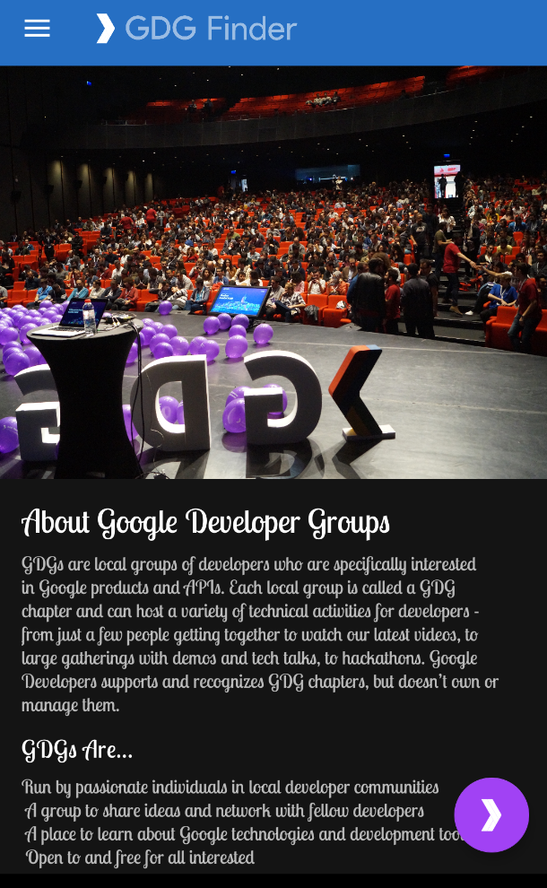

#### Task: Add support for right-to-left (RTL) languages

The main difference between left-to-right (LTR) and right-to-left (RTL) languages is the direction of the displayed content. When the UI direction is changed from LTR to RTL (or vice-versa), it is often called mirroring. Mirroring affects most of the screen, including text, text field icons, layouts, and icons with directions (such as arrows). Other items are not mirrored, such as numbers (clock, phone numbers), icons which do not have direction (airplane mode, WiFi), playback controls, and most charts and graphs.

Languages that use the RTL text direction are used by more than one billion people worldwide. Android developers are all over the world, and so a GDG Finder app needs to support RTL languages.

#### Step 1: Add RTL support

In this step, you make the GDG Finder app work with RTL languages.

- Continue from the final code of the previous project.

- Open the Android Manifest.

- In the `<application>` section, add the following code to specify that the app supports RTL.

```
<application
        ...
        android:supportsRtl="true">
```

- Open activity_main.xml in the Design tab.

- From the Locale for Preview dropdown menu, choose Preview Right to Left. (If you don't find this menu, widen the pane or close the Attributes pane to uncover it.)

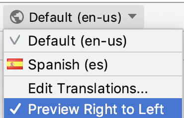

***Tip: You don't need to switch languages on your device to check how your app presents visually in RTL.***


- In the Preview, notice that the header "GDG Finder" has moved to the right, and the rest of the screen remains pretty much the same. Overall, this screen is passable. But the alignment in the text view is now wrong, because it is aligned to the left, instead of to the right.


- To make this work on your device, in your device or emulator Settings, in Developer Options, select Force RTL layout. (If you need to turn on Developer Options, find the Build Number and click it until you get a toast indicating you are a developer. This varies by device and version of the Android system.)


- Run the app and verify on the device that the main screen appears the same as in the Preview. Notice that the FAB is now switched to the left, and the Hamburger menu to the right!

- In the app, open the navigation drawer and navigate to the Search screen. As shown below, the icons are still on the left, and no text is visible. It turns out that the text is off the screen, to the left of the icon. This is because the code uses left/right screen references in the view properties and layout constraints.

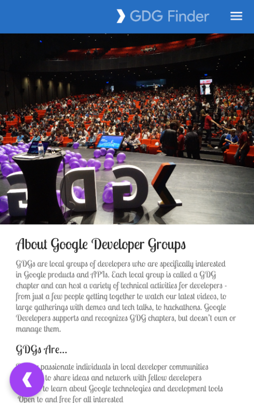

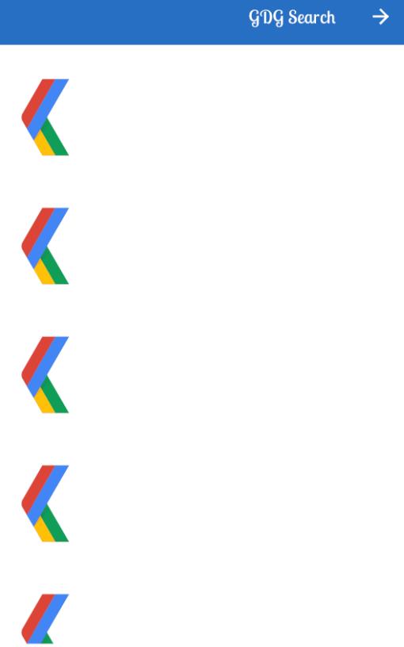

#### Step 2: Use start and end instead of left and right

"Left" and "right" on the screen (when you face the screen) don't change, even if the direction of the text changes. For example, layout_constraintLeft_toLeftOf always constrains the left side of the element to the left side of the screen. In your app's case, the text is off the screen in RTL languages, as shown in the screenshot above.

To fix this, instead of "left" and "right," use Start and End terminology. This terminology sets the start of the text and the end of the text appropriately for the direction of the text in the current language, so that margins and layouts are in the correct areas of the screens.

- Open list_item.xml.

- Replace any references to Left and Right with references to Start and End.

```
app:layout_constraintStart_toStartOf="parent"

app:layout_constraintStart_toEndOf="@+id/gdg_image"
app:layout_constraintEnd_toEndOf="parent"
```

- Replace the ImageView's layout_marginLeft with layout_marginStart. This moves the margin to the correct place to move the icon away from the edge of the screen.

```
<ImageView
android:layout_marginStart="
?
```

- Open fragment_gdg_list.xml. Check the list of GDGs in the Preview pane. Notice that the icon is still pointing in the wrong direction because it is mirrored (If the icon is not mirrored, make sure you are still viewing the right to left preview). According to the Material Design guidelines, icons should not be mirrored.

- Open res/drawable/ic_gdg.xml.

- In the first line of XML code, find and delete android:autoMirrored="true" to disable mirroring.

- Check the Preview or run the app again and open the Search GDG screen. The layout should be fixed now!

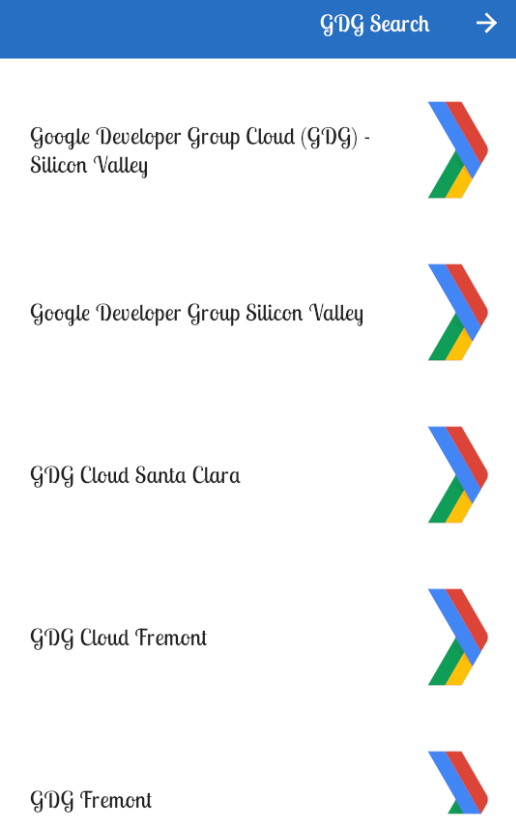

***Tip: Android Studio gives you yellow-highlight tips to encourage the use of start and end attributes.***

Use search-and-replace with case matching to find all occurrences of Left and Right in your XML layouts.

### Step 3: Let Android Studio do the work for you

- In the previous exercise, you took your first steps to support RTL languages. Fortunately, Android Studio can scan your app and set up a lot of basics for you.

- In list_item.xml, in the TextView, change layout_marginStart back to layout_marginLeft, so that the scanner has something to find.

```
<TextView
android:layout_marginLeft="@dimen/spacing_normal"
```

- In Android Studio, choose Refactor > Add RTL support where possible and check the boxes for updating the manifest, and the layout files to use start and end properties.

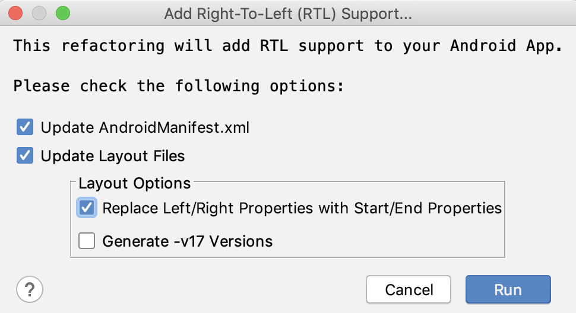

- In the Refactoring Preview pane, find the app folder, and expand until it is open to all the details.

- Under the app folder, notice that the layout_marginLeft that you just changed is listed as code to refactor.

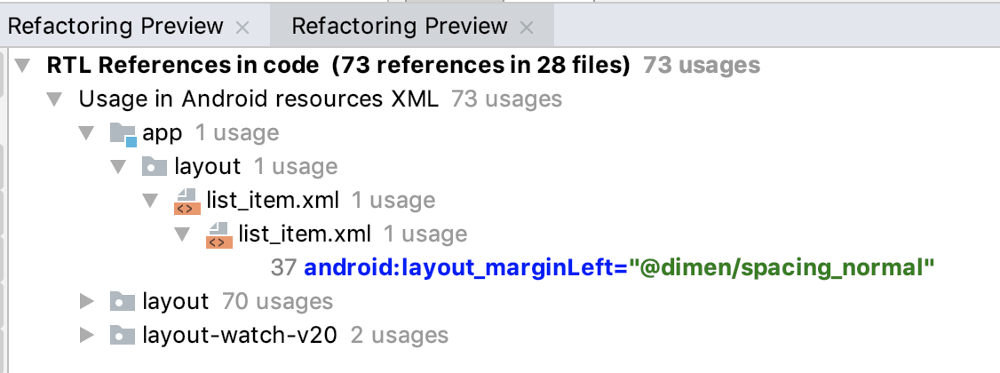

- Notice that the preview also lists system and library files. Right-click on layout and layout-watch-v20 and any other folders that are not part of app, and choose Exclude from the context menu.

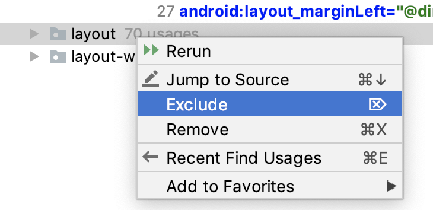

- Go ahead and do the refactor now. (If you get a popup about system files, make sure you have excluded all folders that are not part of your app code.)

- Notice that layout_marginLeft has been changed back to layout_marginStart.

```
Note: Some View components need further customization to behave properly with RTL. In order to have more precise control over the UI there are 4 different APIs that you can use:

android:layoutDirection to set the direction of a component's layout.
android:textDirection to set the direction of a component's text.
android:textAlignment to set the alignment of a component's text.
getLayoutDirectionFromLocale() is a method to programatically get the locale that specifies direction.
```

#### Step 3: Explore folders for locales

So far, you've just changed the direction of the default language used for the app. For a production app, you would send the strings.xml file to a translator to have it translated to a new language. For this project, the app provides a strings.xml file in Spanish (we used Google Translate to generate the translations, so they're not perfect.).

- In Android Studio, switch the project view to Project Files.

- Expand the res folder, and notice folders for res/values and res/values-es. The "es" in the folder name is the language code for Spanish. The values-"language code" folders contain values for each supported language. The values folder without an extension contains the default resources that apply otherwise.

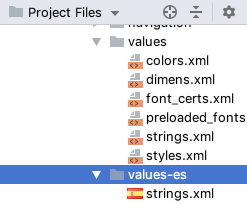

- In values-es, open strings.xml and notice that all the strings are in Spanish.

- In Android Studio, open activity_main.xml in the Design tab.

- In the Locale for Preview dropdown choose Spanish. Your text should now be in Spanish.

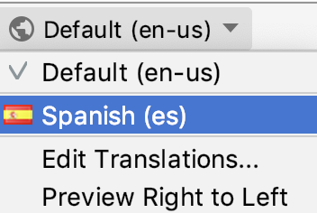

- [Optional] If you are proficient in an RTL language, create a values folder and a strings.xml in that language and test how it appears on your device.

- [Optional] Change the language settings on your device and run the app. Make sure you don't change your device to a language you don't read, as it makes it a bit challenging to undo!

### Task: Scan for accessibility

In the previous task, you changed your app manually and then used Android Studio to check for additional RTL improvements to make.

The Accessibility Scanner app is your best ally when it comes to making your app accessible. It scans the visible screen on your target device and suggests improvements, such as making touch targets larger, increasing contrast, and providing descriptions for images to make your app more accessible. Accessibility Scanner is made by Google and you can install it from Play Store.

#### Step 1: Install and run Accessibility Scanner

- Open the Play Store and sign in if necessary. You can do this on your physical device or the emulator. This project uses the emulator.

```
Note: If you don't have the Play Store on your emulator, you might need to create a new emulator. Make sure you select an option that has the "Play Store" icon enabled when creating the emulator.
```
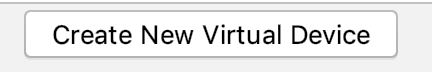
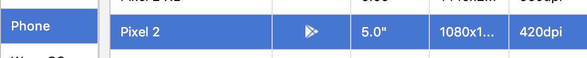

```
Important: To use the Play Store from the emulator, you have to log in with an account. You can use your regular account, or you can create an account just for testing with the emulator. Any account you create is real, and you are connecting to the real Play Services, not an emulated version of it!

Important: You can Skip setting up billing options!
```

- In the Play Store, search for Accessibility Scanner by Google LLC. Make sure you get the correct app, issued by Google, as any scanning requires a lot of permissions!

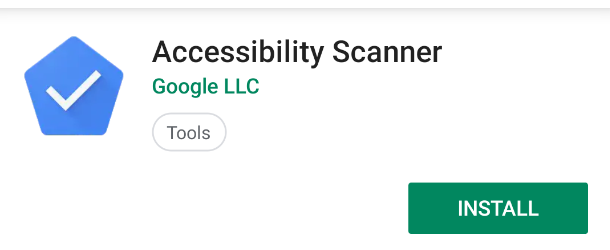

- Install the scanner on the emulator.

- Once installed, click Open.

- Click Get Started.

- Click OK to start Accessibility Scanner setup in Settings.

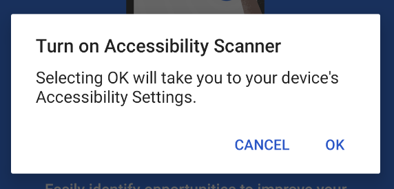

- Click the Accessibility Scanner to go to the device's Accessibility settings.


- Click Use service to enable it.

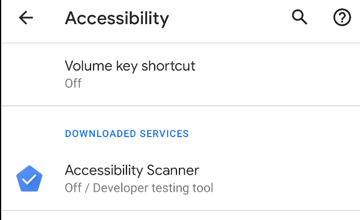

- Follow the on-screen instructions and grant all permissions.

- Then click OK Got it, and return to the home screen. You may see a blue button with a check mark somewhere on the screen. Clicking this button triggers testing for the app in the foreground. You can reposition the button by dragging it. This button stays on top of any apps, so you can trigger testing at any time.

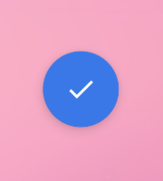

`To turn off the scanner, go to Settings and turn the Accessibility Scanner off.`

- Open or run your app.

- Click the blue button and accept additional security warnings and permissions.

The first time you click the Accessibility Scanner icon, the app asks for permission to get everything displayed on your screen. This seems like a very scary permission, and it is.

You should almost never grant a permission like this one, because the permission lets apps read your email or even grab your bank account info! However, for Accessibility Scanner to do its work, it needs to examine your app the way a user would—that's why it needs this permission.

`Important: Before you enable this permission, double-check to make sure that the app you installed is Accessibility Scanner by Google LLC.`

- Click the blue button and wait for the analysis to complete. You will see something like the screenshot below, with the title and FAB boxed in red. This indicates two suggestions for accessibility improvements on this screen.

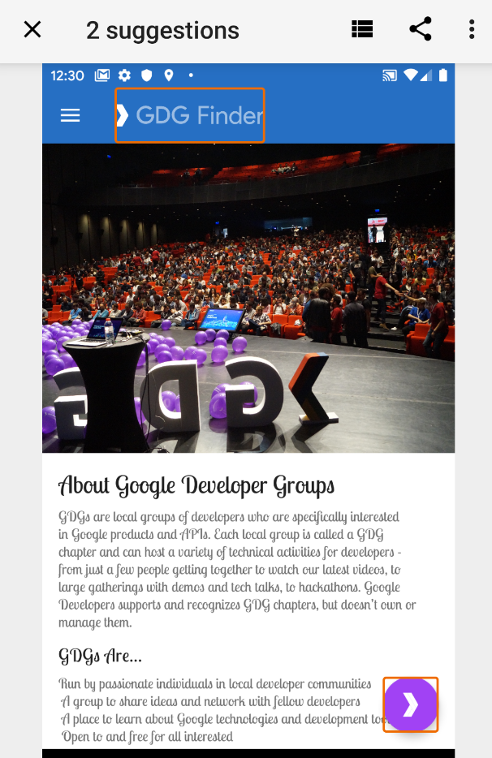

- Click on the box surrounding GDG Finder. This opens a pane with additional information, as shown below, indicating issues with the image contrast.

- Expand the Image Contrast information, and the tool suggests remedies.

- Click the arrows to the right to get information for the next item.

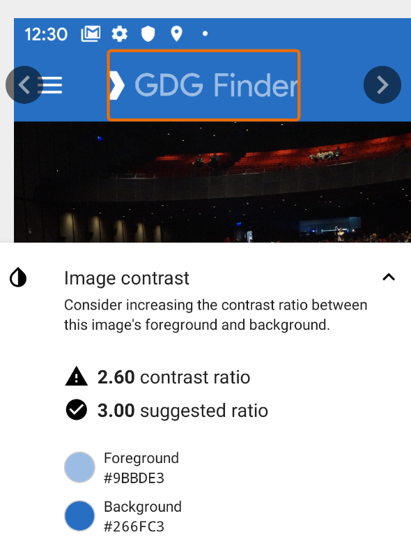


- In your app, navigate to the Apply for GDG screen and scan it with the Accessibility Scanner app. This gives quite a few suggestions, as shown below on the left. 12, to be exact. To be fair, some of those are duplicates for similar items.

- Click the "stack"  icon in the bottom toolbar to get a list of all suggestions, as shown below on the right screenshot. You address all of these issues in this project.


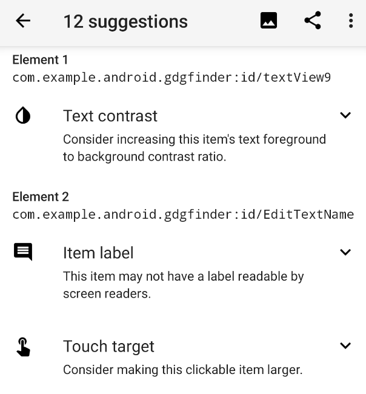