### App overview
The GDG-finder starter app builds on everything you've learned so far in this course.

The app uses ConstraintLayout to lay out three screens. Two of the screens are just layout files that you'll use to explore colors and text on Android.

The third screen is a GDG finder. GDGs, or Google Developer Groups, are communities of developers that focus on Google technologies, including Android. GDGs around the world host meetups, conferences, study jams, and other events.

As you develop this app, you work on the real list of GDGs. The finder screen uses the device's location to sort the GDGs by distance.

If you're lucky and there's a GDG in your region, you can check out the website and sign up for their events! GDG events are a great way to meet other Android developers and learn industry best practices that didn't fit in this course.

The screenshots below show how your app will change from the beginning to the end of this project.

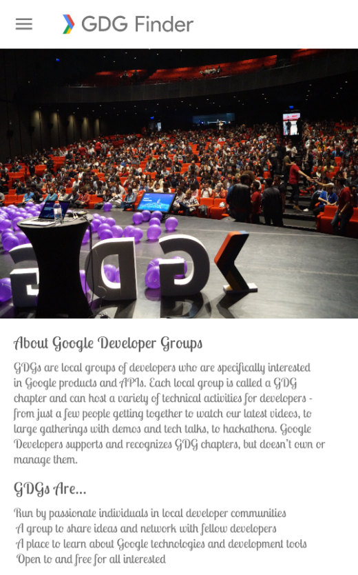

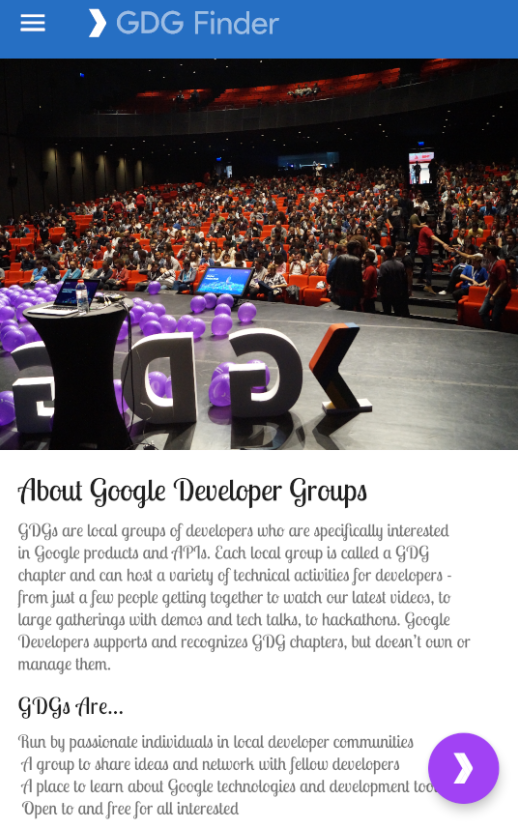

### Task: Add a floating action button (FAB)

In this task, you add a floating action button (FAB) to the home screen of the GDG Finder app.

A FAB is a large round button that represents a primary action, which is the main thing a user should do on the screen. The FAB floats above all other content, as shown in the screenshot on the left below. When the user taps the FAB, they are taken to a list of GDGs, as shown on the right.


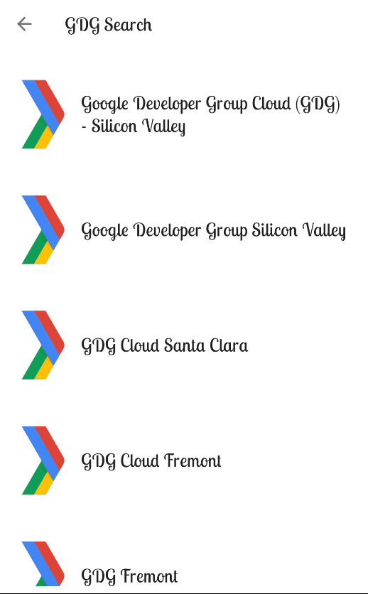

#### Step 1: Add a FAB to the home fragment layout

- Download and run the GDGFinderStyles app, which is the starter app for this project. If you did the preceding project, you can continue from the final code of that project.

- In build.gradle(Module: app), verify that the material library is included. To use Material Design components, you need to include this library.

`implementation 'com.google.android.material:material:1.1.0-alpha04'`

- Open res/layout/home_fragment.xml and switch to the Text tab.

- Currently, the home screen layout uses a single ScrollView with a ConstraintLayout as a child. If you added a FAB to the ConstraintLayout, the FAB would be inside the ConstraintLayout, not floating over all the content, and it would scroll with the rest of the content of the ConstraintLayout. You need a way to float the FAB above your current layout.

CoordinatorLayout is a view group that lets you stack views on top of each other. While CoordinatorLayout doesn't have any fancy layout abilities, it is sufficient for this app. The ScrollView should take up the full screen, and the FAB should float near the bottom edge of the screen.

- In home_fragment.xml, add a CoordinatorLayout around the ScrollView.

```
<androidx.coordinatorlayout.widget.CoordinatorLayout
       android:layout_height="match_parent"
       android:layout_width="match_parent">
...

</androidx.coordinatorlayout.widget.CoordinatorLayout>
```

- Replace <ScrollView> with <androidx.core.widget.NestedScrollView>. Coordinator layout knows about scrolling, and you need to use NestedScrollView inside another view with scrolling for scrolling to work correctly.

`androidx.core.widget.NestedScrollView`

-Inside and at the bottom of the CoordinatorLayout, below the NestedScrollView, add a FloatingActionButton.

```
<com.google.android.material.floatingactionbutton.FloatingActionButton
       android:layout_width="wrap_content"
       android:layout_height="wrap_content"/>
```

- Run your app. You see a colored dot in the top-left corner.

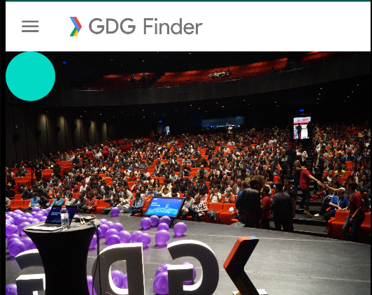

- Tap the button. Notice that the button visually responds.

- Scroll the page. Notice that the button stays put.

#### Step 2: Style the FAB

In this step, you move the FAB to the bottom-right corner and add an image that indicates the FAB's action.

- Still in home_fragment.xml, add the layout_gravity attribute to the FAB and move the button to the bottom and end of the screen. The layout_gravity attribute tells a view to lay out on the top, bottom, start, end, or center of the screen. You can combine positions using a vertical bar.

`android:layout_gravity="bottom|end"`

- Check in the Preview pane that the button has moved.

- Add a layout_margin of 16dp to the FAB to offset it from the edge of the screen.

`android:layout_margin="16dp"`

- Use the provided ic_gdg icon as the image for the FAB. After you add the code below, you see a chevron inside the FAB.

`` app:srcCompat="@drawable/ic_gdg"`

- Run the app, and it should look like the screenshot below.


### Step 3: Add a click listener to the FAB

In this step, you add a click handler to the FAB that takes the user to a list of GDGs. You've added click handlers in previous projects, so the instructions are terse.

- In home_fragment.xml, in the <data> tag, define a variable viewModel for the provided HomeViewModel.

```
<variable
   name="viewModel"
   type="com.example.android.gdgfinder.home.HomeViewModel"/>
```
- Add the onClick listener to the FAB and call it onFabClicked().

`android:onClick="@{() -> viewModel.onFabClicked()}"`

- In the home package, open the provided HomeViewModel class and look at the navigation live data and functions, which are also shown below. Notice that when the FAB is clicked, the onFabClicked()click handler is called, and the app triggers navigation.

```
private val _navigateToSearch = MutableLiveData<Boolean>()
val navigateToSearch: LiveData<Boolean>
   get() = _navigateToSearch

fun onFabClicked() {
   _navigateToSearch.value = true
}

fun onNavigatedToSearch() {
   _navigateToSearch.value = false
}
```

- In the home package, open the HomeFragment class. Notice that onCreateView() creates the HomeViewModel and assigns it to viewModel.

- Add the viewModel to the binding in onCreateView().

```
binding.viewModel = viewModel
```

- To eliminate the error, clean and rebuild your project to update the binding object.

- Also in onCreateView(), add an observer that navigates to the list of GDGs. Here is the code:

```
        viewModel.navigateToSearch.observe(viewLifecycleOwner,
            Observer<Boolean> { navigate ->
                if(navigate) {
                    val navController = findNavController()
                    navController.navigate(R.id.action_homeFragment_to_gdgListFragment)
                    viewModel.onNavigatedToSearch()
               }
             })
```

- Make the necessary imports from androidx. Import this findNavController and Observer:

```
import androidx.navigation.fragment.findNavController
import androidx.lifecycle.Observer

```

- Run your app.

- Tap the FAB and it takes you to the GDG list. If you are running the app on a physical device, you are asked for the location permission. If you are running the app in an emulator, you may see a blank page with the following message:

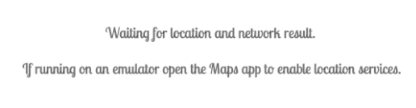

If you get this message running on the emulator, make sure you are connected to the internet and have location settings turned on. Then open the Maps app to enable location services. You may also have to restart your emulator.


### Task: Use styling in a world of Material Design

To get the most out of Material Design components, use theme attributes. Theme attributes are variables that point to different types of styling information, such as the primary color of the app. By specifying theme attributes for the MaterialComponents theme, you can simplify your app styling. Values you set for colors or fonts apply to all widgets, so you can have consistent design and branding.

#### Step 1: Use Material theme attributes

In this step, you change the styling of the title headers on the home screen to use Material Design theme attributes to style your views. This helps you follow the Material style guide while customizing your app's style.

- Open the Material web page for typography theming:

`https://material.io/develop/android/theming/typography/`

- The page shows you all the styles available with Material themes.

- On the page, search or scroll to find textAppearanceHeadline5 (Regular 24sp) and textAppearanceHeadline6 (Regular 20sp). These two attributes are good matches for your app.

- In home_fragment.xml, replace the current style (android:textAppearance="@style/TextAppearance.Title") of the title TextView with style="?attr/textAppearanceHeadline5". The syntax ?attr is a way to look up a theme attribute and apply the value of Headline 5, as defined in the current theme.

```
<TextView
       android:id="@+id/title"
       style="?attr/textAppearanceHeadline5"
```

- Preview your changes. Notice that when the style is applied, the font of the title changes. This happens because the style set in the view overrides the style set by the theme, as shown by the style-priority pyramid diagram below.

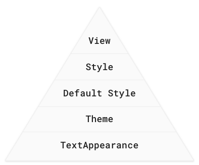

In the pyramid diagram, TextAppearance is below theme. TextAppearance is an attribute on any view that applies text styling. It's not the same as a style, and it only lets you define things about how to display text. All the text styles in Material Design components can also be used as textAppearance; that way, any theme attributes that you define take priority.

- In the title TextView, replace the styling you just added with a textAppearance.

- Preview your changes, or run the app to see the difference. For comparison, the screenshots below show the differences when the Material style is applied to the title and overrides the Title style.

| MATERIAL STYLE: | TEXT APPEARANCE |
|---|---|
| style="? | android:textAppearance="? |
| attr/textAppearanceHeadline5" | attr/textAppearanceHeadline5" |


#### Step 2: Change the style in the Material theme

The textAppearanceHeadline6 would be a good Material choice for the subtitle, but its default size is 20sp, not 18sp as defined in the Title style of the app. Instead of overriding the size in each subtitle view, you can modify the Material theme and override its default style.

- Open styles.xml.

- Delete the Title and Subtitle styles. You are already using textAppearanceHeadline5 instead of Title, and you are going to remove the need for Subtitle.

- Define a CustomHeadline6 style with a textSize of 18sp. Give it a parent of TextAppearance.MaterialComponents.Headline6 so that it inherits everything that you are not explicitly overriding.

```
<style name="TextAppearance.CustomHeadline6" parent="TextAppearance.MaterialComponents.Headline6">
   <item name="android:textSize">18sp</item>
</style>
```

- Inside this style, override the default textAppearanceHeadline6 of the theme, by defining an item that styles textAppearanceHeadline6 with the custom style that you just added.

```
<item name="textAppearanceHeadline6">@style/TextAppearance.CustomHeadline6</item>
```

- In home_fragment.xml, apply textAppearanceHeadline6 to the subtitle view and reformat your code (Code > Reformat code).

`                  android:textAppearance="?attr/textAppearanceHeadline6"`

- Run the app. Notice the difference in font color, which is subtle, but makes a big difference in how readable the screen is.

| ORIGINAL: | AFTER: |
|---|---|
| 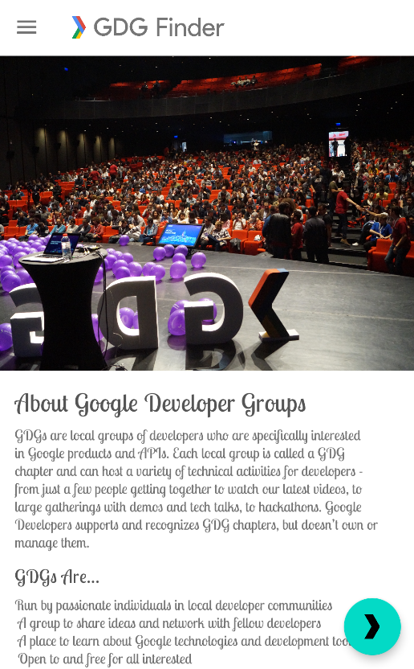 |  |

#### Task: Change the toolbar theme

Sometimes you may want to change portions of your screen to a different theme, but not all of it. For example, you could make the toolbar use the dark Material components theme. You do this using theme overlays.

A Theme is used to set the global theme for the entire app. A ThemeOverlay is used to override (or "overlay") that theme for specific views, especially the toolbar.

Theme overlays are "thin themes" that are designed to overlay an existing theme, like icing on top of a cake. They are useful when you want to change a subsection of your app, for example, change the toolbar to be dark, but continue using a light theme for the rest of the screen. You apply a theme overlay to a view, and the overlay applies to that view and all its children.

You do this by applying the desired theme to the root view of the view hierarchy for which you want to use it. This does not change anything yet! When you want a view in the hierarchy to use a particular attribute that's defined in the overlay theme, you specifically set the attribute on the view and set the value to ?attr/valuename.

#### Step: Use theme overlays

The MaterialComponents theme does not have an option for a dark toolbar on a light screen. In this step, you change the theme for just the toolbar. You make the toolbar dark by applying the Dark theme, which is available from MaterialComponents, to the toolbar as an overlay.

- Open activity_main.xml and find where the Toolbar is defined (androidx.appcompat.widget.Toolbar). The Toolbar is part of Material Design and allows more customization than the app bar that activities use by default.

To change the toolbar and any of its children to the dark theme, start by setting the theme of the Toolbar to the Dark.ActionBar theme. Make sure you do this in the Toolbar, not in the ImageView.

```
<androidx.appcompat.widget.Toolbar
    android:theme="@style/ThemeOverlay.MaterialComponents.Dark.ActionBar"
```

- Change the background of the Toolbar to colorPrimaryDark.

`android:background="?attr/colorPrimaryDark"`

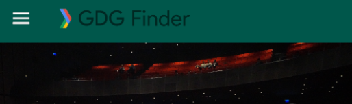

Notice the image in the header (drawable/logo.png), which includes both the colored arrow and the gray "GDG Finder" text on a transparent background. With the changed background color, the text does not stand out as much anymore. You can create a new image, or to increase contrast without creating a new image, you can set a tint on the ImageView. That causes the whole ImageView to be "tinted" to the specified color. The colorOnPrimary attribute is a color that meets accessibility guidelines for text or iconography when drawn on top of the primary color.

- In the ImageView inside the Toolbar, set the tint to colorOnPrimary. Because the drawable includes both the image and the GDG Finder text, both will be light.

`android:tint="?attr/colorOnPrimary"`

- Run the app and notice the dark header from the theme. The tint is responsible for the light logo image, which includes the icon and the "GDG Finder" text.


### Task: Use dimensions

A professional-looking app has a consistent look and feel. It has the same colors and similar layouts on every screen. This makes the app not only look better, but makes it easier for users to understand and interact with the screens.

Dimens, or dimensions, allow you to specify reusable measurements for your app. Specify things like margins, heights, or padding using dp. Specify font sizes using sp.

In this task, you define a dimen that will be used to apply a consistent margin on the right and left sides of the screen.

#### Step 1: Examine your code

- Open home_fragment xml.

- Look at the Design tab and make sure the blueprint is visible.

- In the Component Tree, select the start_guideline and end_guideline. They should be slightly highlighted in the blueprint.

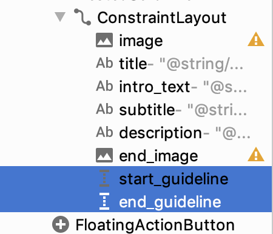

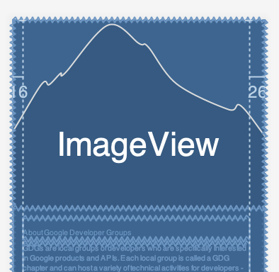

Notice the number 16 on the left and the number 26 on the right, indicating the inset of the start and end guidelines, respectively.

- Switch to the Text tab.

- Notice that at the bottom of the ConstraintLayout, two Guidelines are defined. Guidelines define vertical or horizontal lines on your screen that define the edges of your content. Everything is placed inside these lines except for full-screen images.

```
<androidx.constraintlayout.widget.Guideline
   android:id="@+id/start_guideline"
   android:layout_width="wrap_content"
   android:layout_height="wrap_content"
   android:orientation="vertical"
   app:layout_constraintGuide_begin="16dp" />

<androidx.constraintlayout.widget.Guideline
   android:id="@+id/end_guideline"
   android:layout_width="wrap_content"
   android:layout_height="wrap_content"
   android:orientation="vertical"
   app:layout_constraintGuide_end="26dp" />
```

The layout_constraintGuide_begin="16dp" is correct according to the Material specifications. But app:layout_constraintGuide_end="26dp" should be 16dp also. You could just fix this here manually. However, it is better to create a dimension for these margins and then apply them consistently throughout your app.

#### Step 2: Create a dimension

- In home_fragment xml, using the Text view, put your cursor on the 16dp of app:layout_constraintGuide_begin="16dp".

- Open the intentions menu and select Extract dimension resource.

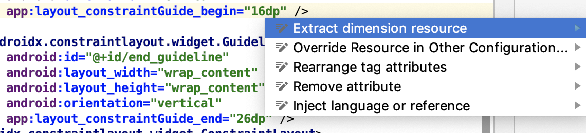

- Set the Resource Name of the dimension to spacing_normal. Leave everything else as given and click OK.

- Fix layout_constraintGuide_end to also use the spacing_normal dimension.

```
<androidx.constraintlayout.widget.Guideline
       android:id="@+id/end_grid"
       app:layout_constraintGuide_end="@dimen/spacing_normal"
```

- In Android Studio, open Replace All (Cmd+Shift+R on the Mac or Ctrl+Shift+R on Windows).

- Search for 16dp and replace all occurrences, except the one in dimens.xml, with @dimen/spacing_normal.

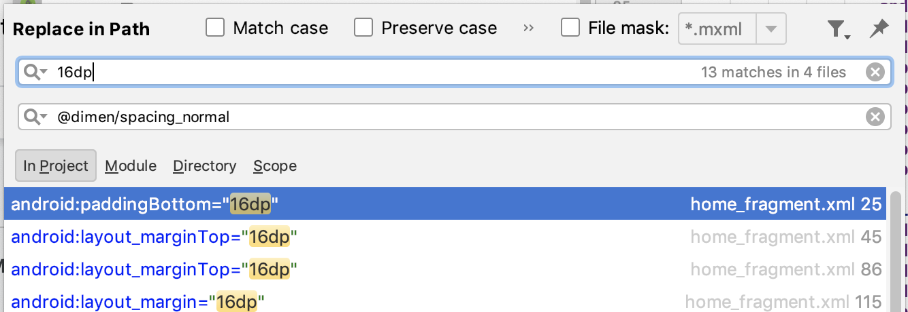

- Open res/values/dimens.xml and notice the new spacing_normal dimension. Make sure you didn't accidentally replace the 16dp with a self-reference!

- Run your app.

- Notice that the spacing on the left and right of the text is now the same. Also, notice that the spacing affects line breaks, and the text in the right screenshot is one line shorter.


| BEFORE: | AFTER: |
|---|---|
|  |  |


#### Task: Use colors

By using color resources and Material theming, you can apply consistent colors throughout your app. Effective use of color can dramatically improve the usability of your app. Picking the best colors and color combinations can be challenging, but there are tools to help.

One of the available tools is the Color Tool. To get a full Material color scheme for your app from the tool, you choose two main base colors, and then the tool creates the remaining colors appropriately.

In this task, you create a Material color scheme and apply it to your app.

#### Step 1: Create a Material color scheme

- Open [https://material.io/tools/color/.](c9d10c153ac5a3cb.png) You can use this tool to explore color combinations for your UI.


- Scroll down in the MATERIAL PALETTE on the right to see more colors.

- Click Primary, then click a color. You can use any color you like.

- Click Secondary and click a color.

- Click Text to choose a text color if you want a color that is different from the one the tool has calculated for you. Pick various text colors to explore contrast.

- Click the ACCESSIBILITY tab. You will see a report like the one below. This gives you a report about how readable the currently selected color choices are.

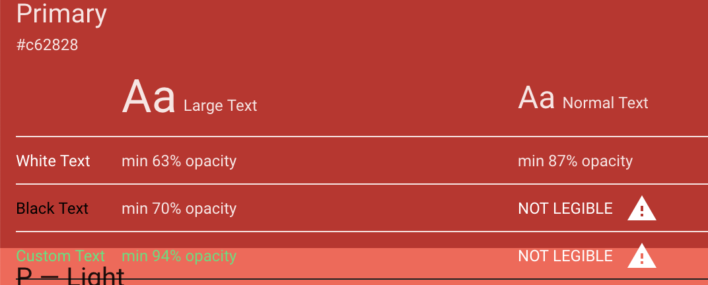

Look for the triangular exclamation mark icons.


***Note: The tool bases its evaluation upon how good humans are at seeing, which takes into account various forms of vision impairment. For many impairments, better contrast makes it easier to read text. Even if you have no trouble reading your text, when you ship your app to millions of users, this tool will help you know that your users can read the text too!***

- In the tool, switch to the CUSTOM tab and enter the following two colors.

```
Primary: #669df6
Secondary: #a142f4
```

The primary color is a blue that's based on the color used in the GDG logo. The secondary color is based on the balloons in the image on the home screen. Type the colors into the Hex Color field. Keep the black and white fonts suggested by the tool.


Note that this color scheme still has some accessibility warnings. Most color schemes do. You work around this in the next step.

- On the top-right of the window, select EXPORT and ANDROID. The tool initiates a download.

- Save the colors.xml file in a convenient location.

#### Step 2: Apply the Material color scheme to your app

- Open the downloaded colors.xml file in a text editor.

- In Android Studio, open values/colors.xml.

- Replace the resources of values/colors.xml with the contents of the downloaded colors.xml file.

- Open styles.xml.

- Inside the AppTheme, delete the colors that show as errors: colorPrimary, colorPrimaryDark, and colorAccent.

- Inside AppTheme, define 6 attributes with these new colors, as shown in the code below. You can find the list in the Color Theming guide.

```
<item name="colorPrimary">@color/primaryColor</item>
<item name="colorPrimaryDark">@color/primaryDarkColor</item>
<item name="colorPrimaryVariant">@color/primaryLightColor</item>
<item name="colorOnPrimary">@color/primaryTextColor</item>
<item name="colorSecondary">@color/secondaryColor</item>
<item name="colorSecondaryVariant">@color/secondaryDarkColor</item>
<item name="colorOnSecondary">@color/secondaryTextColor</item>
```

- Run the app. This looks pretty good...


- However, notice that colorOnPrimary isn't light enough for the logo tint (including the "GDG Finder text") to stand out sufficiently when displayed on top of colorPrimaryDark.

- In activity_main.xml, find the Toolbar. In the ImageView, change the logo tint to colorOnSecondary.

- Run the app.

```
colorOnPrimary: A color that passes accessibility guidelines for text and iconography when drawn on top of the primary color.

colorOnSecondary: A color that passes accessibility guidelines for text and iconography when drawn on top of the secondary color.
```

